# Пояснительная записка к техническому проекту на создание информационной системы «Фармадок»

Версия: 1.0  
Дата: 2026-03-10  
Основание: Техническое задание на создание ИС «Фармадок»

---

## Резюме проекта

ИС «Фармадок» предназначена для поиска, анализа и контролируемой интеллектуальной обработки фармацевтической документации в контуре Заказчика без передачи содержимого документов во внешние недоверенные сервисы.

В техническом проекте в качестве целевой конфигурации принимаются: браузерный пользовательский интерфейс, `API Gateway` (единая внешняя точка входа HTTP(S) из браузера), совмещённый прикладной сервис (`BFF` и backend в одном развёртывании за шлюзом), локальный `Id`-провайдер, контуры хранения документов, метаданных и векторных представлений, а также модульные конвейеры индексирования, поиска, сравнения и нормоконтроля. Альтернативные продукты допускаются только при сохранении этой архитектурной схемы, требований по ИБ и трассируемости решений.

Документ фиксирует архитектурные решения, границы системы, критерии приёмки и основные эксплуатационные ограничения; низкоуровневые контракты API, схемы БД, форматы сообщений и параметры развёртывания относятся к смежной документации уровня «Описание программного обеспечения» и эксплуатационных регламентов.

---

## 1. Введение

### 1.1. Назначение пояснительной записки

Записка связывает требования Технического задания (ТЗ) на ИС «Фармадок» с принятыми архитектурными решениями: поясняет, зачем выбран тот или иной контур, и где в тексте это раскрыто.

Читатели — Заказчик, эксперты, архитекторы и специалисты приёмки и сопровождения. Документ пригодится при экспертизе проекта, при приёмочных испытаниях и позже, когда нужно вспомнить логику устройства системы.

### 1.2. Область действия

Охват — ИС «Фармадок» в объёме раздела 2 ТЗ (назначение и цели). Нумерация и состав разделов согласованы с ТЗ; если трактовка расходится с ТЗ, верна формулировка ТЗ.

### 1.3. Условные обозначения и сокращения

Сокращения из раздела 1 ТЗ здесь не дублируются полностью. Термины по подсистемам (в т.ч. §9–14) собраны в п. 1.6. Часто встречающиеся обозначения в тексте записки:

Основные сокращения: 

- БЯМ (большая языковая модель),
- RAG (Retrieval-Augmented Generation),
- RBAC (Role-Based Access Control),
- MFA (Multi-Factor Authentication),
- НЦЭСМП (Научный центр экспертизы средств медицинского применения),
- ПУР (план управления рисками),
- СЗИ (средства защиты информации),
- TLS (Transport Layer Security),
- WAF (Web Application Firewall).

### 1.4. Наименование системы и заказчик (п. 1.1, 1.2 ТЗ)

По п. 1.1 ТЗ полное наименование ИС:

Информационная система «Фармадок» для поиска и интеллектуальной обработки фармацевтической информации ФГБУ «НЦЭСМП» Минздрава России (далее — ИС «Фармадок»).

По п. 1.2 ТЗ заказчик работ — Федеральное государственное бюджетное учреждение «Научный центр экспертизы средств медицинского применения» Министерства здравоохранения Российской Федерации (ФГБУ «НЦЭСМП» Минздрава России), далее — «Заказчик».

### 1.5. Таблица трассировки требований ТЗ к разделам пояснительной записки

Таблица сопоставляет пункты ТЗ (исходный текст — `TZ/TZ.md`) с развёрнутыми местами этой записки. В третьей колонке приведены разделы и подразделы записки: по возможности — конкретные подпункты уровня «####», а где уместно обзор по разделу целиком («##» / «###»). Сводные таблицы разд. 5 (пп. 5.2, 5.3) в роли основной трассировки не используются. Формат ссылки: «п. — краткая суть»; несколько ссылок отделены переносом (`<br>`). Если фрагмента нет — НЕ НАЙДЕНО.


| Пункт ТЗ       | Содержание требования                                                 | Пункт(ы) пояснительной записки                                                                                                                                                                                                                                                                                                                                                                                                                                                                                                                                                                                                                                                                     |
| -------------- | --------------------------------------------------------------------- | -------------------------------------------------------------------------------------------------------------------------------------------------------------------------------------------------------------------------------------------------------------------------------------------------------------------------------------------------------------------------------------------------------------------------------------------------------------------------------------------------------------------------------------------------------------------------------------------------------------------------------------------------------------------------------------------------- |
| 1.1            | Полное наименование и условное обозначение ИС «Фармадок»              | 1.4 — полное наименование ИС по п. 1.1 ТЗ                                                                                                                                                                                                                                                                                                                                                                                                                                                                                                                                                                                                                                                          |
| 1.2            | Организация заказчика (ФГБУ «НЦЭСМП»)                                 | 1.4 — заказчик работ по п. 1.2 ТЗ 3.1 — функции и роль ФГБУ «НЦЭСМП» как объекта автоматизации, типы экспертной документации                                                                                                                                                                                                                                                                                                                                                                                                                                                                                                                                                                       |
| 1.3            | Плановые сроки начала и окончания работ (Приложение № 1 к ТЗ)         | 16.2 — сроки по контракту, площадки, формы взаимодействия, отсылка к Приложению № 1 к ТЗ                                                                                                                                                                                                                                                                                                                                                                                                                                                                                                                                                                                                           |
| 2.1            | Назначение ИС                                                         | 2.1 — обоснование назначения: объём документов, регуляторный контекст, поддержка экспертов, конфиденциальность; контекст развёртывания по п. 2.1 ТЗ (фармкомпании, иные регуляторы — при согласовании контуров)                                                                                                                                                                                                                                                                                                                                                                                                                                                                                    |
| 2.2            | Цели создания и критерии их достижения                                | 2.2 — таблица целей и измеримых критериев из п. 2.2 ТЗ                                                                                                                                                                                                                                                                                                                                                                                                                                                                                                                                                                                                                                             |
| 3.1            | Краткие сведения об объекте автоматизации                             | 3.1 — функции центра, связь с ОХЛП, НД, ПУР и др.                                                                                                                                                                                                                                                                                                                                                                                                                                                                                                                                                                                                                                                  |
| 3.2            | Условия эксплуатации и окружающая среда                               | 3.2 — 152-ФЗ, ИБ Минздрава, доменная сеть, WAF, SIEM, VPN WireGuard (Прил. № 2 к ТЗ)                                                                                                                                                                                                                                                                                                                                                                                                                                                                                                                                                                                                               |
| OK - 4.1.1     | Принципы построения, структурные элементы (вводная часть)             | 7.1 — модульность и шесть структурных элементов, плагины агентов 9.2.2 — состав подсистемы входа и общий поток запросов 13.1.1 — общая архитектура конвейера индексирования и место компонентов в Системе                                                                                                                                                                                                                                                                                                                                                                                                                                                                                          |
| OK - 4.1.1.1   | Пользовательский интерфейс                                            | 14 — подсистема пользовательского интерфейса                                                                                                                                                                                                                                                                                                                                                                                                                                                                                                                                                                                                                                                       |
| OK - 4.1.1.2   | API Gateway                                                           | 9 — подсистема входа, аутентификации и авторизации                                                                                                                                                                                                                                                                                                                                                                                                                                                                                                                                                                                                                                                 |
| OK - 4.1.1.3   | Сервис аутентификации (Keycloak и интеграция)                         | 9 — подсистема входа, аутентификации и авторизации                                                                                                                                                                                                                                                                                                                                                                                                                                                                                                                                                                                                                                                 |
| OK - 4.1.1.4   | Модуль RAG (Retriever, Generator)                                     | 13 — подсистема обработки информации с использованием ИИ                                                                                                                                                                                                                                                                                                                                                                                                                                                                                                                                                                                                                                           |
| OK - 4.1.1.5   | Векторная база данных (хранение, шифрование, типы документов, кэш)    | 10.3.3 — ротация ключей не реже 90 суток (п. 4.1.1.5 ТЗ), регламент секретов 11.3.3 — Milvus: классы данных, кэш внешнего поиска, TTL, поиск с учётом прав 11.4.1 — сроки хранения, в т.ч. кэша внешнего поиска 11.6.2 — шифрование данных и ключи 11.6.3 — маскирование в контуре хранения 13.3.5 — этап векторного индексирования 10.3.2 — обоснование Vault для секретов и ключей                                                                                                                                                                                                                                                                                                               |
| OK - 4.1.1.6   | Модуль агентов (песочница, плагины)                                   | 12 — подсистема модулей и управления их работой                                                                                                                                                                                                                                                                                                                                                                                                                                                                                                                                                                                                                                                    |
| OK - 4.1.2     | Масштабируемость и производительность                                 | 7.4 — горизонтальное масштабирование, целевые 100 пользователей и 100 запросов в минуту 11.5.3 — масштабирование хранилищ 13.4.8 — операционные метрики, безопасность и эксплуатация поиска 14.8.4 — нефункциональные требования к API пользовательского UI                                                                                                                                                                                                                                                                                                                                                                                                                                        |
| OK - 4.1.3     | Надёжность, резервное копирование, восстановление, обработка ошибок   | 14.8.5 — сообщения пользователю и устойчивое состояние UI/API (п. 4.1.3 ТЗ) 4.3 — надёжность и обработка ошибок пользователя 11.5.1 — резервное копирование 11.5.2 — восстановление после сбоев (RTO/RPO) 12.4.2 — повторные попытки и обработка ошибок доставки в конвейерах 12.5 — операционные SLO/SLA и runbook                                                                                                                                                                                                                                                                                                                                                                                |
| OK - 4.1.4     | Эргономика и техническая эстетика интерфейса                          | 4.5 — эргономика (мышь, клавиатура, русский язык, единообразие) 14.3 — требования к UX, отображению данных и единообразию интерфейса                                                                                                                                                                                                                                                                                                                                                                                                                                                                                                                                                               |
| OK - 4.1.5     | Защита информации от несанкционированного доступа                     | 9.3.4 — логирование шлюза и доставка событий в SIEM 9.4.6 — MFA 9.5.2 — двухуровневая RBAC 9.5.3 — настройка правил авторизации 10.3.2 — централизованное хранение секретов (Vault) 10.4.1 — категории событий аудита 10.6.4 — доставка логов в SIEM 11.6.1 — разграничение доступа к данным в хранилище 11.6.2 — шифрование на хранении 11.6.3 — маскирование чувствительных данных 12.6 — безопасность подсистемы модулей и конвейеров 14.5 — безопасность на стороне клиента 7.2 — безопасность по умолчанию 7.3 — нулевое доверие 7.7 — минимизация данных и маскирование перед БЯМ 7.8 — запрет передачи третьим лицам, размещение БЯМ 7.9 — криптография и контроль подключаемых компонентов |
| 4.1.6          | Патентная чистота и права на результаты                               | 18.3 — патентная чистота, ГК РФ ч. 4, исключительные права Заказчика (п. 4.1.6 ТЗ, п. 7 ТЗ)                                                                                                                                                                                                                                                                                                                                                                                                                                                                                                                                                                                                        |
| OK - 4.2       | Вводная часть раздела требований к функциям                           | 2.3 — границы системы по компонентам и очередям внедрения 5.1 — принцип деления на первую и вторую очередь 12.1.1 — обоснование модульных конвейеров вместо монолита                                                                                                                                                                                                                                                                                                                                                                                                                                                                                                                               |
| OK - 4.2.1.1   | Пользовательский Web-интерфейс                                        | 14 — подсистема пользовательского интерфейса                                                                                                                                                                                                                                                                                                                                                                                                                                                                                                                                                                                                                                                       |
| OK - 4.2.1.2   | Семантический поиск (RAG)                                             | 13 — подсистема обработки информации с использованием ИИ                                                                                                                                                                                                                                                                                                                                                                                                                                                                                                                                                                                                                                           |
| OK - 4.2.1.3   | Формирование векторной БД, НСИ                                        | 11.1.1 — получение НСИ Заказчика, уточнение канала на стадии реализации (п. 4.2.1.3 ТЗ) 11.3.3 — векторное хранилище и классы данных 13.3.1 — диаграмма offline pipeline 13.3.2 — этап ingest (приём документов) 13.3.8 — OCR (при необходимости) 13.3.7 — перевод с иностранного языка (при необходимости) 13.3.3 — этап markup 13.3.4 — тэгирование структуры 13.3.5 — векторное индексирование 12.3.1 — механизм запуска обработчиков и обмен через брокер                                                                                                                                                                                                                                      |
| OK - 4.2.1.4   | Интеграция с векторной БД                                             | 11.3.3 — Milvus, метаданные и RBAC при выдаче 13.3.5 — построение векторного индекса 13.4.3 — поиск по индексу в online pipeline 13.4.4 — отсечение недоступных документов по метаданным                                                                                                                                                                                                                                                                                                                                                                                                                                                                                                           |
| OK - 4.2.1.5   | Анализ документов на соответствие регуляторным требованиям (агент ИИ) | 13 — подсистема обработки информации с использованием ИИ                                                                                                                                                                                                                                                                                                                                                                                                                                                                                                                                                                                                                                           |
| OK - 4.2.1.6   | Сравнение документов (агент ИИ)                                       | 13 — подсистема обработки информации с использованием ИИ                                                                                                                                                                                                                                                                                                                                                                                                                                                                                                                                                                                                                                           |
| OK - 4.2.1.7   | Создание и редактирование разметки документов                         | 13.3.2 — приём и нормализация входных файлов 13.3.8 — OCR (при необходимости) 13.3.7 — перевод (при необходимости) 13.3.3 — структурирование (markup) 13.3.4 — тэгирование перед индексированием                                                                                                                                                                                                                                                                                                                                                                                                                                                                                                   |
| OK - 4.2.1.8   | Генерация отчётных документов (DOCX, шаблоны)                         | 14.9 — шаблоны DOCX, роли администратора и пользователя (п. 4.2.1.8 ТЗ) 11.3.2 — объектное хранилище для исходников и отчётов DOCX 12.4.4 — версионирование и хранение артефактов 14.7 — сценарии UI с экспортом отчётов 14.8.2 — API формирования и выдачи отчётов                                                                                                                                                                                                                                                                                                                                                                                                                                |
| OK - 4.2.2.1   | Безопасный поиск в интернете                                          | 5.4 — безопасный веб-поиск: белый список, конфиденциальные запросы, кэш, UI (п. 4.2.2.1 ТЗ) 13.8 — поток данных агента, кэш Milvus, RAG (п. 4.2.2.1 ТЗ) 7.6 — изоляция агентов, белый список сети 11.3.3 — классы данных, кэш внешнего поиска, TTL 11.4.1 — сроки хранения кэша внешнего поиска 12.2.2 — вызовы внешних API 18.1, 18.2 — допущения и риски EMA/FDA, конфиденциальность                                                                                                                                                                                                                                                                                                             |
| OK - 4.2.2.2   | Перевод документов                                                    | 5.5 — перевод DOCX, терминология, БЯМ (п. 4.2.2.2 ТЗ) 7.8 — локальная или доверенная БЯМ, запрет передачи данных третьим лицам 13.3.7 — этап перевода с иностранного языка в offline-контуре 12 — подключаемый модуль оркестратора (§ 12.2, п. 13.3.7) 18.2 — риски качества перевода и приёмка                                                                                                                                                                                                                                                                                                                                                                                        |
| OK - 4.2.2.3   | OCR                                                                   | 5.6 — OCR: PDF/JPEG/PNG, языки (п. 4.2.2.3 ТЗ) 13.3.8 — этап OCR в offline-контуре 12 — подключаемый модуль оркестратора (§ 12.2, п. 13.3.8) 13.3.5 — индексирование распознанного текста 18.2 — риски качества OCR и приёмка                                                                                                                                                                                                                                                                                                                                                                                                                                                          |
| OK - 4.2.2.4   | Добавление агентов ИИ (плагины, интерфейс администратора)             | 12 — подсистема модулей и управления их работой 14.10 — UI администратора плагинов (п. 4.2.2.4 ТЗ)                                                                                                                                                                                                                                                                                                                                                                                                                                                                                                                                                                                                 |
| OK - 4.3.1     | Математическое обеспечение                                            | 6.1 — БЯМ, RAG, классификация, глубокое обучение 13.2 — чанкинг и обоснование для индексирования 13.4.3 — семантический поиск по эмбеддингам 13.4.6 — реранкинг результатов                                                                                                                                                                                                                                                                                                                                                                                                                                                                                                                        |
| OK - 4.3.2     | Требования к ОС (Windows 10, Ubuntu ≥ 24.04)                          | 6.2 — Windows 10 на рабочих местах, Ubuntu 24.04+ на серверах 8 — контейнеризация и платформа развёртывания на указанных ОС                                                                                                                                                                                                                                                                                                                                                                                                                                                                                                                                                                        |
| OK - 4.3.3     | Техническое обеспечение                                               | 6.3 — оборудование и каналы связи со стороны Заказчика, уточнение на стадии реализации 8 — инфраструктура, оркестрация, CI/CD 11.5.1 — резервное копирование инфраструктуры хранения                                                                                                                                                                                                                                                                                                                                                                                                                                                                                                               |
| 4.3.4          | Лингвистическое обеспечение (русский язык интерфейса)                 | 6.4 — русский язык надписей и сообщений пользователю 14.3 — требования к представлению данных и UX на русском языке                                                                                                                                                                                                                                                                                                                                                                                                                                                                                                                                                                                |
| 5 (вводная)    | Виды испытаний (приёмочные, опытная эксплуатация)                     | 15.0.1 — комиссия, представители, передача ИС и документации по Прил. № 1 (вводная часть разд. 5 ТЗ) 15.1 — приёмочные испытания 15.2 — опытная эксплуатация 10.7 — наблюдаемость при приёмке                                                                                                                                                                                                                                                                                                                                                                                                                                                                                                      |
| 5.1            | Приёмочные испытания                                                  | 15.1 — программа и методика, протокол, акт готовности к ОЭ 14.6 — наблюдаемость и критерии приёмки UI                                                                                                                                                                                                                                                                                                                                                                                                                                                                                                                                                                                              |
| 5.2            | Опытная эксплуатация                                                  | 15.2 — условия ОЭ, журнал, акт завершения ОЭ                                                                                                                                                                                                                                                                                                                                                                                                                                                                                                                                                                                                                                                       |
| 5.3            | Повторные приёмочные испытания                                        | 15.3 — повторная приёмка и акт о постоянной эксплуатации                                                                                                                                                                                                                                                                                                                                                                                                                                                                                                                                                                                                                                           |
| 6              | Подготовка объекта автоматизации к вводу ПО в действие                | 16.1 — оборудование, системное ПО, развёртывание ИС, обучение, наполнение ВБД, СМК 8 — автоматическая сборка и развёртывание в контуре Заказчика (п. 6 ТЗ) 12.7 — эксплуатация оркестрации и приёмка модулей                                                                                                                                                                                                                                                                                                                                                                                                                                                                                       |
| 7              | Требования к организации работ (сроки, места, взаимодействие)         | 16.2 — календарь, адреса площадок, коммуникации, отчётность Подрядчика                                                                                                                                                                                                                                                                                                                                                                                                                                                                                                                                                                                                                             |
| 8              | Требования к документированию (ГОСТ, ЕСПД, состав по Прил. № 1)       | 17 — ГОСТ 2.105-2019, ЕСПД, состав по Приложению № 1 к ТЗ, форматы передачи                                                                                                                                                                                                                                                                                                                                                                                                                                                                                                                                                                                                                        |
| 9              | Источники разработки (НПА)                                            | 19.1 — перечень НПА из п. 9 ТЗ и смежные ГОСТ/ЕСПД (отражено в п. 19.1)                                                                                                                                                                                                                                                                                                                                                                                                                                                                                                                                                                                                                            |
| 10             | Гарантийные обязательства                                             | 16.3 — срок 12 мес., устранение недостатков, 30 календарных дней, прерывание срока (п. 10 ТЗ)                                                                                                                                                                                                                                                                                                                                                                                                                                                                                                                                                                                                      |
| Приложение № 1 | Календарный план, состав документации                                 | 16.2 — сроки и связь с календарным планом в контракте 17 — состав документации по Приложению № 1 19.2 — ссылка на Приложение № 1 в проектных документах                                                                                                                                                                                                                                                                                                                                                                                                                                                                                                                                            |
| Приложение № 2 | Схема сетевой инфраструктуры                                          | 3.2 — VPN WireGuard и согласование с топологией Заказчика 8 — развёртывание с опорой на схему из Приложения № 2 к ТЗ                                                                                                                                                                                                                                                                                                                                                                                                                                                                                                                                                                               |
| Приложение № 3 | Примерная архитектура ИС                                              | 9.2.2 — состав и поток подсистемы входа 11.2.2 — обоснование выбора Milvus 11.2.3 — логическая схема хранения 12.2.7 — логическая схема модулей и оркестратора 13.1.1 — архитектура конвейера индексирования 8 — инфраструктурный контур, соответствующий целевой архитектуре                                                                                                                                                                                                                                                                                                                                                                                                                    |
| Приложение № 4 | Перечень типов документации для обработки                             | 18.1 — допущения о шаблонах и перечне типов документов (Приложение А к ТЗ) 19.2 — ссылка на Приложение А к ТЗ в проектных документах                                                                                                                                                                                                                                                                                                                                                                                                                                                                                                                                                               |
| Приложение № 5 | Обоснование неприменения запрета на иностранное ПО                    | 19.3 — соответствие ПП № 1875, ссылка на полный текст в Приложении № 5 к ТЗ                                                                                                                                                                                                                                                                                                                                                                                                                                                                                                                                                                                                                        |


Сводная матрица требований с указанием способов проверки при приёмке приведена в п. 15.0. Полная таблица трассировки ТЗ — в п. 1.5.

### 1.6. Единый глоссарий терминов

Термины ниже встречаются в описании подсистем и смежных решений (прежде всего §9–14). Если в конкретном подпункте смысл уточнён иначе, верна формулировка там.

#### Аутентификация, авторизация и граница API

- API Gateway — единая точка входа для запросов к серверной части Системы; выполняет проверку токенов, RBAC, ограничение частоты запросов и логирование.
- BFF (Backend for Frontend) — логический слой в составе совмещённого прикладного сервиса за `API Gateway`: обмен кода авторизации на токен (OAuth2/OIDC), серверная сессия, выдача и использование JWT без передачи долгоживущих секретов в браузер; сетевой доступ к этому слою извне — только через шлюз.
- Id провайдер (Identity Provider) — компонент, проверяющий учётные данные пользователя и выдающий токены с утверждениями о личности и ролях.
- JWT (JSON Web Token) — формат токена доступа, проверяемого шлюзом и сервисами по публичным ключам Id-провайдера.
- MFA (Multi-Factor Authentication) — многофакторная аутентификация.
- OIDC (OpenID Connect) — протокол идентификации поверх OAuth 2.0.
- RBAC (Role-Based Access Control) — разграничение доступа по ролям; в индексе и Retriever — фильтрация фрагментов по атрибутам прав; в UI — отображение только разрешённых разделов и действий без подмены серверной авторизации.
- SSO (Single Sign-On) — единый вход пользователя в несколько приложений через одного Id провайдера.
- клиент — в контексте входа и API: фронтенд как инициатор запросов к `API Gateway` (далее — шлюз), без прямого обхода шлюза к прикладному сервису.
- фронтенд — браузерное приложение (точка входа пользователя в Систему).
- MPA (Multi-Page Application) — многостраничное веб-приложение.
- SPA (Single-Page Application) — одностраничное веб-приложение.

#### Секреты, аудит, наблюдаемость и логирование

- Vault — HashiCorp Vault или функциональный аналог (корпоративный секрет-менеджер) для централизованного хранения секретов и ключей с политиками ACL и аудитом.
- аудит (security audit) — фиксация значимых событий безопасности и подотчётных действий (вход, отказ в доступе, изменение прав, обращение к секретам, администрирование) с привязкой к субъекту и времени.
- ELK — стек Elasticsearch, Logstash, Kibana или эквивалент (OpenSearch, Loki+Grafana и т.п.) для централизованного поиска и анализа логов.
- метрика — числовой показатель работы компонента (задержка, ошибки, утилизация ресурсов, размер очередей).
- наблюдаемость (observability) — совокупность метрик, структурированных логов и (при необходимости) трасс для диагностики состояния Системы.
- ретенция — срок и политика хранения журналов и записей аудита.
- секрет — конфиденциальные данные конфигурации (пароли СУБД, API-ключи, client_secret, строки подключения, TLS-ключи и сертификаты прикладного уровня и т.п.), не подлежащие хранению в исходном коде или незащищённых образах.
- SIEM (Security Information and Event Management) — система управления событиями и информацией о безопасности (централизованный приём, корреляция и анализ событий).
- ключ шифрования — криптографический ключ или материал для шифрования данных на покое (хранимые данные, резервные копии, тома с документами); может управляться тем же контуром, что и секреты.

#### Хранение и обмен данными

- Milvus — векторная СУБД для хранения эмбеддингов и выполнения ANN/k-NN поиска в контуре RAG.
- PostgreSQL — основная реляционная СУБД для операционных данных, метаданных документов и прикладного аудита.
- RabbitMQ — брокер сообщений для асинхронного обмена заданиями и событиями между сервисами.
- S3 MinIO — S3-совместимое объектное хранилище для исходных документов, производных артефактов и отчётов.
- RPO (Recovery Point Objective) — допустимая точка потери данных при восстановлении.
- RTO (Recovery Time Objective) — допустимое время восстановления сервиса.
- TTL (time-to-live) — срок жизни данных в хранилище (например, кэша).
- векторная база данных — хранилище эмбеддингов и индексов для семантического поиска.
- документное хранилище — контур хранения исходных файлов (DOCX, PDF, изображения, отчёты).
- метаданные документа — идентификатор, тип, версия, источник, атрибуты доступа, сроки хранения и др.
- операционные данные — учётные записи, карточки объектов, служебные справочники, параметры конфигурации (не секреты).
- шифрование на хранении — криптографическая защита данных «на диске».

#### Модульные пайплайны и оркестрация

- Контекст выполнения — передаваемое между этапами состояние: входные параметры сценария, промежуточные артефакты, идентификаторы трассировки, атрибуты RBAC.
- Контракт модуля — соглашение о формате входных и выходных данных, кодах ошибок, идемпотентности и метаданных (версия модуля, идентификатор этапа).
- Оркестратор пайплайна — компонент, выбирающий сценарий, создающий контекст выполнения, вызывающий модули в заданном порядке, обрабатывающий ошибки и фиксирующий состояние прогона.
- Пайплайн обработки информации — упорядоченная (в общем случае ориентированная) последовательность этапов преобразования входных данных в выходные артефакты или решения.
- Подключаемый модуль (плагин этапа) — изолированная реализация одного логического этапа с фиксированным контрактом входа/выхода; подключается без изменения ядра оркестратора.
- Реестр модулей — каталог доступных модулей, их версий, возможностей и политик использования.
- Сценарий (описание пайплайна) — декларативное или конфигурируемое описание графа этапов (какие модули в каком порядке и при каких условиях вызываются).

#### Индексирование, поиск и генерация ответов (ИИ / RAG)

- RAG (Retrieval-Augmented Generation) — генерация ответа на основе извлечённого из хранилища контекста.
- Retriever — компонент поиска и отбора релевантных фрагментов документов.
- Generator — компонент генерации итогового ответа на основе контекста (БЯМ).
- Галлюцинация — генерация ответа, не подтверждённого источниками из контекста; снижается за счёт RAG и обязательного цитирования.
- Гибридный поиск — совместное использование векторного и лексического каналов с последующим слиянием списков кандидатов (например RRF — Reciprocal Rank Fusion) и при необходимости переранжированием (Cross-Encoder).
- Лексический индекс — структура для поиска по словам и терминам (обратный индекс); ранжирование часто по BM25.
- Markup-сервис (структурирование) — этап предобработки: приём сырых документов и формирование структурированного представления (Markdown).
- Сервис тэгирования структуры — этап перед индексированием: разметка логических фрагментов и метаданных в JSON.
- Векторный индекс — хранилище эмбеддингов фрагментов документов и метаданных с поиском ближайших соседей по метрике сходства.
- Эмбеддинг — числовой вектор фиксированной размерности, представляющий смысл текста (модель эмбеддингов при индексации и запросе).

#### Пользовательский интерфейс и эксплуатационные показатели в UI

- Единая точка входа (в контексте UI) — обращение клиента к прикладной части только через API Gateway к совмещённому сервису BFF+backend, без прямых вызовов внутренних сервисов из браузера (кроме явно согласованных случаев).
- Корреляционный идентификатор — идентификатор запроса/сессии для связки клиентских событий с журналами backend и аудита (в т.ч. `x-correlation-id`).
- Пользовательский UI — совокупность экранов, сценариев взаимодействия и клиентской логики, через которые пользователь выполняет операции в ИС «Фармадок».
- RBAC в UI — отображение только разрешённых разделов и действий; скрытие или блокировка недоступных элементов по политике проекта (без подмены серверной проверки прав).
- Клиентское приложение (фронтенд) — программа в браузере (или оболочке рабочего места), обращающаяся к backend через согласованные API (см. также фронтенд).
- progress (прогресс выполнения) — индикатор завершённости операций или этапов в рамках прогона пайплайна.
- run (прогон процесса) — экземпляр выполнения пайплайна с уникальным идентификатором (в т.ч. отображаемый в UI).
- throughput (пропускная способность) — объём обработанных документов или запросов за единицу времени (в т.ч. на дашбордах UI).

---

## 2. Назначение и цели системы

### 2.1. Назначение

Система ориентирована на автоматизацию поиска, обработки и анализа фармацевтической документации с использованием технологий искусственного интеллекта на основе больших языковых моделей в связи со следующими факторами:

- Объём и разнообразие документов (ОХЛП, инструкции по медицинскому применению, нормативные документы по качеству, ПУР, изображения маркировки и др.) делают ручной анализ трудоёмким и подверженным ошибкам.
- Требования регуляторных органов (Минздрав России, ЕЭК, ICH) и необходимость сопоставления с референтными препаратами диктуют потребность в единой инструментальной среде с семантическим поиском и контролируемой генерацией выводов.
- ФГБУ «НЦЭСМП» как объект автоматизации выполняет экспертизу качества, безопасности и эффективности лекарственных средств; система призвана поддерживать экспертов, не подменяя их заключения, а снижая рутинную нагрузку и повышая прозрачность решений.

Ориентация на конфиденциальность и запрет передачи данных третьим лицам без согласия пользователя обусловлена характером обрабатываемой информации (персональные данные, данные экспертиз) и требованиями Федерального закона № 152-ФЗ «О персональных данных».

Согласно п. 2.1 ТЗ область применения решений ИС «Фармадок» включает, помимо базового контура ФГБУ «НЦЭСМП» Минздрава России, фармацевтические организации и иные регуляторные органы и организации, занимающиеся оценкой соответствия и контролем качества лекарственных средств. Настоящая пояснительная записка и договорные границы поставки ориентированы на развёртывание у Заказчика; расширение на иные организации выполняется при согласовании политик ИБ, контуров сети и правовых оснований обработки данных.

### 2.2. Цели и критерии

Кратко, откуда взяты измеримые критерии п. 2.2 ТЗ:


| Цель                                        | Критерий                                                                  | Обоснование                                                                                                                                            |
| ------------------------------------------- | ------------------------------------------------------------------------- | ------------------------------------------------------------------------------------------------------------------------------------------------------ |
| Автоматизация анализа документов            | Сокращение времени анализа не менее чем на 50 %                           | Типовой ориентир для систем с ИИ-ассистированием; позволяет оценить эффект внедрения при приёмке.                                                      |
| Повышение качества оформления документов    | Экспертная оценка не менее 30 тестовых документов                         | Минимальный объём выборки для статистически значимой оценки качества оформления и рекомендаций системы.                                                |
| Автоматизация поиска релевантной информации | Среднее время получения результатов не более 20 с                         | Баланс между качеством ответа (RAG, переранжирование) и приемлемой отзывчивостью для интерактивной работы.                                             |
| Обеспечение ИБ                              | Отсутствие инцидентов за период тестовой эксплуатации (не менее 2 недель) | Подтверждение соблюдения требований к конфиденциальности и доступности в условиях, близких к эксплуатационным.                                         |
| Устойчивость при росте нагрузки             | Обеспечение устойчивой работы при увеличении числа пользователей          | Требование к масштабируемости (не менее 100 пользователей, не менее 100 запросов в минуту — п. 4.1.2 ТЗ) обеспечивается архитектурой (§4, §7). |


### 2.3. Границы системы

В границы системы входят: 

- пользовательский веб-интерфейс,
- API Gateway,
- сервис аутентификации (Id провайдер: Authentik в реализации на стадии прототипирования или Keycloak по согласованию с Заказчиком),
- модуль RAG (Retriever и Generator),
- векторная база данных,
- подсистема агентов ИИ (анализ соответствия, сравнение документов, разметка, генерация отчётов),
- подсистема парсинга и разметки документов,
- подсистема генерации отчётов в формате DOCX.

 В первую очередь реализации входят перечисленные компоненты; во вторую — 

- безопасный поиск в интернете,
- перевод документов,
- OCR и подсистема управления плагинами агентов (см. раздел 5). За рамки системы вынесены: внешние информационные системы Заказчика (интеграция с нормативно-справочной информацией уточняется на стадии реализации), общедоступные веб-источники до их включения в белый список администратором.

---

## 3. Требования к объекту автоматизации и условиям эксплуатации

Раздел опирается на п. 3 ТЗ: кто и в какой среде будет работать с системой.

### 3.1. Характеристика объекта автоматизации

Объект автоматизации — ФГБУ «НЦЭСМП» Минздрава России; это оправдано кругом задач учреждения:

- экспертиза качества, безопасности и эффективности лекарственных средств;
- этическая экспертиза клинических исследований;
- экспертиза документов для признания препаратов орфанными;
- разработка стандартов и фармакопейных статей.

Эти функции связаны с большими объёмами структурированной и неструктурированной документации (ОХЛП, инструкции, НД, ПУР, изображения упаковки), что делает целесообразным применение семантического поиска, автоматизированного сравнения и проверки на соответствие регуляторным требованиям. Типы документов для интеллектуальной обработки приведены в Приложении А к ТЗ.

### 3.2. Условия эксплуатации

Учёт Федерального закона № 152-ФЗ обусловлен обработкой персональных данных и данных экспертиз. 
Требования Минздрава России к информационной безопасности для конфиденциальной информации задают рамки для шифрования, разграничения доступа и аудита. 
Эксплуатация в доменной сети учреждения обеспечивает единое управление учётными записями и политиками доступа. 
Использование WAF, СЗИ, протоколирования и ролевой модели (п. 4.1.5 ТЗ) согласовано с типовой топологией сети Заказчика (в т.ч. VPN через WireGuard по Приложению № 2 к ТЗ).

---

## 4. Требования к системе в целом

Здесь раскрыты пп. 4.1–4.1.5 ТЗ: как устроена система целиком, без детализации отдельных подсистем.

### 4.1. Структура и функционирование

Микросервисная архитектура даёт независимую разработку и масштабирование, изоляцию агентов ИИ и единые политики безопасности. Основные элементы и их роль:

- Пользовательский веб-интерфейс — единая точка взаимодействия пользователя с Системой; доступ с рабочих станций в доменной сети без установки дополнительного ПО.
- API Gateway (Kong или аналог) — единая точка входа: централизованная аутентификация, проверка RBAC, ограничение частоты запросов (100 запросов в минуту на пользователя) и защита от DDoS при интеграции с WAF. Журналирование всех запросов нужно для аудита и интеграции с SIEM.
- Сервис аутентификации (Authentik в реализации на стадии прототипирования или Keycloak по согласованию с Заказчиком) — использование существующей инфраструктуры идентификации Заказчика снижает затраты и обеспечивает единый вход (SSO) и обязательную MFA.
- Модуль RAG — Retriever и Generator реализуют семантический поиск и генерацию ответов с опорой на локальное хранилище; учёт прав доступа в Retriever и размещение БЯМ локально или в доверенном облаке обеспечивают конфиденциальность.
- Векторная база данных — хранение зашифрованных эмбеддингов с логическим разделением типов документов (регламентирующие, рабочие, кэш внешнего поиска) и маскированием чувствительных данных перед индексацией соответствует требованиям ИБ и пригодности для RAG.
- Модуль агентов — изоляция в Docker-контейнерах с ограничением сети (белый список доменов), файловой системы и ресурсов снижает риски при выполнении специализированных сценариев (сравнение, поиск, заполнение шаблонов) и при подключении новых агентов-плагинов.

### 4.2. Масштабируемость и производительность

Требования «не менее 100 одновременно работающих пользователей» и «не менее 100 запросов в минуту» (п. 4.1.2 ТЗ) обоснованы оценкой типовой нагрузки при использовании Системы экспертами и аналитиками НЦЭСМП и резервом на пиковые периоды. 
Ограничение 100 запросов в минуту на пользователя на уровне API Gateway предотвращает злоупотребления и выравнивает нагрузку. 
Горизонтальное масштабирование backend-сервисов в контейнерах и настройка векторной БД и сервера БЯМ предусмотрены проектной конфигурацией Системы.

### 4.3. Надёжность

Требования к отказоустойчивости, резервному копированию с шифрованием копий и времени восстановления не более 4 часов без потери данных (п. 4.1.3 ТЗ) обусловлены необходимостью непрерывности работы при сбоях оборудования или ПО и соответствуют целевым RTO/RPO проекта. 
Корректная обработка ошибочных действий пользователя (сообщения об ошибке и возврат в устойчивое состояние) обеспечивает предсказуемость поведения Системы и исключает потерю данных из-за некорректного ввода.

### 4.4. Защита информации

Требования п. 4.1.5 ТЗ обоснованы следующим образом:

- Соответствие ФЗ № 152, рекомендациям Роскомнадзора и возможность аудита по ISO/IEC 27001 — обязательные условия при обработке персональных и конфиденциальных данных в государственном учреждении.
- Запрет на передачу данных третьим лицам без явного согласия — обеспечение конфиденциальности и контроль над использованием данных; архитектура предполагает размещение БЯМ и эмбеддингов локально или в доверенном облаке.
- RBAC и обязательная MFA — разграничение доступа по ролям и усиленная аутентификация снижают риск несанкционированного доступа.
- Шифрование TLS 1.3 для каналов связи и ГОСТ Р 34.11-2012, ГОСТ Р 34.12-2015 для хранимых данных — соответствие отраслевым и государственным требованиям к криптозащите.
- Изоляция агентов ИИ в контейнерной среде — ограничение последствий сбоя или компрометации агента.
- Анонимизация персональных данных перед передачей в БЯМ (middleware, Presidio) — минимизация рисков при обработке данных языковой моделью.
- Журналирование действий и событий с возможностью интеграции с SIEM — обеспечение аудита и оперативного реагирования на инциденты.

### 4.5. Эргономика и техническая эстетика интерфейса

Интерфейс Системы должен обеспечивать работу с использованием мыши и клавиатуры, русский язык надписей, экранных форм и сообщений пользователю. Требуются единообразие оформления экранов и понятные сообщения при ошибочных действиях пользователя. Реализация и проверка этих требований согласованы с § 4.3 (надёжность и возврат в устойчивое состояние), § 14.3 (UX, язык, ошибки на стороне клиента), §14.8.5 (контракты ошибок API для UI).

---

## 5. Состав и приоритизация функций системы

Ниже — соответствие функций ТЗ модулям и логика первой/второй очереди внедрения.

### 5.1. Принцип деления на очереди

Первая очередь направлена на развёртывание ядра Системы: 

- веб-интерфейс, 
- семантический поиск (RAG),
- формирование и использование векторной БД,
- анализ документов на соответствие регуляторным требованиям,
- сравнение документов, 
- разметка 
- генерация отчётов.
Это позволяет начать эксплуатацию на внутреннем корпусе документов без выхода в интернет и без зависимости от внешних API.

Вторая очередь добавляет функции, требующие дополнительных контуров безопасности и интеграций: 

- безопасный поиск в интернете (белый список доменов, фильтрация конфиденциальных запросов),
- перевод документов,
- OCR,
- управление плагинами агентов.

Такое деление снижает риски первого этапа и обеспечивает поэтапную приёмку в соответствии с календарным планом (Приложение № 1 к ТЗ).
Последовательность и логика внедрения по очередям приведены [на рис. 5.1-1](#fig-roadmap-5-1-1).

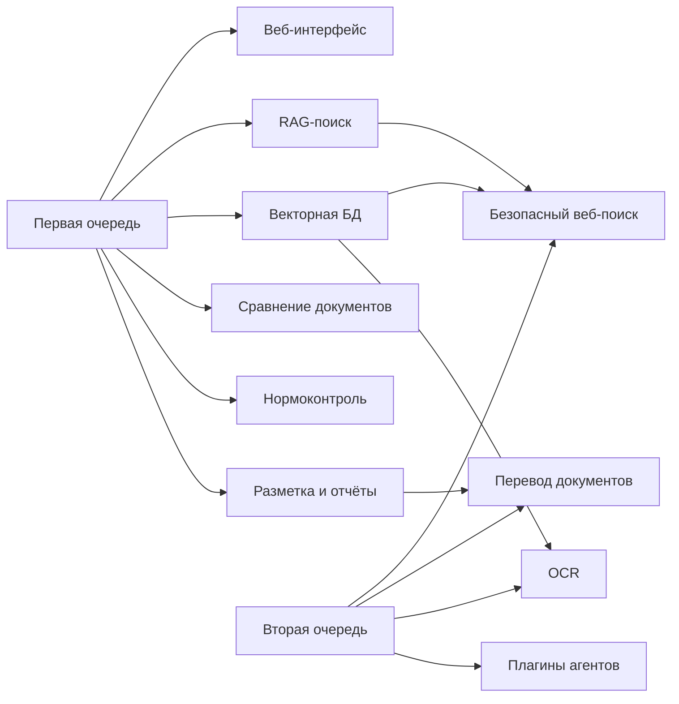


Рисунок 5.1-1. Поэтапная реализация функций первой и второй очередей.

### 5.2. Функции первой очереди


| Функция (п. 4.2.1 ТЗ)                          | Соответствующий модуль системы                       | Краткое обоснование                                                                  |
| ---------------------------------------------- | ---------------------------------------------------- | ------------------------------------------------------------------------------------ |
| Пользовательский веб-интерфейс                 | 6.1 User Web Interface                               | Единая точка ввода и отображения для загрузки документов, поиска, анализа и отчётов. |
| Семантический поиск с RAG                      | 6.4 RAG Module                                       | Основа интеллектуального поиска по локальному хранилищу и кэшу внешнего поиска.      |
| Формирование векторной БД                      | 6.5 Vector Database, 6.7 Document Parsing and Markup | Добавление/удаление документов и получение НСИ Заказчика с последующей индексацией.  |
| Интеграция с векторной БД                      | 6.5 Vector Database                                  | Хранение эмбеддингов с шифрованием и поиск с учётом RBAC.                            |
| Анализ инструкций и документов на соответствие | 6.6 AI Agent (Compliance Agent)                      | Проверка структуры, содержания и соответствия стандартам Минздрава, ЕЭК, ICH.        |
| Сравнение документов                           | 6.6 AI Agent (Comparison Agent)                      | Семантическое и формальное сравнение двух и более документов.                        |
| Создание разметки документов                   | 6.7 Document Parsing and Markup Module               | Парсинг в логические блоки и визуальный редактор разметки.                           |
| Генерация отчётных документов                  | 6.10 Report Generation Module                        | Выгрузка результатов в DOCX по шаблонам Заказчика или Подрядчика.                    |


### 5.3. Функции второй очереди


| Функция (п. 4.2.2 ТЗ)                      | Соответствующий модуль системы   | Краткое обоснование                                                                           |
| ------------------------------------------ | -------------------------------- | --------------------------------------------------------------------------------------------- |
| Безопасный поиск в интернете               | 6.11 Secure Web Search Module    | Поиск по разрешённым сайтам, кэширование в векторной БД, фильтр конфиденциальных запросов.    |
| Перевод документов                         | 6.9 Translation Module           | Перевод с сохранением структуры и терминологии с использованием локальной или доверенной БЯМ. |
| OCR                                        | 6.8 OCR Module                   | Распознавание текста с изображений и сканов для последующей индексации и анализа.             |
| Добавление агентов через штатный интерфейс | 6.12 Plugin Management Subsystem | Регистрация и запуск новых агентов в изолированных контейнерах с проверкой (в т.ч. ClamAV).   |


### 5.4. Безопасный веб-поиск (п. 4.2.2.1 ТЗ)

По п. 4.2.2.1 ТЗ модуль безопасного поиска в интернете обеспечивает:

- Белый список разрешённых внешних сайтов (в т.ч. регуляторные ресурсы класса EMA, FDA и др. — конкретный перечень согласуется с Заказчиком на стадии реализации).
- Блокировку запросов, содержащих признаки конфиденциальной информации: в таких случаях поиск выполняется только по внутреннему корпусу документов Заказчика.
- Кэширование результатов в векторном хранилище с политикой TTL (ориентир — 24 ч), согласованной с § 11.3.3 и § 11.4.1.
- Отображение в UI источников, цитат и предупреждений о рисках безопасности при работе с внешними данными — в объёме сценариев § 14.7 и API § 14.8.

Поток данных агента веб-поиска (запрос → разрешённые домены → нормализация → запись кэша в Milvus → выдача в RAG) увязан с конвейером § 13 и изоляцией агентов § 7.6, § 12.2.2.

### 5.5. Перевод документов

По п. 4.2.2.2 ТЗ перевод выполняется с сохранением структуры DOCX и фармакопейной / отраслевой терминологии с использованием локальной или доверенной БЯМ (§ 7.8). Перечень языков перевода согласовывается с Заказчиком на стадии реализации. 
Модуль перевода вызывается как подключаемый модуль оркестратора (§ 12); место этапа перевода в контуре подготовки данных к индексации и RAG — п. 13.3.7. Качество и критерии приёмки второй очереди — § 18.2.

### 5.6. Оптическое распознавание текста — OCR (п. 4.2.2.3 ТЗ)

По п. 4.2.2.3 ТЗ Система поддерживает OCR для форматов PDF, JPEG, PNG (и согласованных аналогов) с учётом многоязычности; распознанный текст поступает в конвейер подготовки данных после ingest (§ 13.3.2), на отдельном этапе OCR (п. 13.3.8), далее — разметка и индексация (§ 13.3.5). Перечень языков OCR подлежит согласованию с Заказчиком до завершения работ первой очереди в объёме, заданном ТЗ. Риски качества и приёмка — § 18.2.

---

## 6. Виды обеспечения

Соответствие п. 4.3 ТЗ по видам обеспечения.

### 6.1. Математическое обеспечение

Машинное обучение, БЯМ, RAG, классификация, кластеризация, распознавание образов и глубокое обучение (п. 4.3.1 ТЗ) нужны для семантического поиска, нормоконтроля и сравнения документов. 
Retriever выполняет поиск по эмбеддингам; Generator формирует ответ на основе извлечённого контекста; при необходимости применяются переранжирование и явное цитирование. Подробный конвейер приведён в § 13 и в Приложении А.

### 6.2. Программное обеспечение

Требование к функционированию на ОС Windows 10 (рабочие станции) и Ubuntu 24.04 или выше (серверы) (п. 4.3.2 ТЗ) согласовано с типовой инфраструктурой Заказчика. Клиентская часть работает в браузере на рабочих местах под управлением Windows 10 в доменной сети; серверные компоненты развёртываются в контейнерах на серверах с Ubuntu 24.04 LTS.

### 6.3. Техническое обеспечение

Технические средства и каналы связи обеспечиваются Заказчиком (п. 4.3.3 ТЗ). Уточнение параметров оборудования (мощность серверов, в т.ч. для БЯМ и векторной БД, характеристики рабочих станций и сети) выполняется на стадии реализации исходя из требований к производительности и безопасности.

### 6.4. Лингвистическое обеспечение

Требование к русскому языку надписей интерфейса, экранных форм и сообщений пользователю (п. 4.3.4 ТЗ) обусловлено основной аудиторией — сотрудниками российского регуляторного учреждения и необходимостью соответствия правилам документооборота и экспертизы на государственном языке.

---

## 7. Архитектурные принципы

Архитектура ИС «Фармадок» опирается на перечисленные ниже принципы. В подпунктах для каждого кратко указаны механизм в системе и связь с ТЗ (пп. 4.1.1–4.1.5, в т.ч. п. 4.1.4 — эргономика, п. 4.1.5 — защита информации).
Сводная схема «принцип → механизм → пункт ТЗ» — [рис. 7-1](#fig-principles-trace-7-1).

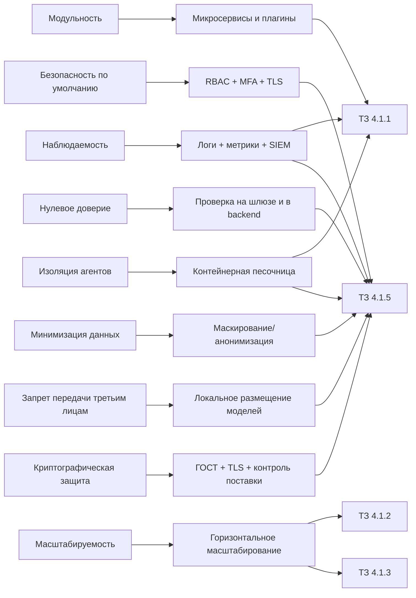


Рисунок 7-1. Трассировка архитектурных принципов на механизмы реализации и пункты ТЗ.

### 7.1. Модульность

Каждая функциональная область (веб-интерфейс, API Gateway, аутентификация, RAG, векторная БД, модуль агентов) выделена в самостоятельный модуль или сервис; новые возможности добавляются в виде плагинов без изменения ядра системы. 
Это соответствует требованию ТЗ о построении Системы на принципах открытости и модульности (п. 4.1.1) и реализуется в виде шести основных структурных элементов, а также штатного механизма подключения новых агентов-плагинов (п. 4.1.1, п. 4.2.2.4 ТЗ — вторая очередь).

### 7.2. Безопасность по умолчанию

В каждом компоненте Системы обеспечиваются аутентификация, авторизация и шифрование; данные не покидают доверенный контур без явного разрешения авторизованного пользователя. 

- Принцип реализуется через единую точку входа (API Gateway), RBAC и, если необходимо, MFA.
- Криптографические требования к каналам и хранимым данным сформулированы в п. 7.9.
- Запрет использования сторонних облачных ИИ для обработки контента и размещение БЯМ/эмбеддингов — в п. 7.8;
- Маскирование перед БЯМ и индексацией — в п. 7.7. Принцип поддерживает выполнение п. 4.1.1.5 и п. 4.1.5 ТЗ.

### 7.3. Нулевое доверие

Доверие не предоставляется по умолчанию даже для запросов из внутренней сети: подлинность и полномочия проверяются на уровне шлюза и в прикладных сервисах. 
Retriever при выборке из векторной БД применяет фильтрацию по правам доступа к документам (RBAC). 
Принцип дополняет п. 4.1.5 ТЗ и согласован с ролью API Gateway (п. 4.1.1 ТЗ).

### 7.4. Масштабируемость

Горизонтальное масштабирование обеспечивается контейнеризацией (Docker, при необходимости другой докер-оркестратор) серверных компонентов и балансировкой нагрузки на уровне API Gateway. Это позволяет наращивать производительность при росте числа пользователей и объёма данных без переработки прикладной логики. Обеспечивается выполнение требований требования п. 4.1.2 ТЗ (не менее 100 одновременно работающих пользователей, не менее 100 запросов в минуту) и согласование с п. 4.1.3 ТЗ по отказоустойчивости.

### 7.5. Наблюдаемость

Значимые события Системы и действия пользователей логируются; предусмотрена интеграция с SIEM. Запросы фиксируются на шлюзе с метаданными (IP, пользователь, время, тип запроса); отказы в доступе к документам со стороны Retriever также журналируются. Так выполняются п. 4.1.1 ТЗ (логирование запросов) и п. 4.1.5 ТЗ (журналирование действий и системных событий, интеграция с SIEM).

### 7.6. Изоляция агентов

Агенты ИИ (анализ соответствия, сравнение документов, веб-поиск, перевод, OCR и др.) выполняются в изолированных Docker-контейнерах с ограничениями по сети (белый список доменов), по файловой системе и по потреблению ресурсов. Это снижает риски при сбое или компрометации агента. Дополнительные меры к поставке плагинов (вторая очередь) — в п. 7.9. Принцип реализует п. 4.1.1 ТЗ (модуль агентов в контейнерах, белый список доменов). Изоляция агентов ИИ в контейнерной среде («песочница») закреплена в п. 4.1.5 ТЗ.

### 7.7. Минимизация данных

Персональные и иные чувствительные данные анонимизируются или маскируются перед передачей в большую языковую модель и перед индексацией в векторной БД (Microsoft Presidio или функциональный аналог), в т.ч. в промежуточном слое (middlware) на пути к БЯМ и при подготовке документов к индексации. Отсюда следует покрытие п. 4.1.1.5 и п. 4.1.5 ТЗ в части маскирования; подход согласован с п. 7.8 (контроль размещения моделей и отсутствие передачи в сторонние облачные ИИ).

### 7.8. Запрет передачи данных третьим лицам и соответствие ФЗ № 152

Требования п. 4.1.5 ТЗ и Федерального закона № 152-ФЗ «О персональных данных» исключают использование общедоступных облачных ИИ-сервисов (в т.ч. коммерческих API сторонних провайдеров) для обработки контента документов и запросов. БЯМ и модели эмбеддингов размещаются локально или в доверенном облаке Заказчика: тексты не уходят в сторонние облачные сервисы, контроль над данными и моделями сохраняется. Вариант развёртывания и параметры серверов уточняются на стадии реализации с учётом п. 4.1.2 ТЗ и политики Заказчика по размещению данных.

### 7.9. Криптографическая защита и контроль подключаемых компонентов

Соединения между компонентами выполняются по TLS 1.3; шифрование данных при хранении и функции хэширования — по ГОСТ Р 34.12-2015 и ГОСТ Р 34.11-2012. Загружаемые плагины агентов (вторая очередь) перед запуском проверяются на вредоносный код средствами антивируса. Так выполняются п. 4.1.5 ТЗ (шифрование каналов и данных) и п. 4.2.2.4 ТЗ (безопасное подключение новых агентных модулей).

В совокупности принципы раздела 7 обеспечивают соответствие Системы требованиям ТЗ к структуре и функционированию (п. 4.1.1), производительности и масштабируемости (п. 4.1.2), надёжности (п. 4.1.3). Требования к защите информации (п. 4.1.5) закрываются теми же принципами в части ИБ, криптографии и минимизации данных.

---

## 8. Инфраструктура и платформа

Серверы — Ubuntu 24.04 LTS, рабочие станции — Windows 10 (п. 4.3.2 ТЗ). Контейнеризация — Docker; при необходимости — оркестрация (Kubernetes,Docker Compose или другие оркестраторы) для горизонтального масштабирования.

CI/CD — GitLab CI или Jenkins (по согласованию с Заказчиком); конфигурации и исходный код — в системе управления конфигурациями Заказчика с автоматической сборкой и развёртыванием (п. 6 ТЗ). Удалённый доступ — VPN WireGuard (топология — Приложение № 2 к ТЗ).

В совокупности это стыкуется с инфраструктурой Заказчика, требованиями к масштабируемости (п. 4.1.2 ТЗ) и порядку развёртывания (п. 6 ТЗ).

## 9. Подсистема входа, аутентификации и авторизации

В настоящем разделе приведены архитектура и обоснование выбора подсистемы единого входа, установления личности и проверки прав доступа. Детали по компонентам приведены в п. 9.3 (API Gateway), п. 9.4 (аутентификация) и п. 9.5 (авторизация).

### 9.1. Обзор подсистемы: проблема, подходы решения

#### 9.1.1. Проблема и требования

ИС «Фармадок» обрабатывает фармацевтическую документацию и персональные данные. 
Необходимо обеспечить: 

1. контролируемый доступ к серверной части — установление личности (аутентификация) и проверку прав на операции и данные (авторизация);
2. единое место прохождения трафика — чтобы все запросы к backend проходили через один контур, где выполняются проверки, ограничение нагрузки и аудит;
3. соответствие ТЗ — п. 4.1.1 (единая точка входа, аутентификация, RBAC, ограничение частоты запросов, логирование) и п. 4.1.5 (контроль доступа, защита информации, журналирование).

Прямой доступ к backend в обход шлюза затрудняет централизованную проверку прав и учёт событий и снижает эффективность защитных мер. При отсутствии выделенной подсистемы идентификации логику входа пришлось бы дублировать в прикладных сервисах, что повышает риск ошибок и использования небезопасных схем, включая хранение секретов в браузере. Для экспертной среды дополнительно требуются SSO, RBAC, а при необходимости MFA и исключение передачи учётных данных третьим лицам без согласия (п. 4.1.5 ТЗ).

#### 9.1.2. Существующие подходы к решению

В отрасли для решения перечисленных задач применяются три взаимодополняющих подхода. 
1. Единая точка входа (API Gateway): 
Весь внешний трафик к backend пропускается через шлюз; шлюз выполняет проверку аутентификации (по JWT или сессии), авторизацию по правилам (RBAC), ограничение частоты запросов и логирование. В результате проверки не дублируются в каждом компоненте, аудит и политики доступа централизованы. 
2. Федеративная идентификация (OAuth2/OIDC): 
Отдельный компонент — поставщик идентичности (Id провайдер) — проверяет учётные данные и выдаёт токены с утверждениями о пользователе и ролях; приложения и шлюз проверяют токены по публичным ключам Id провайдер и не хранят пароли. Это обеспечивает SSO, MFA и интеграцию с корпоративными каталогами (LDAP/AD). 
3. Безопасный обмен токенами для веб-клиента (BFF): 
Браузерное приложение (фронтенд) не получает долгоживущие секреты; обмен кода авторизации на токен выполняется на сервере в модуле Backend for Frontend (BFF) в составе совмещённого прикладного сервиса за шлюзом; далее запросы к API проходят через `API Gateway` с подстановкой и проверкой JWT. Риск утечки секретов из браузера снижается; подход соответствует рекомендациям по безопасному использованию OAuth2/OIDC для фронтенда (поток Authorization Code + PKCE). Комбинация подходов 1–3 даёт единую точку входа с централизованной аутентификацией и авторизацией и безопасным сценарием входа для веб-клиента.

#### 9.1.3. Варианты протоколов и потоков

OAuth 2.0 / OpenID Connect выбраны как база: это распространённый стандарт для федерации и SSO, хорошо стыкуется с LDAP/AD и типовыми Id провайдерами (выбор для «Фармадок» — п. 9.4.5). Приложение и шлюз видят только JWT по публичным ключам, пароль остаётся у Id провайдера (п. 4.1.5 ТЗ). OIDC даёт стандартные identity-claims и роли/группы для RBAC; MFA и аудит событий входа сосредоточены в Id провайдере, без копирования в каждый сервис.

Чистые «сессии с паролем» или проприетарные схемы реже дают в одном пакете SSO, отсутствие передачи пароля приложению и совместимость с корпоративными Id провайдерами без лишней самописной обвязки.

При выборе способа получения токена для веб-клиента (фронтенд) рассматривались варианты потоков OAuth 2.0 / OpenID Connect.
1. Authorization Code + PKCE:
Клиент направляет пользователя к Id провайдеру; получает код авторизации по редиректу и обменивает его на токен на стороне модуля BFF в составе совмещённого прикладного сервиса (доступного извне через маршруты шлюза); code_verifier ограничивает использование перехваченного кода. Рекомендуется для фронтенда (OAuth 2.0 Security BCP, RFC 8252): секреты клиента не попадают в браузер. 
2. Implicit flow: 
Токен возвращается в fragment URL после редиректа с Id провайдера. Устарел, уязвим к перехвату токена; не рекомендуется (RFC 6749, OAuth 2.0 Security BCP). 
3. Resource Owner Password Credentials:
Клиент передаёт логин и пароль приложению, приложение обменивает их на токен у Id провайдера. Требует доверия к клиенту, раскрывает пароль приложению; для браузерного фронтенда недопустим. 
4. Client Credentials: приложение аутентифицируется само (без пользователя); применим для сервис-сервис вызовов, не для входа пользователя. Детали аутентификации сервисов бэкенда между собой — п. 9.4.9 и [рис. 9-4](#fig-9-4).
Обоснование выбора потока для ИС «Фармадок» — п. 9.2.1; детали потока — п. 9.4.4 и [рис. 9-3](#fig-9-3).

#### 9.1.4. Варианты реализации

При выборе конкретной реализации рассматривались четыре варианта. 
1. Сессии на сервере без выделенного шлюза:
Логин и пароль проверяются одним из backend-компонентов, сессия хранится на сервере; авторизация — по данным, привязанным к сессии. Недостатки: отсутствие единой точки входа для всех API, сложность масштабирования на множество компонентов, затруднённый централизованный аудит. 
2. Собственный сервер логина с JWT и отдельный API Gateway: 
Приложение ведёт учётные записи и выдаёт JWT; шлюз проверяет JWT и RBAC. Даёт единую точку входа, но дублирует функциональность Id провайдера, не решает задачу SSO для нескольких приложений и увеличивает объём собственной разработки и сопровождения. 
3. Федеративная идентификация (OAuth2/OIDC) с выделенным Id провайдером в контуре Заказчика и API Gateway: 
Централизованный Id провайдер (Authentik, Keycloak или аналог) выполняет аутентификацию и выдаёт JWT. Шлюз проверяет токены по ключам Id провайдера и выполняет RBAC. Браузерный клиент обращается к шлюзу; обмен кода на токен и сценарий с сессией выполняются в модуле BFF в составе совмещённого прикладного сервиса за шлюзом. Так достигаются единая точка входа, SSO, MFA, RBAC и централизованный аудит, сохраняется соответствие отраслевым практикам и не передаются данные аутентификации третьим лицам. 
4. Облачные Id провайдеры (Auth0, Okta, Azure AD и т.п.) с API Gateway: вариант, аналогичный варианту 3, но с размещением Id-провайдера у стороннего оператора. Указанный подход снижает эксплуатационные затраты, однако влечёт передачу учётных данных и фактов входа во внешний облачный контур, что может противоречить п. 4.1.5 ТЗ и политике конфиденциальности для фармацевтической и экспертной информации.

### 9.2. Обоснование выбора и состав подсистемы

#### 9.2.1. Обоснование выбора варианта реализации

Принятые решения по реализации:

1. Целевая схема подсистемы: браузерный клиент -> API Gateway (Kong) -> совмещённый прикладной сервис (BFF+backend); контур аутентификации обеспечивает локальный Id-провайдер Заказчика. Публичные `redirect_uri` и callback OIDC регистрируются как маршруты шлюза, проксирующие на этот сервис.
2. Базовая конфигурация для технического проекта: Kong OSS как API Gateway и Authentik как Id-провайдер; использование Keycloak допускается как эквивалентной альтернативы по согласованию с Заказчиком без изменения архитектуры.
3. Для получения токена веб-клиентом принят поток Authorization Code + PKCE в рамках OpenID Connect: Id-провайдер поддерживает discovery и выдаёт JWT с утверждениями о пользователе и ролях; обмен кода на токен выполняется в модуле BFF в составе совмещённого прикладного сервиса, браузер не получает долгоживущие секреты. Детали потока — п. 9.4.4 и [рис. 9-3](#fig-9-3).

Этим обеспечиваются п. 4.1.1 и 4.1.5 ТЗ по точке входа, аутентификации, RBAC, лимитам и логированию. Id провайдер и шлюз настраиваются один раз на контур прикладных сервисов; доступны SSO, MFA и стыковка с LDAP/корпоративным Id провайдером. Модуль BFF в составе совмещённого сервиса убирает секреты клиента из браузера и соответствует BCP для OAuth2/OIDC.

Вариант 4 не принят в качестве основного из-за требований к размещению данных (п. 4.1.5 ТЗ). 
Варианты 1 и 2 не обеспечивают в совокупности единую точку входа, SSO и отраслевые практики без избыточной собственной разработки.

#### 9.2.2. Состав и общий поток

Подсистема состоит из четырёх компонентов: API Gateway (Kong — п. 9.3), Id провайдер (Authentik как базовый вариант; Keycloak — допустимая альтернатива, см. п. 9.4.5), совмещённый прикладной сервис (BFF+backend), фронтенд. 
Общий поток: пользователь открывает фронтенд (отдельная раздача статики или через маршруты шлюза — по решению реализации). Все обращения к API и сценарию входа из браузера идут на публичный адрес шлюза. При необходимости входа совмещённый сервис через шлюз инициирует редирект к Id провайдеру (OAuth2/OIDC, Authorization Code + PKCE). После успешной аутентификации Id провайдер возвращает код на `redirect_uri` шлюза; шлюз передаёт запрос совмещённому сервису, который обменивает код на JWT. Последующие запросы: фронтенд → шлюз → совмещённый сервис; на шлюзе выполняются проверка JWT, RBAC и лимиты ([рис. 9-1](#fig-9-1)). 
Детализация состава и пошаговый поток входа — п. 9.3, п. 9.4.2, п. 9.4.4; авторизация — п. 9.5. Состав и общий поток показаны на [рис. 9-1](#fig-9-1).

Рисунок 9-1. Состав подсистемы и общий поток запросов.

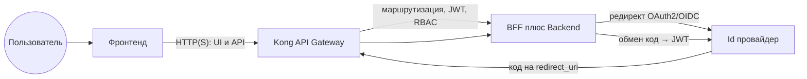


### 9.3. API Gateway и точка входа

Роль шлюза в подсистеме и связь с требованиями ТЗ раскрыты в п. 9.1 и п. 9.2. Ниже приведены назначение компонента в архитектуре, последовательность обработки запроса, принципы реализации, логирования и возможной замены продукта без изменения архитектурной роли шлюза.

#### 9.3.1. Назначение и место в подсистеме

API Gateway выступает единственной точкой входа для всех запросов к серверной части Системы из браузера и для внешних клиентов: веб-клиент обращается к шлюзу, шлюз направляет трафик на совмещённый прикладной сервис BFF+backend (а также, при необходимости, на иные backend-сервисы по п. 9.4.9). 
Все запросы к прикладным компонентам проходят через шлюз; прямой доступ к ним в обход шлюза не предусмотрен. 
На шлюз возлагаются: принудительная проверка аутентификации (валидность JWT), проверка прав доступа по ролям (RBAC), ограничение частоты запросов, маршрутизация на соответствующие компоненты и аудит каждого запроса. 
Совмещённый прикладной сервис и иные backend-компоненты получают лишь запросы, уже прошедшие проверку на шлюзе (где применима проверка JWT), с контекстом авторизации (идентификатор пользователя, роли).

#### 9.3.2. Последовательность обработки запроса

Для каждого входящего запроса шлюз выполняет следующие шаги. 

1. Приём запроса и извлечение JWT из заголовка `Authorization: Bearer <token>`.
2. Аутентификация: проверка подписи и срока действия JWT по публичным ключам Id провайдера (JWKS или PEM); при отсутствии токена, невалидной подписи или истечении срока — ответ 401 Unauthorized, запрос на backend не передаётся, событие логируется.
3. Авторизация (RBAC): для пары «метод HTTP + путь» проверяется, разрешена ли операция для хотя бы одной из ролей пользователя, извлечённых из JWT; при недостатке прав — 403 Forbidden, backend не вызывается.
4. Ограничение частоты: не более 100 запросов в минуту на одного аутентифицированного пользователя (п. 4.1.1 ТЗ); при превышении — 429 Too Many Requests.
5. Маршрутизация: запрос вместе с контекстом авторизации (идентификатор пользователя, роли) направляется на соответствующий backend-компонент согласно правилам (маппинг «путь + метод» → целевой компонент).
6. Ответ: ответ backend возвращается клиенту через шлюз; при таймауте или ошибке компонента шлюз формирует ответ с кодом 5xx и фиксирует событие.

Порядок плагинов на маршруте: сначала проверка JWT, затем RBAC, затем при необходимости rate limiting и маршрутизация. Схема шагов приведена на [рис. 9-2](#fig-9-2).

Рисунок 9-2. Последовательность обработки запроса на API Gateway.

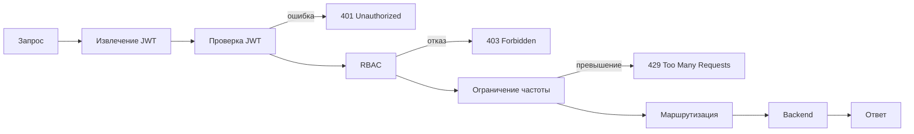


#### 9.3.3. Реализация API Gateway в целевой конфигурации

В базовой конфигурации технического проекта используется Kong OSS. Для пояснительной записки существенны не файловые пути и параметры портов, а следующие архитектурные положения:

- конфигурация шлюза ведётся централизованно и декларативно;
- все внешние вызовы к backend проходят только через маршруты шлюза;
- проверка JWT выполняется по ключам локального Id-провайдера;
- правила RBAC на уровне эндпоинтов поддерживаются в конфигурации шлюза и синхронизируются с принятой ролевой моделью.

Низкоуровневые параметры развёртывания, состав плагинов, конкретные файлы конфигурации и эксплуатационные процедуры относятся к документу «Описание программного обеспечения» и регламентам сопровождения.

#### 9.3.4. Логирование и интеграция с SIEM

Каждый запрос, проходящий через API Gateway, логируется с метаданными: IP-адрес клиента, идентификатор пользователя (из JWT), время запроса, метод и путь, HTTP-статус ответа, задержка. События отказа в доступе (401, 403, 429) фиксируются отдельно и могут передаваться в систему SIEM Заказчика (п. 4.1.5 ТЗ).

Принцип реализации. Шлюз должен формировать структурированные access-логи, отдельно выделять события отказа в доступе (`401`, `403`, `429`) и передавать их в централизованный контур наблюдаемости и при необходимости в SIEM Заказчика. В журналы включаются как минимум IP-адрес клиента, метод и путь, код ответа, задержка, а также идентификатор пользователя или эквивалентный субъектный атрибут из контекста аутентификации.

Конкретный механизм доставки в SIEM (syslog, файловый сборщик, HTTP-коннектор или корпоративный агент), формат записи и набор полей утверждаются на стадии реализации в связке с требованиями ИБ Заказчика.

#### 9.3.5. Взаимодействие с Id провайдером

Шлюз не обращается к Id провайдеру при каждом запросе: проверка JWT выполняется локально по публичным ключам Id провайдера (Authentik). 
Синхронизация ключей (обновление PEM в конфигурации Kong) выполняется при развёртывании или по процедуре обновления (например, скрипт setup-kong-jwt-auth.sh).

### 9.4. Аутентификация

Подраздел раскрывает, что такое аутентификация в контексте системы, из чего состоит контур (Id-провайдер, шлюз, совмещённый BFF+backend, фронтенд), как проходит вход и выдача токена и почему выбран конкретный Id-провайдер; отдельно рассматриваются AD-федерация (п. 9.4.8) и сервис-сервис вызовы (п. 9.4.9). Архитектурный каркас (OAuth2/OIDC, Id-провайдер у Заказчика, модуль BFF в составе прикладного сервиса за шлюзом) дан в п. 9.1–9.2, авторизация — п. 9.5. Реализация в коде — в документе «Описание программного обеспечения».

#### 9.4.1. Понятие аутентификации

*Аутентификация* — установление и проверка личности субъекта (пользователя или компонента): подтверждение того, что субъект является тем, за кого себя выдаёт. Пользователь предъявляет учётные данные (логин и пароль, сертификат, биометрию или второй фактор — TOTP, FIDO2); система проверяет их и при успехе связывает сессию или выданный токен с идентификатором. 

Результат аутентификации — уверенность в том, *кто* обращается к системе. 

В ИС «Фармадок» аутентификация обеспечивается Id-провайдером (проверка учётных данных, при необходимости MFA, выдача JWT); после входа права пользователя проверяются при каждом запросе по утверждениям в JWT (авторизация — п. 9.5).

#### 9.4.2. Назначение и состав компонента

Компоненты аутентификации и авторизации выступают источником *идентичности* пользователя и *сведений о его правах* для всей Системы: установление личности при входе, выдача JWT для последующих запросов к API, передача контекста прав в API Gateway и backend (решения о допуске принимаются на шлюзе и backend по утверждениям в JWT).

Требования ТЗ: п. 4.1.1 и п. 4.1.5 ТЗ.

Id провайдер (Identity Provider): 
В базовой конфигурации — Authentik; по согласованию с Заказчиком допускается Keycloak как эквивалентная альтернатива. Компонент проверяет учётные данные, при необходимости проводит MFA, выдаёт JWT с утверждениями о пользователе и ролях (или группах, отображаемых на роли). Обоснование выбора Id-провайдера — п. 9.4.5.

BFF (Backend for Frontend) — слой в составе совмещённого прикладного сервиса: 
через маршруты шлюза фронтенд входит в систему и обращается к API; выполняется обмен кода авторизации на токен и работа с серверной сессией; запросы к прикладному API проходят через шлюз с проверкой JWT и RBAC.

Фронтенд:
Браузерное приложение; инициация входа и вызовы функциональности выполняются к публичному адресу шлюза. Логически фронтенд расположен перед API Gateway; шлюз проверяет JWT и извлекает контекст прав; совмещённый BFF+backend получает контекст от шлюза и не обращается к Id провайдеру напрямую при обработке каждого запроса API.

#### 9.4.3. SSO (единый вход)

*Single Sign-On (SSO)* — возможность один раз пройти аутентификацию у единого Id провайдера и затем обращаться ко всем приложениям и сервисам Системы без повторного ввода учётных данных.
В ИС «Фармадок» SSO обеспечивается за счёт централизованного Id провайдера (Authentik или согласованный с Заказчиком OIDC-совместимый провайдер) и протоколов OAuth2/OpenID Connect:

- после успешного входа в Id провайдере пользователь получает JWT; 
- при обращении к другим приложениям в контуре (фронтенд, API через шлюз к совмещённому сервису) повторная аутентификация не требуется — шлюз и прикладные сервисы доверяют утверждениям в токене.

Требование единого входа задано ТЗ: п. 4.1.1. 
Детали процесса входа и выдачи токена — п. 9.4.4 ([рис. 9-3](#fig-9-3)); обоснование выбора Id-провайдера — п. 9.2.1 и п. 9.4.5.

#### 9.4.4. Процесс входа и выдачи токена

1. Пользователь открывает в браузере приложение (фронтенд) и обращается к публичному адресу API Gateway;
2. Совмещённый сервис через шлюз перенаправляет браузер к Id провайдеру;
3. После успешной аутентификации Id провайдер редиректит браузер на `redirect_uri`, зарегистрированный на шлюзе; шлюз передаёт callback совмещённому сервису с кодом авторизации.
4. Модуль BFF в составе совмещённого сервиса обменивает код на JWT; браузер получает только cookie сессии, JWT в браузере не хранится.
5. Браузер отправляет cookie на шлюз; по серверной сессии формируется запрос к API с заголовком `Authorization: Bearer` (или иная согласованная политика маршрута), проверяемым на шлюзе.
6. Шлюз проверяет JWT и RBAC и при успехе передаёт запрос на совмещённый прикладной сервис с контекстом авторизации.

Секреты клиента (client_secret при наличии) и долгоживущие токены не попадают в браузер — это соответствует рекомендациям по безопасному использованию OAuth2/OIDC для фронтенда. 
Последовательность взаимодействия отражена на [рис. 9-3](#fig-9-3).

Рисунок 9-3. Поток входа и выдачи токена (Authorization Code + PKCE).

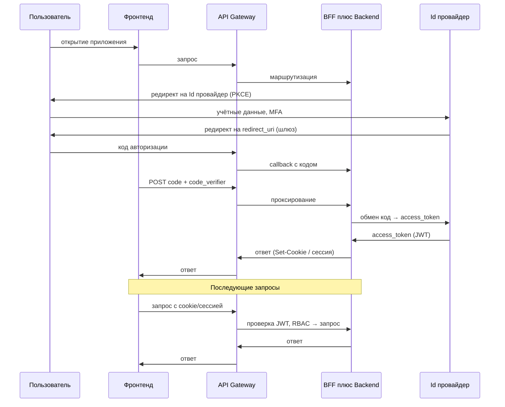


#### 9.4.5. Обоснование выбора Id провайдера (Authentik и альтернативы)

В качестве Id провайдера на стадии прототипирования выбран Authentik; при утверждённом корпоративном Id провайдере у Заказчика (в т.ч. Keycloak) допускается его использование по согласованию.

- Authentik — открытое ПО (лицензия MIT), развёртывание на собственной инфраструктуре. Поддерживает OAuth 2.0, OpenID Connect, JWT, MFA (TOTP, FIDO2), интеграцию с LDAP и др. В репозитории предусмотрены: готовый docker-compose, интеграция с HashiCorp Vault (скрипт run-authentik-with-vault.sh), blueprint провайдера OIDC и приложения (farmadoc-oidc), скрипт настройки Kong (setup-kong-jwt-auth.sh). Это сокращает сроки развёртывания и обеспечивает единообразие конфигурации без привязки к облаку и без передачи данных аутентификации за пределы контура Заказчика.
- Keycloak — открытый Id провайдер (Red Hat), OAuth2/OIDC, MFA, LDAP. Выбор обоснован, если у Заказчика уже развёрнут Keycloak как корпоративный стандарт; интеграция с Kong (JWKS) и модулем BFF в совмещённом сервисе аналогична. В конфигурации на стадии прототипирования выбран Authentik из соображений ресурсоёмкости (Keycloak тяжелее по памяти и образу) и наличия готовых скриптов и blueprints; при переходе на Keycloak потребуются подстановка JWKS в Kong и настройка OIDC-клиента в совмещённом сервисе на discovery Keycloak.
- Облачные Id провайдеры (Auth0, Okta, Azure AD, Google Identity и др.) — передача аутентификации и учётных данных третьей стороне. Для ИС «Фармадок» не рекомендуется как основной вариант из-за п. 4.1.5 ТЗ и конфиденциальности (персональные данные, данные экспертиз). Допустимо только при явном согласии Заказчика и соответствии провайдера политике по размещению данных.
- Самописный Id провайдер — разработка собственного сервера с OAuth2/OIDC и MFA. Требует больших трудозатрат, дублирует зрелые решения и увеличивает риски уязвимостей. Не рекомендуется при наличии готовых Id провайдеров (Authentik, Keycloak), удовлетворяющих ТЗ.

Итого: принят Authentik как баланс между полнотой функций (SSO, MFA, OIDC, LDAP), независимостью от облака, открытой лицензией и удобством развёртывания (Vault, скрипты, blueprint). Замена на иной OIDC-совместимый Id провайдер (например Keycloak) возможна без изменения архитектуры: Kong и совмещённый прикладной сервис с модулем BFF работают с любым таким Id провайдером. Интеграция с корпоративным AD (федерация и маппинг групп в роли) — п. 9.4.8.

#### 9.4.6. MFA (многофакторная аутентификация)

*Многофакторная аутентификация (MFA)* — проверка личности пользователя по двум и более факторам: не только «что пользователь знает» (пароль), но и «что пользователь имеет» (TOTP-код с устройства, ключ безопасности) или «кто пользователь» (биометрия). MFA снижает риски при компрометации пароля и соответствует требованию ТЗ п. 4.1.5 (защита информации, MFA при необходимости). В ИС «Фармадок» MFA реализуется на стороне Id-провайдера: после ввода логина и пароля компонент при необходимости запрашивает второй фактор; при успешной проверке выдаётся JWT.

Поддерживаемые методы в Authentik и Keycloak: 

- TOTP (одноразовые коды по времени, приложения типа Google Authenticator, Authenticator); 
- FIDO2/WebAuthn (аппаратные ключи или платформенный аутентификатор). 
Включение MFA, выбор методов и назначение политик (обязательный второй фактор для ролей или приложений) настраиваются в Id провайдере; архитектура входа (модуль BFF в совмещённом сервисе, OIDC, JWT на шлюзе) при этом не меняется.

Детали настройки MFA — в документации Id провайдера и п. 3.8.1 документа «Описание программного обеспечения».

#### 9.4.7. Backend, фронтенд и BFF

Серверная часть Системы реализуется на Python 3.11 и выше с использованием FastAPI или эквивалента. Доступ к совмещённому прикладному сервису извне — только через API Gateway (п. 9.3); запросы приходят с проверенным на шлюзе JWT (где применима политика маршрута) и контекстом авторизации.

Целевая архитектурная конфигурация. Для технического проекта принимается браузерный пользовательский интерфейс и совмещённый прикладной сервис (модуль BFF и прикладной backend в одном развёртывании) с серверной сессией. Независимо от выбора клиентского фреймворка (`MPA` или `SPA`) безопасность строится одинаково: браузер не хранит долгоживущие токены, а обмен кода авторизации на токен и дальнейшая работа с сессией выполняются в модуле BFF в составе этого сервиса; внешние вызовы к API проходят через шлюз.

Фронтенд. Пользовательский веб-интерфейс реализуется как браузерное приложение. Конкретный UI-стек и способ рендеринга уточняются на стадии реализации, но не меняют архитектурную схему входа, единую точку доступа к API и требования к RBAC.

BFF. Backend for Frontend в составе совмещённого сервиса инициирует редирект пользователя к Id-провайдеру, принимает callback с кодом авторизации (через маршруты шлюза), обменивает код на JWT, хранит токен в серверной сессии и обрабатывает прикладные запросы после проверок на шлюзе. За счёт этого секреты и долгоживущие токены не передаются в браузер, а аудит обмена токенов и вызовов API концентрируется в прикладном контуре за единой точкой входа.

Подробные маршруты, набор переменных окружения и низкоуровневая конфигурация совмещённого сервиса и шлюза фиксируются в документе «Описание программного обеспечения».

#### 9.4.8. Интеграция с корпоративным каталогом (AD-федерация)

Интеграция с корпоративным Active Directory позволяет организовать вход пользователей по учётным данным AD и использовать группы AD для разграничения доступа в Системе (в соответствии с архитектурой, принятой в п. 9.1–9.2).

Аутентификация (вход через AD-федерацию). 
Id провайдер (Authentik или Keycloak) настраивается на использование AD как источника идентичности: подключение по LDAP/LDAPS.

- Пользователь вводит логин и пароль AD; 
- Id провайдер проверяет их по AD, при успехе выдаёт JWT. 
Поток для клиента (шлюз, совмещённый BFF+backend, OIDC) не меняется — меняется только источник учётных данных на стороне Id-провайдера (п. 9.4.4, п. 9.4.5; Authentik и Keycloak поддерживают LDAP и федерацию).

Авторизация (роли из групп AD). 
В Id-провайдере настраивается маппинг групп (или атрибутов) AD в утверждения JWT (например, группы AD -> claim `groups` или `roles`). Шлюз и backend используют эти утверждения для RBAC по п. 9.5; дополнительная настройка — в п. 9.5.3.
Права доступа в ИС «Фармадок» могут при этом определяться членством в группах AD без дублирования учёта в самом Id провайдере.

Развёртывание и настройка федерации с AD выполняются по согласованию с Заказчиком (LDAP). Учётные данные проверяются в контуре Заказчика (Id провайдер и AD внутри контура или через защищённый канал), что соответствует п. 4.1.5 ТЗ по конфиденциальности. Детали настройки LDAP и маппинга групп — в документации Id провайдера (Authentik, Keycloak) и при необходимости в п. 3.8.1 документа «Описание программного обеспечения».

#### 9.4.9. Аутентификация сервисов бэкенда между собой

При вызове одного компонента бэкенда другим вызываемый сервис должен проверять легитимность вызова. Рассматривались следующие варианты. 

- 1. Client Credentials (OAuth2): 
Сервисы регистрируются у Id провайдера как confidential-клиенты, получают JWT по client_id/client_secret и передают его в запросе; проверка по ключам Id провайдера. 
- 2. Прокидывание пользовательского JWT:
При вызове в контексте запроса пользователя — передача того же JWT, что пришёл в первый сервис; подходит для цепочки вызовов «от имени» пользователя, не подходит для фоновых вызовов без пользователя. 
- 3. Внутренний API-ключ или shared secret:
Заголовок с секретом, проверяемым Kong или сервисом; простая реализация, но один скомпрометированный ключ открывает доступ, ротация и учёт сложнее. 
- 4. mTLS (взаимная TLS-аутентификация):
Сертификаты на стороне сервисов; сильная аутентификация, но отдельная инфраструктура сертификатов. 
- 5. Без аутентификации (доверие внутренней сети): 
Вызовы внутри контура считаются доверенными; риск при компрометации любого компонента или сегмента сети.

Выбран вариант Client Credentials в качестве основного механизма для сервис-сервис вызовов без пользовательского контекста, при необходимости в сочетании с прокидыванием пользовательского JWT для вызовов в рамках запроса пользователя. 
Обоснование: 

- единый Id провайдер для пользовательских и сервисных токенов,
- стандартный OAuth2, отзыв через Id провайдер, отсутствие распространения секретов между сервисами; 
- API Gateway и backend уже проверяют JWT по ключам Id-провайдера (п. 9.3.5).

Сервисы регистрируются у Id провайдера как confidential-клиенты (client_id и client_secret).

1. При необходимости вызвать другой сервис вызывающий компонент запрашивает у Id-провайдера JWT-токен доступа.
2. Id-провайдер выдаёт JWT с утверждениями о вызывающем сервисе.
3. Вызов выполняется с заголовком `Authorization: Bearer <token>`.
4. Принимающий сервис проверяет подпись и срок действия токена по публичным ключам, тем же, что используются для пользовательских JWT.

Секреты между сервисами не передаются; единая точка выдачи и отзыва сервисных токенов — Id-провайдер.

Поток аутентификации сервисов показан на [рис. 9-4](#fig-9-4).

Рисунок 9-4. Аутентификация сервисов бэкенда (Client Credentials).

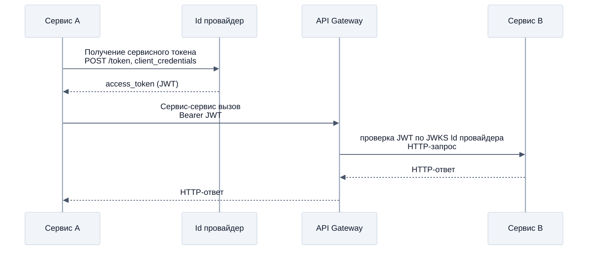


В пользовательском запросе допустимо прокидывать тот же JWT, что пришёл через Kong, чтобы у вызываемого сервиса был контекст для RBAC и аудита. Для фона без пользователя (очереди, планировщики) — Client Credentials; в Kong задают отдельные маршруты или правила по audience/claim, чтобы не смешивать пользовательский и сервисный трафик.

#### 9.4.10. Ссылки на реализацию

Детали реализации (настройка провайдера и приложения у Id-провайдера, конфигурация шлюза и совмещённого прикладного сервиса, пошаговый поток, взаимодействие компонентов, хранение секретов, интеграция с AD — п. 9.4.8, аутентификация сервисов — п. 9.4.9) приведены в документе «Описание программного обеспечения».

### 9.5. Авторизация

Проверка прав после аутентификации: определение авторизации, двухуровневая RBAC (шлюз и backend), настройка. Порядок проверки JWT и RBAC на шлюзе — п. 9.3 и [рис. 9-2](#fig-9-2).

#### 9.5.1. Понятие авторизации

*Авторизация* — проверка прав субъекта на выполнение действия или доступ к ресурсу: разрешено ли уже опознанному пользователю выполнить операцию, прочитать документ, вызвать эндпоинт API. Авторизация опирается на результат аутентификации (идентификатор и атрибуты, например роли) и на правила разграничения доступа (матрица «кто — что может»). Результат авторизации — решение *разрешить* или *запретить* доступ. 
В ИС «Фармадок» авторизация реализована проверкой прав по ролям (RBAC) на уровне API Gateway и backend при каждом запросе по утверждениям в JWT.

#### 9.5.2. Двухуровневая авторизация (RBAC)

Авторизация реализуется в два уровня. 

- 1. На уровне API Gateway (п. 9.3): для пары «метод HTTP + путь» проверяется разрешённость операции для ролей из JWT; при недостатке прав возвращается `403 Forbidden` до вызова backend. Тем самым решается вопрос *доступа к эндпоинту*. 
- 2. На уровне backend: проверка прав при доступе к конкретным данным (например, Retriever возвращает только документы по ролевой модели) и при выполнении изменяющих операций (создание, изменение, удаление). Тем самым решается вопрос *доступа к данным и операциям*.

Ролевая модель поддерживается назначением ролей в Id провайдере и передачей утверждений (роли/группы) в JWT; матрица «роль — операции и данные» уточняется на стадии реализации.

#### 9.5.3. Настройка авторизации

Настройка выполняется в двух местах.

- 1. Id-провайдер: в провайдере или приложении OIDC настраивается включение ролей или групп пользователя в JWT (custom claims или стандартные scopes); задаётся маппинг «роль/группа в Id-провайдере -> имя утверждения в токене» (например `groups`, `roles`), чтобы шлюз и backend единообразно читали список ролей. Роли могут поступать из групп AD при федерации с корпоративным каталогом (п. 9.4.8).
- 2. API Gateway: задаются правила вида «для пути X и методов M разрешены роли R»; конкретная реализация проверки по ролям зависит от выбранного продукта шлюза, см. п. 9.3.

Матрица ролей, правила доступа и их низкоуровневая конфигурация фиксируются в документе «Описание программного обеспечения» и в эксплуатационных регламентах.

#### 9.5.4. Базовая матрица ролей

Для целей технического проекта принимается следующая укрупнённая ролевая модель:


| Роль                             | Основные полномочия                                                                                                           | Ограничения                                                                                        |
| -------------------------------- | ----------------------------------------------------------------------------------------------------------------------------- | -------------------------------------------------------------------------------------------------- |
| Эксперт                      | поиск по корпусу, просмотр разрешённых документов, запуск сравнения и нормоконтроля, формирование отчётов по доступным данным | нет доступа к администрированию ролей, плагинов и системных настроек                               |
| Оператор загрузки/индексации | регистрация документов, запуск конвейеров подготовки и переиндексации, контроль статусов обработки                            | не управляет ролевой моделью и настройками ИБ                                                      |
| Администратор системы        | настройка интеграций, шаблонов, плагинов, служебных параметров и эксплуатационных процедур                                    | доступ к содержимому документов определяется отдельно политиками данных и служебной необходимостью |
| Аудитор/ИБ                   | просмотр журналов аудита, событий доступа, эксплуатационных метрик и отчётов по безопасности                                  | не выполняет прикладные операции от имени эксперта                                                 |


Окончательная детализация ролей, групп и соответствующих им endpoint-прав утверждается на стадии реализации совместно с Заказчиком.

#### 9.5.5. Ссылки на реализацию

Ролевая модель RBAC с перечнем ролей, взаимодействие компонентов — п. 3.8.1 документа «Описание программного обеспечения». 

### 9.6. Ограничения текущей реализации и перспектива замены

Kong выбран Заказчиком в качестве API Gateway в исходном техническом задании на стадии конкурсного отбора. 
На стадии прототипирования были выявлены недостатки:

- усложнённая схема авторизации (в Kong OSS нет штатного плагина `openid-connect` в открытой редакции; поддержка OIDC требует дополнительных настроек, а проверка RBAC по ролям из JWT — отдельной логики на стороне шлюза); 
- отсутствие в открытой версии нативной поддержки OIDC (discovery по URL Id провайдера, проверка токена без ручного обновления PEM).

На стадии реализации по согласованию с Заказчиком допускается рассмотреть возможность замены Kong на Apache APISIX:

- в открытой версии APISIX доступен плагин `openid-connect` (интеграция с Id-провайдером по discovery, проверка Bearer-токена по JWKS), что упростит настройку аутентификации и авторизации по ролям из JWT без дополнительной кастомной логики;
- при замене потребуются обновление конфигурации шлюза, адаптация скриптов развёртывания и документации;
- архитектура (`фронтенд -> шлюз -> совмещённый BFF+backend`, проверка JWT и RBAC на шлюзе) сохраняется.

## 10. Подсистема хранения ключей и секретов, аудита, мониторинга и логирования

Раздел объединяет контур секретов и ключей, аудита, мониторинга и централизованных логов: где хранить чувствительные данные, как фиксировать значимые события, как видеть здоровье системы и как собирать операционные журналы для расследований и ИБ.

### 10.1. Обзор подсистемы: проблема, подходы, требования

#### 10.1.1. Проблема и требования

ИС «Фармадок» обрабатывает фармацевтическую документацию, персональные данные и сведения экспертиз. При отсутствии выделенного контура секретов, аудита, мониторинга и логирования секретные данные оказываются в переменных окружения, репозиториях и образах, что повышает риск утечки и усложняет ротацию. Расследования и отчётность перед службой ИБ требуют сквозной цепочки «кто - что - когда». Разрозненные и нецентрализованные журналы этому препятствуют. Эксплуатации необходимы метрики и алерты, поскольку без них деградация и отказы зависимостей выявляются с запозданием. Разбор сбоев осложняется, если прикладные и платформенные журналы не структурированы и не связаны общим `request ID`.

Требования ТЗ (в части, касающейся настоящей подсистемы): 

- п. 4.1.1 — единая точка входа с логированием запросов; 
- п. 4.1.5 — журналирование действий пользователей и системных событий, возможность интеграции с SIEM, шифрование каналов и хранимых данных, что предполагает управление ключами и секретами; 
- п. 4.1.3 — резервное копирование с шифрованием, связанное с политикой ключей.

Принцип наблюдаемости и упоминания стека (в т.ч. ELK, Prometheus, Grafana) в ТЗ согласуются с этим разделом.

#### 10.1.2. Существующие подходы

Хранение секретов:

- распределённое хранение в конфигурации хостов;
- секреты Kubernetes (или Sealed Secrets); 
- облачные Secret Manager / Key Vault; специализированные хранилища с политиками доступа и аудитом (HashiCorp Vault и аналоги); 
- шифрование секретов в Git (SOPS).

 Для контура Заказчика без обязательного Kubernetes и с требованием независимости от внешнего облака приоритетны решения класса Vault или утверждённый корпоративный секрет-менеджер.

Аудит:

- запись в реляционную СУБД (таблицы аудита приложения);
- неизменяемые журналы (WORM-системы, отдельный контур) — для усиленных сценариев;
- экспорт в SIEM (syslog, CEF, JSON по API).

Сочетание прикладного аудита (бизнес-действия) и платформенного (шлюз, Id провайдер, Vault) даёт полноту картины.

Мониторинг:

- сбор метрик в формате Prometheus;
- визуализация и дашборды в Grafana; 
- оповещения по порогам и алертам.

Альтернативы — экосистемы Zabbix, Nagios, облачные APM. 
Для микросервисной архитектуры стек Prometheus+Grafana является распространённым стандартом.

Логирование: 

- стек Elasticsearch/OpenSearch (агенты + индекс + UI) даёт мощный полнотекстовый поиск и сложную аналитику;
- стек Loki+Grafana (с Promtail/Fluent Bit/Vector) ориентирован на хранение и поиск логов по меткам (labels) с меньшими накладными расходами на индекс;
- требование интеграции с SIEM может реализовываться дублированием критичных событий в поток SIEM помимо общего лог-хранилища.

Для ИС «Фармадок» в качестве базового варианта принимается Loki+Grafana: стек уже включает Grafana для метрик, а модель Loki (индексация меток вместо полного текста) упрощает эксплуатацию и снижает требования к ресурсам при типовых нагрузках микросервисной архитектуры. Elasticsearch/OpenSearch сохраняется как допустимая альтернатива при повышенных требованиях к полнотекстовой аналитике.

### 10.2. Обоснование выбора и состав подсистемы

#### 10.2.1. Принятые решения (на стадии реализации, в т.ч. прототипирование)

1. Секреты и ключевой материал
  HashiCorp Vault (или утверждённый Заказчиком аналог) в контуре организации;
   приложения получают секреты по API/агенту с политиками доступа;
   ротация — по регламенту без пересборки образов с захардкоженными паролями.
2. Аудит — события безопасности и значимые действия:
  запись в PostgreSQL (метаданные, журнал приложения),
   логи API Gateway (п. 9.3.4),
   аудит Id провайдера (вход, MFA),
   аудит обращений к Vault;
    выборочная или полная доставка в SIEM Заказчика по п. 4.1.5 ТЗ.
3. Мониторинг
  Prometheus (сбор метрик с сервисов и инфраструктуры),
   Grafana (дашборды и алерты);
   при необходимости — экспорт в корпоративные системы мониторинга Заказчика.
4. Централизованные логи

- основной вариант — Loki+Grafana (агент Promtail/Fluent Bit/Vector, хранение в Loki, поиск и дашборды в Grafana);
- альтернативный вариант — стек ELK/OpenSearch по согласованию с Заказчиком;
- структурированный формат (JSON);
- correlation/request ID для связки записей шлюза и совмещённого прикладного сервиса (BFF+backend);
- единая схема labels: `service`, `env`, `namespace`, `instance`, `route`, `level`.

Указанный набор закрывает требования ТЗ к журналированию и интеграции с SIEM, разделяет хранение секретов и кода, даёт наблюдаемость для приёмки по производительности (п. 4.1.2 ТЗ) и эксплуатационную устойчивость (п. 4.1.3 ТЗ) без привязки к конкретному публичному облаку.

#### 10.2.2. Состав и взаимодействие компонентов

Логические потоки подсистемы наблюдаемости и аудита показаны [на рис. 10.2-1](#fig-10-2-1).
Рис. 10.2-1. Логические потоки подсистемы наблюдаемости и аудита 

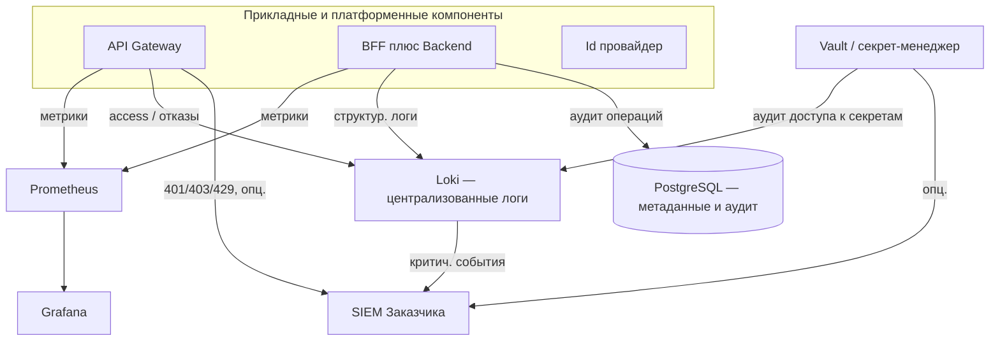


Связь с подсистемой аутентификации: шлюз уже обеспечивает первичный access-лог каждого вызова API; далее по тексту раздела — как эти и прочие события включаются в общий контур аудита, логов и метрик.

### 10.3. Хранение ключей и секретов

#### 10.3.1. Назначение

Централизованное хранение паролей СУБД, ключей для шифрования томов с документами (при отдельном управлении), client_secret сервисов, учётных данных для интеграций и иных секретов с разграничением доступа по политикам и аудитом чтения.

#### 10.3.2. Обоснование выбора HashiCorp Vault среди альтернатив

Требования п. 4.1.1 и п. 4.1.5 ТЗ к централизованному хранению секретов и ключей допускают различные реализации. В качестве альтернатив рассматривались облачные секрет-менеджеры (AWS Secrets Manager, Azure Key Vault, Google Secret Manager), механизмы Kubernetes (Secrets, Sealed Secrets), SOPS/Helm secrets, а также хранение только в переменных окружения на хосте.

HashiCorp Vault выбран по причинам, изложенным в пояснительной записке к ТЗ (раздел 10 исходной редакции), в частности:

1. Независимость от облачного провайдера — развёртывание на инфраструктуре Заказчика;
2. Единый API, политики ACL, аудит обращений к секретам, интеграция с LDAP/OIDC по согласованию;
3. Применимость при Docker Compose и классическом развёртывании без обязательного Kubernetes;
4. Разделение кода и секретов, ротация без изменения образов приложений.

При наличии у Заказчика утверждённого корпоративного секрет-менеджера допускается его замена при сохранении принципов: секреты не в Git, выдача по ролям, аудит, регламент ротации. В репозитории прототипа предусмотрена интеграция Id провайдера (Authentik) с Vault (см. скрипты развёртывания в документации проекта).

#### 10.3.3. Практические требования

- каталог секретов по сервисам и средам (dev/test/prod);  
- минимальные права приложений (least privilege);  
- регламент ротации паролей и ключей;  
- запрет логирования значений секретов в прикладных логах;  
- резервное копирование состояния Vault и процедуры восстановления (согласовать с п. 4.1.3 ТЗ).

Согласно п. 4.1.1.5 ТЗ срок использования ключей шифрования до их обязательной ротации не должен превышать 90 суток; регламент ротации ключей и секретов для Milvus, объектного хранилища и иных компонентов согласовывается с Заказчиком и фиксируется в эксплуатационной документации.

Детали реализации (подготовка кредов перед запуском стека, перечень ключей, ручная и автоматическая ротация) — в п. 3.8.2 документа «Описание программного обеспечения».

### 10.4. Аудит

#### 10.4.1. Категории событий

В рамках подсистемы должны быть явно разделены следующие категории событий:


| Категория               | Примеры                                  | Назначение                                        |
| ----------------------- | ---------------------------------------- | ------------------------------------------------- |
| Аутентификация и доступ | Вход, выход, неуспешный вход, MFA        | Расследование попыток НСД                         |
| Авторизация             | 403, отказ Retriever по RBAC             | Доказательство контроля доступа к данным          |
| Администрирование       | Изменение ролей, политик, конфигурации   | Контроль привилегированных действий               |
| Данные и документы      | Загрузка, удаление, экспорт отчёта       | Подотчётность по персональным и экспертным данным |
| Секреты                 | Чтение/обновление записей в Vault        | Контроль доступа к ключевому материалу            |
| Платформа               | Перезапуск критичных сервисов, сбой бэка | Связь с ИБ и восстановлением                      |


#### 10.4.2. Хранение и неизменяемость

- PostgreSQL — для записей аудита прикладного уровня (кто выполнил операцию, тип объекта, время, результат); срок хранения и индексация согласовываются с Заказчиком.  
- Файлы/потоки логов шлюза, Vault, ОС — в central log store (п. 10.6); для усиленных требований — политика immutability (append-only, отдельный retention) по регламенту Заказчика.  
- SIEM — для корреляции, правил обнаружения инцидентов и долгосрочной политики архивации в соответствии с организацией Заказчика.

#### 10.4.3. Минимизация ПДн в аудите

В записях аудита избегают излишнего дублирования персональных данных; при необходимости — только идентификаторы и хэши/псевдонимы, в соответствии с ФЗ № 152-ФЗ и внутренними нормами.

### 10.5. Мониторинг

#### 10.5.1. Метрики

Минимальный набор для backend и инфраструктуры:

- HTTP/RPS, задержки (latency percentiles), доля ошибок 4xx/5xx по сервисам и маршрутам;  
- Загрузка CPU, память, диск, сеть на узлах с БЯМ, векторной БД, PostgreSQL;  
- Очереди и фоновые задачи (если применимо);  
- Здоровье зависимостей (доступность СУБД, брокера сообщений, Vault).

#### 10.5.2. Визуализация и алертинг

Grafana — дашборды по продуктовым и инфраструктурным метрикам; оповещения при превышении порогов (рост ошибок, деградация задержки относительно целевых значений п. 4.1.2 ТЗ, исчерпание ресурсов). Интеграция с каналами оповещения Заказчика (почта, мессенджеры, тикет-система) уточняется на этапе внедрения.

#### 10.5.3. Мониторинг по логам (Loki)

В дополнение к метрикам Prometheus должны использоваться логовые алерты в Grafana на базе Loki (LogQL), что особенно важно для событий, которые не всегда отражаются отдельной метрикой:

- всплеск ошибок аутентификации и авторизации (`401/403`) по маршрутам API;
- повторяющиеся ошибки обращения к Vault, СУБД, внешним интеграциям;
- рост сообщений уровня `error`/`critical` по конкретному сервису;
- аномалии в системных журналах (частые рестарты контейнеров, отказы health-check).

Логовые алерты дополняют метрики и сокращают время выявления инцидентов при дежурной эксплуатации.
Сводный pipeline наблюдаемости приведен [на рис. 10.5-1](#fig-observability-pipeline-10-5-1).

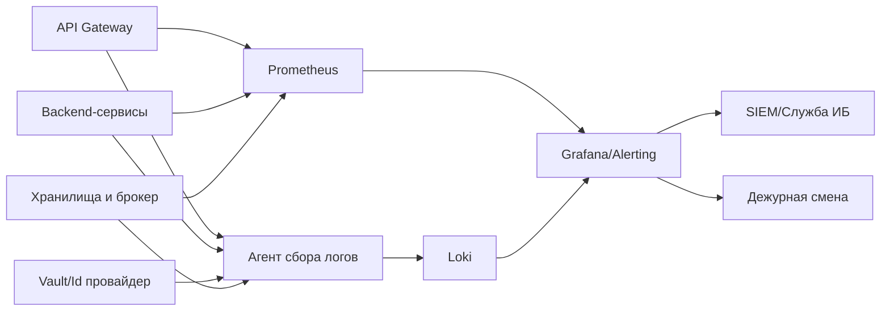


Рисунок 10.5-1. Pipeline сбора логов и метрик, алертинга и передачи событий в SIEM.

### 10.6. Логирование

#### 10.6.1. Структура и корреляция

Логи в структурированном виде (JSON-предпочтительно) с полями: 

- время (UTC), уровень, сервис,
- request/correlation ID, 
- идентификатор пользователя (если применимо),
- сообщение, контекст ошибки без утечки секретов.
Один и тот же request ID прокидывается от шлюза через совмещённый прикладной сервис (BFF+backend) и при необходимости далее по внутренним вызовам — для восстановления цепочки при обращении пользователя или при инциденте.

Для Loki должны быть разделены:

- labels (низкая кардинальность): `service`, `env`, `namespace`, `instance`, `route`, `level`;
- payload (тело записи): текст ошибки, stack trace, бизнес-контекст.

Поля с высокой кардинальностью (например, `user_id`, `session_id`, `document_id`, `trace_id`) не следует выносить в labels; их оставляют в теле JSON и извлекают в запросе при необходимости. Это критично для производительности и объёма индекса Loki.

#### 10.6.2. Централизация

Основной стек централизованного логирования — Loki+Grafana:

- агенты (Promtail, Fluent Bit или Vector) собирают логи контейнеров и узлов;
- при отправке добавляются нормализованные labels и сохраняется JSON-структура записи;
- Loki хранит логи чанками и индексирует потоки по labels и времени;
- поиск, фильтрация, корреляция и визуализация выполняются в Grafana через LogQL.

Базовый профиль хранения должен предусматривать:

- «горячий» период в Loki для оперативных расследований (например, 30–90 дней);
- архивный период в объектном или корпоративном хранилище по политике Заказчика;
- отдельная ретенция для security-событий (дольше общего операционного лога).

Конкретные сроки ретенции, объём хранилища и класс носителей утверждаются совместно с ИБ и эксплуатацией.

#### 10.6.3. Практика настройки labels для Loki

Для стабильной работы Loki и предсказуемой стоимости хранения должны соблюдаться следующие правила:

1. использовать ограниченный и фиксированный набор labels для всех сервисов;
2. не включать в labels значения, близкие к уникальным на запись;
3. нормализовать `route` (например, `/api/docs/{id}`, а не фактический UUID в пути);
4. контролировать рост числа потоков (`streams`) как отдельный эксплуатационный показатель;
5. формализовать схему labels в регламенте логирования проекта.

Эти правила уменьшают риск деградации запросов и избыточного роста индекса.

#### 10.6.4. Доставка в SIEM

Критичные события (отказы аутентификации, массовые 403, аномалии частоты запросов, ошибки Vault, признаки недоступности сервисов) могут дублироваться в SIEM по syslog, HTTP или штатным коннекторам SIEM — по согласованию с ИБ Заказчика (п. 4.1.5 ТЗ). 
Механизмы доставки с уровня API Gateway — § 9, п. 9.3.4.

При использовании Loki обычно применяют один из подходов:

- доставка в SIEM напрямую из источников (шлюз, Id провайдер, Vault) параллельно с отправкой в Loki;
- экспорт выборки критичных записей из Loki через агент/промежуточный коннектор;
- гибридная схема, где Loki — оперативный поиск, SIEM — корреляция ИБ и долговременный контур.

Выбор схемы зависит от требований службы ИБ к полноте событий и времени доставки.

### 10.7. Требования к эксплуатации и приёмке

На приёмке должны быть зафиксированы сроки хранения аудита и операционных логов; на стенде, близком к промышленному, — работающий сбор метрик и централизованных логов; при необходимости поставки — проверена интеграция с SIEM (хотя бы тестовый поток). Регламенты ротации секретов и резервного копирования Vault согласуют с п. 4.1.3 ТЗ.

### 10.8. Ограничения текущей реализации и перспектива

На стадии прототипирования возможны упрощения: сокращённый набор дашбордов, локальный SIEM-заглушка, ручная выгрузка аудита. 
На стадии реализации и в промышленной эксплуатации должны быть расширены набор алертов и контроль SLO/SLA для ключевых API; при необходимости должна быть внедрена распределённая трассировка (OpenTelemetry, Jaeger/Tempo) для глубокой диагностики задержек в цепочках вызовов RAG и агентов. 
Замена отдельных продуктов (Vault → корпоративный секрет-менеджер, Loki → OpenSearch/ELK или обратный переход) не меняет архитектурной логики подсистемы при сохранении перечисленных функций.

---

## 11. Подсистема хранения информации

Документы и метаданные, векторные представления для поиска, журналы и аудит — в разных контурах, с требованиями к целостности, доступности, резервному копированию и защите (пп. 4.1.1–4.1.5 ТЗ в части, касающейся хранения).

### 11.1. Обзор подсистемы: проблема, подходы, требования

#### 11.1.1. Проблема и требования

ИС «Фармадок» работает с разнородными данными:

1. исходные документы (регуляторные, рабочие, отчётные);
2. структурированные метаданные и настройки;
3. эмбеддинги и индексы для RAG;
4. журналы аудита и события эксплуатации.

Использование одного универсального хранилища для всех типов данных приводит к ухудшению производительности, сложностям с политиками доступа и завышенным эксплуатационным затратам. Требуется разделение контуров хранения по типу нагрузки и характеру данных.

В рамках п. 4.2.1.3 ТЗ (формирование векторной БД) предусмотрено получение нормативно-справочной информации (НСИ) от Заказчика для наполнения и актуализации данных, используемых при индексации и поиске.

Предусматривается сопряжение с хранилищем документов и НСИ Заказчика с помощью API, предоставляемого Заказчиком, либо другим способом, согласованным с Заказчиком.

Требования ТЗ, влияющие на подсистему хранения:

- п. 4.1.1 — поддержка векторной БД и семантического поиска, логическое разделение данных;
- п. 4.1.2 — устойчивость работы при росте нагрузки;
- п. 4.1.3 — резервное копирование и восстановление;
- п. 4.1.5 — шифрование, разграничение доступа, журналирование и защита данных.

#### 11.1.2. Подходы к реализации

Рассматриваются три базовых подхода:

- монолитное хранилище (одна СУБД для всего) — упрощает начальное внедрение, но уступает другим подходам по масштабируемости и эксплуатационной гибкости;
- гибридная модель (реляционная БД + документное хранилище + векторная БД + отдельный контур логов) — балансируемость и соответствие характеру данных;
- полностью управляемые облачные сервисы — быстрый запуск, но зависимость от провайдера и ограничения по размещению данных.

Для контура Заказчика и требований конфиденциальности приоритетна гибридная модель. Развёртывание — в инфраструктуре Заказчика или в доверенном облаке.

### 11.2. Обоснование выбора и состав подсистемы

#### 11.2.1. Принятые решения

1. PostgreSQL — хранение операционных данных, справочников, метаданных документов и прикладного аудита.
2. S3 MinIO — объектное хранилище оригиналов документов, производных артефактов и сформированных отчётов DOCX.
3. Milvus — хранение эмбеддингов и векторных индексов для Retriever в контуре RAG.
4. Отдельный контур логов и аудита — централизованное логирование и передача критичных событий в SIEM.
5. RabbitMQ — брокер сообщений для асинхронного обмена между компонентами и буферизации нагрузки в событийных сценариях.

Выбор соответствует модульной архитектуре и позволяет независимо масштабировать хранение документов, метаданных и индексов.

#### 11.2.2. Обоснование выбора векторной СУБД (Milvus)

Milvus выбран как СУБД для векторов главным образом из‑за ожидаемого объёма данных. Векторизация документов с 2019 года оценивается примерно в 100 ГБ; с запасом на рост фонда и догрузку более старых данных в расчётах заложено до 1 ТБ. Для такого масштаба нужна нормальная работа индексов и поиска при росте нагрузки, а не только «хранение файлов».

Кратко, почему именно Milvus:

- нормально работает и на процессорах, и на GPU — на старте можно обойтись без видеокарт;
- рассчитан на большие коллекции и многопоточные запросы;
- есть разные типы индексов (HNSW, IVF, DiskANN и др.), можно подстроить скорость и качество поиска под задачу;
- Milvus уже несколько лет в эксплуатации у разработчика, команда с ним знакома.


#### 11.2.3. Логическая схема хранения

Логическая схема контуров хранения и обмена показана [на рис. 11.2-1](#fig-storage-scheme-11-2-1).

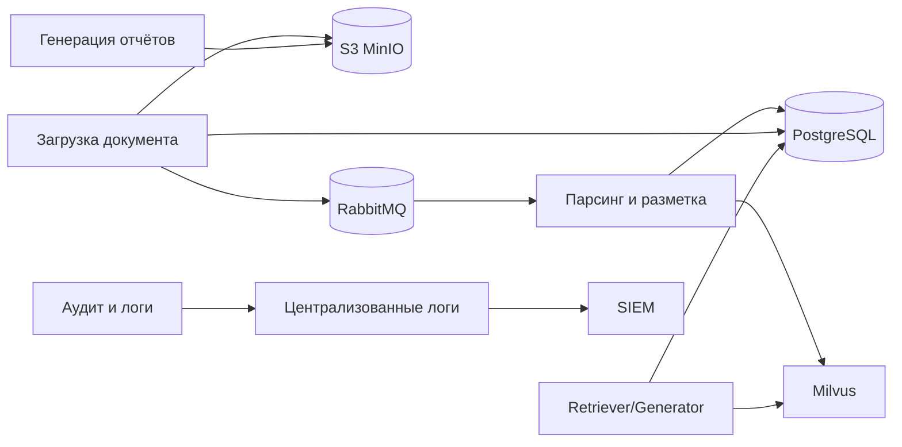


Рисунок 11.2-1. Логическая схема хранения данных и обмена между компонентами.

### 11.3. Контуры хранения данных

#### 11.3.1. Операционные данные и метаданные

В PostgreSQL хранятся:

- учётные данные и сервисные сущности приложения;
- метаданные документов (идентификаторы, тип, версия, статусы, права доступа);
- записи прикладного аудита;
- параметры конфигурации, не являющиеся секретами.

Требования к PostgreSQL:

- транзакционность и целостность;
- индексация по часто используемым полям (идентификатор, тип, дата, владелец);
- миграции схемы через контролируемый процесс.

#### 11.3.2. Документное хранилище (S3 MinIO)

S3 MinIO хранит исходные и производные файлы:

- загруженные DOCX, PDF, изображения;
- промежуточные артефакты обработки (при необходимости);
- итоговые отчёты DOCX.

Требования к MinIO:

- S3-совместимые стабильные URI/идентификаторы объектов;
- версионирование документов (если предусмотрено регламентом);
- контроль доступа к скачиванию через backend и RBAC.

Базовая сегментация бакетов предусматривает:

- `farmadoc-source-docs` — загруженные исходные документы;
- `farmadoc-reports` — сформированные отчёты;
- `farmadoc-temp` — временные артефакты обработки с коротким TTL/очисткой.

#### 11.3.3. Векторное хранилище (Milvus)

Milvus содержит эмбеддинги и индексы, используемые модулем RAG:

- разбиение по логическим классам данных (регламентирующие, рабочие, кэш внешнего поиска);
- хранение метаданных для фильтрации по RBAC;
- поддержка TTL для кэша внешних источников.

Поиск выполняется с учётом прав доступа пользователя; недоступные документы не должны попадать в выдачу Retriever.
В Milvus должны использоваться коллекции/партиции по классам данных; при росте корпуса должно предусматриваться регулярное обслуживание индексов.

#### 11.3.4. Брокер сообщений (RabbitMQ)

RabbitMQ используется как транспортный слой для асинхронного взаимодействия между компонентами (оркестратор, обработчики, контур индексирования и сервисы интеграции) и обеспечивает буферизацию нагрузки при пиковых сценариях.

Основные требования к использованию брокера:

- разделение очередей по назначению (входные задания, события этапов, технические уведомления);
- подтверждение доставки сообщений (`ack`) и политика повторной обработки при временных сбоях;
- использование `dead-letter` очередей для неуспешных сообщений с контролируемым разбором ошибок;
- идемпотентность обработчиков на стороне потребителей;
- ограничение времени жизни сообщений (TTL) и регламент очистки служебных очередей.

Требования безопасности:

- доступ к RabbitMQ только из доверенного контура и через сервисные учётные записи с минимальными правами;
- шифрование транспортного канала (TLS) между продюсерами/консьюмерами и брокером;
- журналирование операций администрирования и критичных ошибок брокера в контур наблюдаемости и аудита.

#### 11.3.5. Хранилище логов и аудита

Логи и платформенные события хранятся в специализированном контуре наблюдаемости (Loki/ELK/аналог) с отдельной политикой ретенции и экспортом критичных событий в SIEM.

### 11.4. Политики данных и жизненный цикл

#### 11.4.1. Классификация и сроки хранения

Должны быть выделены следующие основные категории данных и политики их хранения:


| Категория данных         | Примеры                                                                   | Базовая политика хранения                                                  |
| ------------------------ | ------------------------------------------------------------------------- | -------------------------------------------------------------------------- |
| Операционные данные  | карточки документов, настройки, статусы процессов                         | в течение жизненного цикла системы и по регламентам сопровождения          |
| Документы экспертизы | исходные DOCX/PDF, отчёты, связанные артефакты                            | по нормативным срокам и внутренним регламентам Заказчика                   |
| Кэш внешнего поиска  | результаты разрешённого веб-поиска                                        | краткосрочно, по TTL; ориентир для проекта — до 24 часов                   |
| Операционные логи    | журналы сервисов, инфраструктуры и конвейеров                             | среднесрочно, в объёме, достаточном для эксплуатации и разборов инцидентов |
| Security-аудит       | события входа, отказов в доступе, администрирования, обращения к секретам | дольше операционных логов, по требованиям ИБ и расследований               |


Конкретные сроки ретенции, архивирования и удаления фиксируются отдельным регламентом эксплуатации и согласуются со службой ИБ Заказчика.

#### 11.4.2. Версионирование и неизменяемость

- для документов должна быть предусмотрена версионность или журнал изменений;
- для аудита должна быть обеспечена неизменяемость записей (append-only подход);
- для критичных действий должны фиксироваться автор, время и результат операции.

#### 11.4.3. Удаление и архивирование

Удаление данных выполняется по регламенту и с подтверждением прав доступа. Перед удалением долгоживущих данных допускается архивирование в отдельный контур хранения.

### 11.5. Надёжность и восстановление

#### 11.5.1. Резервное копирование

Подсистема должна обеспечивать:

- резервные копии PostgreSQL (полные + инкрементальные по регламенту);
- резервные копии/репликацию бакетов S3 MinIO;
- резервирование конфигурации Milvus и процедур переиндексации;
- контроль целостности резервных копий.

#### 11.5.2. Восстановление после сбоев

Процедуры восстановления должны быть документированы и протестированы:

- восстановление БД из резервной копии;
- восстановление доступа к бакетам S3 MinIO;
- восстановление или перепостроение векторных индексов Milvus (если требуется после аварии);

Целевые значения RPO/RTO определяются требованиями эксплуатации и соответствуют разделу ТЗ о надёжности.

#### 11.5.3. Масштабирование

Масштабирование выполняется по контурам:

- реляционная БД — оптимизация запросов, репликация, разделение ролей чтение/запись;
- объектное хранилище MinIO — горизонтальное масштабирование объёма и пропускной способности;
- Milvus — масштабирование под рост корпуса документов и нагрузки поиска;

### 11.6. Защита информации в подсистеме хранения

#### 11.6.1. Доступ и разграничение прав

- доступ к данным — только через backend/API Gateway;
- RBAC применяется к операциям чтения/записи и к выдаче документов/фрагментов;
- сервисные учётные записи получают минимально необходимые права.

#### 11.6.2. Шифрование и ключи

- шифрование каналов связи между компонентами (TLS 1.3);
- шифрование данных на хранении (в соответствии с политикой и нормативами Заказчика);
- хранение ключей и секретов в Vault или корпоративном секрет-менеджере;
- регламент ротации ключевого материала.

#### 11.6.3. Маскирование чувствительных данных

Перед передачей в БЯМ и перед индексацией векторных представлений чувствительные данные подлежат маскированию (Presidio или аналог) согласно требованиям ИБ.

### 11.7. Эксплуатационные требования и приёмка

Для приёмки подсистемы хранения подтверждаются:

1. корректная запись и чтение данных по всем контурам хранения;
2. выполнение RBAC-фильтрации при поиске и доступе к документам;
3. работоспособность резервного копирования и тестового восстановления;
4. применение политики хранения и TTL для временных данных;
5. журналирование ключевых операций и доставка критичных событий в SIEM (если входит в объём поставки).

### 11.8. Ограничения и перспектива развития

На стадии прототипирования допустимы упрощения (ограниченная схема архивирования, базовая ретенция, упрощённая репликация). На этапе реализации должны быть обеспечены:

- формализовать модель данных и матрицу сроков хранения;
- автоматизировать контроль качества данных и проверку резервных копий;
- внедрить регулярные тесты восстановления;
- расширить политику аудита изменений в документных и метаданных.

---

## 12. Подсистема модулей и управления их работой

Оркестратор и подключаемые модули собирают цепочки (графы) этапов обработки документов и отчётов. Здесь зафиксированы архитектурные рамки; имена сервисов, контракты и полный каталог модулей уточняются на стадии реализации. Связь с остальной запиской: §9 (вход и RBAC), §10 (аудит и логи), §11 (хранение), §13 (RAG и индексы).

---

### 12.1. Назначение и обоснование подхода

#### 12.1.1. Проблема

Жёстко встроенная в один сервис логика многоэтапной обработки затрудняет развитие системы. Добавление нового этапа требует модификации ядра, усложняет тестирование и снижает повторное использование этапов в различных сценариях. Для ИС «Фармадок» характерны цепочки с различными комбинациями шагов (нормализация, разметка, извлечение признаков, вызов моделей, формирование отчётов и т.п.), поэтому их целесообразно строить из переиспользуемых модулей под управлением единого оркестратора.

#### 12.1.2. Решение: оркестратор и подключаемые модули

Архитектура строится из двух уровней:

1. Оркестратор — отвечает за выбор сценария, жизненный цикл прогона, вызов модулей, политику повторов, таймауты, фиксацию аудита и связь с внешними API (в т.ч. через единую точку входа).
2. Подключаемые модули — реализуют отдельные этапы; регистрируются в реестре; не содержат знания о полном графе пайплайна, только о своём контракте и заявленных зависимостях.

Такое разделение соответствует модульности, заявленной в архитектурных принципах пояснительной записки к ТЗ, и облегчает независимое развитие этапов при сохранении согласованности контрактов.

---

### 12.2. Архитектура: оркестратор, модули, реестр

Сводная логическая схема взаимодействия компонентов приведена в [п. 12.2.7](#fig-logicheskaya-shema-12-2-7).

#### 12.2.1. Функции оркестратора

- разбор сценария пайплайна (статический конфиг, БД, API управления сценариями — по решению проекта);
- проверка доступности и совместимости версий модулей из реестра;
- создание и наполнение контекста выполнения; передача выхода одного этапа на вход следующего (или ветвление при условных переходах);
- применение политик: таймауты, ограничение параллелизма, повторные попытки для отдельных классов ошибок;
- интеграция с RBAC (разрешение на запуск сценария и на использование отдельных модулей);
- журналирование этапов, ошибок и идентификаторов прогона для аудита и расследований;
- при необходимости — постановка длительных прогонов в очередь и асинхронное завершение.

#### 12.2.2. Требования к подключаемым модулям

- явный идентификатор и версия; совместимость версий контракта фиксируется в реестре;
- реализация контракта входа/выхода; документированные побочные эффекты (запись в хранилища, вызовы внешних API);
- отсутствие обхода политик доступа: модуль получает принципала/ограничения из контекста, а не дублирует авторизацию произвольно;
- устойчивость к повторному вызову (идемпотентность) там, где оркестратор допускает повтор этапа;
- ограничение области ответственности: один модуль реализует один смысловой этап, что упрощает тестирование и замену реализации.

#### 12.2.3. Реестр конвейеров

Реестр конвейеров хранится в таблице PostgreSQL `pipeline_registry`: в ней перечислены именованные типы конвейеров, доступные для запуска оркестратором. Регистрация конвейера — занесение в `pipeline_registry` идентификационных и конфигурационных сведений. Оркестратор создаёт экземпляр только для типов из этой таблицы с активным статусом.
Базовый набор полей таблицы фиксируется в документе «Описание программного обеспечения».

#### 12.2.4. Реестр модулей

Реестр модулей — специальная таблица PostgreSQL, в которой хранятся зарегистрированные обработчики как самостоятельные сущности. Для нормализации структуры данных привязка модулей к конвейерам хранится не в `module_registry`, а в отдельной таблице связи `pipeline_module_link` (отношение многие-ко-многим между `pipeline_registry` и `module_registry`). Оркестратор не запускает незарегистрированные или неактивные модули.

При запуске экземпляра конвейера оркестратор выбирает обработчики через связку `pipeline_registry -> pipeline_module_link -> module_registry` и определяет стартовые обработчики.
Базовые наборы полей таблиц `module_registry` и `pipeline_module_link` фиксируются в документе «Описание программного обеспечения».

#### 12.2.5. Экземпляры конвейеров (`pipeline_instance`)

Таблица `pipeline_instance` хранит общие сведения о каждом запущенном экземпляре конвейера и используется как родительская сущность для записей статусов модулей в `module_run_status`.
Базовый набор полей таблицы `pipeline_instance` фиксируется в документе «Описание программного обеспечения».

#### 12.2.6. Статусы выполнения модулей (`module_run_status`)

Таблица `module_run_status` хранит состояние выполнения обработчиков в рамках конкретного экземпляра конвейера: по одной записи на каждую пару «обработчик - экземпляр конвейера». Начальный статус записи — `not started`; после завершения обработки оркестратор обновляет запись на `done` или `error` (в зависимости от кода завершения, переданного обработчиком).
Базовый набор полей таблицы `module_run_status` фиксируется в документе «Описание программного обеспечения».

#### 12.2.7. Логическая схема

Ниже показаны связи между входной очередью, оркестратором конвейеров, реестрами в PostgreSQL, данными о прогоне (экземпляр конвейера, статусы модулей), подключаемыми модулями, бакетом контекста в S3 и выходом конвейера.

```mermaid
flowchart TB
  QIN[Входная очередь] --> ORCH[Оркестратор конвейеров]

  subgraph REG[Реестры (PostgreSQL)]
    PR[(Реестр конвейеров)]
    PML[(Связь «конвейер — модуль»)]
    MR[(Реестр модулей)]
  end

  ORCH --> PR
  ORCH --> PML
  ORCH --> MR

  subgraph RUN[Выполнение]
    PI[(Экземпляр конвейера)]
    MRS[(Статус выполнения модуля)]
    MODS[Подключаемые модули]
    S3[(Бакет контекста в S3)]
  end

  ORCH --> PI
  ORCH --> MRS
  ORCH --> MODS
  MODS --> S3
  MODS --> ORCH

  ORCH --> OUT[Результат конвейера]
```


Рисунок 12.2-7. Логическая схема подсистемы модульных конвейеров.

На практике модули могут выполняться в отдельных процессах или контейнерах; оркестратор вызывает их через согласованный механизм (очередь сообщений).

---

### 12.3. Описание пайплайна и поток данных

- Все бизнес-процессы обработки информации в ИС «Фармадок» представляют собой именованные конвейеры (процессы, пайплайны); перечень конвейеров ведется в таблице `pipeline_registry` (PostgreSQL).
- Сценарий задаёт граф этапов: линейный порядок, параллельные ветки, условные переходы по результату модуля или по метаданным контекста.
- Контекст выполнения содержит идентификатор прогона, ссылку на сценарий, входные параметры, накопленные результаты этапов, метки времени; объём и формат сериализации определяются на стадии реализации.
- Артефакты большого объёма (файлы, векторные индексы) в контексте передаются по ссылкам на хранилища (§11), а не целиком в теле сообщений между этапами.

Укрупнённый поток выполнения конвейера (цикл оркестратора и модулей) показан [в п. 12.3.2](#fig-diagramma-potoka-12-3-2). Диаграмма последовательности обмена сообщениями между входной очередью, оркестратором, PostgreSQL, брокером, обработчиком и бакетом контекста в S3 приведена [в п. 12.3.3](#fig-posledovatelnosti-12-3-3).

#### 12.3.1. Механизм запуска обработчиков и обмен сообщениями

Взаимодействие участников во времени отражено [в п. 12.3.3](#fig-posledovatelnosti-12-3-3); ниже дано текстовое описание шагов и состава сообщений.

Оркестратор создает экземпляр конвейера после получения сообщения с именем типа конвейера из специальной очереди брокера сообщений. После создания экземпляра оркестратор определяет в таблице реестра обработчики, которые должны выполняться первыми, и отправляет им через канал брокера сообщений специальное сообщение о старте.

Стартовое сообщение содержит:

- идентификатор экземпляра конвейера;
- имя конвейера и имя обработчика;
- путь к бакету S3 (или префиксу в бакете), где обработчик сохраняет артефакты своей работы;
- перечень входных артефактов, уже созданных в этом бакете другими модулями данного экземпляра конвейера (пути в S3 и, при необходимости, имя модуля-источника — см. п. 12.4.1, поле `input_artifacts`).

Использование артефактов предшественников. Модуль опирается на сведения, переданные оркестратором в стартовом сообщении: по указанным путям он читает в общем контекстном бакете объекты, созданные ранее другими обработчиками (без самостоятельного «угадывания» структуры каталога, если иное не оговорено контрактом модуля). Модуль не обязан загружать все перечисленные артефакты — он использует те из них, которые нужны его логике.

После получения стартового сообщения обработчик выполняет свою работу и отправляет оркестратору сообщение о завершении с кодом завершения (например: `done`, `error` и иные статусы по регламенту проекта). В этом же сообщении обработчик указывает имена (пути) всех файлов-артефактов, созданных им в процессе работы в выделенном бакете S3.

Оркестратор, получив сообщение о завершении, проставляет статус `done` в записи пары «модуль - экземпляр конвейера» (для успешного завершения), затем в таблице связей находит модуль, который должен запускаться следующим, и отправляет ему стартовое сообщение. В стартовом сообщении следующему модулю передаются название бакета контекста и сводный список артефактов, полученных в результате работы предыдущих модулей данного экземпляра конвейера.

Данный цикл повторяется, пока для экземпляра конвейера существуют следующие обработчики со статусом `not started`. Если таких обработчиков не остается, работа конвейера считается завершенной. После завершения конвейера оркестратор имеет право удалить временный бакет с контекстом в соответствии с политикой хранения и регламентом эксплуатации. Описанный цикл в виде блок-схемы приведён [в п. 12.3.2](#fig-diagramma-potoka-12-3-2), обмен сообщениями между участниками — [в п. 12.3.3](#fig-posledovatelnosti-12-3-3).

#### 12.3.2. Диаграмма потока выполнения конвейера

Ниже показаны этапы от приёма запроса на запуск конвейера до завершения всех модулей: создание экземпляра и статусов, поочерёдный запуск модулей, обмен через брокер, обновление статусов и проверка наличия следующего модуля.

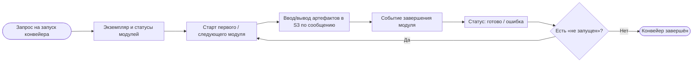


Рисунок 12.3-2. Диаграмма потока выполнения конвейера.

#### 12.3.3. Диаграмма последовательности обмена сообщениями

На рисунке ниже показаны сообщения от запроса на запуск конвейера до завершения экземпляра: обращения оркестратора к реестрам и статусам в PostgreSQL, команды и события через брокер, работа обработчика с бакетом S3 и цикл по модулям со статусом «не запущен».

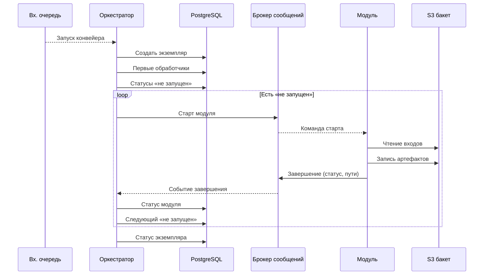


Рисунок 12.3-3. Диаграмма последовательности обмена сообщениями.

---

### 12.4. Контракты, политики и форматы

#### 12.4.1. Обязательные свойства контрактов

Для уровня технического проекта важны не примеры конкретных JSON-сообщений и DDL, а обязательные свойства контрактов между оркестратором, брокером, модулями и хранилищами:

- у каждого сообщения должны быть тип, уникальный идентификатор, временная метка, версия схемы и корреляционный идентификатор;
- команды запуска модуля должны содержать идентификатор экземпляра конвейера, имя этапа и ссылки на входные артефакты, но не сами бинарные данные;
- сообщения о завершении должны фиксировать итоговый статус, код завершения, ссылки на созданные артефакты и диагностические метрики;
- большие артефакты передаются только через S3-совместимое хранилище по ссылкам, а не в теле сообщений брокера.

#### 12.4.2. Требования к очередям и доставке

При проектировании обмена через брокер должны соблюдаться следующие принципы:

- доставка не ниже семантики at-least-once с идемпотентной обработкой на стороне потребителей;
- раздельные каналы для запуска конвейера, старта модулей, завершения модулей и при необходимости для операционных команд и аудита;
- поддержка повторных попыток с backoff и переводом сообщений в `DLQ` после исчерпания лимита;
- обязательные TLS, разграничение прав доступа и наблюдаемость по глубине очередей, повторным доставкам и ошибкам.

#### 12.4.3. Требования к модели данных и статусам

В служебной модели данных должны быть явно представлены:

- реестр типов конвейеров;
- реестр модулей и связей «конвейер -> модуль»;
- экземпляры конвейеров;
- статусы выполнения модулей по каждому экземпляру.

Статусы должны быть нормализованы и не допускать неоднозначной трактовки. Минимально требуется различать состояния `not started`, `in progress`, `done`, `error`, а также фиксировать правила переходов и обработки дубликатов сообщений.

#### 12.4.4. Версионирование и хранение артефактов

- схемы сообщений и контракты модулей подлежат явному версионированию;
- breaking changes допускаются только с повышением major-версии;
- артефакты должны храниться по детерминированному пути, связанному с экземпляром конвейера и именем модуля;
- удаление временных артефактов допускается только после финального статуса конвейера и в соответствии с политиками ретенции.

Подробные форматы сообщений, перечни полей таблиц, ограничения БД, индексы, примеры JSON и эксплуатационные параметры брокера фиксируются в документе «Описание программного обеспечения».

---

### 12.5. Операционные SLO/SLA и runbook

Эксплуатационные требования:

- SLO по времени:
  - задержка оркестратора на обработку события брокера,
  - p95/p99 длительности модулей и полного конвейера;
- лимиты:
  - максимальный размер message payload,
  - ограничение параллельных экземпляров конвейеров;
- обязательные алерты:
  - рост доли `error`,
  - увеличение числа retry,
  - зависшие `in progress` дольше порога.

Минимальный runbook:

1. Ручной перезапуск модуля в рамках экземпляра.
2. Ручной перезапуск экземпляра конвейера.
3. Принудительный перевод в `error` при зависании.
4. Reconciliation состояния БД и фактических артефактов S3.
5. Процедура восстановления после отказа оркестратора.

---

### 12.6. Безопасность и соответствие требованиям ИС

- доступ к запуску пайплайнов и к отдельным модулям — через RBAC и единую точку входа (§9);
- подключаемые модули не должны обходить журналирование и минимизацию ПДн; значимые этапы фиксируются для аудита (§10);
- поставка и обновление модулей — по контролируемому контуру (проверка целостности, политика доверенных источников; при необходимости — сканирование вложений и артефактов в соответствии с архитектурными принципами пояснительной записки к ТЗ);
- секреты и ключи не передаются в контексте открытым текстом; модуль получает доступ к секретам через утверждённый механизм (секрет-менеджер).

---

### 12.7. Эксплуатация, наблюдаемость и приёмка

- метрики оркестратора: длительность прогона, длительность по этапам, число ошибок и повторов, глубина очереди (если используется);
- сквозной correlation/request ID для связки логов оркестратора и модулей;
- критерии приёмки: воспроизводимый запуск сценария из реестра; корректная обработка отказа этапа; соблюдение RBAC; наличие записей аудита для критичных операций; возможность отката на предыдущую совместимую версию модуля без остановки оркестратора (если предусмотрено политикой версий).

---

### 12.8. Ограничения и развитие

Чрезмерная фрагментация (слишком мелкие модули) увеличивает накладные расходы на вызовы и усложняет сопровождение; чрезмерно «толстые» модули снижают гибкость. Оптимальная гранулярность определяется на стадии реализации по доменным сценариям и требованиям к времени ответа (в т.ч. п. 4.1.2 ТЗ). Расширение каталога модулей и сценариев не должно нарушать обратную совместимость контрактов без явного версионирования.

### 12.9. Управление плагинами агентов (п. 4.2.2.4 ТЗ)

По п. 4.2.2.4 ТЗ предусматривается штатный интерфейс администратора для загрузки кода новых агентных модулей, настройки параметров вызова API и лимитов (в т.ч. сетевых), регистрации модулей в реестре (§ 12.2.4) и запуска в изолированных контейнерах. Перед запуском поставка проверяется на вредоносный код (ClamAV или функциональный аналог) в связке с § 7.9. Операции администрирования журналируются; доступ — по RBAC (§ 9.5.3). Детализация экранов — § 14.10.

---

## 13. Подсистема обработки информации с использованием ИИ

Раздел посвящён конвейеру интеллектуального поиска и RAG: векторный индекс (эмбеддинги) и лексический (в т.ч. BM25), подготовка данных, хранилища и online-retrieval. Гибридный поиск и этапы пайплайна изложены ниже; детали реализации см. также в «Описании программного обеспечения» (модуль RAG и векторная БД). Общие требования к размещению моделей и защите данных — в §4.4, §7.7–7.8 и §8 пояснительной записки к ТЗ.

---

### 13.1. Назначение, цели и место в архитектуре

Подсистема векторного и лексического индексирования реализуется как два независимых, но согласованных пайплайна:

- offline-пайплайн подготовки данных — сбор документов, при необходимости OCR (п. 13.3.8), при необходимости перевод с иностранного языка (п. 13.3.7), структурирование, тэгирование, чанкинг и построение индексов;
- online-пайплайн обработки запроса — гибридное извлечение, фильтрация, маскирование чувствительных данных, реранкинг и передача контекста в Generator.

Пайплайны развязаны по времени выполнения и нагрузочному профилю: offline-контур работает асинхронно при поступлении/изменении документов, online-контур выполняется синхронно на пользовательский запрос с опорой на уже подготовленные индексы.

Обоснование RAG по сравнению с альтернативами. Чистая генерация без извлечения (LLM-only) не гарантирует опору на корпус документов и повышает риск галлюцинаций. Поиск без генерации (retrieval-only) даёт список фрагментов, но не формирует связного ответа на естественном языке. RAG сочетает извлечение релевантного контекста из доверенного корпуса с генерацией ответа по этому контексту. Для «Фармадок» это даёт проверяемость за счёт цитирования и согласуется с требованиями к экспертной и регуляторной документации (в том числе п. 4.1.2 ТЗ).

Оркестрация моделей. Модели эмбеддингов используются при индексации чанков и при кодировании пользовательского запроса для векторного поиска; большая языковая модель (БЯМ) применяется на этапе Generator для формирования ответа. Разделение ролей и вызовы моделей координирует backend.

Первоначальный перечень моделей векторизации. На стадии проектирования в качестве ориентиров для построения эмбеддингов зафиксированы следующие модели (публикации Hugging Face):

- [Qwen/Qwen3-VL-Embedding-8B](https://huggingface.co/Qwen/Qwen3-VL-Embedding-8B) — мультимодальная векторизация (текст и изображения);
- [intfloat/multilingual-e5-large](https://huggingface.co/intfloat/multilingual-e5-large) — текстовая мультиязычная векторизация.

Окончательный состав моделей, версии весов и параметры развёртывания уточняются на стадии реализации с учётом лицензий, требований к размещению и защите данных (§ 7.7–7.8, § 8) и вычислительных ресурсов Заказчика.

Подсистема ориентирована на регуляторные и экспертные процессы ФГБУ «НЦЭСМП» Минздрава России и поддерживает работу с профильной фармацевтической документацией (регистрационные досье, инструкции по медицинскому применению, ПУР, нормативные документы по качеству и сопутствующие материалы). В рамках данного документа подсистема рассматривается как технологическая основа для быстрого и воспроизводимого извлечения релевантного контекста: она не формирует экспертное заключение, а обеспечивает качество входных данных для последующих этапов реранкинга и генерации ответа.

Назначение подсистемы напрямую связано с требованиями ТЗ по безопасности: индексирование и поиск выполняются в контролируемой инфраструктуре Заказчика, с учетом RBAC, шифрования и ограничений на обработку данных в доверенном контуре.

Ключевые цели подсистемы индексирования:

- Точность извлечения (retrieval precision/recall). Обеспечить устойчивое нахождение релевантных фрагментов как по смыслу, так и по точным лексическим совпадениям (коды, номера, термины) за счет гибридного поиска (векторный + BM25), корректного чанкинга и последующего реранкинга.
- Трассируемость и цитируемость. Сохранять в индексе метаданные первоисточников (документ, раздел, страница/фрагмент), чтобы на этапе генерации ответа обеспечивалось обязательное цитирование и проверяемость выводов.
- Масштабируемость и производительность. Поддерживать рост объема корпуса и числа пользователей без деградации SLA, включая целевые показатели ТЗ по времени ответа и нагрузке.
- Безопасность данных. Обеспечить обработку и хранение артефактов индексирования в рамках требований ИБ (RBAC, шифрование, разделение доступов, контроль источников данных).

Требования ТЗ и критерии приёмки (время ответа, качество поиска, учёт прав, шифрование эмбеддингов) согласуются с п. 4.1.1, 4.1.2, 4.2.1 и п. 2.2 ТЗ. Размещение моделей — см. ввод к §13 выше и §4.4, §7.7–7.8, §8 пояснительной записки к ТЗ. Хранение артефактов: эмбеддинги — Milvus; результаты тэгирования — S3 MinIO с привязкой к исходному документу; при необходимости служебная мета — PostgreSQL.

---

#### 13.1.1. Общая архитектура подсистемы индексирования

Подсистема реализует оркестрированную архитектуру из двух независимых контуров, которые связаны через общие хранилища и контракты метаданных.

Offline-пайплайн подготовки данных формирует индексный слой:

- `ingest-service` принимает и валидирует входящие документы;
- при необходимости модуль OCR (подключаемый модуль оркестратора, п. 13.3.8) извлекает текст из сканов, изображений и PDF без текстового слоя до разметки;
- при необходимости модуль перевода (подключаемый модуль оркестратора, п. 13.3.7) преобразует текст исходного документа с иностранного языка на целевой перед разметкой;
- `markup-service`, `tagging-service` и `chunking-service` подготавливают структурированные фрагменты;
- `vector-indexer` строит векторные представления в `milvus-vector-db`;
- `lexical-indexer` формирует лексический индекс BM25 в `postgresql-db`;
- артефакты тэгирования сохраняются в `s3-storage`.

Online-пайплайн обработки запроса использует индексный слой для retrieval:

- `retriever-service` оркестрирует обработку пользовательского запроса;
- `vector-retriever` выполняет семантический поиск по `milvus-vector-db`;
- `lexical-retriever` выполняет BM25-поиск по `postgresql-db`;
- `merge-service` объединяет кандидатов (RRF), далее `filter-service` отсекает по метаданным и RBAC, затем `masking-middleware` маскирует чувствительные данные, `reranker-service` уточняет релевантность;
- итоговый контекст передается в `llm-generator` для ответа с обязательным цитированием первоисточников.

Такое разделение повышает управляемость подсистемы: offline-контур оптимизируется под полноту и качество индексов, online-контур - под время ответа и стабильность SLA.

---

### 13.2. Типы чанкинга для индексирования и обоснование выбора

Чанкинг определяет, какие фрагменты документа станут единицами индексирования, поиска и цитирования. Для ИС "Фармадок" используются следующие типы:

1. Структурный чанкинг (базовый).
  - Деление по логике документа: заголовки, разделы, подпункты, абзацы, таблицы.
  - Источник границ: результат этапов markup и тэгирования.
  - Плюс: высокая интерпретируемость и корректные ссылки на нормативные фрагменты.
2. Фиксированный чанкинг по длине (символы/токены).
  - Деление на блоки заданного размера, при необходимости с overlap.
  - Плюс: стабильно по вычислительной стоимости и просто в реализации.
  - Минус: может разрывать логический смысл и ухудшать точность ссылок для нормативных формулировок.
3. Скользящий чанкинг (sliding window).
  - Последовательные окна фиксированного размера с перекрытием.
  - Плюс: снижает риск потери контекста на границах.
  - Минус: увеличивает объем индекса и число почти дублирующих фрагментов.
4. Семантический чанкинг.
  - Границы формируются по тематическим переходам/сходству предложений.
  - Плюс: более цельные по смыслу фрагменты.
  - Минус: выше вычислительная стоимость, сложнее воспроизводимость границ и аудит.

Выбор для системы "Фармадок".

- Основной вариант: структурный чанкинг, потому что в системе критичны трассируемость фрагментов, цитирование и проверка на соответствие нормативам.
- Дополнительный механизм: ограничение максимальной длины чанка и при необходимости умеренное перекрытие для длинных разделов, чтобы сохранить контекст и не выходить за ограничения модели эмбеддингов.
- Для некоторых типов документов допускается переход на фиксированный или скользящий режим, если структурные границы выделены недостаточно надёжно.

---

### 13.3. Процесс подготовки данных (offline pipeline)

#### 13.3.1. Диаграмма потоков данных

Схема потоков данных offline-конвейера приведена [на рис. 13.3-1](#fig-offline-flow-13-3-1).

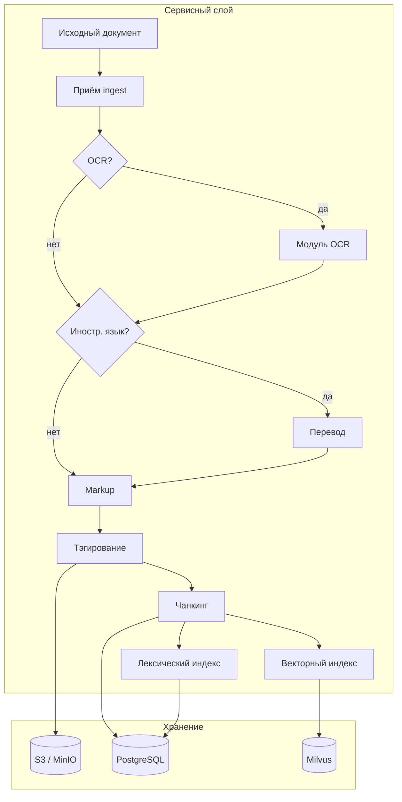


Рисунок 13.3-1. Диаграмма потоков данных процесса подготовки данных (offline pipeline).

#### 13.3.2. Этап сбора документов (ingest)

Назначение. Этап сбора документов выполняется перед markup и обеспечивает контролируемое поступление документов в конвейер подготовки данных.

Вход этапа. На вход `ingest-service` поступают исходные сырые документы и метаданные источника (тип документа, версия, источник, служебные атрибуты).

Выход этапа. На выходе формируется подготовленный пакет документов для `markup-service`: принятые файлы, результаты первичной валидации и минимальный набор служебных метаданных для дальнейшей трассировки.

---

#### 13.3.3. Этап markup (структурирование) перед тэгированием

Назначение. До этапа тэгирования выполняется этап markup (структурирование) документа. Этап используется для преобразования сырого документа в унифицированное структурированное представление, пригодное для последующего тэгирования и индексирования.

Вход этапа. На вход markup-сервиса подаются сырые документы.

Выход этапа. Markup-сервис возвращает структурированные документы в формате Markdown.

---

#### 13.3.4. Этап тэгирования структуры перед индексированием

Назначение. После этапа markup и до векторного индексирования выполняется этап тэгирования структуры документа. Он выделяет логически осмысленные фрагменты и нормализует признаки для последующего векторного и лексического индексирования. Отдельно тэгирование поддерживает учёт и обработку тэгов фрагментов текста при проверке документов на соответствие нормативам.

Вход этапа. На вход сервиса тэгирования подаются структурированные документы в формате Markdown (результат этапа markup).

Выход этапа. Сервис возвращает JSON, содержащий:

- список тэгированных фрагментов (абзацев);
- метаданные тэгирования для каждого фрагмента (например тип тега/секции, позиция в документе, уровень структуры, служебные признаки качества разметки).

Результирующие JSON-артефакты этапа тэгирования сохраняются в S3 MinIO бакете с привязкой к исходному документу (например по идентификатору документа и версии).

Опциональность по типу документа. Этап тэгирования может быть пропущен для некоторых типов документов. В этом случае в индексацию передаются фрагменты, полученные базовым конвейером парсинга и разметки, без дополнительного тэгирования.

---

#### 13.3.5. Этап векторного индексирования

На этапах разметки (markup) и тэгирования (п. 13.3.3, 13.3.4) предусмотрен механизм ручной корректировки результатов автоматической обработки перед векторизацией. Также предусматривается механизм повторной векторизации после повторной ручной корректировки разбиения документа на фрагменты (чанков), с обновлением соответствующих записей в векторном индексе.

Идея. В offline-пайплайне тексты блоков документов преобразуются в эмбеддинги согласованной моделью и сохраняются в векторный индекс. Онлайн-поиск по этим данным выполняется отдельным компонентом `vector-retriever` (см. п. 13.4.2).

Обоснование векторизации от оригинала (языка первоисточника). При переводе меняется не только формулировка: одну и ту же мысль в другом языке часто передают иначе, оттенки и термины сдвигаются. Поэтому вектор, построенный по переводу, не всегда совпадает по смыслу с вектором по исходному тексту, даже при хорошем переводе. Чтобы семантический поиск и подбор фрагментов опирались на авторский текст, планируется хранить и использовать векторы, полученные именно из оригинала (языка первоисточника). Перевод будет происходить при предоставлении найденного текста пользователю.

Содержимое записи индекса (логически). Вектор эмбеддинга; идентификатор документа и фрагмента; метаданные для цитирования (страница, раздел); атрибуты RBAC; при необходимости тип документа (регламентирующие/рабочие/кэш внешнего поиска — по классификации в описании программного обеспечения ИС, подсистема векторной БД); при необходимости - заголовки структуры.

Хранение векторных представлений выполняется в Milvus. При необходимости метаинформация об индексировании и связях между артефактами хранится в PostgreSQL.

Особенности для фармдомена. Семантический поиск хорошо покрывает формулировки "по смыслу" и синонимы; может быть менее точным для редких кодов и точных строковых совпадений без донастройки - отсюда оправдан лексический канал в гибриде.

---

#### 13.3.6. Этап лексического индексирования

Идея. В offline-пайплайне документы представляются как наборы лексических единиц (токены после нормализации: регистр, стемминг или лемматизация - по решению реализации) и строится обратный индекс: термин -> список документов или фрагментов, где термин встречается (с позициями или частотами). Онлайн-доступ к индексу выполняет `lexical-retriever` (см. п. 13.4.2).

Ранжирование. Типично используется BM25: учитываются частота термина в фрагменте, обратная частота по корпусу, длина текста. Это даёт сильные результаты при точном совпадении идентификаторов: коды АТХ, МНН, регистрационные номера, артикулы, точные названия из регламентов (см. § 13 пояснительной записки к ТЗ и п. 13.4 настоящего раздела — гибридный поиск).

"При необходимости". Лексический индекс может не строиться на самых ранних итерациях, если на данном этапе достаточно чисто векторного поиска; для достижения целевого качества на смешанных запросах должен использоваться гибридный поиск (п. 13.4.2).

---

#### 13.3.7. Этап перевода с иностранного языка

Назначение. Для документов, поступивших в конвейер подготовки данных на иностранном языке (относительно целевого языка корпуса и сценариев эксплуатации, согласованных с Заказчиком), выполняется отдельный этап машинного перевода содержимого в целевой язык до этапа markup (п. 13.3.3), чтобы последующие структурирование, тэгирование, чанкинг и индексирование опирались на единый лингвистический контур поиска и RAG. Требования к сохранению структуры DOCX, фармакопейной и отраслевой терминологии и к использованию локальной или доверенной БЯМ зафиксированы в п. 4.2.2.2 ТЗ, §5.5 и §7.8.

Оркестрация. Модуль перевода вызывается как подключаемый модуль (плагин этапа) оркестратора конвейеров (§ 12): регистрируется в реестре модулей, входит в сценарий пайплайна «подготовка документа к индексации» (или в выделенный сценарий «перевод документа») и получает контекст выполнения с идентификатором документа, метаданными языка и ограничениями RBAC. Такое включение обеспечивает единые политики повторов, таймаутов, аудита прогона и изоляции исполнения с другими агентными модулями (согласованно с § 7.6, § 7.9, § 12.2.2).

Вход этапа. Пакет после ingest (п. 13.3.2) и при необходимости после OCR (п. 13.3.8): файлы документа (в т.ч. DOCX/PDF и согласованные форматы), метаданные источника, признак исходного языка (явный или определённый на ingest), целевой язык перевода по политике Заказчика.

Выход этапа. Документ (или согласованный набор артефактов) на целевом языке, пригодный для передачи в markup-service без обхода контроля доступа и трассировки версий; при необходимости — связь «исходник ↔ перевод» фиксируется в метаданных для цитирования и приёмки.

Условие включения. Этап выполняется, если по правилам маршрутизации конвейера документ классифицирован как требующий перевода (язык не совпадает с целевым либо задан принудительный перевод). Для документов уже на целевом языке ветка «Модуль перевода» не вызывается (см. [рис. 13.3-1](#fig-offline-flow-13-3-1)); при цепочке OCR → перевод порядок этапов соответствует рисунку (п. 13.3.8 затем п. 13.3.7).

Качество и приёмка. Риски качества перевода, вторая очередь и критерии проверки — § 18.2; перечень пар языков и параметры модулей уточняются на стадии реализации.

---

#### 13.3.8. Этап OCR (оптическое распознавание текста)

Назначение. Для документов в форматах PDF (без извлекаемого текстового слоя), JPEG, PNG и согласованных аналогов (п. 4.2.2.3 ТЗ, § 5.6) выполняется отдельный этап OCR — извлечение машиночитаемого текста и согласованных структурных подсказок после этапа ingest (п. 13.3.2) и до этапа markup (п. 13.3.3), чтобы markup-service и последующие тэгирование, чанкинг и индексирование (п. 13.3.5) опирались на распознанный текст, а не только на «пустой» растр или неселектируемый PDF.

Оркестрация. Модуль OCR вызывается как подключаемый модуль (плагин этапа) оркестратора конвейеров (§ 12) — по той же схеме, что и модуль перевода (п. 13.3.7): регистрация в реестре модулей, включение в сценарий пайплайна подготовки документа к индексации (или выделенный сценарий «OCR»), контекст выполнения с идентификатором документа, метаданными языка распознавания и RBAC; единые политики повторов, таймаутов, аудита и изоляции исполнения (§ 7.6, § 7.9, § 12.2.2).

Вход этапа. Пакет после ingest: файлы-изображения, сканы, PDF, требующие OCR по правилам маршрутизации; метаданные источника; перечень языков OCR — по согласованию с Заказчиком (§ 5.6).

Выход этапа. Текстовое представление (и при необходимости промежуточные артефакты: координаты блоков, уверенность распознавания), пригодное для передачи в цепочку перевода (п. 13.3.7, если требуется) либо непосредственно в markup-service.

Условие включения. Этап выполняется, если тип файла и результат первичной проверки на ingest указывают на необходимость OCR; для «обычных» цифровых PDF/DOCX с извлекаемым текстом ветка «Модуль OCR» не вызывается (см. [рис. 13.3-1](#fig-offline-flow-13-3-1)).

Качество и приёмка. Риски качества OCR и вторая очередь — § 18.2; детали движков и порогов уверенности уточняются на стадии реализации.

### 13.4. Процесс обработки запроса (online pipeline)

#### 13.4.1. Диаграмма потоков данных

Схема потоков данных online-конвейера приведена [на рис. 13.4-1](#fig-online-flow-13-4-1).

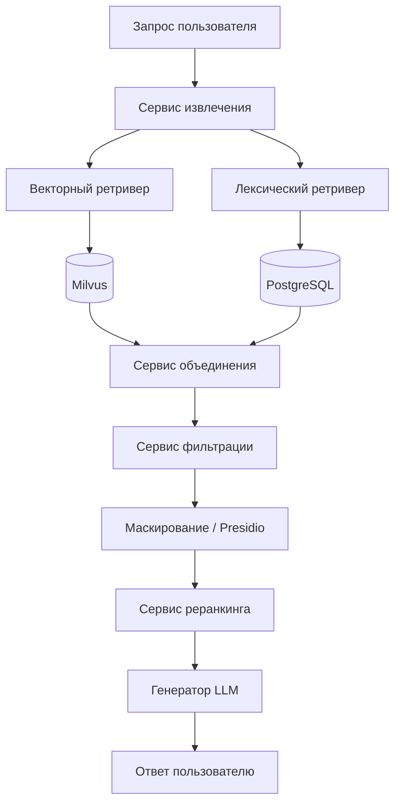


Рисунок 13.4-1. Диаграмма потоков данных процесса обработки запроса (online pipeline).

#### 13.4.2. Последовательность обработки запроса

Последовательность взаимодействия компонентов online-конвейера приведена [на рис. 13.4-2](#fig-online-seq-13-4-2).

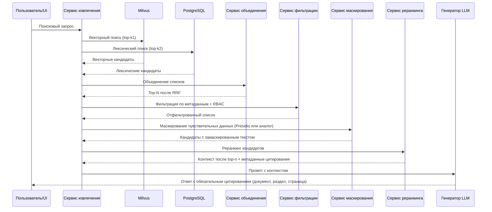


Рисунок 13.4-2. Диаграмма последовательности процесса обработки запроса (online pipeline).

#### 13.4.3. Этап поиска

1. После этапов markup и тэгирования (если тэгирование включено для типа документа) независимо выполняются: векторный поиск (топ-k1) и лексический поиск (топ-k2) с теми же ограничениями RBAC (и фильтрами по типу документов, если заданы).
2. Списки объединяются алгоритмом вроде RRF: позиции в ранжированных списках преобразуются в общий скор без обязательной калибровки весов двух модальностей.
3. Формируется промежуточный список кандидатов (топ-N) для последующей передачи на этап фильтрации по метаданным.

Поэтапное внедрение каналов поиска. На первоначальном этапе планируется использовать семантический и лексический поиск раздельно. В дальнейшем, если понадобится смешивать результаты обоих поисков, весовые коэффициенты будут настроены опытным путём.

Реализация поиска на данном этапе выполняется двумя специализированными компонентами:

- `vector-retriever` — выполняет семантический поиск по `milvus-vector-db` и возвращает топ-k1 кандидатов;
- `lexical-retriever` — выполняет лексический BM25-поиск по `postgresql-db` и возвращает топ-k2 кандидатов.

На этапе поиска выполняется проверка RBAC: в выборку кандидатов попадают только документы и фрагменты, доступные пользователю в соответствии с его ролями и политиками доступа. Документы и фрагменты, недоступные пользователю по правам, не передаются в Generator — исключение выполняется на этапах поиска и фильтрации до формирования промпта для БЯМ.

Такой конвейер зафиксирован в пояснительной записке к ТЗ (§ 13; этапы и гибридный поиск — в п. 13.4 настоящего раздела) и в описании программного обеспечения (модуль RAG, Retriever).

---

#### 13.4.4. Этап фильтрации по метаданным

Этап выполняется после базового поиска и до маскирования и реранкинга для исключения нерелевантных кандидатов по атрибутам документа и контекста запроса.

1. На вход поступает промежуточный список кандидатов (топ-N) с этапа поиска.
2. Применяются фильтры по метаданным (например тип документа, источник, версия/актуальность, дата, раздел, язык, служебные тэги, ограничения видимости).
3. На выходе формируется отфильтрованный список кандидатов для этапа маскирования и последующего реранкинга.

Фильтрация по метаданным используется совместно с RBAC и позволяет уменьшить шум до более затратных этапов маскирования и реранкинга.

---

#### 13.4.5. Этап маскирования чувствительных данных

Этап выполняется сразу после фильтрации по метаданным и RBAC и до реранкинга.

Тексты фрагментов-кандидатов (и при необходимости фрагменты пользовательского запроса) проходят сокрытие персональных и иных чувствительных данных в соответствии с политикой ИБ (Presidio или функционально эквивалентные средства). Это снижает риск утечки чувствительных сведений в реранкер, логи и промпт БЯМ. Реранкер оперирует уже замаскированными формулировками; калибровка качества реранкинга на таких текстах выполняется на стадии реализации.

---

#### 13.4.6. Этап реранкинга

Этап реранкинга выполняется после маскирования и до передачи контекста в Generator.

Назначение реранкинга: повысить релевантность итогового контекста; снизить шум в списке кандидатов после гибридного поиска; стабилизировать качество при росте объёма корпуса.

Цепочка параметров: на этапах векторного и лексического извлечения задаются top-k (k1, k2) для широкого набора кандидатов; после слияния (RRF) и фильтрации список сужается; после маскирования реранкер формирует упорядоченный top-n фрагментов для передачи в Generator. Значения k и n подбираются на стадии реализации и нагрузочных испытаниях, синхронизируются с п. 4.1.2 ТЗ и целевыми SLA.

1. На вход поступает ограниченный список кандидатов после этапа маскирования (топ-N после RRF, отсева по метаданным и сокрытия чувствительных данных в текстах).
2. Кандидаты переоцениваются более точной и более «тяжёлой» моделью (например Cross-Encoder), чтобы уточнить порядок релевантности.
3. По результатам формируется финальный упорядоченный список (top-n), который передаётся в Generator для формирования ответа и цитирования источников.

Реранкинг применяется при необходимости и балансируется с требованиями по времени ответа (п. 4.1.2 ТЗ).

---

#### 13.4.7. Этап формирования окончательного ответа для пользователя

Этап выполняется после реранкинга и завершает конвейер обработки пользовательского запроса. Формирование ответа проводится с помощью LLM (Generator). Маскирование чувствительных данных уже выполнено на этапе п. 13.4.5.

1. На вход Generator поступает упорядоченный список фрагментов и метаданные цитирования после реранкинга (тексты фрагментов — в замаскированном виде, пригодном для промпта БЯМ).
2. Generator формирует итоговый ответ на основе этого контекста, с учётом ограничений доступа и требований к качеству.
3. В ответ обязательно включаются ссылки на первоисточники (цитирование: документ, раздел и страница при наличии).
4. Ответ приводится к формату, пригодному для отображения в пользовательском интерфейсе.

Контроль качества ответа: пороги релевантности и политика отказа в ответе при недостаточной уверенности или отсутствии опоры на источники; запрет выдачи утверждений без ссылки на фрагмент корпуса, где это требуется регламентом; при постобработке — диагностические показатели (число кандидатов до/после реранкинга, наличие цитирования) — по требованиям к качеству ответа подсистемы RAG.

Для внутренней оценки достоверности генерируемых ответов планируется использовать оценку достоверности, выдаваемую самой моделью, поскольку любой ответ от БЯМ по определению не является стопроцентно достоверным. Для особо ответственных задач предусматривается возможность прогнать пайплайн несколько раз и выбрать наиболее достоверный ответ с помощью специального обращения к модели.

При необходимости на этапе выполняются постобработка и валидация качества ответа перед возвратом пользователю.

---

#### 13.4.8. Операционные метрики, безопасность и эксплуатация

Для сопровождения online-контура должны собираться операционные метрики по этапам: задержка retrieval (векторный и лексический каналы), merge/RRF, фильтрация, маскирование, реранкинг, генерация; агрегаты по числу кандидатов на каждом шаге; доля ответов с цитированием. Отказы доступа и попытки обращения к недоступным документам подлежат учёту в контуре аудита (§10). Секреты (ключи API, строки подключения к индексам) должны храниться в защищённом хранилище секретов согласно политике развёртывания.

---

#### 13.4.9. Приёмка и ограничения (связь с подсистемой RAG)

Критерии приёмки подсистемы RAG, сценарии тестирования и ограничения (область применения, границы ответственности компонентов) задаются ТЗ и согласуются с техническим проектом. В контексте этой записки критично: соответствие целевым показателям извлечения и времени ответа (п. 4.1.2 ТЗ); корректная работа RBAC на пути к Generator; воспроизводимость цитирования; согласованность индексов с актуальным корпусом после обновлений (п. 13.7).

---

### 13.5. Процесс сравнения двух документов между собой

Пайплайн предназначен для автоматизированного сопоставления двух документов (или двух версий одного документа) с формированием структурированного отчёта о расхождениях.
Последовательность взаимодействия компонентов показана [на рис. 13.5-1](#fig-compare-seq-13-5-1).

Охват сравнения и мультимодальная модель. Планируется сопоставление по всем значимым элементам документа, включая визуальные (вёрстка, рисунки, таблицы, маркировка, компоновка блоков и т.п.), а не только по извлечённому текстовому слою. Для визуально-структурного этапа используется мультимодальная модель; прототипирование на Qwen3-VL-Embedding-8B ([Hugging Face](https://huggingface.co/Qwen/Qwen3-VL-Embedding-8B)) показало хорошие результаты. Ориентир по составу моделей см. перечень в § 13.1; окончательный выбор весов и параметров — на стадии реализации.

Ключевые этапы пайплайна:

1. Этап 1. Лексическое сравнение текстов — извлечение текстового слоя документов A и B и посимвольное/построчное сопоставление с функционалом, во многом аналогичным стандартной команде `git diff`, на основе традиционных алгоритмов сравнения.
2. Этап 2. Визуально-структурное сравнение страниц — сопоставление изображений страниц двух документов мультимодальной LLM для выявления не только лексических, но и структурных, графических и иных отличий (вёрстка, таблицы, схемы, подписи, расположение блоков).
3. Этап 3. LLM-агрегация итогов — подача результатов этапов 1 и 2 на вход LLM для консолидации расхождений, устранения дубликатов и формирования итогового структурированного отчёта.

Выходные артефакты пайплайна:

- реестр лексических различий по текстовому слою документов (в формате, сопоставимом с `diff`);
- реестр визуально-структурных и графических расхождений с привязкой к страницам/областям;
- итоговый интегральный отчёт LLM с классификацией различий, уровнем критичности и трассировкой к источникам A/B.

Ключевые KPI и SLA процесса:

- Precision выявления расхождений — доля корректно выявленных различий среди всех отмеченных системой.
- Recall выявления расхождений — доля выявленных системой значимых различий относительно эталонной разметки.
- Доля ложноположительных срабатываний — не выше целевого порога, согласованного с Заказчиком на приемке.
- SLA времени обработки — целевое время формирования отчёта сравнения для документа типового объёма (например, до 20 страниц) фиксируется в программе испытаний.

Минимальные приёмочные тесты:

1. сравнение двух версий документа с известным набором правок и проверкой полноты найденных различий;
2. сравнение документов с визуальными и структурными отличиями в таблицах, реквизитах и компоновке страницы;
3. сценарий, где лексические различия отсутствуют, но присутствуют графические/структурные изменения, выявляемые мультимодальной LLM;
4. проверка корректной агрегации результатов этапов 1 и 2 в итоговом отчёте, включая устранение дублирующих замечаний и корректный экспорт.

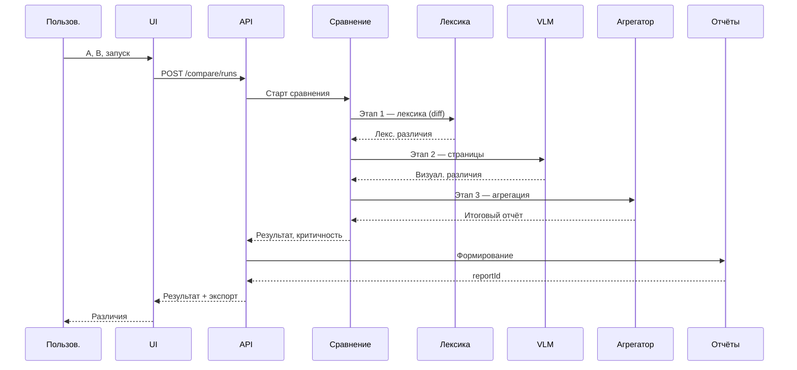


Рисунок 13.5-1. Диаграмма последовательности процесса сравнения двух документов.

### 13.6. Процесс проверки документов на соответствие нормативным требованиям

Пайплайн предназначен для проверки документа на соответствие заданному набору нормативных требований (регламент, шаблон, чек-лист, обязательные разделы и формулировки).
Логика выполнения нормоконтроля приведена [на рис. 13.6-1](#fig-compliance-flow-13-6-1).

Ключевые этапы пайплайна:

1. Этап 1. Автоматическое тэгирование документа — разметка проверяемого документа на фрагменты и атрибуты с применением лексического тэгирования, а при необходимости — семантического тэгирования (векторного или с помощью LLM).
2. Этап 2. Проверка тэгированных фрагментов по правилам — сопоставление каждого тэгированного фрагмента с соответствующим правилом из нормативного документа и выполнение проверки соответствия с помощью LLM.
3. Этап 3. LLM-агрегация результатов проверок — подача результатов проверки всех правил на вход LLM для консолидации замечаний, присвоения итоговых статусов и формирования итогового структурированного отчёта.

Выходные артефакты пайплайна:

- тэгированное представление проверяемого документа с разбиением на фрагменты и служебные атрибуты;
- реестр результатов проверок по связкам «фрагмент -> правило» с фиксацией статуса соответствия и обоснования;
- итоговый агрегированный LLM-отчёт по соответствию с приоритизацией замечаний и цитированием нормативных источников.

Ключевые KPI и SLA процесса:

- Точность классификации несоответствий — доля корректно классифицированных замечаний по уровням критичности.
- Полнота покрытия обязательных требований — доля требований профиля, проверенных и отражённых в отчёте.
- Доля критичных пропусков (false negative) — должна быть минимизирована и контролироваться на эталонном наборе.
- SLA времени нормоконтроля — целевое время формирования заключения фиксируется для типового объёма документа и профиля требований.

Минимальные приёмочные тесты:

1. проверка корректности автоматического тэгирования документа (лексического и, при включении, семантического) на эталонном наборе;
2. проверка корректности сопоставления «тэгированный фрагмент -> правило» и результатов LLM-проверки по заранее размеченным кейсам;
3. документ с множественными несоответствиями и конфликтующими формулировками для проверки полноты выявления нарушений по правилам;
4. проверка корректной LLM-агрегации результатов всех правил в итоговый отчёт, включая приоритизацию замечаний и экспорт.

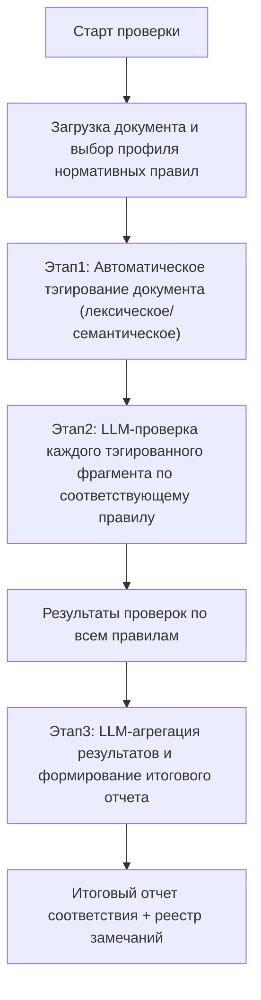


Рисунок 13.6-1. Блок-схема процесса проверки документов на соответствие нормативным требованиям.

#### 13.6.1. Риски качества моделей и меры снижения

Ключевые риски:

- устаревание индексов при изменении нормативного корпуса;
- шум источников и неоднородность входной разметки;
- дрейф формулировок в предметной области, снижающий стабильность классификации.

Базовые меры:

- регулярное переиндексирование и контроль версий корпуса требований;
- периодическая валидация на эталонном наборе документов;
- мониторинг метрик качества (precision/recall/false positives) с порогами алертов;
- процедура экспертного пересмотра критичных решений до финального заключения.

### 13.7. Обновление индексов и согласованность

При добавлении, изменении или удалении документа необходимо обновить или удалить соответствующие записи markdown-представления (результат markup), тэгированного представления (если этап тэгирования включен для данного типа), векторного и (если используется) лексического индексов, чтобы поиск и цитирование в ответах соответствовали актуальному корпусу. При необходимости должно быть обеспечено автоматическое переиндексирование документа при его изменении, включая повторное переразбиение на фрагменты и пересчет связанных представлений. Порядок индексации (полная переиндексация или инкрементальные обновления) определяется на стадии реализации с учетом объема данных и п. 4.1.2 ТЗ.

#### 13.7.1. Сводный список сервисов


| Имя                  | Сервис/компонент                      | Роль в подсистеме                                                                  | Основные входы                                                                          | Основные выходы                                    | Этап конвейера                      |
| -------------------- | ------------------------------------- | ---------------------------------------------------------------------------------- | --------------------------------------------------------------------------------------- | -------------------------------------------------- | ----------------------------------- |
| `ingest-service`     | Сервис сбора документов               | Прием, первичная валидация и маршрутизация документов в конвейер подготовки        | Источники документов, файлы загрузки, метаданные источника                              | Подготовленный пакет документов для markup-service | Этап 1: подготовка и индексирование |
| `ocr-module`         | Модуль OCR (плагин оркестратора)      | Распознавание текста со сканов и изображений до разметки (п. 13.3.8, § 12) | Пакет после ingest, языки OCR, RBAC в контексте                                         | Текст/артефакты для перевода или markup            | Этап 1: подготовка и индексирование |
| `translation-module` | Модуль перевода (плагин оркестратора) | Перевод с иностранного языка на целевой до разметки (п. 13.3.7, § 12)      | Пакет после ingest (при необходимости после OCR, п. 13.3.8), метаданные языка, RBAC | Документ на целевом языке для markup-service       | Этап 1: подготовка и индексирование |
| `markup-service`     | Markup-сервис                         | Преобразование сырого документа в структурированный Markdown                       | Сырые документы (PDF/DOCX/HTML и аналоги)                                               | Структурированный документ (Markdown)              | Этап 1: подготовка и индексирование |
| `tagging-service`    | Сервис тэгирования структуры          | Выделение логических фрагментов и структурных метаданных                           | Markdown от Markup-сервиса                                                              | JSON со списком фрагментов и метаданными           | Этап 1: подготовка и индексирование |
| `chunking-service`   | Chunking-компонент                    | Формирование единиц индексирования и цитирования                                   | Markdown и/или тэгированный JSON                                                        | Набор чанков с привязкой к источнику               | Этап 1: подготовка и индексирование |
| `vector-indexer`     | Сервис векторного индексирования      | Векторизация чанков и построение векторного индекса                                | Чанки документов                                                                        | Эмбеддинги и записи индекса                        | Этап 1: подготовка и индексирование |
| `lexical-indexer`    | Лексический индексатор (BM25)         | Построение и обслуживание лексического индекса                                     | Чанки/тексты документов                                                                 | Лексический индекс BM25                            | Этап 1: подготовка и индексирование |
| `vector-retriever`   | Компонент семантического извлечения   | Поиск релевантных фрагментов в векторном индексе                                   | Текст запроса, параметры top-k                                                          | Топ-k1 векторных кандидатов                        | Этап 2: гибридное извлечение        |
| `lexical-retriever`  | Компонент лексического извлечения     | Поиск релевантных фрагментов в лексическом индексе BM25                            | Текст запроса, параметры top-k                                                          | Топ-k2 лексических кандидатов                      | Этап 2: гибридное извлечение        |
| `merge-service`      | RRF Merge                             | Слияние ранжированных списков vector/BM25                                          | Списки кандидатов двух каналов                                                          | Объединенный топ-N список                          | Этап 2: гибридное извлечение        |
| `filter-service`     | Metadata + RBAC Filter                | Отсев по метаданным, ролям и ограничениям доступа                                  | Топ-N после RRF, атрибуты доступа                                                       | Отфильтрованный список кандидатов                  | Этап 3: пост-поисковая обработка    |
| `masking-middleware` | Маскирование (Presidio/аналог)        | Сокрытие чувствительных данных в текстах фрагментов до реранкинга и БЯМ            | Список кандидатов после фильтрации                                                      | Список с замаскированными текстами                 | Этап 3: пост-поисковая обработка    |
| `reranker-service`   | Реранкер (Cross-Encoder)              | Уточнение порядка релевантности (top-k → top-n)                                    | Кандидаты после маскирования                                                            | Упорядоченный контекст для БЯМ                     | Этап 3: пост-поисковая обработка    |
| `retriever-service`  | Retriever API (оркестратор)           | Управление online-конвейером retrieval                                             | Пользовательский запрос, параметры поиска                                               | Финальный контекст + метаданные цитирования        | Этап 2-3                            |
| `llm-generator`      | Generator LLM (смежный модуль)        | Формирование ответа по проверенному контексту                                      | Контекст после реранкинга, метаданные источников                                        | Ответ с обязательным цитированием                  | Этап 4: генерация ответа            |


#### 13.7.2. Сводный список хранилищ (БД и объектное хранилище)


| Имя                | Хранилище             | Назначение                                                                         | Основные входы                                                                  | Основные выходы                                                            | Контур использования                                          |
| ------------------ | --------------------- | ---------------------------------------------------------------------------------- | ------------------------------------------------------------------------------- | -------------------------------------------------------------------------- | ------------------------------------------------------------- |
| `milvus-vector-db` | Milvus (векторная БД) | Хранение и поиск по векторному индексу                                             | Эмбеддинги и метаданные                                                         | Топ-k векторных кандидатов                                                 | Этап 1 (хранение), Этап 2 (поиск)                             |
| `postgresql-db`    | PostgreSQL            | Хранение служебной метаинформации, связей артефактов и лексического индекса (BM25) | Метаданные процессов индексирования, нормализованные токены/индексные структуры | Служебные записи для трассировки и связности, топ-k лексических кандидатов | Инфраструктурное хранилище, Этап 1 (хранение), Этап 2 (поиск) |
| `s3-storage`       | S3 MinIO              | Хранение JSON-артефактов тэгирования                                               | JSON от сервиса тэгирования                                                     | Доступные артефакты тэгирования                                            | Инфраструктурное хранилище                                    |


### 13.8. Поток данных безопасного веб-поиска и кэша (п. 4.2.2.1 ТЗ)

Для п. 4.2.2.1 ТЗ важно явно увязать цепочку: агент безопасного веб-поиска (изолированный модуль, § 12.2.2) → вызовы только к разрешённым доменам → нормализация и запись фрагментов в класс данных «кэш внешнего поиска» в Milvus (§ 11.3.3, TTL — § 11.4.1) → последующее извлечение контекста Retriever и ответ Generator (§ 13.4). При срабатывании политики конфиденциальности запрос не выходит во внешнюю сеть; контекст для RAG ограничивается внутренним корпусом.

---

## 14. Подсистема пользовательского UI

Пользовательский интерфейс — точка входа сотрудников в функции системы: единая логика навигации, согласованность с точкой входа и авторизацией (§9), удобство, доступность и безопасность на клиенте. Стек фронтенда, макеты и виджеты уточняются на стадии реализации. Связанные разделы этой записки: §10 (аудит и наблюдаемость), §11 (хранение), §12 (конвейеры), §13 (ИИ и RAG).

---

### 14.1. Назначение и обоснование подхода

#### 14.1.1. Проблема

Без выделенных требований к пользовательскому слою интерфейсы разных модулей могут расходиться по стилю, дублировать проверки доступа на уровне «скрытых» URL и ухудшать воспринимаемую целостность продукта. Для регуляторной и экспертной работы с документами важны предсказуемость сценариев, явная обратная связь при длительных операциях (в т.ч. при вызовах пайплайнов и моделей) и снижение риска ошибок пользователя.

#### 14.1.2. Цели подсистемы UI

1. Единообразие — согласованные паттерны навигации, форм, таблиц, сообщений об ошибках и состояниях загрузки.
2. Соответствие правам доступа — интерфейс не подменяет серверную авторизацию, но отражает RBAC: пользователь видит только допустимые действия и данные.
3. Связность с контуром безопасности — без долгоживущих секретов в браузере; токены и вход — по §9.
4. Поддерживаемость — модульность клиентского кода по прикладным областям, чтобы развитие подсистем (документы, поиск, ИИ, конвейеры) не приводило к неконтролируемому дублированию.

---

### 14.2. Архитектура клиентской части

#### 14.2.1. Целевая модель

- Браузерный клиент как основной способ доступа пользователей к ИС «Фармадок» в рамках согласованной с Заказчиком среды.
- Основной принцип построения UI — следование пользовательским use case, соответствующим пайплайнам обработки документов: отдельная браузерная страница (или выделенный экран раздела) сопоставляется конкретному пользовательскому сценарию и выступает интерфейсом соответствующего пайплайна.
- Обращение к прикладной части только через единую точку входа (API Gateway) к совмещённому сервису BFF+backend, без прямых вызовов внутренних сервисов из браузера, кроме явно разрешённых случаев (например, presigned URL по политике §11).
- Разделение слоёв: представление (компоненты UI), состояние и маршрутизация, клиент для HTTP/API — с едиными политиками обработки ошибок, таймаутов и повторных запросов.

#### 14.2.2. Связь с подсистемами


| Область              | Роль UI                                                                                  |
| -------------------- | ---------------------------------------------------------------------------------------- |
| Аутентификация       | Вход, сессия, выход; OIDC/OAuth и совмещённый BFF+backend за шлюзом (§9).                                          |
| Документы и хранение | Метаданные, загрузка/выгрузка, presigned URL (§11).                                  |
| ИИ и RAG             | Поиск, сравнение, нормоконтроль с цитатами и объяснимостью (§13).                    |
| Конвейеры            | Запуск сценариев, статусы этапов и артефакты (§12).                                  |
| Аудит                | Журналирование не отключается пользователем; просмотр событий — в рамках прав (§10). |


Конкретные экраны и маршруты фиксируются в проекте интерфейса (документ "Описание ПО"); далее в этом разделе заданы архитектурные и качественные рамки.

---

### 14.3. Требования к UX и отображению данных

- Состояния загрузки и прогресса — для операций с ожидаемой задержкой (индексация, пайплайн, вызов модели) отображается явный индикатор; по возможности — оценка или этап выполнения.
- Ошибки — понятные сообщения без утечки внутренних имён и трасс; подробности — в журналах (§10).
- Язык интерфейса — при необходимости многоязычности ресурсы выносятся в каталоги сообщений; язык по умолчанию и переключение — по регламенту проекта.

---

### 14.4. RBAC и отображение разрешений

- Решение о допустимости операции принимается на сервере; UI не является доверенным источником прав.
- Скрытие и блокировка: элементы управления (кнопки, пункты меню), ведущие к запрещённым действиям, не отображаются или показываются неактивными — в соответствии с политикой (в т.ч. чтобы не раскрывать существование объектов без прав).
- Маршрутизация: при прямом переходе по URL к недоступному разделу отображается согласованная страница «нет доступа» или перенаправление, без подробностей о причинах, вредных для безопасности.

---

### 14.5. Безопасность на стороне клиента

- Долгоживущие секреты (ключи API, client secret) не должны храниться в localStorage/sessionStorage; должна использоваться схема с модулем BFF в совмещённом серверном приложении и короткоживущими токенами (§9), если иное прямо не согласовано с Заказчиком.
- CSRF: для cookie-сессий — токены синхронизатора или SameSite-политики; согласование с выбранной схемой аутентификации.
- Чувствительные данные на экране — маскирование по политике (ПДн, коммерческая тайна); автоматический выход по таймауту неактивности при необходимости.

---

### 14.6. Наблюдаемость и приёмка

- Корреляция — correlation/request ID в заголовках по общей политике (§10).
- Критерии приёмки UI-части (ориентиры): выполнение согласованных сценариев под тестовыми ролями; корректное поведение при истечении сессии; отсутствие утечки запрещённых данных в ответах об ошибках; соответствие макетам и чек-листу доступности — в объёме, зафиксированном в договорной документации.

---

### 14.7. Основные пользовательские пайплайны и экраны

Соответствие ключевых конвейеров страницам и элементам UI — в таблице ниже.


| Пайплайн (конвейер)                                                | Веб-страница / веб-форма                                                      | Доступные операции (визуальные контролы)                                                                               | Визуальные элементы отображения                                                                                                                   |
| ------------------------------------------------------------------ | ----------------------------------------------------------------------------- | ---------------------------------------------------------------------------------------------------------------------- | ------------------------------------------------------------------------------------------------------------------------------------------------- |
| Загрузка и регистрация документа (разделы 11, 12)              | Страница «Документы / Загрузка»; форма загрузки документа                 | `Выбрать файл`, `Drag-and-drop`, заполнение полей метаданных, `Загрузить`, `Сохранить черновик`, `Отменить`            | Таблица загруженных документов, статус-бейджи (`новый`, `в обработке`, `ошибка`), индикатор прогресса загрузки                                    |
| Парсинг и разметка документа (раздел 12)                       | Страница «Конвейеры / Обработка»; карточка запуска сценария               | `Запустить конвейер`, `Повторить этап`, `Остановить`, `Открыть лог`, `Скачать артефакт`                                | Таймлайн этапов, диаграмма статусов этапов, журнал событий по run-id, индикатор очереди RabbitMQ                                                  |
| Индексирование (vector + lexical) (разделы 11, 13)             | Страница «Индексирование»; форма параметров индексации                    | `Запустить индексацию`, `Переиндексировать`, `Обновить по измененным`, `Пауза`, `Возобновить`                          | Счётчики обработанных документов/чанков, прогресс-бар, KPI-карточки (`throughput`, `ошибки`), таблица проблемных документов                       |
| Интеллектуальный поиск (раздел 13.4)                           | Страница «Поиск по базе знаний»; поисковая форма                          | Поле запроса, `Найти`, фильтры (`тип`, `дата`, `источник`), `Показать цитаты`, `Экспорт ответа`                        | Список результатов с релевантностью, блок ответа Generator, панель цитирования (документ/раздел/страница), теги фильтров                          |
| Сравнение двух документов (раздел 13.5)                        | Страница «Сравнение документов»; форма выбора `Документ A` и `Документ B` | `Выбрать документ A/B`, `Сравнить`, `Показать только различия`, `Экспорт отчёта`, `Сохранить результат`                | Двухколоночный просмотр документов, подсветка различий по категориям, сводка изменений, таблица расхождений с критичностью                        |
| Проверка на соответствие нормативным требованиям (раздел 13.6) | Страница «Нормоконтроль»; форма выбора документа и профиля требований     | `Выбрать профиль проверки`, `Запустить проверку`, `Показать критичные`, `Сформировать заключение`, `Экспорт замечаний` | Матрица «требование -> фрагмент документа», список несоответствий с приоритетами, карточки рекомендаций, индикатор итогового статуса соответствия |


Приведённый перечень фиксирует базовые пользовательские сценарии; окончательный состав экранов и контролов уточняется на стадии реализации при сохранении RBAC и требований ИБ.

Негативные UX-сценарии (обязательные для ключевых экранов):

- таймаут операции — отображать статус «превышено время ожидания», кнопку `Повторить` и ссылку на журнал;
- частичная деградация — явно показывать, какие данные доступны, а какие временно недоступны;
- нет доступа (RBAC) — согласованная страница/баннер с кодом отказа без раскрытия лишних деталей;
- повтор операции — идемпотентное повторное выполнение без дублирования результатов (для загрузки, сравнения, нормоконтроля и формирования отчётов).

---

### 14.8. Backend-сервис для пользовательского UI

Для реализации сценариев, перечисленных в п. 14.7, выделяется логический backend-сервис UI (BFF/API Facade), инкапсулирующий вызовы внутренних сервисов и предоставляющий фронтенду согласованный прикладной API. В целевой конфигурации технического проекта этот фасад **реализуется в составе совмещённого прикладного сервиса BFF+backend за API Gateway**, а не как отдельный сетевой узел перед шлюзом.

#### 14.8.1. Назначение и зона ответственности

Backend-сервис для UI выполняет:

- единый вход для UI-операций по документам, поиску, сравнению и нормоконтролю;
- агрегацию данных из подсистем 10, 11, 12 и 13 в форматах, удобных для экранов;
- оркестрацию длинных операций (запуск конвейеров, отслеживание статуса, получение артефактов);
- централизованную проверку RBAC и применение политик доступа к данным/операциям;
- нормализацию ошибок и возврат пользовательски понятных кодов/сообщений.

#### 14.8.2. Состав API (v1)

На уровне технического проекта API backend-сервиса UI задаётся не исчерпывающим перечнем endpoint-ов, а группами прикладных возможностей. Связь групп API с подсистемами и сценариями UI приведена [на рис. 14.8-1](#fig-api-map-14-8-1).


| Группа API                          | Назначение                                                                                | Основной результат для UI                                  |
| ----------------------------------- | ----------------------------------------------------------------------------------------- | ---------------------------------------------------------- |
| Документы                       | загрузка, регистрация, просмотр карточек и списков документов                             | идентификаторы документов, метаданные, доступные действия  |
| Конвейеры                       | запуск процессов, получение статуса, отмена и повтор отдельных операций                   | `runId`, этап, прогресс, итоговый статус                   |
| Поиск, сравнение, нормоконтроль | выполнение ключевых ИИ-сценариев системы                                                  | результат сценария, цитаты, замечания, ссылки на артефакты |
| Отчёты                          | формирование, получение статуса и выдача файлов                                           | `reportId`, статус, ссылка на скачивание                   |
| Аудит и наблюдаемость           | просмотр журналов пользовательских действий и служебных событий в объёме разрешённых прав | лента событий, фильтры, идентификаторы трассировки         |


Набор конкретных endpoint-ов, структура URI и тела запросов фиксируются в документе «Описание программного обеспечения».

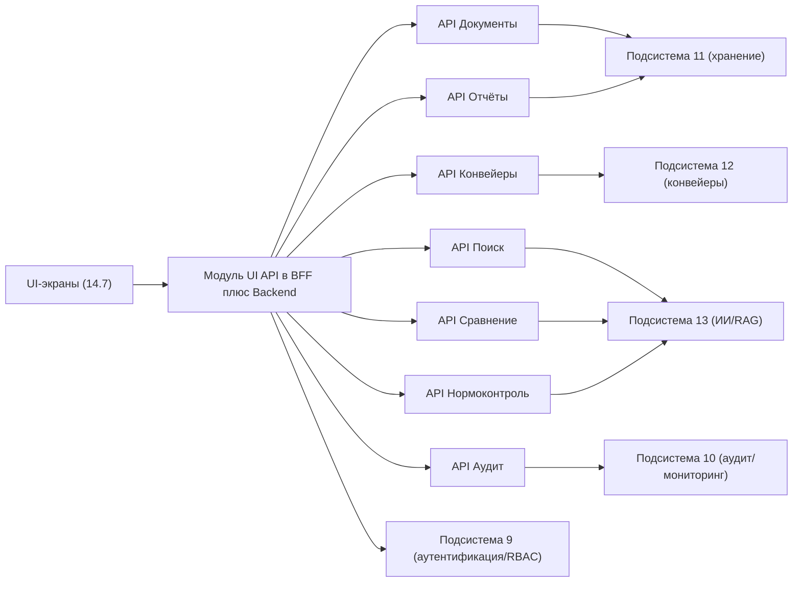


Рисунок 14.8-1. Карта API логического backend-сервиса UI (модуль в совмещённом BFF+backend) и его связи с подсистемами.

#### 14.8.3. Требования к контрактам API

- Все методы должны поддерживать `correlation-id` для трассировки (п. 14.6).
- Для длительных операций должен использоваться асинхронный шаблон: `POST` -> `runId` -> `GET status/result`.
- Формат ошибок должен быть унифицирован (`code`, `message`, `details`, `traceId`) без утечки чувствительных данных.
- Для списков и таблиц обязательно: пагинация, сортировка, фильтры и стабильные идентификаторы.
- Экспортируемые артефакты (отчёты, результаты сравнения/проверки) должны выдаваться через backend с проверкой прав доступа.

Обязательные заголовки и правила:

- входящий и исходящий `x-correlation-id` для сквозной трассировки;
- `Idempotency-Key` для повторяемых `POST`-операций (загрузка, запуск сравнения/нормоконтроля, генерация отчёта);
- для списков: `page`, `pageSize`, `sort`, `filter` с единым контрактом пагинации.

#### 14.8.4. Нефункциональные требования

- Версионирование API (`/api/v1`) и обратная совместимость при эволюции UI.
- Ограничение частоты запросов и защита от перегрузки на уровне API Gateway и backend.
- Наблюдаемость: метрики latency/error-rate по endpoint, аудит критичных операций.
- Безопасность: RBAC, TLS, маскирование чувствительных данных в логах и ответах.

#### 14.8.5. Обработка ошибок и устойчивое состояние (п. 4.1.3 ТЗ)

По п. 4.1.3 ТЗ при ошибочных действиях пользователя и сбоях серверной обработки UI и совмещённый прикладной сервис (BFF+backend) обеспечивают понятные сообщения и идемпотентность повторяемых операций (см. `Idempotency-Key` в п. 14.8.3). Интерфейс возвращается в устойчивое состояние без потери согласованности данных. Общие требования к отказоустойчивости и резервированию — § 4.3, § 11.5, § 12.4.2; негативные сценарии отображения — § 14.7.

---

### 14.9. Шаблоны отчётов DOCX (п. 4.2.1.8 ТЗ)

По п. 4.2.1.8 ТЗ отчёты формируются в формате DOCX по шаблонам, задаваемым Заказчиком или Подрядчиком. Администратор размещает и сопровождает библиотеку шаблонов (загрузка, версия, актуальность); пользователь выбирает допустимый шаблон из списка, доступного по RBAC. Жизненный цикл шаблона (загрузка в объектное хранилище, привязка к типу отчёта, выдача в UI) согласуется с § 11.3.2, § 12.4.4, API § 14.8.2.

### 14.10. Интерфейс администратора плагинов агентов (п. 4.2.2.4 ТЗ)

По п. 4.2.2.4 ТЗ в UI предусматриваются экраны регистрации и управления плагинами: загрузка модуля, настройка лимитов и разрешённых вызовов, запуск и остановка в контуре оркестратора. Доступ к разделу предоставляется только ролям администрирования (§ 9.5). Техническая детализация приведена в § 12.9 и § 7.9.

### 14.11. Ограничения и развитие

Чрезмерная кастомизация интерфейса под отдельных пользователей без версионирования усложняет сопровождение. Полное отсутствие обратной связи при длительных серверных операциях снижает доверие к системе. Баланс между универсальностью компонентов и специализированными рабочими местами определяется на стадии реализации. Расширение функций ИИ и конвейеров должно сопровождаться обновлением пользовательских сценариев и обучающих материалов, а не только backend-контрактов.

## 15. Порядок контроля и приёмки

Раздел опирается на разд. 5 ТЗ: приёмочные испытания, опытная эксплуатация, повторная приёмка. Полная трассировка пунктов ТЗ по записке — п. 1.5.

### 15.0. Матрица трассируемости требований

Полное соответствие пунктов ТЗ подразделам этой записки (включая НЕ НАЙДЕНО) — в п. 1.5.

### 15.0.1. Общие положения испытаний (вводная часть разд. 5 ТЗ)

По вводной части разд. 5 ТЗ — приёмочные испытания, опытная эксплуатация и при необходимости повторные приёмочные испытания. Их проводят комиссия и представители Заказчика и Подрядчика по программе и методике Заказчика. На испытания передают ИС и документацию в составе Приложения № 1 к ТЗ (сроки и комплекты — §16.2, §17). Наблюдаемость при приёмке — §10.7; этапы раскрыты в §15.1–15.3.

Графическое представление трассируемости требований ТЗ к разделам реализации и видам проверки приведено [на рис. 15.0-1](#fig-traceability-15-0-1).


| Требование ТЗ                                                  | Разделы реализации            | Способ проверки                                                     |
| -------------------------------------------------------------- | ----------------------------- | ------------------------------------------------------------------- |
| п. 4.1.1 (модульность, единая точка входа, логирование)        | разделы 9, 12, 14.8           | Функциональные тесты API, проверка маршрутизации и аудита           |
| п. 4.1.2 (производительность, масштабируемость)                | разделы 8, 13.4, 13.5, 13.6   | Нагрузочные испытания, SLA-метрики времени отклика/обработки        |
| п. 4.1.3 (резервирование, восстановление, ошибки пользователя) | разделы 4.3, 10, 11, 14.8     | Восстановление из бэкапов, RPO/RTO; сценарии ошибок UI/API (14.8.5) |
| п. 4.1.4 (эргономика интерфейса)                               | разделы 4.5, 14.3             | Проверка языка, единообразия, сообщений об ошибках, доступности     |
| п. 4.1.5 (безопасность, RBAC, шифрование)                      | разделы 9, 10, 11, 14.5, 14.8 | Тесты доступа по ролям, проверка TLS/секретов, аудит событий ИБ     |
| п. 4.3.1 (ИИ-методы для доменных задач)                        | разделы 13.4, 13.5, 13.6      | Сценарные тесты поиска/сравнения/нормоконтроля на эталонном наборе  |


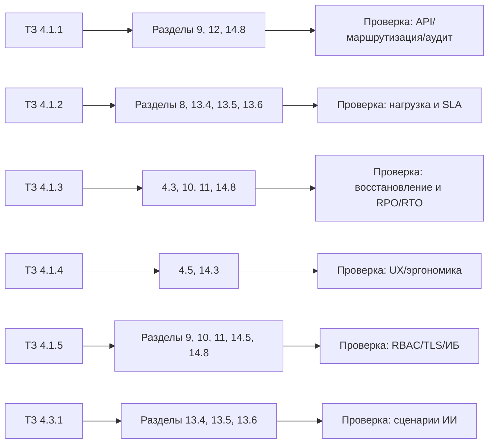


Рисунок 15.0-1. Визуальная матрица трассируемости требований ТЗ.

### 15.1. Приёмочные испытания

Проведение приёмочных испытаний по программе и методике, утверждённой Заказчиком, необходимо для объективной проверки соответствия Системы требованиям ТЗ. Протокол и акт готовности к опытной эксплуатации фиксируют результат испытаний. Далее следует этап опытной эксплуатации на объектах Заказчика.

Минимальный чек-лист приёмки (п. 14.7):

1. Интеллектуальный поиск (13.4): корректность цитирования, устойчивость фильтрации RBAC, время ответа в целевом SLA.
2. Сравнение документов (13.5): полнота/точность выявленных различий на эталонной выборке, корректный экспорт отчёта.
3. Нормоконтроль (13.6): корректная классификация несоответствий, формирование заключения и карты соответствия.
4. Формирование отчётов: успешная генерация и выдача файлов с проверкой прав доступа.
5. Мониторинг и аудит: наличие трассировки `x-correlation-id` и запись критичных событий в аудит.

Ключевые измеримые критерии приёмки ИИ-сценариев должны фиксироваться в программе и методике испытаний в виде отдельной таблицы:


| Сценарий                         | Что проверяется                                                                       | Базовый критерий приёмки                                                                                  |
| -------------------------------- | ------------------------------------------------------------------------------------- | --------------------------------------------------------------------------------------------------------- |
| Интеллектуальный поиск / RAG | время ответа, наличие цитат, отсутствие запрещённых по RBAC фрагментов в выдаче       | ответ в целевом SLA; цитирование источников обязательно; нарушений RBAC не допускается                    |
| Сравнение документов         | полнота и точность выявленных различий на эталонной выборке                           | доли ложноположительных и ложноотрицательных результатов не превышают порогов, согласованных с Заказчиком |
| Нормоконтроль                | корректность сопоставления фрагментов правилам и воспроизводимость итоговых замечаний | критичные несоответствия обнаруживаются на эталонном наборе; итоговый отчёт содержит ссылки на основания  |
| Перевод и OCR                | качество результата на согласованных типах документов второй очереди                  | качество не ниже согласованного порога и пригодно для последующей разметки и индексирования               |


### 15.2. Опытная эксплуатация

Опытная эксплуатация на условно реальных данных позволяет выявить недостатки и особенности работы в условиях, близких к штатным, без риска для реальных процессов. Ведение рабочего журнала и фиксация сбоев и замечаний создают основу для доработок и для повторных приёмочных испытаний. Акт о завершении опытной эксплуатации документирует итоги этапа.

На этапе опытной эксплуатации дополнительно фиксируются:

- статистика деградаций UI/API (таймауты, частичные отказы, повторные запуски);
- стабильность KPI процессов `13.5` и `13.6` на рабочих данных;
- перечень улучшений интерфейса и контрактов API по фактической обратной связи пользователей.

### 15.3. Повторные приёмочные испытания

Повторные приёмочные испытания проводятся при наличии неустранённых недостатков после опытной эксплуатации. Их цель — подтвердить устранение замечаний и готовность Системы к постоянной эксплуатации. Результат — акт о готовности к постоянной эксплуатации и передача обновлённой документации и исходных кодов Заказчику в соответствии с п. 5.3 ТЗ.

Повторная приёмка должна подтвердить:

- закрытие замечаний по качеству сравнения и нормоконтроля (п. 13.5, п. 13.6);
- отсутствие регрессий в сценариях UI и в контрактах backend-сервиса (п. 14.7, п. 14.8);
- соблюдение целевых SLA и требований ИБ по результатам повторных испытаний.

---

## 16. Подготовка к вводу в действие и организации работ

### 16.1. Подготовка объекта

Разд. 6 ТЗ задаёт готовность инфраструктуры и системы к вводу. По смыслу блока: закупка и установка оборудования по рекомендациям Подрядчика; установка и настройка системного ПО (ОС, СУБД, виртуализация, резервное копирование) для единообразия окружения; развёртывание прикладной системы с учётом политик Заказчика; обучение пользователей. Дополнительно предусматриваются начальное наполнение векторной БД для семантического поиска и загрузка исходников в СМК Заказчика с CI/CD для контроля версий и воспроизводимости.

### 16.2. Организация работ

Сроки выполнения работ (02.02.2026–12.05.2027), места выполнения (площадки Заказчика в Москве и место нахождения Подрядчика), формы взаимодействия (телефон, электронная почта, ВКС, совещания) и обязанность Подрядчика предоставлять отчёты по требованию Заказчика определены контрактом и обеспечивают управляемость проекта и согласованность с Приложением № 1 к ТЗ (календарный план).

### 16.3. Гарантийные обязательства (п. 10 ТЗ)

По п. 10 ТЗ на выполненные работы устанавливается гарантийный срок 12 (двенадцать) месяцев с даты подписания Заказчиком документа о приёмке по последнему этапу. Выявленные в гарантийный срок недостатки Подрядчик устраняет за свой счёт. Если качество работ не соответствует требованиям и Система непригодна для нормальной эксплуатации, Заказчик письменно уведомляет Подрядчика; недостатки подлежат безвозмездному устранению в срок не более 30 (тридцати) календарных дней. Гарантийный срок прерывается со дня такого уведомления и возобновляется после устранения недостатков.

---

## 17. Документирование

Документация ведётся по ГОСТ 2.105-2019 и ЕСПД (ГОСТ 19) — для единообразия, экспертизы и сопровождения. Состав комплектов — Приложение № 1 к ТЗ. Отчётность: печать (1 экз.) и DOCX; исходные коды — на электронном носителе (1 экз.), как обычно требуют при приёмке работ.

---

## 18. Риски и допущения

### 18.1. Допущения

Предполагается, что инфраструктура Заказчика (серверы, сеть, WAF, СЗИ) будет доведена до объёма, достаточного для развёртывания по рекомендациям Подрядчика. Корпоративный Id провайдер или Authentik окажется совместим с SSO/MFA и интеграцией с API Gateway без ломки штатной конфигурации. Белый список сайтов для веб-поиска (вторая очередь) согласует Заказчик с учётом регламентов и лицензий. Шаблоны отчётов и перечень типов документов (Приложение А к ТЗ) уточнят на реализации, не блокируя старт первой очереди.

### 18.2. Риски


| Риск                                                   | Проявление                                                                              | Мера снижения                                                                                                                    |
| ------------------------------------------------------ | --------------------------------------------------------------------------------------- | -------------------------------------------------------------------------------------------------------------------------------- |
| Производительность БЯМ и векторной БД              | превышение целевого времени ответа при росте корпуса и нагрузки                         | нагрузочные испытания на согласованной конфигурации, масштабирование ресурсов, настройка поиска и реранкинга                     |
| Качество перевода и OCR (вторая очередь)           | снижение пригодности текста для разметки, поиска и проверки                             | ограничение перечня типов документов и языков на первом этапе, контроль качества на эталонной выборке, возможность замены движка |
| Дрейф и устаревание нормативного корпуса           | ответы и проверки опираются на неактуальные документы                                   | регламент актуализации корпуса, контроль версий и переиндексации, фиксация даты источника в метаданных                           |
| Доступность внешних API и сайтов                   | сбои безопасного веб-поиска, изменение интерфейсов источников                           | белый список источников, кэширование, деградация к внутреннему корпусу без выхода во внешнюю сеть                                |
| Интеграция с корпоративным каталогом и ИБ-контуром | задержки внедрения из-за LDAP/SSO/MFA и требований службы ИБ                            | раннее согласование схемы федерации, ролей, форматов аудита и перечня обязательных интеграций                                    |
| Избыточная детализация проектных решений           | усложнение согласования технического проекта и размывание границы со стадией реализации | вынос низкоуровневых контрактов и параметров в смежную документацию, сохранение в записке только архитектурно значимых решений   |


Перечень рисков подлежит актуализации на стадии реализации и опытной эксплуатации; конкретные пороги и ответственные стороны закрепляются в программе испытаний и эксплуатационных регламентах.

### 18.3. Патентная чистота и права на результаты (п. 4.1.6 ТЗ и п. 7 ТЗ)

По п. 4.1.6 ТЗ проектные и технические решения Системы должны соответствовать законодательству РФ, в том числе части четвёртой ГК РФ об интеллектуальной собственности. Система и используемые при её создании компоненты должны быть свободны от притязаний третьих лиц по промышленной и иной собственности; реализация не должна нарушать авторские и смежные права. Правообладание информационными ресурсами, формируемыми при эксплуатации Системы, определяется в компетенции Заказчика и действующими НПА. Исключительное право на результаты работ по ТЗ принадлежит Заказчику. Обязательство Подрядчика не нарушать исключительные права третьих лиц при передаче результатов закреплено также в разделе 7 ТЗ (организация работ).

---

## 19. Список использованных источников и приложения

### 19.1. Нормативные и методические документы

Ниже — источники из п. 9 ТЗ и сопутствующие нормативные документы, на которые ссылается записка (в т.ч. ПДн, регистрация ЛС, документация АС, криптография).

1. Федеральный закон от 12.04.2010 № 61-ФЗ «Об обращении лекарственных средств».
2. Федеральный закон от 27.07.2006 № 152-ФЗ «О персональных данных».
3. Решение Совета Евразийской экономической комиссии от 03.11.2016 № 78 «О Правилах регистрации и экспертизы лекарственных средств для медицинского применения».
4. Решение Совета Евразийской экономической комиссии от 03.11.2016 № 88 «Об утверждении требований к инструкции по медицинскому применению лекарственных препаратов и общей характеристике лекарственных препаратов для медицинского применения».
5. Решение Коллегии Евразийской экономической комиссии от 07.09.2018 № 151 «Об утверждении Руководства по составлению нормативного документа по качеству лекарственного препарата».
6. ГОСТ Р 34.12-2015. Информационная технология. Криптографическая защита информации. Блочные шифры.
7. ГОСТ Р 59795-2021. Информационные технологии. Комплекс стандартов на автоматизированные системы. Автоматизированные системы. Требования к содержанию документов.
8. ГОСТ 2.105-2019. Единая система конструкторской документации. Текстовые документы.
9. ГОСТ 34.201-89. Виды, комплектность и обозначение документов при создании автоматизированных систем.
10. Единая система программной документации (ЕСПД), ГОСТ 19 серии.
11. ГОСТ Р 34.11-2012. Информационная технология. Криптографическая защита информации. Функция хэширования.
12. Рекомендации Роскомнадзора по обработке персональных данных.
13. Требования Минздрава России к информационной безопасности при обработке конфиденциальной информации.

### 19.2. Проектные документы

- Техническое задание на создание информационной системы «Фармадок» (ТЗ).
- Описание архитектуры и технических средств.
- Приложение № 1 к ТЗ — календарный план, состав документации.
- Приложение № 2 к ТЗ — схема сетевой инфраструктуры.
- Приложение № 3 к ТЗ — примерная архитектура Системы.
- Приложение А к ТЗ — примерный перечень типов документации для интеллектуальной обработки в ИС «Фармадок».

### 19.3. Соответствие требованиям закупки и Приложение № 5 к ТЗ

Настоящая пояснительная записка не воспроизводит полный текст обоснования, предусмотренного Постановлением Правительства РФ № 1875 и Приложением № 5 к ТЗ (обоснование неприменения запрета на использование иностранного программного обеспечения). Архитектурные и технологические решения, изложенные в записке, подлежат согласованию с требованиями контракта, условиями закупки и реестрами российского и евразийского ПО в объёме, определяемом Заказчиком. Исчерпывающая формулировка обоснования содержится в комплекте ТЗ (Приложение № 5).