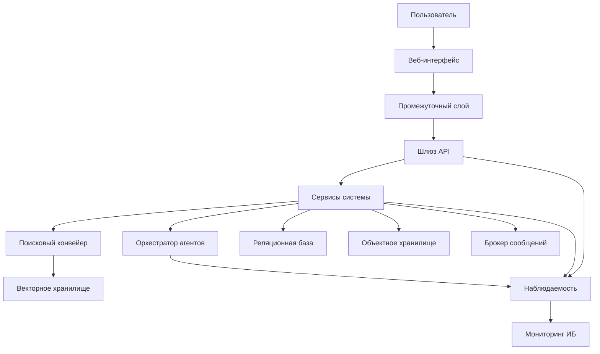
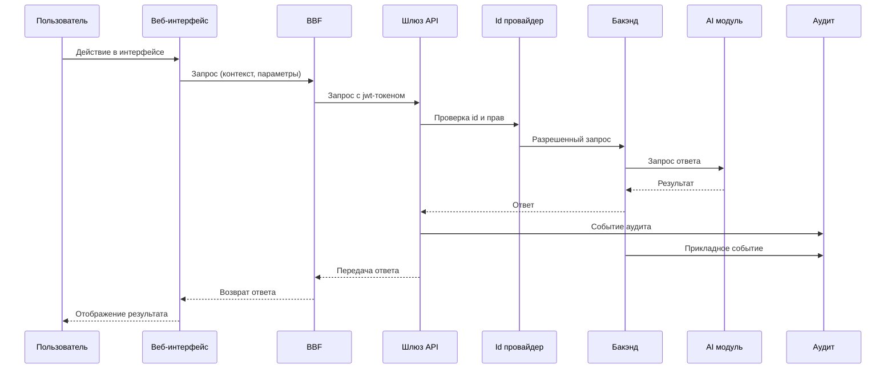
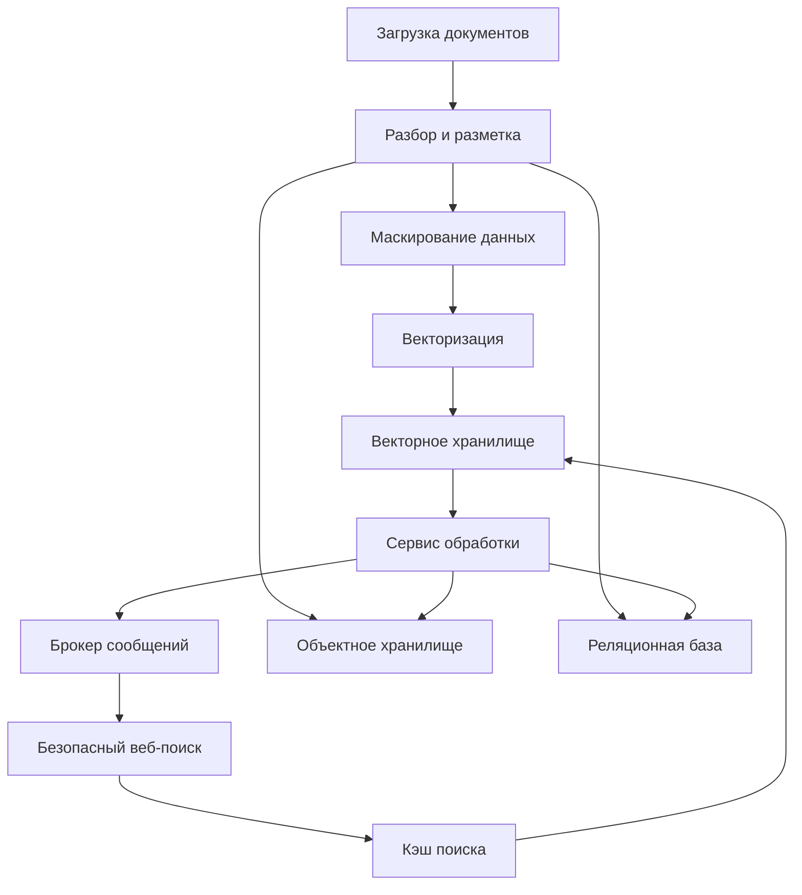
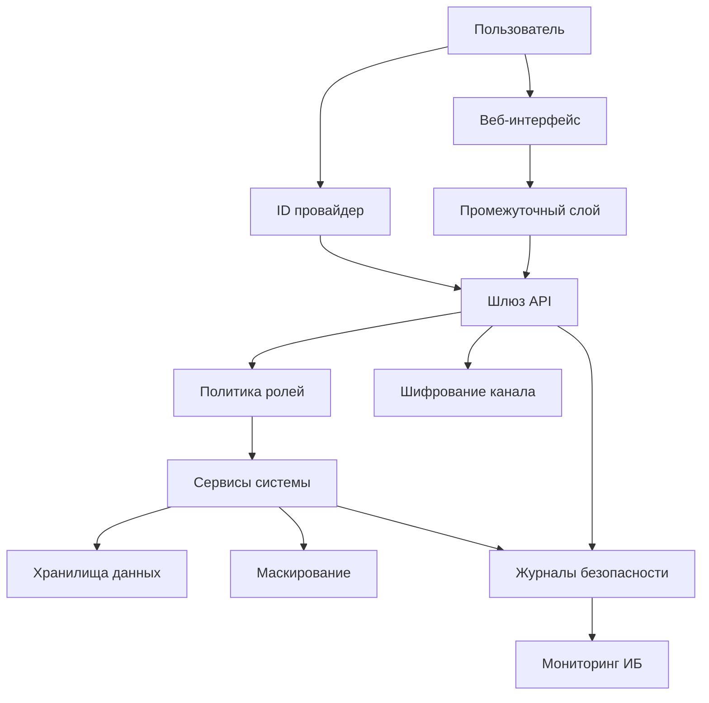
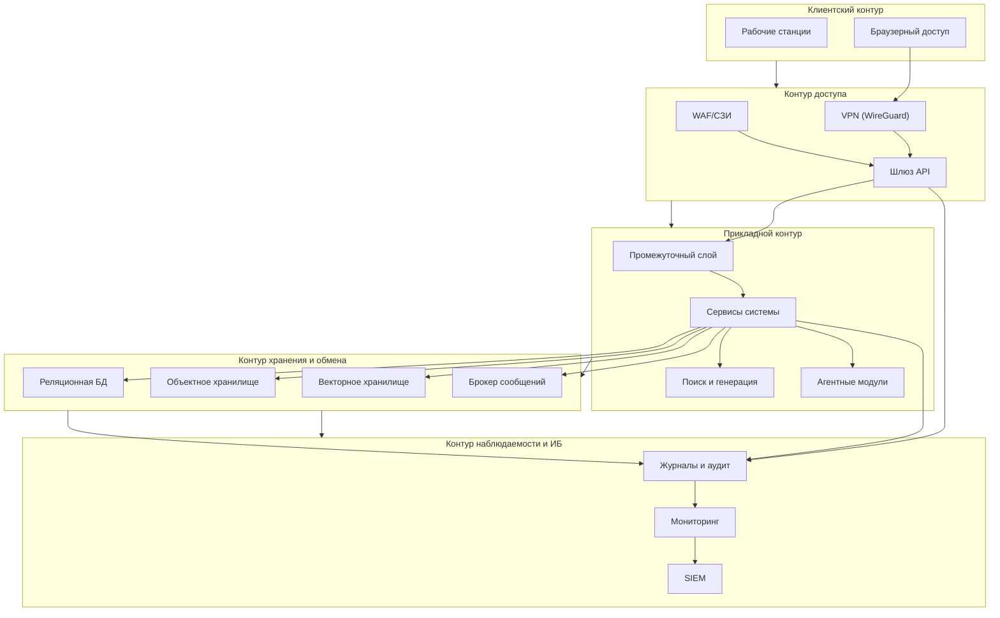

# Описание архитектуры и технических средств

## информационной системы «Фармадок»

---

## 1. Назначение документа

Настоящий документ фиксирует архитектуру развертывания и состав технических средств ИС «Фармадок», включая:
- схему размещения программных компонентов;
- требования к серверной и сетевой инфраструктуре;
- спецификацию программного окружения;
- требования к безопасности, надежности и масштабируемости на уровне инфраструктуры.

Документ предназначен для системных администраторов, DevOps-инженеров, специалистов по информационной безопасности и инфраструктурной эксплуатации.

---

## 2. Архитектурный контур системы

Архитектура ИС «Фармадок» строится как модульная многоуровневая система с единой точкой входа в серверный контур и разделением ответственности между контурами доступа, прикладной обработки, хранения данных и наблюдаемости/информационной безопасности. Архитектурная базовая модель ориентирована на требования технического задания и их обоснование в пояснительной записке.

### 2.1. Архитектурные цели и ограничения

Архитектура должна обеспечивать:
- контролируемый и единообразный доступ к функциям системы через шлюз программного интерфейса приложений;
- поддержку ключевых сценариев первой и второй очереди (поиск и генерация ответа с использованием внутренней базы знаний, анализ, безопасный веб-поиск, агентные расширения);
- масштабирование без переработки прикладной логики;
- безопасность обработки конфиденциальных данных на всем пути запроса;
- эксплуатационную управляемость через централизованные логи, метрики и аудит.

Ограничения и обязательные условия:
- размещение в контуре Заказчика (локальный контур или доверенный контур) с учетом требований по защите данных;
- поддержка клиентских рабочих мест `Windows 10` и серверного контура `Ubuntu 24.04+`;
- использование протокола шифрования транспортного уровня версии 1.3 или выше, ролевой модели разграничения доступа, аудита и интеграции с системой управления событиями информационной безопасности;
- изоляция агентных модулей в контейнерах с ограничением сети/ФС/ресурсов.

### 2.2. Логические контуры и границы ответственности

В архитектуре выделяются пять логических контуров:
- **клиентский контур**: пользовательский браузерный доступ и пользовательские сессии;
- **контур доступа**: защищенный виртуальный сетевой доступ, шлюз программного интерфейса приложений, периметровая защита (межсетевой экран веб-приложений/средства защиты информации);
- **прикладной контур**: серверный промежуточный слой для пользовательского интерфейса, серверные сервисы, оркестрация прикладных сценариев, компоненты поиска и генерации ответа с использованием внутренней базы знаний;
- **контур хранения и обмена**: `PostgreSQL`, `S3 MinIO`, векторное хранилище, `RabbitMQ`;
- **контур наблюдаемости и информационной безопасности**: централизованный сбор журналов, метрик и аудита с передачей событий в систему управления событиями информационной безопасности.

Правила межконтурного взаимодействия:
- внешний трафик к прикладным сервисам допускается только через контур доступа;
- прямой доступ клиентского контура к хранилищам запрещен;
- сервисный доступ к хранилищам осуществляется по учетным записям минимально необходимой привилегии;
- события безопасности и отказов должны фиксироваться в контуре наблюдаемости.

### 2.3. Компонентная модель и архитектурные контракты

Ключевые компоненты:
- шлюз программного интерфейса приложений: единая точка входа, маршрутизация, ограничение частоты запросов, журналирование, базовое применение политик доступа;
- централизованный провайдер идентификации (`Authentik`/`Keycloak` по согласованию): единый вход, многофакторная аутентификация, выпуск и валидация токенов в рамках принятой схемы;
- серверный промежуточный слой для пользовательского интерфейса: безопасное взаимодействие веб-клиента с серверными интерфейсами и вынос клиент-специфичной логики;
- серверные сервисы: реализация бизнес-функций и оркестрация прикладных процессов;
- подсистема поиска и генерации ответа с использованием внутренней базы знаний: поиск релевантного контекста и формирование ответа с учетом прав доступа;
- векторное хранилище: хранение эмбеддингов и поисковых индексов с логическим разделением типов данных;
- модуль агентов: изолированное выполнение специализированных сценариев (поиск, анализ, сравнение, оптическое распознавание текста и перевод во второй очереди);
- контур наблюдаемости: журналы, метрики, аудит, оповещения и экспорт событий в систему управления событиями информационной безопасности.

Архитектурные контракты:
- контракт доступа: шлюз программного интерфейса приложений применяет общесистемные политики перед передачей вызова в серверные сервисы;
- контракт данных: серверные сервисы работают с хранилищами через формализованные сервисные роли и схемы данных;
- контракт безопасности: все межсервисные вызовы защищены транспортным шифрованием и аудируются;
- контракт расширяемости: подключение новых агентов не должно требовать изменений ядра.

### 2.4. Ключевые архитектурные сценарии

Сценарий 1 - пользовательский запрос к функционалу системы:
1. Пользователь инициирует действие в веб-интерфейсе.
2. Запрос поступает в серверный промежуточный слой для пользовательского интерфейса, далее в шлюз программного интерфейса приложений.
3. На уровне контура доступа выполняются проверки аутентификации/авторизации и ограничение частоты.
4. Серверный сервис обрабатывает запрос и при необходимости обращается к подсистеме поиска и генерации ответа с использованием внутренней базы знаний и к хранилищам.
5. Результат возвращается пользователю, а технические и аудитные события фиксируются.

Сценарий 2 - обработка интеллектуального запроса:
1. Серверный сервис инициирует поиск релевантного контекста в векторном хранилище.
2. Конвейер поиска и генерации ответа с использованием внутренней базы знаний формирует контекст и итоговый ответ.
3. Чувствительные данные маскируются в соответствии с политиками ИБ.
4. События обработки и метрики отправляются в наблюдаемость.

Сценарий 3 - выполнение агентного модуля:
1. Оркестратор запускает агент в контейнерной песочнице.
2. Применяются ограничения сети (белый список), файловой системы и ресурсов.
3. Результаты агента передаются в прикладной контур, а события выполнения аудируются.

### 2.5. Нефункциональные атрибуты архитектуры

Производительность и масштабирование:
- горизонтальное масштабирование прикладных сервисов и контуров поиска/хранения;
- целевые показатели: не менее 100 одновременно работающих пользователей и не менее 100 запросов в минуту.

Надежность и восстановление:
- резервное копирование критичных данных с шифрованием;
- периодическое тестовое восстановление;
- целевое время восстановления при сбоях - не более 4 часов в предусмотренных ТЗ сценариях.

Безопасность:
- ролевая модель разграничения доступа и многофакторная аутентификация в модели доступа;
- протокол шифрования транспортного уровня версии 1.3 или выше для каналов связи;
- криптографическая защита данных на хранении в соответствии с требованиями Заказчика, включая ГОСТ;
- запрет несанкционированной передачи данных во внешние сервисы.

Наблюдаемость:
- централизованный сбор приложенческих и инфраструктурных логов;
- сбор метрик производительности и доступности;
- аудит пользовательских и сервисных действий;
- передача критичных событий в систему управления событиями информационной безопасности.

### 2.6. Трассировка архитектуры на требования ТЗ/ПЗ

- требования к структуре и функционированию (модульность, единая точка входа, агентный контур) отражены в компонентной модели и сценариях разделов `2.2-2.4`;
- требования к масштабируемости и производительности отражены в `2.5` и связаны с эксплуатационными параметрами раздела `8`;
- требования к надежности и восстановлению отражены в `2.5` и детализируются в разделе `7`;
- требования к защите информации, контролю доступа и аудиту отражены в `2.2-2.5` и детализируются в разделах `6` и `9`;
- инфраструктурные ограничения (ОС, контур размещения, обеспечение техсредств Заказчиком) учитываются в разделах `3` и `4`.

#### Диаграмма 2-1. Логическая архитектура (контуры и компоненты)

#### Диаграмма 2-2. Поток пользовательского запроса

#### Диаграмма 2-3. Потоки данных и хранилища

#### Диаграмма 2-4. Контур безопасности

---

## 3. Схема развертывания

### 3.1. Логическая схема размещения

Основные контуры развертывания:
1. **Клиентский контур** (рабочие станции Заказчика, браузерный доступ).
2. **Контур доступа** (защищенный виртуальный сетевой доступ, шлюз программного интерфейса приложений, межсетевой экран веб-приложений/средства защиты информации).
3. **Прикладной контур** (серверный промежуточный слой для пользовательского интерфейса, серверные сервисы, модули поиска и генерации ответа с использованием внутренней базы знаний и агенты).
4. **Контур хранения и обмена** (реляционная бд, объектное хранилище, векторное хранилище, брокер сообщений).
5. **Контур наблюдаемости и информационной безопасности** (централизованные журналы, мониторинг, аудит, система управления событиями информационной безопасности).

Термины контуров и состав ключевых компонентов приведены в разделе `2.2` и диаграмме `2-1`; данный раздел фиксирует только размещение и сетевое разделение.

#### Диаграмма 3-1. Логическая схема размещения

### 3.2. Сетевая топология (целевой подход)

- Доступ пользователей осуществляется из доменной сети учреждения.
- Удаленный защищенный доступ организуется через защищенный виртуальный сетевой доступ (`WireGuard`) в рамках инфраструктуры Заказчика (по схеме Приложения №2 к ТЗ).
- Публикуемая точка входа в серверную часть - шлюз программного интерфейса приложений (Kong OSS или функциональный аналог) с централизованной аутентификацией, авторизацией и журналированием.
- Периметр защищается средствами межсетевого экрана веб-приложений и средствами защиты информации Заказчика, а межконтурный обмен выполняется по регламентированным правилам.
- Для агентных модулей применяется сетевой белый список доменов/узлов и запрет произвольного внешнего доступа.

Сетевая топология реализует архитектурные контракты раздела `2.3` (единая точка входа, контролируемые межконтурные взаимодействия, обязательный аудит событий доступа).

---

## 4. Состав технических средств

### 4.1. Рабочие станции пользователей

Требуемая клиентская платформа:
- ОС: `Windows 10` (доменная эксплуатация);
- доступ к системе через поддерживаемый корпоративный браузер;
- отсутствие необходимости установки специализированного клиентского ПО (работа через веб-интерфейс).

### 4.2. Серверная платформа

Базовая серверная платформа:
- ОС рабочих станций: `Windows 10`;
- ОС серверов: `Ubuntu 24.04 LTS` или выше;
- контейнеризация сервисов: `Docker`;
- оркестрация (по масштабу и политике Заказчика): `Docker Compose` и/или `Kubernetes`.

Состав серверных ролей (логически):
- сервер доступа/шлюзов (шлюз программного интерфейса приложений, при необходимости интеграция с межсетевым экраном веб-приложений);
- серверы прикладных сервисов (серверный промежуточный слой для пользовательского интерфейса, серверные сервисы обработки);
- серверы контуров хранения (`PostgreSQL`, `MinIO`, `Milvus`, `RabbitMQ`);
- сервер наблюдаемости и централизованного логирования;
- сервер(ы) ИИ/моделей (в локальном или доверенном контуре Заказчика).

### 4.3. Требования к аппаратным ресурсам

Точные характеристики CPU/RAM/GPU/дисков определяются при рабочем проектировании по итогам профилирования нагрузки.

Технические средства и каналы связи, необходимые для развертывания ИС, обеспечиваются Заказчиком. На этапе технического проектирования уточняются параметры рабочих станций, серверов и телекоммуникационной инфраструктуры исходя из требований производительности, доступности и информационной безопасности.

Минимальные требования к планированию ресурсов:
- закладывать масштабирование на не менее 100 одновременно работающих пользователей;
- обеспечивать не менее 100 запросов в минуту на уровне сервиса;
- предусматривать резерв по CPU/RAM и IOPS для пиковых сценариев;
- учитывать отдельный ресурсный контур под модели ИИ и векторный поиск;
- предусматривать отказоустойчивое хранение данных и резервные емкости под бэкапы.

---

## 5. Спецификация программного окружения

Инфраструктурное ПО и платформенные компоненты:
- `Шлюз программного интерфейса приложений`: Kong OSS (или функциональный аналог);
- `Централизованный провайдер идентификации`: Authentik (базовый вариант), Keycloak (по согласованию);
- `Backend`: Python 3.11+ (FastAPI или эквивалент);
- `Хранилища`: PostgreSQL, S3 MinIO, Milvus;
- `Обмен событиями`: RabbitMQ;
- `Контейнеризация`: Docker;
- `CI/CD`: GitLab CI или Jenkins (по согласованию с Заказчиком);
- `Наблюдаемость`: централизованный сбор журналов, метрик и оповещений, интеграция с системой управления событиями информационной безопасности.

Требования к векторному хранилищу:
- логическое раздельное хранение как минимум трех типов данных: регламентирующие документы, рабочие документы, кэш результатов внешнего поиска;
- управление доступом и фильтрация выборки по атрибутам/метаданным (в связке с ролевой моделью разграничения доступа);
- аудит обращений и совместимость с политиками маскирования чувствительных данных перед индексацией.

Версии и параметры конфигурации фиксируются в эксплуатационных и конфигурационных артефактах поставки.

---

## 6. Архитектура безопасности

### 6.1. Контроль доступа

- единая аутентификация через централизованный провайдер идентификации (единый вход);
- обязательная многофакторная аутентификация для пользовательского доступа;
- ролевая модель разграничения доступа к функциям и данным;
- сервисные взаимодействия через выделенные учетные записи с минимальными правами.

### 6.2. Защита каналов и данных

- шифрование трафика между компонентами (протокол шифрования транспортного уровня версии 1.3 или выше);
- шифрование данных на хранении в соответствии с криптографическими требованиями Заказчика, включая применение ГОСТ Р 34.11-2012 и ГОСТ Р 34.12-2015;
- хранение ключей/секретов в корпоративном секрет-менеджере (например, Vault);
- запрет передачи обрабатываемых данных в несанкционированные внешние сервисы.

### 6.3. Защита периметра и агентных контуров

- использование межсетевого экрана веб-приложений и средств защиты информации в интеграции с точкой входа;
- централизованное журналирование запросов шлюза;
- изоляция ИИ-агентов в контейнерной среде (ограничения сети/ФС/ресурсов);
- фильтрация и контроль внешнего сетевого взаимодействия.

Дополнительно:
- критичные данные в документах подлежат маскированию/анонимизации перед передачей в БЯМ и перед индексацией в векторное хранилище;
- журналы действий пользователей и системных событий хранятся в защищенном контуре и передаются в систему управления событиями информационной безопасности в режиме, согласованном с Заказчиком (системный журнал, протокол передачи гипертекста, агент доставки).

---

## 7. Отказоустойчивость, резервирование и восстановление

Инфраструктура должна обеспечивать:
- резервное копирование критичных данных (БД, объектное хранилище, конфигурации);
- шифрование резервных копий;
- регламентированное тестовое восстановление;
- восстановление из резервной копии и восстановление программных средств при сбое не более чем за 4 часа для сценариев, предусмотренных ТЗ;
- сохранение работоспособности при росте нагрузки и отказе отдельных компонентов.

Рекомендуемые меры:
- выделение уровней приоритета сервисов;
- подготовка и периодическая проверка процедур аварийного восстановления;
- контроль целостности и пригодности резервных копий.

---

## 8. Масштабируемость и производительность

Архитектура предусматривает горизонтальное масштабирование:
- серверных сервисов и серверного промежуточного слоя для пользовательского интерфейса в контейнерной среде;
- контуров хранения и поиска при росте объема документов;
- прикладных обработчиков и агентных модулей при увеличении очередей заданий.

Инфраструктурные механизмы обеспечения производительности:
- ограничение частоты запросов на шлюзе программного интерфейса приложений;
- балансировка нагрузки;
- разделение контуров по типу нагрузки (доступ, обработка, хранение, наблюдаемость);
- мониторинг производительности и настройка алертов по порогам деградации.

Целевые показатели для промышленного контура:
- поддержка не менее 100 одновременно работающих пользователей;
- обработка не менее 100 запросов в минуту без потери функциональности.

---

## 9. Наблюдаемость и эксплуатационный контроль

Подсистема наблюдаемости должна обеспечивать:
- сбор технических логов приложений и инфраструктуры;
- сбор метрик доступности/производительности;
- аудит ключевых действий пользователей и сервисов;
- выделение событий отказа доступа (401/403/429 и аналогичных);
- передачу критичных событий в систему управления событиями информационной безопасности (по составу поставки и требованиям информационной безопасности).

Интеграция с системой управления событиями информационной безопасности может выполняться по схемам:
- syslog;
- HTTP-приемник;
- файловый поток через агент доставки логов.

---

## 10. Ограничения и допущения

- На этапе прототипирования допускаются упрощения в части отказоустойчивого кластера, ретенции логов и глубины резервирования.
- При переходе к промышленной эксплуатации параметры масштабирования, резервирования и ИБ-контролей подлежат уточнению и формализации.
- Конкретные характеристики оборудования зависят от выбранной модели развертывания (локальный контур/доверенный контур) и профильной нагрузки Заказчика.
- Для векторного хранилища допускается использование эквивалентного решения (например, `Redis`/`Pinecone`/`Milvus`) при условии выполнения требований по шифрованию, логическому разделению данных, фильтрации по ролевой модели разграничения доступа и аудитируемости.
- Кэш результатов внешнего поиска хранится ограниченное время (целевой срок хранения - до 24 часов) и используется только в рамках контролируемых сценариев безопасного поиска.

---

## 11. Связь с комплектом документации

Документ «Описание архитектуры и технических средств» отвечает на вопрос «где и на каком оборудовании работает система» и дополняет:
- `Техническое задание` (целевые требования);
- `Пояснительная записка к техническому проекту` (обоснование решений);
- `Описание программного обеспечения` (логика модулей);
- `Описание информационного обеспечения` (структура и жизненный цикл данных).

Документ подлежит актуализации при изменении архитектурной схемы, инфраструктурных ролей, окружения развертывания и требований по ИБ/эксплуатации.
