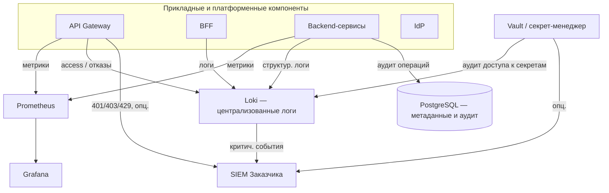

# ПОЯСНИТЕЛЬНАЯ ЗАПИСКА К ТЕХНИЧЕСКОМУ ЗАДАНИЮ

# 2. Подсистема хранения ключей и секретов, аудита, мониторинга и логирования

Подраздел описывает архитектуру и обоснование решений по: 
 - 1. централизованному хранению секретов и ключевого материала; 
 - 2. журналированию действий пользователей и системных событий, пригодному для расследований и соответствия требованиям ИБ; 
 - 3. мониторингу технического состояния и производительности компонентов; 
 - 4. сбору, хранению и анализу операционных логов приложений и платформы. 
 Детализация по блокам — пп. 2.3–2.6; 
 Cвязь с API Gateway и журналированием запросов — документ [1.1. Подсистема входа, аутентификации и авторизации](1_1_subsystem_auth.md), п. 1.3.4.

## 2.0. Глоссарий

- **секрет** — конфиденциальные данные конфигурации (пароли СУБД, API-ключи, client_secret, строки подключения, TLS-ключи и сертификаты прикладного уровня и т.п.), которые не должны храниться в исходном коде или незащищённых файлах образов;
- **ключ шифрования** — криптографический ключ или материал для шифрования данных на покое (хранимые данные, резервные копии, тома с документами); в обобщённом виде может управляться тем же контуром, что и секреты;
- **Vault** — HashiCorp Vault или функциональный аналог (кор­по­ра­тив­ный секрет-менеджер);
- **аудит (security audit)** — фиксация значимых событий безопасности и подотчётных действий (вход, отказ в доступе, изменение прав, обращение к секретам, административные операции) с привязкой к субъекту и времени;
- **SIEM** — система управления событиями и информацией о безопасности (централизованный приём, корреляция и анализ событий);
- **метрика** — числовой показатель работы компонента (задержка, ошибки, утилизация ресурсов, размер очередей);
- **наблюдаемость (observability)** — совокупность метрик, логов и (при необходимости) трасс для диагностики состояния системы;
- **ретенция** — срок и политика хранения журналов и аудита;
- **ELK** — стек Elasticsearch, Logstash, Kibana или эквивалент (OpenSearch, Loki+Grafana и т.п.) для централизованного поиска по логам.

## 2.1. Обзор подсистемы: проблема, подходы, требования

### 2.1.1. Проблема и требования

ИС «Фармадок» обрабатывает фармацевтическую документацию, персональные данные и сведения экспертиз. Без выделенного контура для секретов, аудита, мониторинга и логирования:

1. **секреты** оказываются в переменных окружения на хостах, в репозиториях или образах — что увеличивает риск утечки и затрудняет ротацию;
2. **расследование инцидентов** и демонстрация соответствия регламентам требуют целостной цепочки записей «кто — что — когда»; разрозненные логи на контейнерах без доставки в единое хранилище не обеспечивают приемлемого уровня аудита;
3. **эксплуатация** (дежурства, плановые работы) нуждается в проактивном обнаружении деградации (рост задержек, отказы зависимостей), что невозможно без метрик и оповещений;
4. **устранение сбоев** замедляется, если прикладные и инфраструктурные логи не структурированы и не коррелируются по идентификатору запроса.

Требования ТЗ (в части, касающейся настоящей подсистемы): 
 - п. 4.1.1 — единая точка входа с **логированием запросов**; 
 - п. 4.1.4 — **журналирование действий пользователей и системных событий**, возможность **интеграции с SIEM**, **шифрование** каналов и хранимых данных, что предполагает **управление ключами и секретами**; 
 - п. 4.1.3 — **резервное копирование с шифрованием**, связанное с политикой ключей. 
 В документе «Описание архитектуры» (Architecture) принцип **наблюдаемости**, разделы о безопасности и стеке технологий (в т.ч. ELK, Prometheus, Grafana) согласуются с настоящим подразделом.

### 2.1.2. Существующие подходы

**Хранение секретов:**
 - распределённое хранение в конфигурации хостов;
 - секреты Kubernetes (или Sealed Secrets); 
 - облачные Secret Manager / Key Vault; специализированные хранилища с политиками доступа и аудитом (HashiCorp Vault и аналоги); 
 - шифрование секретов в Git (SOPS). 

 Для контура Заказчика без обязательного Kubernetes и с требованием независимости от внешнего облака приоритетны решения класса Vault или утверждённый корпоративный секрет-менеджер.

**Аудит:**
 - запись в реляционную СУБД (таблицы аудита приложения);
 - неизменяемые журналы (WORM-системы, отдельный контур) — для усиленных сценариев;
 - экспорт в SIEM (syslog, CEF, JSON по API).
 
 Сочетание **прикладного аудита** (бизнес-действия) и **платформенного** (шлюз, IdP, Vault) даёт полноту картины.

**Мониторинг:**
 - сбор метрик в формате Prometheus;
 - визуализация и дашборды в Grafana; 
 - оповещения по порогам и алертам.

Альтернативы — экосистемы Zabbix, Nagios, облачные APM. 
Для микросервисной архитектуры стек Prometheus+Grafana является распространённым стандартом.

**Логирование:** 
- стек Elasticsearch/OpenSearch (агенты + индекс + UI) даёт мощный полнотекстовый поиск и сложную аналитику;
- стек Loki+Grafana (с Promtail/Fluent Bit/Vector) ориентирован на хранение и поиск логов по меткам (labels) с меньшими накладными расходами на индекс;
- требование интеграции с SIEM может реализовываться дублированием критичных событий в поток SIEM помимо общего лог-хранилища.

Для ИС «Фармадок» в качестве базового варианта целесообразно рассматривать **Loki+Grafana**: стек уже включает Grafana для метрик, а модель Loki (индексация меток вместо полного текста) упрощает эксплуатацию и снижает требования к ресурсам при типовых нагрузках микросервисной архитектуры. Elasticsearch/OpenSearch остаётся допустимой альтернативой при усиленных требованиях к полнотекстовой аналитике.

## 2.2. Обоснование выбора и состав подсистемы

### 2.2.1. Принятые решения (реализация на стадии прототипирования / ТП)

1. **Секреты и ключевой материал**
 - **HashiCorp Vault** (или утверждённый Заказчиком аналог) в контуре организации;
 - приложения получают секреты по API/агенту с политиками доступа;
 - ротация — по регламенту без пересборки образов с захардкоженными паролями.

2. **Аудит** — события безопасности и значимые действия:
 - запись в **PostgreSQL** (метаданные, журнал приложения),
 - **логи API Gateway** (п. 1.3.4 документа по аутентификации),
 - **аудит IdP** (вход, MFA),
 - **аудит обращений к Vault**;
 -  выборочная или полная **доставка в SIEM** Заказчика по п. 4.1.4 ТЗ.

3. **Мониторинг** 
 - **Prometheus** (сбор метрик с сервисов и инфраструктуры),
 - **Grafana** (дашборды и алерты);
 - при необходимости — экспорт в корпоративные системы мониторинга Заказчика.

4. **Централизованные логи**
- основной вариант — **Loki+Grafana** (агент Promtail/Fluent Bit/Vector, хранение в Loki, поиск и дашборды в Grafana);
- альтернативный вариант — стек **ELK/OpenSearch** по согласованию с Заказчиком;
- структурированный формат (JSON);
- **correlation/request ID** для связки записей шлюза, BFF и backend;
- единая схема labels: `service`, `env`, `namespace`, `instance`, `route`, `level`.

Указанный набор обеспечивает выполнение требований ТЗ к журналированию и интеграции с SIEM, разделение хранения секретов и кода, наблюдаемость для приёмки по производительности (п. 4.1.2 ТЗ) и эксплуатационную устойчивость (п. 4.1.3 ТЗ), без привязки к конкретному публичному облаку.

### 2.2.2. Состав и взаимодействие компонентов

**Рис. 1. Логические потоки подсистемы наблюдаемости и аудита** 

Связь с подсистемой аутентификации: шлюз уже обеспечивает первичный **access-лог** каждого вызова API; настоящий документ задаёт, как эти и прочие события включаются в общий контур **аудита**, **логов** и **метрик**.

## 2.3. Хранение ключей и секретов

### 2.3.1. Назначение

Централизованное хранение паролей СУБД, ключей для шифрования томов с документами (при отдельном управлении), client_secret сервисов, учётных данных для интеграций и иных секретов с **разграничением доступа по политикам** и **аудитом чтения**.

### 2.3.2. Обоснование выбора HashiCorp Vault среди альтернатив

Требования п. 4.1.1 и п. 4.1.4 ТЗ к централизованному хранению секретов и ключей допускают различные реализации. Рассматривались: облачные секрет-менеджеры (AWS Secrets Manager, Azure Key Vault, Google Secret Manager), механизмы Kubernetes (Secrets, Sealed Secrets), SOPS/Helm secrets, хранение только в переменных окружения на хосте.

**HashiCorp Vault** выбран по причинам, изложенным в пояснительной записке к ТЗ (раздел 10 исходной редакции), в частности:

1. **Независимость от облачного провайдера** — развёртывание на инфраструктуре Заказчика;
2. **Единый API, политики ACL, аудит** обращений к секретам, интеграция с LDAP/OIDC по согласованию;
3. **Применимость при Docker Compose** и классическом развёртывании без обязательного Kubernetes;
4. **Разделение** кода и секретов, **ротация** без изменения образов приложений.

При наличии у Заказчика утверждённого корпоративного секрет-менеджера допускается его замена при сохранении принципов: секреты не в Git, выдача по ролям, аудит, регламент ротации. В репозитории прототипа предусмотрена интеграция IdP (Authentik) с Vault (см. скрипты развёртывания в документации проекта).

### 2.3.3. Практические требования

- каталог секретов по сервисам и средам (dev/test/prod);  
- минимальные права приложений (**least privilege**);  
- регламент **ротации** паролей и ключей;  
- запрет логирования значений секретов в прикладных логах;  
- резервное копирование состояния Vault и процедуры восстановления (согласовать с п. 4.1.3 ТЗ).

Детали реализации (подготовка кредов перед запуском стека, перечень ключей, ручная и автоматическая ротация) — в п. 3.8.2 документа «Описание программного обеспечения».

## 2.4. Аудит

### 2.4.1. Категории событий

Рекомендуется явно разделять:

| Категория | Примеры | Назначение |
|-----------|---------|------------|
| Аутентификация и доступ | Вход, выход, неуспешный вход, MFA | Расследование попыток НСД |
| Авторизация | 403, отказ Retriever по RBAC | Доказательство контроля доступа к данным |
| Администрирование | Изменение ролей, политик, конфигурации | Контроль привилегированных действий |
| Данные и документы | Загрузка, удаление, экспорт отчёта | Подотчётность по персональным и экспертным данным |
| Секреты | Чтение/обновление записей в Vault | Контроль доступа к ключевому материалу |
| Платформа | Перезапуск критичных сервисов, сбой бэка | Связь с ИБ и восстановлением |

### 2.4.2. Хранение и неизменяемость

- **PostgreSQL** — для записей аудита прикладного уровня (кто выполнил операцию, тип объекта, время, результат); срок хранения и индексация согласовываются с Заказчиком.  
- **Файлы/потоки логов** шлюза, Vault, ОС — в central log store (п. 2.6); для усиленных требований — политика **immutability** (append-only, отдельный retention) по регламенту Заказчика.  
- **SIEM** — для корреляции, правил обнаружения инцидентов и долгосрочной политики архивации в соответствии с организацией Заказчика.

### 2.4.3. Минимизация ПДн в аудите

В записях аудита избегают излишнего дублирования персональных данных; при необходимости — только идентификаторы и хэши/псевдонимы, в соответствии с ФЗ № 152-ФЗ и внутренними нормами.

## 2.5. Мониторинг

### 2.5.1. Метрики

Минимальный набор для backend и инфраструктуры:

- **HTTP/RPS, задержки** (latency percentiles), доля ошибок 4xx/5xx по сервисам и маршрутам;  
- **Загрузка CPU, память, диск, сеть** на узлах с БЯМ, векторной БД, PostgreSQL;  
- **Очереди и фоновые задачи** (если применимо);  
- **Здоровье зависимостей** (доступность СУБД, брокера сообщений, Vault).

### 2.5.2. Визуализация и алертинг

**Grafana** — дашборды по продуктовым и инфраструктурным метрикам; оповещения при превышении порогов (рост ошибок, деградация задержки относительно целевых значений п. 4.1.2 ТЗ, исчерпание ресурсов). Интеграция с каналами оповещения Заказчика (почта, мессенджеры, тикет-система) уточняется на этапе внедрения.

### 2.5.3. Мониторинг по логам (Loki)

В дополнение к метрикам Prometheus рекомендуется использовать **логовые алерты** в Grafana на базе Loki (LogQL), что особенно полезно для событий, которые не всегда отражаются отдельной метрикой:

- всплеск ошибок аутентификации и авторизации (`401/403`) по маршрутам API;
- повторяющиеся ошибки обращения к Vault, СУБД, внешним интеграциям;
- рост сообщений уровня `error`/`critical` по конкретному сервису;
- аномалии в системных журналах (частые рестарты контейнеров, отказы health-check).

Логовые алерты дополняют метрики и сокращают время выявления инцидентов при дежурной эксплуатации.

## 2.6. Логирование

### 2.6.1. Структура и корреляция

Логи в **структурированном виде** (JSON-предпочтительно) с полями: 
 - время (UTC), уровень, сервис,
 - **request/correlation ID**, 
  - идентификатор пользователя (если применимо),
  - сообщение, контекст ошибки без утечки секретов.
  
  Один и тот же **request ID** прокидывается от шлюза или BFF через backend — для восстановления цепочки при обращении пользователя или при инциденте.

Для Loki рекомендуется разделять:
- **labels** (низкая кардинальность): `service`, `env`, `namespace`, `instance`, `route`, `level`;
- **payload** (тело записи): текст ошибки, stack trace, бизнес-контекст.

Поля с высокой кардинальностью (например, `user_id`, `session_id`, `document_id`, `trace_id`) не следует выносить в labels; их оставляют в теле JSON и извлекают в запросе при необходимости. Это критично для производительности и объёма индекса Loki.

### 2.6.2. Централизация

Основной стек централизованного логирования — **Loki+Grafana**:
- агенты (Promtail, Fluent Bit или Vector) собирают логи контейнеров и узлов;
- при отправке добавляются нормализованные labels и сохраняется JSON-структура записи;
- Loki хранит логи чанками и индексирует потоки по labels и времени;
- поиск, фильтрация, корреляция и визуализация выполняются в Grafana через LogQL.

Рекомендуемый профиль хранения:
- «горячий» период в Loki для оперативных расследований (например, 30–90 дней);
- архивный период в объектном или корпоративном хранилище по политике Заказчика;
- отдельная ретенция для security-событий (дольше общего операционного лога).

Конкретные сроки ретенции, объём хранилища и класс носителей утверждаются совместно с ИБ и эксплуатацией.

### 2.6.3. Практика проектирования labels для Loki

Для стабильной работы Loki и предсказуемой стоимости хранения рекомендуется:

1. использовать ограниченный и фиксированный набор labels для всех сервисов;
2. не включать в labels значения, близкие к уникальным на запись;
3. нормализовать `route` (например, `/api/docs/{id}`, а не фактический UUID в пути);
4. контролировать рост числа потоков (`streams`) как отдельный эксплуатационный показатель;
5. формализовать схему labels в регламенте логирования проекта.

Эти правила уменьшают риск деградации запросов и избыточного роста индекса.

### 2.6.4. Доставка в SIEM

Критичные события (отказы аутентификации, массовые 403, аномалии частоты запросов, ошибки Vault, признаки недоступности сервисов) могут дублироваться в SIEM по **syslog**, **HTTP** или штатным коннекторам SIEM — по согласованию с ИБ Заказчика (п. 4.1.4 ТЗ). 
Механизмы доставки с уровня API Gateway описаны в п. 1.3.4 документа [1_1_subsystem_auth.md](1_1_subsystem_auth.md).

При использовании Loki целесообразно применять один из подходов:
- доставка в SIEM напрямую из источников (шлюз, IdP, Vault) параллельно с отправкой в Loki;
- экспорт выборки критичных записей из Loki через агент/промежуточный коннектор;
- гибридная схема, где Loki — оперативный поиск, SIEM — корреляция ИБ и долговременный контур.

Выбор схемы зависит от требований службы ИБ к полноте событий и времени доставки.

## 2.7. Требования к эксплуатации и приёмке

- Документированы **сроки хранения** журналов аудита и операционных логов.  
- Подтверждена **работоспособность** сбора метрик и централизованных логов на стенде, близком к промышленному.  
- Проверена **интеграция** с SIEM (хотя бы приём тестового потока), если она входит в объём поставки.  
- Регламенты **ротации секретов** и **резервного копирования** Vault согласованы с п. 4.1.3 ТЗ.

## 2.8. Ограничения текущей реализации и перспектива

На стадии прототипирования возможны упрощения: сокращённый набор дашбордов, локальный SIEM-заглушка, ручная выгрузка аудита. 
На этапе технического проектирования и промышленной эксплуатации целесообразно: расширить **набор алертов**, ввести **SLO/SLA** для ключевых API, при необходимости — **распределённую трассировку** (OpenTelemetry, Jaeger/Tempo) для глубокой диагностики задержек в цепочках вызовов RAG и агентов. 
Замена отдельных продуктов (Vault → корпоративный секрет-менеджер, Loki → OpenSearch/ELK или обратный переход) не меняет архитектурной логики подсистемы при сохранении перечисленных функций.

---

*Конец документа.*
