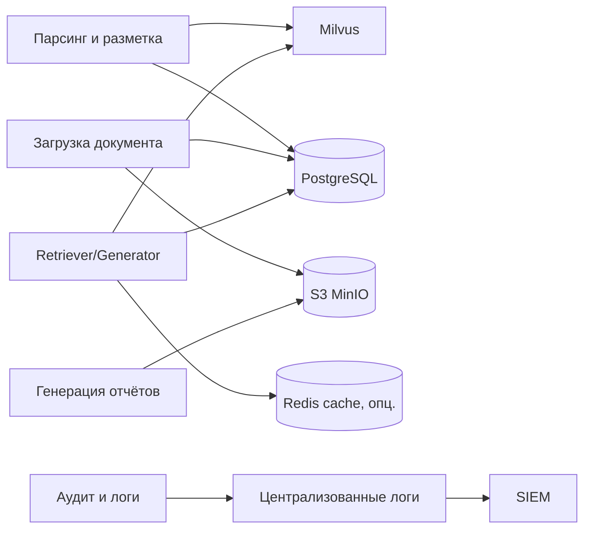

# ПОЯСНИТЕЛЬНАЯ ЗАПИСКА К ТЕХНИЧЕСКОМУ ЗАДАНИЮ

# 3. Подсистема хранения информации

Подраздел описывает архитектуру и обоснование решений по хранению данных в ИС «Фармадок»: 
 - хранение документов и метаданных,
 - хранение векторных представлений для семантического поиска,
 - хранение журналов и аудита,
 а также требования к целостности, доступности, резервному копированию и защите данных.

## 3.0. Глоссарий

- **операционные данные** — учётные записи, карточки объектов, служебные справочники, параметры конфигурации;
- **документное хранилище** — место хранения исходных файлов (DOCX, PDF, изображения, отчёты);
- **векторная база данных** — хранилище эмбеддингов и индексов для семантического поиска;
- **метаданные документа** — идентификатор, тип, версия, источник, атрибуты доступа, сроки хранения;
- **PostgreSQL** — основная реляционная СУБД для операционных данных, метаданных и прикладного аудита;
- **Milvus** — векторная БД для хранения эмбеддингов и выполнения ANN/k-NN поиска в контуре RAG;
- **S3 MinIO** — S3-совместимое объектное хранилище для исходных документов и отчётов;
- **Redis** — in-memory хранилище/кэш для ускорения повторных запросов и короткоживущих данных;
- **TTL** — срок жизни данных (time-to-live);
- **RPO** — допустимая точка потери данных при восстановлении;
- **RTO** — допустимое время восстановления сервиса;
- **шифрование на хранении** — криптографическая защита данных «на диске»;
- **RBAC** — разграничение доступа по ролям.

## 3.1. Обзор подсистемы: проблема, подходы, требования

### 3.1.1. Проблема и требования

ИС «Фармадок» работает с разнородными данными:

1. исходные документы (регуляторные, рабочие, отчётные);
2. структурированные метаданные и настройки;
3. эмбеддинги и индексы для RAG;
4. журналы аудита и события эксплуатации.

Использование одного универсального хранилища для всех типов данных приводит к ухудшению производительности, сложностям с политиками доступа и завышенным эксплуатационным затратам. Требуется разделение контуров хранения по типу нагрузки и характеру данных.

Требования ТЗ, влияющие на подсистему хранения:

- п. 4.1.1 — поддержка векторной БД и семантического поиска, логическое разделение данных;
- п. 4.1.2 — устойчивость работы при росте нагрузки;
- п. 4.1.3 — резервное копирование и восстановление;
- п. 4.1.4 — шифрование, разграничение доступа, журналирование и защита данных.

### 3.1.2. Подходы к реализации

Рассматриваются три базовых подхода:

- **монолитное хранилище** (одна СУБД для всего) — проще старт, но хуже масштабируемость и эксплуатация;
- **гибридная модель** (реляционная БД + документное хранилище + векторная БД + отдельный контур логов) — балансируемость и соответствие характеру данных;
- **полностью управляемые облачные сервисы** — быстрый запуск, но зависимость от провайдера и ограничения по размещению данных.

Для контура Заказчика и требований конфиденциальности приоритетна гибридная модель с развёртыванием в инфраструктуре Заказчика или в доверенном облаке.

## 3.2. Обоснование выбора и состав подсистемы

### 3.2.1. Принятые решения

1. **PostgreSQL** — хранение операционных данных, справочников, метаданных документов и прикладного аудита.
2. **S3 MinIO** — объектное хранилище оригиналов документов, производных артефактов и сформированных отчётов DOCX.
3. **Milvus** — хранение эмбеддингов и векторных индексов для Retriever в контуре RAG.
4. **Отдельный контур логов и аудита** — централизованное логирование и передача критичных событий в SIEM.
5. **Redis (опционально, стадия разработки)** — кэш для ускорения отклика в сценариях повторных чтений и часто запрашиваемых результатов.

Выбор соответствует модульной архитектуре и позволяет независимо масштабировать хранение документов, метаданных и индексов.

### 3.2.2. Логическая схема хранения

## 3.3. Контуры хранения данных

### 3.3.1. Операционные данные и метаданные

В **PostgreSQL** хранятся:

- учётные данные и сервисные сущности приложения;
- метаданные документов (идентификаторы, тип, версия, статусы, права доступа);
- записи прикладного аудита;
- параметры конфигурации, не являющиеся секретами.

Требования к PostgreSQL:

- транзакционность и целостность;
- индексация по часто используемым полям (идентификатор, тип, дата, владелец);
- миграции схемы через контролируемый процесс.

### 3.3.2. Документное хранилище (S3 MinIO)

**S3 MinIO** хранит исходные и производные файлы:

- загруженные DOCX, PDF, изображения;
- промежуточные артефакты обработки (при необходимости);
- итоговые отчёты DOCX.

Требования к MinIO:

- S3-совместимые стабильные URI/идентификаторы объектов;
- версионирование документов (если предусмотрено регламентом);
- контроль доступа к скачиванию через backend и RBAC.

Рекомендуемая сегментация бакетов:
- `farmadoc-source-docs` — загруженные исходные документы;
- `farmadoc-reports` — сформированные отчёты;
- `farmadoc-temp` — временные артефакты обработки с коротким TTL/очисткой.

### 3.3.3. Векторное хранилище (Milvus)

**Milvus** содержит эмбеддинги и индексы, используемые модулем RAG:

- разбиение по логическим классам данных (регламентирующие, рабочие, кэш внешнего поиска);
- хранение метаданных для фильтрации по RBAC;
- поддержка TTL для кэша внешних источников.

Поиск выполняется с учётом прав доступа пользователя; недоступные документы не должны попадать в выдачу Retriever.
В Milvus целесообразно использовать коллекции/партиции по классам данных и предусматривать регулярное обслуживание индексов при росте корпуса.

### 3.3.4. Redis-кэш (опционально на стадии разработки)

На стадии разработки, при необходимости ускорить отклик, допускается подключение **Redis** в качестве дополнительного кэш-слоя.

Рекомендуемые сценарии кэширования:
- результаты часто повторяющихся поисковых запросов на короткий TTL;
- промежуточные данные пайплайна (без хранения персональных/чувствительных данных в открытом виде);
- справочники и read-mostly данные, которые часто читаются приложением.

Ограничения:
- Redis не заменяет PostgreSQL/Milvus/MinIO и не является источником истины;
- все кэш-записи должны иметь TTL и политику инвалидирования;
- чувствительные данные кэшируются только при соблюдении требований ИБ.

### 3.3.5. Хранилище логов и аудита

Логи и платформенные события хранятся в специализированном контуре наблюдаемости (Loki/ELK/аналог) с отдельной политикой ретенции и экспортом критичных событий в SIEM.

## 3.4. Политики данных и жизненный цикл

### 3.4.1. Классификация и сроки хранения

Рекомендуется выделять:

- **операционные данные** — по срокам эксплуатации системы и требованиям регламента;
- **документы экспертизы** — по нормативным срокам Заказчика;
- **кэш внешнего поиска** — краткосрочно (TTL, например 24 часа);
- **операционные логи** — среднесрочно;
- **security-аудит** — дольше операционных логов.

### 3.4.2. Версионирование и неизменяемость

- для документов предусмотреть версионность или журнал изменений;
- для аудита обеспечить неизменяемость записей (append-only подход);
- для критичных действий фиксировать автора, время и результат операции.

### 3.4.3. Удаление и архивирование

Удаление данных выполняется по регламенту и с подтверждением прав доступа. Перед удалением долгоживущих данных допускается архивирование в отдельный контур хранения.

## 3.5. Надёжность и восстановление

### 3.5.1. Резервное копирование

Подсистема должна обеспечивать:

- резервные копии PostgreSQL (полные + инкрементальные по регламенту);
- резервные копии/репликацию бакетов S3 MinIO;
- резервирование конфигурации Milvus и процедур переиндексации;
- для Redis (если используется) — кэш не является критичным для восстановления, допускается восстановление «с нуля»;
- контроль целостности резервных копий.

### 3.5.2. Восстановление после сбоев

Процедуры восстановления должны быть документированы и протестированы:

- восстановление БД из резервной копии;
- восстановление доступа к бакетам S3 MinIO;
- восстановление или перепостроение векторных индексов Milvus (если требуется после аварии);
- перезапуск Redis-кэша (если используется) без потери целостности основных данных.

Целевые значения RPO/RTO определяются требованиями эксплуатации и соответствуют разделу ТЗ о надёжности.

### 3.5.3. Масштабирование

Масштабирование выполняется по контурам:

- реляционная БД — оптимизация запросов, репликация, разделение ролей чтение/запись;
- объектное хранилище MinIO — горизонтальное масштабирование объёма и пропускной способности;
- Milvus — масштабирование под рост корпуса документов и нагрузки поиска;
- Redis (опционально) — масштабирование кэша для снижения latency повторных запросов.

## 3.6. Защита информации в подсистеме хранения

### 3.6.1. Доступ и разграничение прав

- доступ к данным — только через backend/API Gateway;
- RBAC применяется к операциям чтения/записи и к выдаче документов/фрагментов;
- сервисные учётные записи получают минимально необходимые права.

### 3.6.2. Шифрование и ключи

- шифрование каналов связи между компонентами (TLS 1.3);
- шифрование данных на хранении (в соответствии с политикой и нормативами Заказчика);
- хранение ключей и секретов в Vault или корпоративном секрет-менеджере;
- регламент ротации ключевого материала.

### 3.6.3. Маскирование чувствительных данных

Перед передачей в БЯМ и перед индексацией векторных представлений чувствительные данные подлежат маскированию (Presidio или аналог) согласно требованиям ИБ.

## 3.7. Эксплуатационные требования и приёмка

Для приёмки подсистемы хранения подтверждаются:

1. корректная запись и чтение данных по всем контурам хранения;
2. выполнение RBAC-фильтрации при поиске и доступе к документам;
3. работоспособность резервного копирования и тестового восстановления;
4. применение политики хранения и TTL для временных данных;
5. журналирование ключевых операций и доставка критичных событий в SIEM (если входит в объём поставки).

## 3.8. Ограничения и перспектива развития

На стадии прототипирования допустимы упрощения (ограниченная схема архивирования, базовая ретенция, упрощённая репликация). На промышленном этапе рекомендуется:

- формализовать модель данных и матрицу сроков хранения;
- автоматизировать контроль качества данных и проверку резервных копий;
- внедрить регулярные тесты восстановления;
- расширить политику аудита изменений в документных и метаданных.

На этапе разработки допускается включение Redis-кэша как временной оптимизации производительности. Решение о переносе Redis в промышленный контур принимается по результатам нагрузочных испытаний и требований эксплуатации.

---

*Конец документа.*
