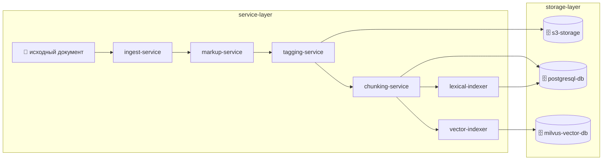
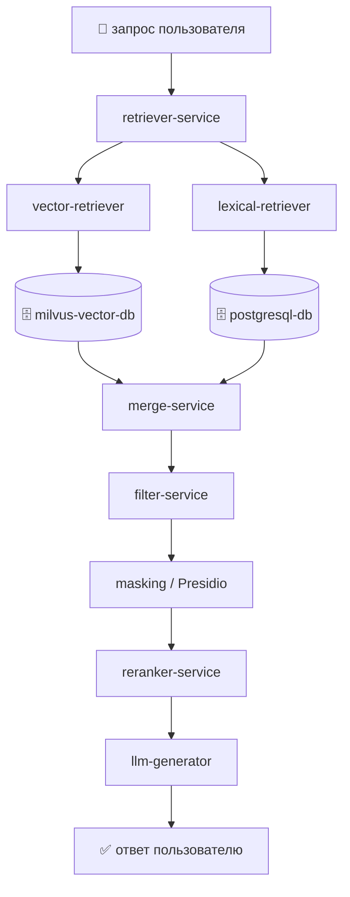
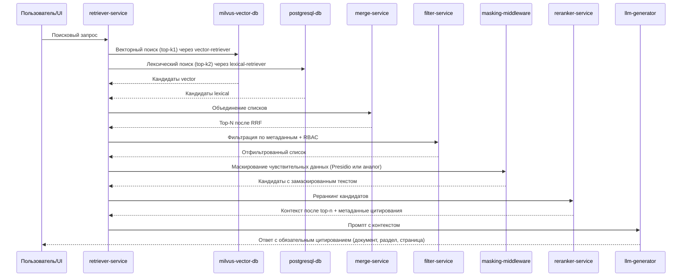

# ПОЯСНИТЕЛЬНАЯ ЗАПИСКА К ТЕХНИЧЕСКОМУ ЗАДАНИЮ

# 10. Подсистема векторного и лексического индексирования

Подраздел описывает назначение, принципы построения и использование двух классов индексов в конвейере интеллектуального поиска и RAG ИС «Фармадок»: векторного (семантический поиск по эмбеддингам) и лексического (поиск по совпадению терминов, в том числе BM25). Настоящий документ углубляет индексирование, хранилища и контур retrieval в составе того же конвейера. Материал дополняет разделы **12** и **14** пояснительной записки к ТЗ (подсистема интеллектуального поиска и гибридный поиск в п. 14.2–14.3) и документ «Описание программного обеспечения» (модуль RAG и подсистема векторной БД).

---

## 10.0. Глоссарий

- **RAG (Retrieval-Augmented Generation)** - подход, при котором генерация ответа выполняется на основе извлечённого из хранилища контекста.
- **Retriever** - компонент поиска и отбора релевантных фрагментов документов.
- **Generator** - компонент генерации итогового ответа на основе контекста (БЯМ).
- **Галлюцинация** - генерация ответа, не подтверждённого источниками из контекста; снижается за счёт RAG и обязательного цитирования.
- **Векторный индекс** - хранилище эмбеддингов фрагментов (блоков) документов и связанных метаданных, поддерживающее поиск ближайших соседей по метрике сходства (косинусное расстояние, скалярное произведение и аналоги).
- **Эмбеддинг** - числовой вектор фиксированной размерности, представляющий смысл текста; получается моделью эмбеддингов при индексации и при запросе.
- **Лексический индекс** - структура данных для поиска по словам и терминам (обратный индекс по токенам); ранжирование часто реализуется статистикой вхождений (например BM25).
- **Гибридный поиск** - совместное использование векторного и лексического каналов с последующим слиянием списков кандидатов (например **RRF** - Reciprocal Rank Fusion) и при необходимости переранжированием (Cross-Encoder).
- **RBAC в индексе** - атрибуты прав доступа к фрагменту или документу, по которым фильтруются результаты при запросе.
- **Markup-сервис (структурирование)** - этап предобработки, который принимает сырые документы и формирует структурированные документы в формате Markdown.
- **Сервис тэгирования структуры** - этап предобработки перед индексированием, который принимает структурированный документ в Markdown и возвращает JSON со списком тэгированных фрагментов (абзацев) и метаданными тэгирования.

---

## 10.1. Назначение, цели и место в архитектуре

Подсистема векторного и лексического индексирования реализуется как два независимых, но согласованных пайплайна:

- **offline-пайплайн подготовки данных** - сбор документов, структурирование, тэгирование, чанкинг и построение индексов;
- **online-пайплайн обработки запроса** - гибридное извлечение, фильтрация, маскирование чувствительных данных, реранкинг и передача контекста в Generator.

Пайплайны развязаны по времени выполнения и нагрузочному профилю: offline-контур работает асинхронно при поступлении/изменении документов, online-контур выполняется синхронно на пользовательский запрос с опорой на уже подготовленные индексы.

**Обоснование RAG по сравнению с альтернативами.** Чистая генерация без извлечения (LLM-only) не гарантирует опору на корпус документов и повышает риск галлюцинаций. Поиск без генерации (retrieval-only) даёт список фрагментов, но не формирует связного ответа на естественном языке. RAG сочетает извлечение релевантного контекста из доверенного корпуса с генерацией ответа по этому контексту, что для «Фармадок» обеспечивает проверяемость за счёт цитирования и согласуется с требованиями к экспертной и регуляторной документации (в том числе согласно п. 4.1.2 ТЗ).

**Оркестрация моделей.** Модели эмбеддингов используются при индексации чанков и при кодировании пользовательского запроса для векторного поиска; большая языковая модель (БЯМ) применяется на этапе Generator для формирования ответа. Разделение ролей и вызовы моделей координирует backend.

Подсистема ориентирована на регуляторные и экспертные процессы ФГБУ «НЦЭСМП» Минздрава России и поддерживает работу с профильной фармацевтической документацией (регистрационные досье, инструкции по медицинскому применению, ПУР, нормативные документы по качеству и сопутствующие материалы). В рамках данного документа подсистема рассматривается как технологическая основа для быстрого и воспроизводимого извлечения релевантного контекста: она не формирует экспертное заключение, а обеспечивает качество входных данных для последующих этапов реранкинга и генерации ответа.

Назначение подсистемы напрямую связано с требованиями ТЗ по безопасности: индексирование и поиск выполняются в контролируемой инфраструктуре Заказчика, с учетом RBAC, шифрования и ограничений на обработку данных в доверенном контуре.

**Ключевые цели подсистемы индексирования:**

- **Точность извлечения (retrieval precision/recall).** Обеспечить устойчивое нахождение релевантных фрагментов как по смыслу, так и по точным лексическим совпадениям (коды, номера, термины) за счет гибридного поиска (векторный + BM25), корректного чанкинга и последующего реранкинга.
- **Трассируемость и цитируемость.** Сохранять в индексе метаданные первоисточников (документ, раздел, страница/фрагмент), чтобы на этапе генерации ответа обеспечивалось обязательное цитирование и проверяемость выводов.
- **Масштабируемость и производительность.** Поддерживать рост объема корпуса и числа пользователей без деградации SLA, включая целевые показатели ТЗ по времени ответа и нагрузке.
- **Безопасность данных.** Обеспечить обработку и хранение артефактов индексирования в рамках требований ИБ (RBAC, шифрование, разделение доступов, контроль источников данных).

Требования ТЗ и критерии приемки (в том числе время ответа, качество поиска, учет прав, шифрование хранения эмбеддингов) согласуются с п. 4.1.1, 4.1.2, 4.2.1 и п. 2.2 ТЗ; детали размещения моделей эмбеддингов и БЯМ — в разделах **12** и **13** пояснительной записки к ТЗ. Хранение артефактов в рамках подсистемы: эмбеддинги - в Milvus; результирующие артефакты этапа тэгирования - в S3 MinIO бакете с привязкой к исходному документу; при необходимости служебная метаинформация - в PostgreSQL.

---

## 10.1.1. Общая архитектура подсистемы индексирования

Подсистема реализует оркестрированную архитектуру из двух независимых контуров, которые связаны через общие хранилища и контракты метаданных.

**Offline-пайплайн подготовки данных** формирует индексный слой:

- `ingest-service` принимает и валидирует входящие документы;
- `markup-service`, `tagging-service` и `chunking-service` подготавливают структурированные фрагменты;
- `vector-indexer` строит векторные представления в `milvus-vector-db`;
- `lexical-indexer` формирует лексический индекс BM25 в `postgresql-db`;
- артефакты тэгирования сохраняются в `s3-storage`.

**Online-пайплайн обработки запроса** использует индексный слой для retrieval:

- `retriever-service` оркестрирует обработку пользовательского запроса;
- `vector-retriever` выполняет семантический поиск по `milvus-vector-db`;
- `lexical-retriever` выполняет BM25-поиск по `postgresql-db`;
- `merge-service` объединяет кандидатов (RRF), далее `filter-service` отсекает по метаданным и RBAC, затем `masking-middleware` маскирует чувствительные данные, `reranker-service` уточняет релевантность;
- итоговый контекст передается в `llm-generator` для ответа с обязательным цитированием первоисточников.

Такое разделение повышает управляемость подсистемы: offline-контур оптимизируется под полноту и качество индексов, online-контур - под время ответа и стабильность SLA.

---

## 10.2. Типы чанкинга для индексирования и обоснование выбора

Чанкинг определяет, какие фрагменты документа станут единицами индексирования, поиска и цитирования. Для ИС "Фармадок" используются следующие типы:

1. **Структурный чанкинг (рекомендуемый базовый).**
  - Деление по логике документа: заголовки, разделы, подпункты, абзацы, таблицы.
  - Источник границ: результат этапов markup и тэгирования.
  - Плюс: высокая интерпретируемость и корректные ссылки на нормативные фрагменты.
2. **Фиксированный чанкинг по длине (символы/токены).**
  - Деление на блоки заданного размера, при необходимости с overlap.
  - Плюс: стабильно по вычислительной стоимости и просто в реализации.
  - Минус: может разрывать логический смысл и ухудшать точность ссылок для нормативных формулировок.
3. **Скользящий чанкинг (sliding window).**
  - Последовательные окна фиксированного размера с перекрытием.
  - Плюс: снижает риск потери контекста на границах.
  - Минус: увеличивает объем индекса и число почти дублирующих фрагментов.
4. **Семантический чанкинг.**
  - Границы формируются по тематическим переходам/сходству предложений.
  - Плюс: более цельные по смыслу фрагменты.
  - Минус: выше вычислительная стоимость, сложнее воспроизводимость границ и аудит.

**Выбор для системы "Фармадок".**

- Основной вариант: **структурный чанкинг**, потому что в системе критичны трассируемость фрагментов, цитирование и проверка на соответствие нормативам.
- Дополнительный механизм: **ограничение максимальной длины чанка** и при необходимости **умеренное перекрытие** для длинных разделов, чтобы сохранить контекст и не выходить за ограничения модели эмбеддингов.
- Для некоторых типов документов допускается fallback на фиксированный/скользящий режим, если структурные границы выделены недостаточно надежно.

---

## 10.3. Процесс подготовки данных (offline pipeline)

### 10.3.1. Диаграмма потоков данных

### 10.3.2. Этап сбора документов (ingest)

**Назначение.** Этап сбора документов выполняется перед markup и обеспечивает контролируемое поступление документов в конвейер подготовки данных.

**Вход этапа.** На вход `ingest-service` поступают исходные сырые документы и метаданные источника (тип документа, версия, источник, служебные атрибуты).

**Выход этапа.** На выходе формируется подготовленный пакет документов для `markup-service`: принятые файлы, результаты первичной валидации и минимальный набор служебных метаданных для дальнейшей трассировки.

---

### 10.3.3. Этап markup (структурирование) перед тэгированием

**Назначение.** До этапа тэгирования выполняется этап markup (структурирование) документа. Этап используется для преобразования сырого документа в унифицированное структурированное представление, пригодное для последующего тэгирования и индексирования.

**Вход этапа.** На вход markup-сервиса подаются сырые документы.

**Выход этапа.** Markup-сервис возвращает структурированные документы в формате Markdown.

---

### 10.3.4. Этап тэгирования структуры перед индексированием

**Назначение.** После этапа markup и до векторного индексирования выполняется этап тэгирования структуры документа. Этап используется для выделения логически осмысленных фрагментов и нормализации признаков, которые затем будут использованы при векторном и лексическом индексировании. Дополнительно этап тэгирования нужен для дальнейшего учета и обработки тэгов фрагментов текста на этапе проверки документов на соответствие нормативам.

**Вход этапа.** На вход сервиса тэгирования подаются структурированные документы в формате Markdown (результат этапа markup).

**Выход этапа.** Сервис возвращает JSON, содержащий:

- список тэгированных фрагментов (абзацев);
- метаданные тэгирования для каждого фрагмента (например тип тега/секции, позиция в документе, уровень структуры, служебные признаки качества разметки).

Результирующие JSON-артефакты этапа тэгирования сохраняются в S3 MinIO бакете с привязкой к исходному документу (например по идентификатору документа и версии).

**Опциональность по типу документа.** Этап тэгирования может быть пропущен для некоторых типов документов. В этом случае в индексацию передаются фрагменты, полученные базовым конвейером парсинга и разметки, без дополнительного тэгирования.

---

### 10.3.5. Этап векторного индексирования

**Идея.** В offline-пайплайне тексты блоков документов преобразуются в эмбеддинги согласованной моделью и сохраняются в векторный индекс. Онлайн-поиск по этим данным выполняется отдельным компонентом `vector-retriever` (см. п. 10.4.2).

**Содержимое записи индекса (логически).** Вектор эмбеддинга; идентификатор документа и фрагмента; метаданные для цитирования (страница, раздел); атрибуты RBAC; при необходимости тип документа (регламентирующие/рабочие/кэш внешнего поиска — по классификации в описании программного обеспечения ИС, подсистема векторной БД); при необходимости - заголовки структуры.

Хранение векторных представлений выполняется в Milvus. При необходимости метаинформация об индексировании и связях между артефактами хранится в PostgreSQL.

**Особенности для фармдомена.** Семантический поиск хорошо покрывает формулировки "по смыслу" и синонимы; может быть менее точным для редких кодов и точных строковых совпадений без донастройки - отсюда оправдан лексический канал в гибриде.

---

### 10.3.6. Этап лексического индексирования

**Идея.** В offline-пайплайне документы представляются как наборы лексических единиц (токены после нормализации: регистр, стемминг или лемматизация - по решению реализации) и строится обратный индекс: термин -> список документов или фрагментов, где термин встречается (с позициями или частотами). Онлайн-доступ к индексу выполняет `lexical-retriever` (см. п. 10.4.2).

**Ранжирование.** Типично используется BM25: учитываются частота термина в фрагменте, обратная частота по корпусу, длина текста. Это дает сильные результаты при точном совпадении идентификаторов: коды АТХ, МНН, регистрационные номера, артикулы, точные названия из регламентов (см. п. **14.3** пояснительной записки к ТЗ — гибридный поиск).

**"При необходимости".** Лексический индекс может не строиться на самых ранних итерациях, если достаточно чисто векторного поиска; для целевого качества на смешанных запросах рекомендуется гибрид (п. 10.4.2).

## 10.4. Процесс обработки запроса (online pipeline)

### 10.4.1. Диаграмма потоков данных

### 10.4.2. Последовательность обработки запроса

### 10.4.3. Этап поиска

1. После этапов markup и тэгирования (если тэгирование включено для типа документа) независимо выполняются: векторный поиск (топ-k1) и лексический поиск (топ-k2) с теми же ограничениями RBAC (и фильтрами по типу документов, если заданы).
2. Списки объединяются алгоритмом вроде RRF: позиции в ранжированных списках преобразуются в общий скор без обязательной калибровки весов двух модальностей.
3. Формируется промежуточный список кандидатов (топ-N) для последующей передачи на этап фильтрации по метаданным.

Реализация поиска на данном этапе выполняется двумя специализированными компонентами:

- `vector-retriever` - выполняет семантический поиск по `milvus-vector-db` и возвращает топ-k1 кандидатов;
- `lexical-retriever` - выполняет лексический BM25-поиск по `postgresql-db` и возвращает топ-k2 кандидатов.

На этапе поиска выполняется проверка RBAC: в выборку кандидатов попадают только документы и фрагменты, доступные пользователю в соответствии с его ролями и политиками доступа. **Документы и фрагменты, недоступные пользователю по правам, не передаются в Generator** — исключение выполняется на этапах поиска и фильтрации до формирования промпта для БЯМ.

Такой конвейер зафиксирован в пояснительной записке к ТЗ (п. **14.2–14.3** — этапы конвейера и гибридный поиск) и в описании программного обеспечения (модуль RAG, Retriever).

---

### 10.4.4. Этап фильтрации по метаданным

Этап выполняется после базового поиска и до маскирования и реранкинга для исключения нерелевантных кандидатов по атрибутам документа и контекста запроса.

1. На вход поступает промежуточный список кандидатов (топ-N) с этапа поиска.
2. Применяются фильтры по метаданным (например тип документа, источник, версия/актуальность, дата, раздел, язык, служебные тэги, ограничения видимости).
3. На выходе формируется отфильтрованный список кандидатов для этапа маскирования и последующего реранкинга.

Фильтрация по метаданным используется совместно с RBAC и позволяет уменьшить шум до более затратных этапов маскирования и реранкинга.

---

### 10.4.5. Этап маскирования чувствительных данных

Этап выполняется сразу после фильтрации по метаданным и RBAC и до реранкинга.

**Тексты фрагментов-кандидатов** (и при необходимости фрагменты пользовательского запроса) проходят сокрытие персональных и иных чувствительных данных в соответствии с политикой ИБ (Presidio или функционально эквивалентные средства). Это снижает риск утечки чувствительных сведений в реранкер, логи и промпт БЯМ. Реранкер оперирует уже замаскированными формулировками; калибровка качества реранкинга на таких текстах выполняется на техническом проектировании.

---

### 10.4.6. Этап реранкинга

Этап реранкинга выполняется после маскирования и до передачи контекста в Generator.

**Назначение реранкинга:** повысить релевантность итогового контекста; снизить шум в списке кандидатов после гибридного поиска; стабилизировать качество при росте объёма корпуса.

**Цепочка параметров:** на этапах векторного и лексического извлечения задаются **top-k** (k1, k2) для широкого набора кандидатов; после слияния (RRF) и фильтрации список сужается; после маскирования реранкер формирует упорядоченный **top-n** фрагментов для передачи в Generator. Значения **k** и **n** подбираются на техническом проектировании и нагрузочных испытаниях, синхронизируются с п. 4.1.2 ТЗ и целевыми SLA.

1. На вход поступает ограниченный список кандидатов после этапа маскирования (топ-N после RRF, отсева по метаданным и сокрытия чувствительных данных в текстах).
2. Кандидаты переоцениваются более точной и более «тяжёлой» моделью (например Cross-Encoder), чтобы уточнить порядок релевантности.
3. По результатам формируется финальный упорядоченный список (**top-n**), который передаётся в Generator для формирования ответа и цитирования источников.

Реранкинг применяется при необходимости и балансируется с требованиями по времени ответа (п. 4.1.2 ТЗ).

---

### 10.4.7. Этап формирования окончательного ответа для пользователя

Этап выполняется после реранкинга и завершает конвейер обработки пользовательского запроса. Формирование ответа проводится с помощью LLM (Generator). Маскирование чувствительных данных уже выполнено на этапе п. 10.4.5.

1. На вход Generator поступает упорядоченный список фрагментов и метаданные цитирования после реранкинга (тексты фрагментов — в замаскированном виде, пригодном для промпта БЯМ).
2. Generator формирует итоговый ответ на основе этого контекста, с учётом ограничений доступа и требований к качеству.
3. В ответ обязательно включаются ссылки на первоисточники (цитирование: документ, раздел и страница при наличии).
4. Ответ приводится к формату, пригодному для отображения в пользовательском интерфейсе.

**Контроль качества ответа (сжато):** пороги релевантности и политика отказа в ответе при недостаточной уверенности или отсутствии опоры на источники; запрет выдачи утверждений без ссылки на фрагмент корпуса, где это требуется регламентом; при постобработке — диагностические показатели (число кандидатов до/после реранкинга, наличие цитирования) — по требованиям к качеству ответа подсистемы RAG.

При необходимости на этапе выполняются постобработка и валидация качества ответа перед возвратом пользователю.

---

### 10.4.8. Операционные метрики, безопасность и эксплуатация

Для сопровождения online-контура целесообразно собирать **операционные метрики** по этапам: задержка retrieval (векторный и лексический каналы), merge/RRF, фильтрация, маскирование, реранкинг, генерация; агрегаты по числу кандидатов на каждом шаге; доля ответов с цитированием. Отказы доступа и попытки обращения к недоступным документам подлежат учёту в рамках подсистемы аудита (см. `1_2_subsystem_audit.md`). Секреты (ключи API, строки подключения к индексам) хранятся в защищённом хранилище секретов согласно политике развёртывания.

---

### 10.4.9. Приёмка и ограничения (связь с подсистемой RAG)

Критерии приёмки подсистемы RAG, сценарии тестирования и ограничения (область применения, границы ответственности компонентов) задаются ТЗ и согласуются с техническим проектом. В контексте настоящего документа критично: соответствие целевым показателям извлечения и времени ответа (п. 4.1.2 ТЗ); корректная работа RBAC на пути к Generator; воспроизводимость цитирования; согласованность индексов с актуальным корпусом после обновлений (п. 10.5).

---

## 10.5. Обновление индексов и согласованность

При добавлении, изменении или удалении документа необходимо обновить или удалить соответствующие записи markdown-представления (результат markup), тэгированного представления (если этап тэгирования включен для данного типа), векторного и (если используется) лексического индексов, чтобы поиск и цитирование в ответах соответствовали актуальному корпусу. При необходимости должно быть обеспечено автоматическое переиндексирование документа при его изменении, включая повторное переразбиение на фрагменты и пересчет связанных представлений. Порядок индексации (полная переиндексация или инкрементальные обновления) определяется на этапе технического проектирования или разработки с учетом объема данных и п. 4.1.2 ТЗ.

### 10.1.2.1. Сводный список сервисов

| Имя                 | Сервис/компонент                    | Роль в подсистеме                                                           | Основные входы                                             | Основные выходы                                    | Этап конвейера                      |
| ------------------- | ----------------------------------- | --------------------------------------------------------------------------- | ---------------------------------------------------------- | -------------------------------------------------- | ----------------------------------- |
| `ingest-service`    | Сервис сбора документов             | Прием, первичная валидация и маршрутизация документов в конвейер подготовки | Источники документов, файлы загрузки, метаданные источника | Подготовленный пакет документов для markup-service | Этап 1: подготовка и индексирование |
| `markup-service`    | Markup-сервис                       | Преобразование сырого документа в структурированный Markdown                | Сырые документы (PDF/DOCX/HTML и аналоги)                  | Структурированный документ (Markdown)              | Этап 1: подготовка и индексирование |
| `tagging-service`   | Сервис тэгирования структуры        | Выделение логических фрагментов и структурных метаданных                    | Markdown от Markup-сервиса                                 | JSON со списком фрагментов и метаданными           | Этап 1: подготовка и индексирование |
| `chunking-service`  | Chunking-компонент                  | Формирование единиц индексирования и цитирования                            | Markdown и/или тэгированный JSON                           | Набор чанков с привязкой к источнику               | Этап 1: подготовка и индексирование |
| `vector-indexer`    | Сервис векторного индексирования    | Векторизация чанков и построение векторного индекса                         | Чанки документов                                           | Эмбеддинги и записи индекса                        | Этап 1: подготовка и индексирование |
| `lexical-indexer`   | Лексический индексатор (BM25)       | Построение и обслуживание лексического индекса                              | Чанки/тексты документов                                    | Лексический индекс BM25                            | Этап 1: подготовка и индексирование |
| `vector-retriever`  | Компонент семантического извлечения | Поиск релевантных фрагментов в векторном индексе                            | Текст запроса, параметры top-k                             | Топ-k1 векторных кандидатов                        | Этап 2: гибридное извлечение        |
| `lexical-retriever` | Компонент лексического извлечения   | Поиск релевантных фрагментов в лексическом индексе BM25                     | Текст запроса, параметры top-k                             | Топ-k2 лексических кандидатов                      | Этап 2: гибридное извлечение        |
| `merge-service`     | RRF Merge                           | Слияние ранжированных списков vector/BM25                                   | Списки кандидатов двух каналов                             | Объединенный топ-N список                          | Этап 2: гибридное извлечение        |
| `filter-service`    | Metadata + RBAC Filter              | Отсев по метаданным, ролям и ограничениям доступа                           | Топ-N после RRF, атрибуты доступа                          | Отфильтрованный список кандидатов                  | Этап 3: пост-поисковая обработка    |
| `masking-middleware`| Маскирование (Presidio/аналог)       | Сокрытие чувствительных данных в текстах фрагментов до реранкинга и БЯМ    | Список кандидатов после фильтрации                         | Список с замаскированными текстами               | Этап 3: пост-поисковая обработка    |
| `reranker-service`  | Реранкер (Cross-Encoder)            | Уточнение порядка релевантности (top-k → top-n)                             | Кандидаты после маскирования                               | Упорядоченный контекст для БЯМ                     | Этап 3: пост-поисковая обработка    |
| `retriever-service` | Retriever API (оркестратор)         | Управление online-конвейером retrieval                                      | Пользовательский запрос, параметры поиска                  | Финальный контекст + метаданные цитирования        | Этап 2-3                            |
| `llm-generator`     | Generator LLM (смежный модуль)      | Формирование ответа по проверенному контексту                               | Контекст после реранкинга, метаданные источников           | Ответ с обязательным цитированием                  | Этап 4: генерация ответа            |

### 10.1.2.2. Сводный список хранилищ (БД и объектное хранилище)

| Имя                | Хранилище             | Назначение                                                                         | Основные входы                                                                  | Основные выходы                                                            | Контур использования                                          |
| ------------------ | --------------------- | ---------------------------------------------------------------------------------- | ------------------------------------------------------------------------------- | -------------------------------------------------------------------------- | ------------------------------------------------------------- |
| `milvus-vector-db` | Milvus (векторная БД) | Хранение и поиск по векторному индексу                                             | Эмбеддинги и метаданные                                                         | Топ-k векторных кандидатов                                                 | Этап 1 (хранение), Этап 2 (поиск)                             |
| `postgresql-db`    | PostgreSQL            | Хранение служебной метаинформации, связей артефактов и лексического индекса (BM25) | Метаданные процессов индексирования, нормализованные токены/индексные структуры | Служебные записи для трассировки и связности, топ-k лексических кандидатов | Инфраструктурное хранилище, Этап 1 (хранение), Этап 2 (поиск) |
| `s3-storage`       | S3 MinIO              | Хранение JSON-артефактов тэгирования                                               | JSON от сервиса тэгирования                                                     | Доступные артефакты тэгирования                                            | Инфраструктурное хранилище                                    |

---

Документ вводит обоснование подсистемы векторного и лексического индексирования для включения в структуру пояснительных материалов к ТЗ и детализирует индексы, хранилища и контур retrieval. Перекрёстные ссылки в других файлах при необходимости добавляются отдельно.