# ПОЯСНИТЕЛЬНАЯ ЗАПИСКА К ТЕХНИЧЕСКОМУ ЗАДАНИЮ

# 4. Подсистема интеллектуального поиска и RAG

Подраздел описывает архитектуру и обоснование выбора подсистемы интеллектуального поиска документов на основе подхода RAG (Retrieval-Augmented Generation): извлечение релевантного контекста из локального корпуса документов и формирование ответа с обязательным цитированием источников.

## 4.0. Глоссарий

- **RAG** — подход, при котором генерация ответа выполняется на основе извлечённого из хранилища контекста;
- **Retriever** — компонент поиска и отбора релевантных фрагментов документов;
- **Generator** — компонент генерации итогового ответа на основе контекста;
- **эмбеддинг** — векторное представление текста для семантического поиска;
- **гибридный поиск** — сочетание лексического поиска (BM25 и аналоги) и векторного поиска;
- **RRF** — алгоритм объединения ранжированных списков результатов (Reciprocal Rank Fusion);
- **переранжирование** — уточнение порядка кандидатов (например, Cross-Encoder);
- **RBAC-фильтрация** — применение ограничений доступа при извлечении контекста;
- **галлюцинация** — генерация ответа, не подтверждённого источниками из контекста.

## 4.1. Обзор подсистемы: проблема, подходы, требования

### 4.1.1. Проблема и требования

В предметной области ИС «Фармадок» требуется быстрый и обоснованный поиск по большому корпусу документов с высокой точностью и воспроизводимостью результатов. Использование только генеративной модели без опоры на локальные источники создаёт риски галлюцинаций и не обеспечивает проверяемость ответа.

Требования ТЗ, которые реализует подсистема RAG:

- п. 4.1.1 — семантический поиск в локальном хранилище, учёт прав доступа, логирование событий;
- п. 4.1.2 — приемлемое время отклика и масштабируемость;
- п. 4.1.4 — защита данных, маскирование чувствительной информации, работа в доверенном контуре.

### 4.1.2. Подходы к реализации

Рассматриваются три варианта:

1. **Только генерация (LLM-only)** — быстрый старт, но низкая проверяемость и риски ошибок.
2. **Только поиск (retrieval-only)** — высокая проверяемость, но слабая итоговая аналитика ответа.
3. **RAG (retrieval + generation)** — компромисс: фактическая база из локальных документов и удобный ответ с цитированием.

Для ИС «Фармадок» принят третий вариант, так как он сочетает качество, проверяемость и соответствие требованиям к безопасности.

## 4.2. Обоснование выбора и состав подсистемы

### 4.2.1. Принятые решения

1. **Retriever** извлекает кандидатов из векторной БД с учётом RBAC.
2. **Гибридный поиск** (векторный + лексический) используется для повышения полноты и точности.
3. **Generator** формирует ответ только на основе отобранного контекста.
4. **Цитирование источников** в ответе является обязательным.
5. **Локальное/доверенное размещение моделей** предотвращает передачу данных третьим лицам без согласия.

### 4.2.2. Логическая схема RAG-конвейера

```mermaid
flowchart LR
  Query[Запрос пользователя] --> ACL[Проверка контекста доступа]
  ACL --> Embed[Эмбеддинг запроса]
  Embed --> Retrieve[Извлечение кандидатов]
  Retrieve --> Hybrid[Гибридный поиск / RRF]
  Hybrid --> Rerank[Переранжирование]
  Rerank --> Context[Контекст]
  Context --> Mask[Маскирование чувствительных данных]
  Mask --> Generate[Generator]
  Generate --> Answer[Ответ с цитированием]
```

## 4.3. Конвейер интеллектуального поиска

### 4.3.1. Подготовка данных и индексирование

Документы проходят парсинг и разметку на логические блоки. Для блоков формируются эмбеддинги и метаданные (тип документа, источник, атрибуты доступа, служебные теги). Эмбеддинги записываются в векторное хранилище, а метаданные используются для фильтрации и трассировки источников.

### 4.3.2. Извлечение контекста (Retriever)

Retriever выполняет:

- векторный поиск по эмбеддингу запроса;
- при включённом гибридном режиме — лексический поиск;
- объединение списков кандидатов и отбор релевантных фрагментов;
- RBAC-фильтрацию перед возвратом контекста.

Недоступные пользователю документы исключаются до передачи данных в Generator.

### 4.3.3. Реранкинг (уточнение релевантности)

После первичного извлечения кандидатов применяется этап реранкинга для повышения точности контекста перед генерацией ответа.

Назначение реранкинга:

- повысить долю действительно релевантных фрагментов в итоговом контексте;
- снизить попадание нерелевантных фрагментов при широком поиске;
- стабилизировать качество ответа при росте корпуса документов.

Типовой порядок:

1. Retriever формирует расширенный список кандидатов (top-k retrieval).
2. Реранкер (например, Cross-Encoder или эквивалент) оценивает пары «запрос–фрагмент».
3. Формируется сокращённый список top-n для передачи в Generator.

Параметры `k` и `n` подбираются на этапе технического проектирования и нагрузочных испытаний как баланс между качеством и временем отклика.

### 4.3.4. Генерация ответа (Generator)

Generator получает только разрешённый контекст и формирует ответ:

- с опорой на найденные фрагменты;
- с явным цитированием источников;
- с контролем формата ответа под задачи эксперта.

Перед передачей контекста в БЯМ выполняется маскирование чувствительных данных согласно политике ИБ.

### 4.3.5. Контроль качества ответа

Для повышения качества применяются:

- пороги релевантности кандидатов;
- переранжирование (при необходимости);
- запрет «ответа без источника»;
- регистрация диагностических метрик (latency, число кандидатов, доля ответов с цитированием).

## 4.4. Технологические решения подсистемы

### 4.4.1. Поиск и хранение

- векторное хранилище — по выбранному стеку проекта (например Milvus);
- хранение метаданных и служебных сущностей — реляционная БД;
- документное хранилище — S3-совместимое (например MinIO).

### 4.4.2. Большая языковая модель (Generator)

Генератор ответов в модуле RAG (п. 4.1.1 ТЗ) использует большую языковую модель для формирования ответов на основе контекста, полученного от Retriever и агентов. Модель должна размещаться **локально на серверах организации** Заказчика или в **доверенном частном облаке**, граница которого определена и контролируется Заказчиком. В документе «Описание архитектуры» (раздел 7.3) в качестве допустимых вариантов указаны локально развёрнутые модели (например, Mistral, Llama 3, GigaChat, YandexGPT) или развёртывание в доверенном облаке. Критерий — нахождение модели в доверенном контуре: данные запросов и документов не передаются за его пределы. Перед передачей в БЯМ персональные и чувствительные данные маскируются (Presidio, п. 4.1.4 ТЗ), что дополнительно снижает риски при обработке.

### 4.4.3. Модели эмбеддингов

Модели эмбеддингов используются для преобразования текста документов и запросов в векторные представления при индексации и при семантическом поиске (Retriever, п. 4.1.1 ТЗ). В ТЗ указано хранение эмбеддингов «OpenAI Embeddings или аналог» с шифрованием (п. 4.2.1); в Architecture (раздел 7.3) допускаются самохостируемые модели (OpenAI Embeddings при развёртывании у Заказчика) или эквиваленты (E5, BGE, ruBERT). Модели эмбеддингов также размещаются локально или в доверенном облаке, чтобы тексты документов и запросов не покидали контролируемую инфраструктуру при построении векторов и при поиске.

### 4.4.4. Оркестрация и параметры конвейера

- модель эмбеддингов применяется на этапах индексации и кодирования поискового запроса;
- БЯМ применяется на этапе генерации ответа по отобранному контексту;
- оркестрация шагов конвейера выполняется на backend-сервисах.

Конкретные модели и параметры (размеры контекста, top-k, пороги реранкинга) уточняются на этапе технического проектирования и при нагрузочном тестировании.

## 4.5. Безопасность и соответствие требованиям

### 4.5.1. Конфиденциальность

- работа в локальном контуре или доверенном облаке;
- маскирование чувствительных данных перед генерацией;
- отсутствие передачи данных во внешние сервисы без явного согласия.

### 4.5.2. Контроль доступа

- RBAC применяется на этапе извлечения контекста;
- аудит отказов доступа и критичных операций ведётся централизованно;
- сервисные токены и ключи хранятся в защищённом хранилище секретов.

## 4.6. Производительность, надёжность и эксплуатация

### 4.6.1. Производительность

Требуется обеспечение целевого времени получения ответа в пределах критериев ТЗ. Оптимизация достигается настройкой top-k, гибридного поиска, переранжирования на ограниченном множестве кандидатов и профилированием узких мест.

### 4.6.2. Надёжность

Подсистема должна поддерживать:

- устойчивую работу при росте нагрузки;
- восстановление после сбоев компонентов хранения;
- контролируемое обновление индексов и моделей.

### 4.6.3. Эксплуатационные метрики

Рекомендуется контролировать:

- латентность этапов конвейера (retrieval, rerank, generation);
- долю ошибок по этапам;
- долю ответов с валидным цитированием;
- нагрузку на векторное хранилище и модель генерации.

## 4.7. Требования к приёмке подсистемы RAG

Для приёмки подтверждаются:

1. корректный поиск и выдача релевантных фрагментов с учётом RBAC;
2. формирование ответа с обязательными ссылками на источники;
3. соответствие целевым показателям времени ответа на тестовом контуре;
4. отсутствие утечки чувствительных данных за доверенный контур;
5. наличие журналов и метрик, достаточных для диагностики.

## 4.8. Ограничения и перспектива развития

На стадии прототипирования допустимы упрощения (ограниченный набор моделей, упрощённые правила переранжирования, базовый контроль качества). На промышленном этапе рекомендуется:

- расширять гибридный поиск и словари доменных терминов;
- вводить A/B-проверку параметров retrieval/generation;
- развивать автоматические проверки качества ответов;
- формализовать SLO/SLI для конвейера RAG.

---

*Конец документа.*
