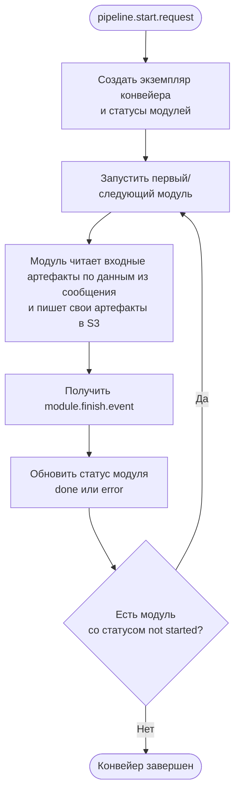
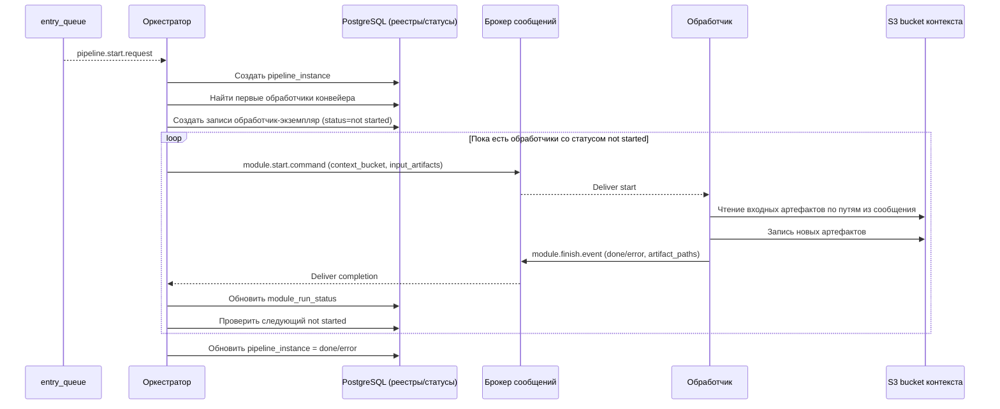

# ПОЯСНИТЕЛЬНАЯ ЗАПИСКА К ТЕХНИЧЕСКОМУ ЗАДАНИЮ

# 5. Подсистема модульной архитектуры пайплайнов обработки информации

Подраздел описывает принципы **модульного построения пайплайнов обработки информации** в ИС «Фармадок»: центральный **оркестратор** и **подключаемые модули**, составляющие цепочки (графы) этапов обработки. Материал задаёт архитектурные рамки; конкретные имена сервисов, форматы контрактов и каталог модулей уточняются на этапе технического проектирования или разработки и согласуются с документами по смежным подсистемам (хранение — `1_3_subsystem_storage.md`, аудит и наблюдаемость — `1_2_subsystem_audit.md`, аутентификация — `1_1_subsystem_auth.md`, контур ИИ и RAG — `1_4_subsystem_AI.md`).

---

## 5.0. Глоссарий

- **Пайплайн обработки информации** — упорядоченная (в общем случае — ориентированная) последовательность этапов преобразования входных данных в выходные артефакты или решения.
- **Оркестратор пайплайна** — компонент, который выбирает сценарий (описание пайплайна), создаёт контекст выполнения, вызывает модули в заданном порядке, обрабатывает ошибки, фиксирует состояние и метаданные прогона.
- **Подключаемый модуль (плагин этапа)** — изолированная реализация одного логического этапа пайплайна с фиксированным контрактом входа/выхода и объявленными зависимостями; подключается к системе без изменения ядра оркестратора.
- **Контракт модуля** — соглашение о формате входных и выходных данных, кодах ошибок, требованиях к идемпотентности и к метаданным (версия модуля, идентификатор этапа).
- **Реестр модулей** — каталог доступных модулей, их версий, возможностей и политик использования; служит источником истины для оркестратора при сборке пайплайна.
- **Контекст выполнения** — передаваемое между этапами состояние: входные параметры сценария, промежуточные артефакты, идентификаторы для трассировки, атрибуты RBAC.
- **Сценарий (описание пайплайна)** — декларативное или конфигурируемое описание графа этапов (какие модули в каком порядке и при каких условиях вызываются).

---

## 5.1. Назначение и обоснование подхода

### 5.1.1. Проблема

Жёстко зашитая в одном сервисе логика многоэтапной обработки затрудняет эволюцию: добавление этапа требует правок ядра, усложняет тестирование и повторное использование этапов в разных сценариях. Для ИС «Фармадок» типичны цепочки с разными комбинациями шагов (нормализация, разметка, извлечение признаков, вызов моделей, формирование отчётов и т.п.) — их целесообразно строить из **переиспользуемых модулей** под управлением **единого оркестратора**.

### 5.1.2. Решение: оркестратор и подключаемые модули

Архитектура строится из двух уровней:

1. **Оркестратор** — отвечает за выбор сценария, жизненный цикл прогона, вызов модулей, политику повторов, таймауты, фиксацию аудита и связь с внешними API (в т.ч. через единую точку входа).
2. **Подключаемые модули** — реализуют отдельные этапы; регистрируются в реестре; не содержат знания о полном графе пайплайна, только о своём контракте и заявленных зависимостях.

Такое разделение соответствует модульности, заявленной в архитектурных принципах пояснительной записки к ТЗ, и облегчает независимое развитие этапов при сохранении согласованности контрактов.

---

## 5.2. Архитектура: оркестратор, модули, реестр

### 5.2.1. Функции оркестратора

- разбор сценария пайплайна (статический конфиг, БД, API управления сценариями — по решению проекта);
- проверка доступности и совместимости версий модулей из реестра;
- создание и наполнение **контекста выполнения**; передача выхода одного этапа на вход следующего (или ветвление при условных переходах);
- применение политик: таймауты, ограничение параллелизма, повторные попытки для отдельных классов ошибок;
- интеграция с **RBAC** (разрешение на запуск сценария и на использование отдельных модулей);
- журналирование этапов, ошибок и идентификаторов прогона для аудита и расследований;
- при необходимости — постановка длительных прогонов в очередь и асинхронное завершение.

### 5.2.2. Требования к подключаемым модулям

- явный **идентификатор** и **версия**; совместимость версий контракта фиксируется в реестре;
- реализация контракта входа/выхода; документированные побочные эффекты (запись в хранилища, вызовы внешних API);
- отсутствие обхода политик доступа: модуль получает принципала/ограничения из контекста, а не дублирует авторизацию произвольно;
- устойчивость к повторному вызову (**идемпотентность**) там, где оркестратор допускает повтор этапа;
- ограничение области ответственности: один модуль — один смысловой этап (упрощение тестирования и замены реализации).

### 5.2.3. Реестр конвейеров

Реестр конвейеров хранится в таблице PostgreSQL **`pipeline_registry`**: в ней перечислены именованные типы конвейеров, доступные для запуска оркестратором. Процедура регистрации конвейера состоит из занесения в `pipeline_registry` его идентификационных и конфигурационных сведений. Оркестратор создает экземпляр конвейера только для типов, присутствующих в этой таблице и имеющих активный статус.
Рекомендуемый набор полей таблицы `pipeline_registry` приведен в п. `5.4.3`.

### 5.2.4. Реестр модулей

Реестр модулей — специальная таблица PostgreSQL, в которой хранятся зарегистрированные обработчики как самостоятельные сущности. Для нормализации структуры данных привязка модулей к конвейерам хранится не в `module_registry`, а в отдельной таблице связи `pipeline_module_link` (отношение многие-ко-многим между `pipeline_registry` и `module_registry`). Оркестратор не запускает незарегистрированные или неактивные модули.

При запуске экземпляра конвейера оркестратор выбирает обработчики через связку `pipeline_registry -> pipeline_module_link -> module_registry` и определяет стартовые обработчики.
Рекомендуемые наборы полей таблиц `module_registry` и `pipeline_module_link` приведены в п. `5.4.3`.

### 5.2.5. Экземпляры конвейеров (`pipeline_instance`)

Таблица `pipeline_instance` хранит общие сведения о каждом запущенном экземпляре конвейера и используется как родительская сущность для записей статусов модулей в `module_run_status`.
Рекомендуемый набор полей таблицы `pipeline_instance` приведен в п. `5.4.3`.

### 5.2.6. Статусы выполнения модулей (`module_run_status`)

Таблица `module_run_status` хранит состояние выполнения обработчиков в рамках конкретного экземпляра конвейера: по одной записи на каждую пару «обработчик - экземпляр конвейера». Начальный статус записи — `not started`; после завершения обработки оркестратор обновляет запись на `done` или `error` (в зависимости от кода завершения, переданного обработчиком).
Рекомендуемый набор полей таблицы `module_run_status` приведен в п. `5.4.3`.

### 5.2.7. Логическая схема

```mermaid
flowchart TB
  QIN[entry_queue] --> ORCH[pipeline-orchestrator]

  subgraph REG[Реестры (PostgreSQL)]
    PR[(pipeline_registry)]
    PML[(pipeline_module_link)]
    MR[(module_registry)]
  end

  ORCH --> PR
  ORCH --> PML
  ORCH --> MR

  subgraph RUN[Выполнение]
    PI[(pipeline_instance)]
    MRS[(module_run_status)]
    MODS[Подключаемые модули]
    S3[(S3 context bucket)]
  end

  ORCH --> PI
  ORCH --> MRS
  ORCH --> MODS
  MODS --> S3
  MODS --> ORCH

  ORCH --> OUT[Результат конвейера]
```

На практике модули могут выполняться в отдельных процессах или контейнерах; оркестратор вызывает их через согласованный механизм (очередь сообщений).

---

## 5.3. Описание пайплайна и поток данных

- Все бизнес-процессы обработки информации в ИС «Фармадок» представляют собой **именованные конвейеры** (процессы, пайплайны); перечень конвейеров ведется в таблице `pipeline_registry` (PostgreSQL).
- **Сценарий** задаёт граф этапов: линейный порядок, параллельные ветки, условные переходы по результату модуля или по метаданным контекста.
- **Контекст выполнения** содержит идентификатор прогона, ссылку на сценарий, входные параметры, накопленные результаты этапов, метки времени; объём и формат сериализации определяются на этапе технического проектирования или разработки.
- **Артефакты большого объёма** (файлы, векторные индексы) в контексте передаются по **ссылкам** на хранилища (см. `1_3_subsystem_storage.md`), а не целиком в теле сообщений между этапами.

### 5.3.1. Механизм запуска обработчиков и обмен сообщениями

Оркестратор создает экземпляр конвейера после получения сообщения с именем типа конвейера из специальной очереди брокера сообщений. После создания экземпляра оркестратор определяет в таблице реестра обработчики, которые должны выполняться первыми, и отправляет им через канал брокера сообщений специальное сообщение о старте.

Стартовое сообщение содержит:

- идентификатор экземпляра конвейера;
- имя конвейера и имя обработчика;
- путь к бакету S3 (или префиксу в бакете), где обработчик сохраняет артефакты своей работы;
- **перечень входных артефактов**, уже созданных в этом бакете другими модулями данного экземпляра конвейера (пути в S3 и, при необходимости, имя модуля-источника — см. п. 5.4.1, поле `input_artifacts`).

**Использование артефактов предшественников.** Модуль опирается на сведения, переданные оркестратором в стартовом сообщении: по указанным путям он читает в общем контекстном бакете объекты, созданные ранее другими обработчиками (без самостоятельного «угадывания» структуры каталога, если иное не оговорено контрактом модуля). Модуль не обязан загружать все перечисленные артефакты — он использует те из них, которые нужны его логике.

После получения стартового сообщения обработчик выполняет свою работу и отправляет оркестратору сообщение о завершении с кодом завершения (например: `done`, `error` и иные статусы по регламенту проекта). В этом же сообщении обработчик указывает имена (пути) всех файлов-артефактов, созданных им в процессе работы в выделенном бакете S3.

Оркестратор, получив сообщение о завершении, проставляет статус `done` в записи пары «модуль - экземпляр конвейера» (для успешного завершения), затем в таблице связей находит модуль, который должен запускаться следующим, и отправляет ему стартовое сообщение. В стартовом сообщении следующему модулю передаются название бакета контекста и сводный список артефактов, полученных в результате работы предыдущих модулей данного экземпляра конвейера.

Данный цикл повторяется, пока для экземпляра конвейера существуют следующие обработчики со статусом `not started`. Если таких обработчиков не остается, работа конвейера считается завершенной. После завершения конвейера оркестратор имеет право удалить временный бакет с контекстом в соответствии с политикой хранения и регламентом эксплуатации.

### 5.3.2. Диаграмма потока выполнения конвейера



### 5.3.3. Диаграмма последовательности обмена сообщениями



---

## 5.4. Рекомендуемые контракты, политики и форматы

### 5.4.1. Рекомендуемые форматы сообщений в брокере

Ниже приведены рекомендуемые форматы сообщений (JSON) для взаимодействия оркестратора и модулей через брокер. Конкретные имена топиков/очередей и строгая схема валидации (JSON Schema/Avro/Protobuf) фиксируются на этапе технического проектирования или разработки.

**1) Сообщение на создание экземпляра конвейера** (вход в оркестратор из `entry_queue`):

```json
{
  "message_type": "pipeline.start.request",
  "schema_version": "1.0",
  "message_id": "9f6a02d5-8f3c-4f44-8a85-7ce4d2f31b2f",
  "ts_utc": "2026-03-25T10:15:30Z",
  "pipeline_name": "pharma-document-processing",
  "pipeline_version": "1.0.0",
  "requested_by": "system|user-id",
  "input": {
    "document_ids": [
      "doc-1001",
      "doc-1002"
    ],
    "options": {
      "priority": "normal"
    }
  },
  "correlation_id": "corr-0b5f7d8f"
}
```

**2) Стартовое сообщение оркестратора для обработчика**:

В стартовом сообщении для каждого входного артефакта передаются не только путь в S3, но и имя обработчика, который создал этот артефакт (если применимо).

```json
{
  "message_type": "module.start.command",
  "schema_version": "1.0",
  "message_id": "2ae2fcb0-7703-4c7f-8538-6e4fdd5a5d13",
  "ts_utc": "2026-03-25T10:15:35Z",
  "pipeline_instance_id": "pi-20260325-000123",
  "pipeline_name": "pharma-document-processing",
  "module_name": "markup-service",
  "context_bucket": "s3://farmadoc-pipeline-context/pi-20260325-000123/",
  "input_artifacts": [
    {
      "artifact_path": "s3://farmadoc-pipeline-context/pi-20260325-000123/source/doc-1001.pdf",
      "producer_module_name": "ingest-service"
    }
  ],
  "correlation_id": "corr-0b5f7d8f",
  "attempt": 1
}
```

**3) Сообщение обработчика о завершении** (в оркестратор):

```json
{
  "message_type": "module.finish.event",
  "schema_version": "1.0",
  "message_id": "f0c8fa2f-c8f5-4a5f-9a13-8f0fda9ee8fb",
  "ts_utc": "2026-03-25T10:16:02Z",
  "pipeline_instance_id": "pi-20260325-000123",
  "pipeline_name": "pharma-document-processing",
  "module_name": "markup-service",
  "status": "done",
  "completion_code": "ok",
  "artifact_paths": [
    "s3://farmadoc-pipeline-context/pi-20260325-000123/markup/doc-1001.md"
  ],
  "metrics": {
    "duration_ms": 27000
  },
  "error": null,
  "correlation_id": "corr-0b5f7d8f"
}
```

**4) Сообщение обработчика о завершении с ошибкой**:

```json
{
  "message_type": "module.finish.event",
  "schema_version": "1.0",
  "message_id": "f5ad0a6f-6e6b-4f67-bc3f-42c737742f74",
  "ts_utc": "2026-03-25T10:16:02Z",
  "pipeline_instance_id": "pi-20260325-000123",
  "pipeline_name": "pharma-document-processing",
  "module_name": "markup-service",
  "status": "error",
  "completion_code": "validation_failed",
  "artifact_paths": [],
  "metrics": {
    "duration_ms": 4200
  },
  "error": {
    "code": "VALIDATION_ERROR",
    "message": "Unsupported document format",
    "details": {
      "document_id": "doc-1001"
    }
  },
  "correlation_id": "corr-0b5f7d8f"
}
```

Рекомендуемые правила:

- использовать `message_id` (уникальность) и `correlation_id` (сквозная трассировка);
- фиксировать `pipeline_instance_id`, `pipeline_name`, `module_name` во всех рабочих сообщениях;
- в `module.start.command` передавать полный перечень релевантных входных артефактов (`input_artifacts`), чтобы модуль мог однозначно обратиться к объектам в общем бакете, созданным ранее другими модулями;
- нормализовать значения `status` (`not started`, `in progress`, `done`, `error`) и `completion_code`;
- передавать артефакты только ссылками (`artifact_paths`) на S3, без включения больших бинарных данных в тело сообщения.

### 5.4.2. Очереди брокера сообщений (RabbitMQ): назначение и режим работы

Ниже приведен рекомендуемый минимальный набор очередей RabbitMQ для работы оркестратора и модулей.

| Очередь | Назначение | Publisher -> Consumer | Режим работы (рекомендуемый) |
| --- | --- | --- | --- |
| `pipeline.start.request` | Запрос на создание экземпляра конвейера по имени типа (`pipeline_name`). | Внешние инициаторы/сервисы -> `pipeline-orchestrator` | `durable`, manual `ack`; quorum queue; retry через DLX + delayed retry; дедупликация по `message_id`. |
| `module.start.command` | Команда запуска конкретного обработчика в рамках экземпляра конвейера. | `pipeline-orchestrator` -> соответствующий модуль-обработчик | `durable`, manual `ack`; желательно разделение по routing key (например, `module.<module_name>.start`); quorum queue. |
| `module.finish.event` | Событие завершения обработки (`done`/`error`) с кодом и списком артефактов. | Модуль-обработчик -> `pipeline-orchestrator` | `durable`, manual `ack`; at-least-once доставка; дедупликация у оркестратора по `message_id`. |
| `pipeline.control.command` (опц.) | Операционные команды: pause/resume/cancel/retry для экземпляра. | Оператор/служебные сервисы -> `pipeline-orchestrator` | `durable`; доступ только привилегированным ролям; аудит всех команд. |
| `pipeline.audit.event` (опц.) | Поток событий жизненного цикла для аудита/наблюдаемости. | `pipeline-orchestrator` и модули -> аудит/мониторинг | `durable`; fanout/topic exchange; подписчики read-only. |
| `pipeline.dlq` | Dead-letter очередь для сообщений, не обработанных после исчерпания retry. | DLX -> операционный consumer/оркестратор | `durable`; обязательный мониторинг, алерты и runbook на разбор причин. |

Рекомендуемые принципы эксплуатации очередей:

- **Семантика доставки:** at-least-once, идемпотентная обработка на стороне consumer.
- **Подтверждения:** manual `ack` только после фиксации статуса в БД и/или завершения критичных операций.
- **Повторы:** retry-policy с backoff; после лимита попыток — перевод сообщения в `pipeline.dlq`.
- **Порядок:** порядок сообщений гарантируется в пределах очереди/partition, но не между разными очередями; логика оркестратора не должна зависеть от глобального total order.
- **Надежность:** очереди и сообщения — `durable`; для production предпочтительны quorum queues.
- **Безопасность:** TLS для подключений, отдельные vhost/права, запрет анонимного доступа, ротация секретов подключения.
- **Наблюдаемость:** метрики depth, publish rate, ack rate, redelivery rate, DLQ rate; алерты на рост `pipeline.dlq`.

### 5.4.3. Рекомендуемый перечень методов (функций)

Ниже приведен рекомендуемый минимальный набор методов для реализации модульной системы. Имена методов могут отличаться в конкретном языке/фреймворке, но семантика должна сохраняться.

**Оркестратор (`pipeline-orchestrator`):**

| Метод/функция | Назначение |
| --- | --- |
| `handle_pipeline_start(request)` | Обработка входного `pipeline.start.request`, валидация и запуск экземпляра конвейера. |
| `build_start_command(pipeline_instance_id, module_name)` | Формирование `module.start.command`, включая `context_bucket` и `input_artifacts`. |
| `publish_start_command(command)` | Отправка стартовой команды в брокер сообщений. |
| `handle_module_finish(event)` | Прием `module.finish.event`, валидация, дедупликация и маршрутизация дальнейших действий. |
| `find_next_not_started_module(pipeline_instance_id)` | Поиск следующего обработчика со статусом `not started`. |
| `finalize_pipeline_instance(pipeline_instance_id)` | Перевод `pipeline_instance` в итоговый статус `done/error`. |

**Подключаемый модуль (обработчик):**

| Метод/функция | Назначение |
| --- | --- |
| `register_module(registration_payload)` | Регистрация модуля в системе (запись сведений в `module_registry` и привязка к конвейерам через `pipeline_module_link` по регламенту). |
| `handle_start_command(command)` | Обработка команды `module.start.command`, полученной от оркестратора через брокер сообщений. |
| `publish_finish_event(event)` | Публикация сообщения о завершении в брокер. |

### 5.4.4. Рекомендуемые поля таблиц (PostgreSQL)

Рекомендуемый минимальный набор полей в таблице `pipeline_registry`:

| Поле | Назначение |
| --- | --- |
| `pipeline_name` | Уникальное имя типа конвейера. |
| `pipeline_version` | Версия описания конвейера (контракта этапов). |
| `description` | Краткое назначение и область применения конвейера. |
| `entry_queue` | Имя специальной очереди брокера сообщений, из которой оркестратор получает сообщения на запуск экземпляров данного типа конвейера. |
| `context_bucket` | Имя S3-бакета или базовый префикс для контекста и артефактов экземпляров конвейера. |
| `is_active` | Признак доступности типа конвейера к запуску. |
| `created_at` | Дата и время регистрации конвейера. |
| `updated_at` | Дата и время последнего изменения записи конвейера. |

Рекомендуемый минимальный набор полей в таблице `module_registry`:

| Поле | Назначение |
| --- | --- |
| `module_name` | Уникальное имя модуля (обработчика). |
| `module_version` | Версия модуля для контроля совместимости и воспроизводимости. |
| `is_active` | Признак активности модуля как обработчика. |
| `created_at` | Дата и время регистрации записи. |
| `updated_at` | Дата и время последнего изменения записи. |

Рекомендуемый минимальный набор полей в таблице связи `pipeline_module_link`:

| Поле | Назначение |
| --- | --- |
| `pipeline_name` | Имя конвейера из `pipeline_registry`. |
| `module_name` | Имя обработчика из `module_registry`. |
| `run_after_handler` | Имя обработчика-предшественника в рамках данного конвейера. Для первого обработчика допускается `NULL` или маркер начала. |
| `is_active` | Признак активности связи модуль-конвейер. |
| `created_at` | Дата и время регистрации связи. |
| `updated_at` | Дата и время последнего изменения связи. |

Рекомендуемый минимальный набор полей в таблице `pipeline_instance`:

| Поле | Назначение |
| --- | --- |
| `pipeline_instance_id` | Уникальный идентификатор экземпляра конвейера. |
| `pipeline_name` | Имя типа конвейера из `pipeline_registry`. |
| `pipeline_version` | Версия конвейера, зафиксированная на момент запуска экземпляра. |
| `status` | Текущий агрегированный статус экземпляра (`not started`, `in progress`, `done`, `error`). |
| `entry_message_id` | Идентификатор входного сообщения из очереди брокера, инициировавшего запуск. |
| `context_bucket` | Имя бакета/префикса S3 для артефактов данного экземпляра. |
| `created_at` | Дата и время создания экземпляра конвейера. |
| `started_at` | Дата и время фактического начала обработки. |
| `finished_at` | Дата и время завершения экземпляра конвейера. |
| `updated_at` | Дата и время последнего обновления записи экземпляра. |

Рекомендуемый минимальный набор полей в таблице `module_run_status`:

| Поле | Назначение |
| --- | --- |
| `pipeline_instance_id` | Идентификатор экземпляра конвейера. |
| `pipeline_name` | Имя конвейера, к которому относится экземпляр. |
| `module_name` | Имя обработчика, для которого хранится статус. |
| `status` | Текущий статус выполнения (`not started`, `done`, `error` и др.). |
| `completion_code` | Код завершения, полученный от обработчика. |
| `artifact_paths` | Список путей файлов-артефактов, переданных обработчиком в сообщении о завершении. |
| `started_at` | Дата и время фактического старта обработчика (при наличии). |
| `finished_at` | Дата и время завершения обработчика (при наличии). |
| `updated_at` | Дата и время последнего изменения статуса. |

### 5.4.5. Формальная модель статусов и переходов

Нормативная таблица переходов `module_run_status.status`:

| Текущий статус | Событие | Новый статус | Исполнитель | Условие |
| --- | --- | --- | --- | --- |
| `not started` | Отправлено `module.start.command` | `in progress` | Оркестратор | Запись активна, попытка запуска зарегистрирована |
| `in progress` | Получено `module.finish.event` с `status=done` | `done` | Оркестратор | Валидация сообщения завершена |
| `in progress` | Получено `module.finish.event` с `status=error` | `error` | Оркестратор | Ошибка подтверждена кодом завершения |
| `error` | Разрешен retry и отправлен новый `module.start.command` | `in progress` | Оркестратор | `attempt < max_attempts` |
| `done` | Любое новое событие выполнения | `done` | Оркестратор | Повторные события игнорируются как дубликаты |

Нормативная таблица переходов `pipeline_instance.status`:

| Текущий статус | Событие | Новый статус | Условие |
| --- | --- | --- | --- |
| `not started` | Создан экземпляр | `in progress` | Отправлена хотя бы одна стартовая команда |
| `in progress` | Все обязательные модули в `done` | `done` | Нет записей `not started` и `in progress` |
| `in progress` | Критическая ошибка без retry | `error` | Исчерпаны попытки или ошибка non-retryable |
| `error` | Ручной перезапуск экземпляра (новый run) | `not started`/новый instance | По регламенту эксплуатации |

### 5.4.6. Политика ошибок и повторных попыток

- `max_attempts` задается на уровне конвейера и/или конкретной связи `pipeline_module_link`;
- рекомендуется экспоненциальный backoff (например 5s, 15s, 45s, ...), верхний предел задается регламентом;
- ошибки делятся на:
  - **retryable** (временная недоступность зависимостей, сетевые сбои),
  - **non-retryable** (ошибки валидации входа, некорректный контракт);
- при исчерпании попыток модуль получает статус `error`, экземпляр конвейера переводится в `error`, если модуль критичен;
- поддерживается дедупликация сообщений завершения: повторный `module.finish.event` с тем же `message_id` не изменяет состояние.

### 5.4.7. DDL-ограничения и индексы (рекомендуемые)

Минимальные требования целостности данных:

- `pipeline_registry`: PK по `pipeline_name` (или surrogate key + unique на `pipeline_name`);
- `module_registry`: PK по `module_name` (или surrogate key + unique на `module_name`);
- `pipeline_module_link`:
  - FK на `pipeline_registry` и `module_registry`,
  - unique на (`pipeline_name`, `module_name`),
  - index на (`pipeline_name`, `is_active`);
- `pipeline_instance`:
  - PK по `pipeline_instance_id`,
  - FK/ссылка на `pipeline_registry`,
  - index на (`pipeline_name`, `status`, `created_at`);
- `module_run_status`:
  - FK на `pipeline_instance` и `module_registry`,
  - unique на (`pipeline_instance_id`, `module_name`),
  - `CHECK` для допустимых статусов,
  - index на (`pipeline_instance_id`, `status`) для поиска следующих обработчиков.

### 5.4.8. Контракт сообщений и версионирование схем

- каждое сообщение содержит `message_type`, `message_id`, `ts_utc`, `correlation_id`, `schema_version`;
- `schema_version` обязателен для сообщений:
  - `pipeline.start.request`,
  - `module.start.command`,
  - `module.finish.event`;
- принцип совместимости: backward-compatible изменения допускаются в пределах одной major-версии, breaking changes требуют увеличения major;
- оркестратор ведет white-list поддерживаемых `schema_version` и отклоняет неподдерживаемые схемы с аудитом события.

Рекомендуемое дополнение к примерам JSON:

```json
{
  "schema_version": "1.0"
}
```

### 5.4.9. Политика хранения артефактов S3

- артефакты сохраняются по детерминированному шаблону ключей:
  - `s3://<bucket>/<pipeline_instance_id>/<module_name>/<artifact_name>`;
- в `artifact_paths` записываются только ссылки на объекты, фактические бинарные данные в сообщения брокера не помещаются;
- для временного контекста задается lifecycle policy (TTL), согласованная с эксплуатацией;
- удаление временного контекста допускается только после финального статуса экземпляра (`done`/`error`) и выполнения правил ретенции;
- для аудита рекомендуется сохранять manifest артефактов по экземпляру конвейера.

### 5.4.10. Операционные SLO/SLA и runbook

Рекомендуемые эксплуатационные требования:

- SLO по времени:
  - задержка оркестратора на обработку события брокера,
  - p95/p99 длительности модулей и полного конвейера;
- лимиты:
  - максимальный размер message payload,
  - ограничение параллельных экземпляров конвейеров;
- обязательные алерты:
  - рост доли `error`,
  - увеличение числа retry,
  - зависшие `in progress` дольше порога.

Минимальный runbook:

1. Ручной перезапуск модуля в рамках экземпляра.
2. Ручной перезапуск экземпляра конвейера.
3. Принудительный перевод в `error` при зависании.
4. Reconciliation состояния БД и фактических артефактов S3.
5. Процедура восстановления после отказа оркестратора.

---

## 5.5. Безопасность и соответствие требованиям ИС

- доступ к запуску пайплайнов и к отдельным модулям — через **RBAC** и единую точку входа (см. `1_1_subsystem_auth.md`);
- подключаемые модули не должны обходить требования к **журналированию** и **минимизации ПДн**; события значимых этапов фиксируются для аудита (см. `1_2_subsystem_audit.md`);
- поставка и обновление модулей — по контролируемому контуру (проверка целостности, политика доверенных источников; при необходимости — сканирование вложений и артефактов в соответствии с архитектурными принципами пояснительной записки к ТЗ);
- секреты и ключи не передаются в контексте открытым текстом; модуль получает доступ к секретам через утверждённый механизм (секрет-менеджер).

---

## 5.6. Эксплуатация, наблюдаемость и приёмка

- метрики оркестратора: длительность прогона, длительность по этапам, число ошибок и повторов, глубина очереди (если используется);
- сквозной **correlation/request ID** для связки логов оркестратора и модулей;
- критерии приёмки: воспроизводимый запуск сценария из реестра; корректная обработка отказа этапа; соблюдение RBAC; наличие записей аудита для критичных операций; возможность отката на предыдущую совместимую версию модуля без остановки оркестратора (если предусмотрено политикой версий).

---

## 5.7. Ограничения и развитие

Чрезмерная фрагментация (слишком мелкие модули) увеличивает накладные расходы на вызовы и усложняет сопровождение; чрезмерно «толстые» модули снижают гибкость. Оптимальная гранулярность определяется на этапе технического проектирования или разработки по доменным сценариям и требованиям к времени ответа (в т.ч. п. 4.1.2 ТЗ). Расширение каталога модулей и сценариев не должно нарушать обратную совместимость контрактов без явного версионирования.

---

*Конец документа.*
