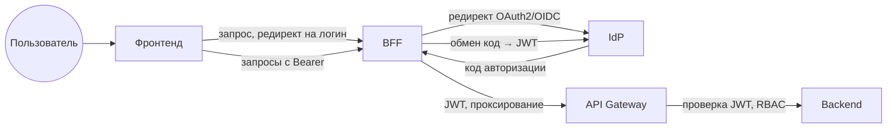
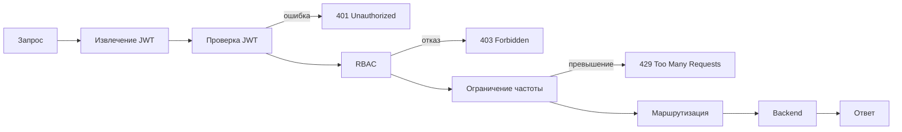
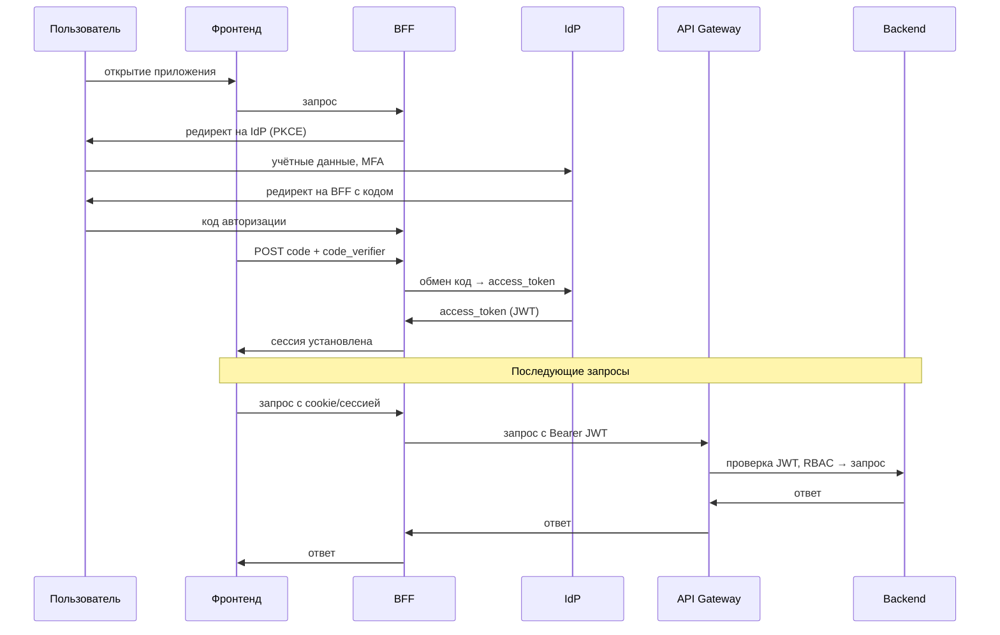
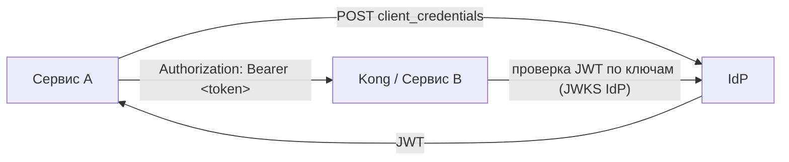
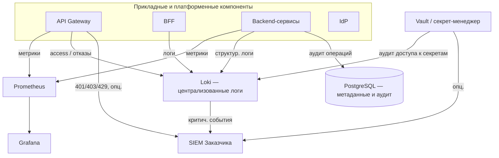

# ПОЯСНИТЕЛЬНАЯ ЗАПИСКА К ТЕХНИЧЕСКОМУ ЗАДАНИЮ
## на создание информационной системы «Фармадок»

**Версия:** 1.0  
**Дата:** 2026-03-10  
**Основание:** Техническое задание на создание ИС «Фармадок», документ «Описание архитектуры» (Architecture.md)

---

## 1. Введение

### 1.1. Назначение пояснительной записки

Настоящая пояснительная записка предназначена для обоснования и разъяснения требований и решений, зафиксированных в Техническом задании (ТЗ) на создание информационной системы «Фармадок», и установления связи между этими требованиями и архитектурными решениями, описанными в документе «Описание архитектуры».

Документ адресован Заказчику, техническим экспертам, архитекторам и специалистам, участвующим в приёмке и сопровождении Системы. Пояснительная записка используется при экспертизе проекта, при приёмочных испытаниях (для проверки соответствия заявленным целям и критериям) и при дальнейшем сопровождении — для понимания обоснований принятых решений.

### 1.2. Область действия

Область действия пояснительной записки распространяется на информационную систему «Фармадок» в объёме, определённом разделом 2 ТЗ (назначение и цели создания ИС). Документ согласован со структурой ТЗ и с документом «Описание архитектуры» (Architecture.md); при расхождении трактовок приоритет имеют формулировки ТЗ.

### 1.3. Условные обозначения и сокращения

Условные обозначения и сокращения приведены в разделе 1 ТЗ. Основные из них: БЯМ (большая языковая модель), RAG (Retrieval-Augmented Generation), RBAC (Role-Based Access Control), MFA (Multi-Factor Authentication), НЦЭСМП (Научный центр экспертизы средств медицинского применения), ПУР (план управления рисками), СЗИ (средства защиты информации), TLS (Transport Layer Security), WAF (Web Application Firewall).

---

## 2. Обоснование назначения и целей системы

*Соответствие разделу 2 ТЗ.*

### 2.1. Обоснование назначения

Система ориентирована на автоматизацию поиска, обработки и анализа фармацевтической документации с использованием технологий искусственного интеллекта на основе больших языковых моделей в связи со следующими факторами:

- Объём и разнообразие документов (ОХЛП, инструкции по медицинскому применению, нормативные документы по качеству, ПУР, изображения маркировки и др.) делают ручной анализ трудоёмким и подверженным ошибкам.
- Требования регуляторных органов (Минздрав России, ЕЭК, ICH) и необходимость сопоставления с референтными препаратами диктуют потребность в единой инструментальной среде с семантическим поиском и контролируемой генерацией выводов.
- ФГБУ «НЦЭСМП» как объект автоматизации выполняет экспертизу качества, безопасности и эффективности лекарственных средств; система призвана поддерживать экспертов, не подменяя их заключения, а снижая рутинную нагрузку и повышая прозрачность решений.

Ориентация на конфиденциальность и запрет передачи данных третьим лицам без согласия пользователя обусловлена характером обрабатываемой информации (персональные данные, данные экспертиз) и требованиями Федерального закона № 152-ФЗ «О персональных данных».

### 2.2. Обоснование целей и критериев

Измеримые критерии из п. 2.2 ТЗ обоснованы следующим образом:

| Цель | Критерий | Обоснование |
|-----|----------|-------------|
| Автоматизация анализа документов | Сокращение времени анализа не менее чем на 50 % | Типовой ориентир для систем с ИИ-ассистированием; позволяет оценить эффект внедрения при приёмке. |
| Повышение качества оформления документов | Экспертная оценка не менее 30 тестовых документов | Минимальный объём выборки для статистически значимой оценки качества оформления и рекомендаций системы. |
| Автоматизация поиска релевантной информации | Среднее время получения результатов не более 20 с | Баланс между качеством ответа (RAG, переранжирование) и приемлемой отзывчивостью для интерактивной работы. |
| Обеспечение ИБ | Отсутствие инцидентов за период тестовой эксплуатации (не менее 2 недель) | Подтверждение соблюдения требований к конфиденциальности и доступности в условиях, близких к эксплуатационным. |
| Устойчивость при росте нагрузки | Обеспечение устойчивой работы при увеличении числа пользователей | Требование к масштабируемости (не менее 100 пользователей, не менее 100 запросов в минуту — п. 4.1.2 ТЗ) обеспечивается архитектурой (см. разделы 4 и 7 настоящей записки). |

### 2.3. Границы системы

В границы системы входят: пользовательский веб-интерфейс, API Gateway, сервис аутентификации (IdP: Authentik в реализации на стадии прототипирования или Keycloak по согласованию с Заказчиком), модуль RAG (Retriever и Generator), векторная база данных, модуль агентов ИИ (анализ соответствия, сравнение документов, разметка, генерация отчётов), модуль парсинга и разметки документов, модуль генерации отчётов в формате DOCX. В первую очередь реализации входят перечисленные компоненты; во вторую — безопасный поиск в интернете, перевод документов, OCR и подсистема управления плагинами агентов (см. раздел 5). За рамки системы вынесены: внешние информационные системы Заказчика (интеграция с нормативно-справочной информацией уточняется на этапе проектирования), общедоступные веб-источники до их включения в белый список администратором.

---

## 3. Обоснование требований к объекту автоматизации и условиям эксплуатации

*Соответствие разделу 3 ТЗ.*

### 3.1. Характеристика объекта автоматизации

Выбор ФГБУ «НЦЭСМП» Минздрава России в качестве объекта автоматизации обусловлен его функциями: экспертиза качества, безопасности и эффективности лекарственных средств; этическая экспертиза клинических исследований; экспертиза документов для признания препаратов орфанными; разработка стандартов и фармакопейных статей. Эти функции связаны с большими объёмами структурированной и неструктурированной документации (ОХЛП, инструкции, НД, ПУР, изображения упаковки), что делает целесообразным применение семантического поиска, автоматизированного сравнения и проверки на соответствие регуляторным требованиям. Типы документов для интеллектуальной обработки приведены в Приложении А к ТЗ.

### 3.2. Условия эксплуатации

Учёт Федерального закона № 152-ФЗ обусловлен обработкой персональных данных и данных экспертиз. Требования Минздрава России к информационной безопасности для конфиденциальной информации задают рамки для шифрования, разграничения доступа и аудита. Эксплуатация в доменной сети учреждения обеспечивает единое управление учётными записями и политиками доступа. Использование WAF, СЗИ, протоколирования и ролевой модели (п. 4.1.4 ТЗ) согласовано с документом «Описание архитектуры», раздел 8 (Security Architecture), и с типовой топологией сети Заказчика (в т.ч. VPN через WireGuard по Приложению № 2 к ТЗ).

---

## 4. Обоснование требований к системе в целом

*Соответствие п. 4.1 ТЗ.*

### 4.1. Структура и функционирование

Модульная (микросервисная) архитектура выбрана для обеспечения независимой разработки и масштабирования компонентов, изоляции агентов ИИ и единообразного применения политик безопасности. Обоснование основных элементов:

- **Пользовательский веб-интерфейс** — единая точка взаимодействия пользователя с Системой; доступ с рабочих станций в доменной сети без установки дополнительного ПО (см. раздел 6.1 Architecture).
- **API Gateway (Kong или аналог)** — единая точка входа обеспечивает централизованную аутентификацию, проверку RBAC, ограничение частоты запросов (100 запросов в минуту на пользователя) и защиту от DDoS при интеграции с WAF; логирование всех запросов необходимо для аудита и интеграции с SIEM (раздел 6.2 Architecture).
- **Сервис аутентификации (Authentik в реализации на стадии прототипирования или Keycloak по согласованию с Заказчиком)** — использование существующей инфраструктуры идентификации Заказчика снижает затраты и обеспечивает единый вход (SSO) и обязательную MFA (раздел 6.3 Architecture).
- **Модуль RAG** — Retriever и Generator реализуют семантический поиск и генерацию ответов с опорой на локальное хранилище; учёт прав доступа в Retriever и размещение БЯМ локально или в доверенном облаке обеспечивают конфиденциальность (раздел 6.4 Architecture).
- **Векторная база данных** — хранение зашифрованных эмбеддингов с логическим разделением типов документов (регламентирующие, рабочие, кэш внешнего поиска) и маскированием чувствительных данных перед индексацией соответствует требованиям ИБ и пригодности для RAG (раздел 6.5 Architecture).
- **Модуль агентов** — изоляция в Docker-контейнерах с ограничением сети (белый список доменов), файловой системы и ресурсов снижает риски при выполнении специализированных сценариев (сравнение, поиск, заполнение шаблонов) и при подключении новых агентов-плагинов (разделы 6.6 и 8.3 Architecture).

### 4.2. Масштабируемость и производительность

Требования «не менее 100 одновременно работающих пользователей» и «не менее 100 запросов в минуту» (п. 4.1.2 ТЗ) обоснованы оценкой типовой нагрузки при использовании Системы экспертами и аналитиками НЦЭСМП и резервом на пиковые периоды. Ограничение 100 запросов в минуту на пользователя на уровне API Gateway предотвращает злоупотребления и выравнивает нагрузку. Горизонтальное масштабирование backend-сервисов в контейнерах и настройка векторной БД и сервера БЯМ предусмотрены в разделе 10.4 Architecture (Scalability).

### 4.3. Надёжность

Требования к отказоустойчивости, резервному копированию с шифрованием копий и времени восстановления не более 4 часов без потери данных (п. 4.1.3 ТЗ) обусловлены необходимостью непрерывности работы при сбоях оборудования или ПО и соответствуют целевым RTO/RPO в разделе 10.3 Architecture (Reliability and Recovery). Корректная обработка ошибочных действий пользователя (сообщения об ошибке и возврат в устойчивое состояние) обеспечивает предсказуемость поведения Системы и исключает потерю данных из-за некорректного ввода.

### 4.4. Защита информации

Требования п. 4.1.4 ТЗ обоснованы следующим образом:

- Соответствие ФЗ № 152, рекомендациям Роскомнадзора и возможность аудита по ISO/IEC 27001 — обязательные условия при обработке персональных и конфиденциальных данных в государственном учреждении (раздел 8.5 Architecture, Compliance).
- Запрет на передачу данных третьим лицам без явного согласия — обеспечение конфиденциальности и контроль над использованием данных; архитектура предполагает размещение БЯМ и эмбеддингов локально или в доверенном облаке.
- RBAC и обязательная MFA — разграничение доступа по ролям и усиленная аутентификация снижают риск несанкционированного доступа (раздел 8.1 Architecture).
- Шифрование TLS 1.3 для каналов связи и ГОСТ Р 34.11-2012, ГОСТ Р 34.12-2015 для хранимых данных — соответствие отраслевым и государственным требованиям к криптозащите (раздел 8.2 Architecture).
- Изоляция агентов ИИ в контейнерной среде — ограничение последствий сбоя или компрометации агента (раздел 8.3 Architecture).
- Анонимизация персональных данных перед передачей в БЯМ (middleware, Presidio) — минимизация рисков при обработке данных языковой моделью (раздел 8.2 Architecture).
- Журналирование действий и событий с возможностью интеграции с SIEM — обеспечение аудита и оперативного реагирования на инциденты (раздел 8.4 Architecture).

---

## 5. Обоснование состава и приоритизации функций системы

*Соответствие п. 4.2 ТЗ.*

### 5.1. Принцип деления на очереди

Первая очередь направлена на развёртывание ядра Системы: веб-интерфейс, семантический поиск (RAG), формирование и использование векторной БД, анализ документов на соответствие регуляторным требованиям, сравнение документов, разметку и генерацию отчётов. Это позволяет начать эксплуатацию на внутреннем корпусе документов без выхода в интернет и без зависимости от внешних API. Вторая очередь добавляет функции, требующие дополнительных контуров безопасности и интеграций: безопасный поиск в интернете (белый список доменов, фильтрация конфиденциальных запросов), перевод документов, OCR, управление плагинами агентов. Такое деление снижает риски первого этапа и обеспечивает поэтапную приёмку в соответствии с календарным планом (Приложение № 1 к ТЗ).

### 5.2. Функции первой очереди

| Функция (п. 4.2.1 ТЗ) | Соответствующий модуль Architecture | Краткое обоснование |
|------------------------|-------------------------------------|----------------------|
| Пользовательский веб-интерфейс | 6.1 User Web Interface | Единая точка ввода и отображения для загрузки документов, поиска, анализа и отчётов. |
| Семантический поиск с RAG | 6.4 RAG Module | Основа интеллектуального поиска по локальному хранилищу и кэшу внешнего поиска. |
| Формирование векторной БД | 6.5 Vector Database, 6.7 Document Parsing and Markup | Добавление/удаление документов и получение НСИ Заказчика с последующей индексацией. |
| Интеграция с векторной БД | 6.5 Vector Database | Хранение эмбеддингов с шифрованием и поиск с учётом RBAC. |
| Анализ инструкций и документов на соответствие | 6.6 AI Agent (Compliance Agent) | Проверка структуры, содержания и соответствия стандартам Минздрава, ЕЭК, ICH. |
| Сравнение документов | 6.6 AI Agent (Comparison Agent) | Семантическое и формальное сравнение двух и более документов. |
| Создание разметки документов | 6.7 Document Parsing and Markup Module | Парсинг в логические блоки и визуальный редактор разметки. |
| Генерация отчётных документов | 6.10 Report Generation Module | Выгрузка результатов в DOCX по шаблонам Заказчика или Подрядчика. |

### 5.3. Функции второй очереди

| Функция (п. 4.2.2 ТЗ) | Соответствующий модуль Architecture | Краткое обоснование |
|------------------------|-------------------------------------|----------------------|
| Безопасный поиск в интернете | 6.11 Secure Web Search Module | Поиск по разрешённым сайтам, кэширование в векторной БД, фильтр конфиденциальных запросов (раздел 9.2 Architecture). |
| Перевод документов | 6.9 Translation Module | Перевод с сохранением структуры и терминологии с использованием локальной или доверенной БЯМ. |
| OCR | 6.8 OCR Module | Распознавание текста с изображений и сканов для последующей индексации и анализа. |
| Добавление агентов через штатный интерфейс | 6.12 Plugin Management Subsystem | Регистрация и запуск новых агентов в изолированных контейнерах с проверкой (в т.ч. ClamAV). |

---

## 6. Обоснование видов обеспечения

*Соответствие п. 4.3 ТЗ.*

### 6.1. Математическое обеспечение

Использование методов машинного обучения, больших языковых моделей, технологии RAG, а также методов классификации, кластеризации, распознавания образов и глубокого обучения (п. 4.3.1 ТЗ) обусловлено задачами семантического поиска, анализа соответствия регуляторным требованиям и сравнения документов. Retriever реализует поиск по векторным представлениям (эмбеддинги); Generator формирует ответы на основе извлечённого контекста; при необходимости применяются переранжирование и явное цитирование источников. Детальное обоснование конвейера интеллектуального поиска приведено в § 12 настоящей записки, в документе `1_4_subsystem_AI.md` и в Приложении А.

### 6.2. Программное обеспечение

Требование к функционированию на ОС Windows 10 (рабочие станции) и Ubuntu 24.04 или выше (серверы) (п. 4.3.2 ТЗ) согласовано с типовой инфраструктурой Заказчика и с разделом 7.1 Architecture (Infrastructure and Platform). Клиентская часть (SPA) работает в браузере на рабочих местах под управлением Windows 10 в доменной сети; серверные компоненты развёртываются в контейнерах на серверах с Ubuntu 24.04 LTS.

### 6.3. Техническое обеспечение

Технические средства и каналы связи обеспечиваются Заказчиком (п. 4.3.3 ТЗ). Уточнение параметров оборудования (мощность серверов, в т.ч. для БЯМ и векторной БД, характеристики рабочих станций и сети) выполняется на этапе технического проектирования исходя из требований к производительности и безопасности; ориентиры приведены в разделе 10.1 Architecture (Server Infrastructure).

### 6.4. Лингвистическое обеспечение

Требование к русскому языку надписей интерфейса, экранных форм и сообщений пользователю (п. 4.3.4 ТЗ) обусловлено основной аудиторией — сотрудниками российского регуляторного учреждения и необходимостью соответствия правилам документооборота и экспертизы на государственном языке.

---

## 7. Архитектурные принципы

В документе «Описание архитектуры» (Architecture), раздел 4, зафиксированы архитектурные принципы, на которых строится Система. Ниже приведены суть каждого принципа, его реализация в ИС «Фармадок» и связь с требованиями ТЗ (пп. 4.1.1–4.1.4).

### 7.1. Модульность

Каждая функциональная область (веб-интерфейс, API Gateway, аутентификация, RAG, векторная БД, модуль агентов) выделена в самостоятельный модуль или сервис; новые возможности добавляются в виде плагинов без изменения ядра системы. Это соответствует требованию ТЗ о построении Системы на принципах открытости и модульности (п. 4.1.1) и реализуется в виде шести основных структурных элементов, а также штатного механизма подключения новых агентов-плагинов (п. 4.1.1, п. 4.2.2 — вторая очередь).

### 7.2. Безопасность по умолчанию

В каждом компоненте Системы обеспечиваются аутентификация, авторизация и шифрование; данные не покидают доверенный контур без явного разрешения авторизованного пользователя. Принцип реализуется через единую точку входа (API Gateway), RBAC и обязательную MFA (раздел 6.3 Architecture). Криптографические требования к каналам и хранимым данным сформулированы в п. 7.9; запрет использования сторонних облачных ИИ для обработки контента и размещение БЯМ/эмбеддингов — в п. 7.8; маскирование перед БЯМ и индексацией — в п. 7.7. Принцип поддерживает выполнение п. 4.1.4 ТЗ.

### 7.3. Нулевое доверие

Доверие не предоставляется по умолчанию даже для запросов из внутренней сети: подлинность и полномочия проверяются на уровне шлюза и в прикладных сервисах; Retriever при выборке из векторной БД применяет фильтрацию по правам доступа к документам (RBAC). Принцип дополняет п. 4.1.4 ТЗ и согласован с ролью API Gateway (п. 4.1.1 ТЗ).

### 7.4. Масштабируемость

Горизонтальное масштабирование обеспечивается контейнеризацией (Docker, при необходимости Kubernetes) серверных компонентов и балансировкой нагрузки на уровне API Gateway. Это позволяет наращивать производительность при росте числа пользователей и объёма данных без переработки прикладной логики. Принцип обеспечивает выполнение требований п. 4.1.2 ТЗ (не менее 100 одновременно работающих пользователей, не менее 100 запросов в минуту) и согласован с требованиями к отказоустойчивости п. 4.1.3 ТЗ.

### 7.5. Наблюдаемость

Значимые события Системы и действия пользователей логируются; предусмотрена интеграция с SIEM. Запросы фиксируются на шлюзе с метаданными (IP, пользователь, время, тип запроса); отказы в доступе к документам со стороны Retriever также журналируются. Соблюдение принципа обеспечивает выполнение требований п. 4.1.1 ТЗ (логирование запросов) и п. 4.1.4 ТЗ (журналирование действий и системных событий, интеграция с SIEM).

### 7.6. Изоляция агентов

Агенты ИИ (анализ соответствия, сравнение документов, веб-поиск, перевод, OCR и др.) выполняются в изолированных Docker-контейнерах с ограничениями по сети (белый список доменов), по файловой системе и по потреблению ресурсов. Это снижает риски при сбое или компрометации агента. Дополнительные меры к поставке плагинов (вторая очередь) — в п. 7.9. Принцип реализует требования п. 4.1.1 ТЗ (модуль агентов в контейнерах, белый список доменов) и п. 4.1.4 ТЗ (изоляция агентов ИИ в контейнерной среде — «песочнице»).

### 7.7. Минимизация данных

Персональные и иные чувствительные данные анонимизируются или маскируются перед передачей в большую языковую модель и перед индексацией в векторной БД (Microsoft Presidio или функциональный аналог), в т.ч. middleware на пути к БЯМ и при подготовке документов к индексации. Принцип обеспечивает выполнение п. 4.1.4 и п. 4.1.1 ТЗ в части маскирования; сочетается с п. 7.8 (контроль размещения моделей и отсутствие передачи в сторонние облачные ИИ).

### 7.8. Запрет передачи данных третьим лицам и соответствие ФЗ № 152

Требования п. 4.1.4 ТЗ и Федерального закона № 152-ФЗ «О персональных данных» исключают использование общедоступных облачных ИИ-сервисов (в т.ч. коммерческих API сторонних провайдеров) для обработки контента документов и запросов. БЯМ и модели эмбеддингов размещаются локально или в доверенном облаке Заказчика, что не допускает отправку текстов в сторонние облачные сервисы и сохраняет контроль над данными и моделями. Вариант развёртывания и параметры серверов (в т.ч. AI/LLM-сервер по разделу 10.1 Architecture) уточняются на этапе технического проектирования с учётом п. 4.1.2 ТЗ и политики Заказчика по размещению данных.

### 7.9. Криптографическая защита и контроль подключаемых компонентов

Соединения между компонентами выполняются по TLS 1.3; шифрование данных при хранении и функции хэширования — по ГОСТ Р 34.12-2015 и ГОСТ Р 34.11-2012. Загружаемые плагины агентов (вторая очередь) перед запуском проверяются на вредоносный код средствами ClamAV или функционального аналога. Принцип обеспечивает выполнение п. 4.1.4 ТЗ (шифрование каналов и данных) и п. 4.2.2 ТЗ (безопасное подключение новых агентных модулей).

В совокупности принципы раздела 7 обеспечивают соответствие Системы требованиям ТЗ к структуре и функционированию (п. 4.1.1), производительности и масштабируемости (п. 4.1.2), надёжности (п. 4.1.3) и защите информации (п. 4.1.4).

---

## 8. Инфраструктура и платформа

Операционная система серверов — Ubuntu 24.04 LTS, рабочих станций — Windows 10 (п. 4.3.2 ТЗ). Контейнеризация выполняется средствами Docker; при необходимости применяется оркестрация (Kubernetes или Docker Compose) для горизонтального масштабирования сервисов. Непрерывная интеграция и развёртывание (CI/CD) — GitLab CI или Jenkins по согласованию с Заказчиком; управление конфигурацией и исходным кодом — система управления конфигурациями Заказчика с автоматической сборкой и развёртыванием (п. 6 ТЗ). Для защищённого удалённого доступа используется VPN WireGuard (схема инфраструктуры — по Приложению № 2 к ТЗ). Указанные решения обеспечивают соответствие инфраструктуре Заказчика, выполнение требований к масштабируемости (п. 4.1.2 ТЗ) и порядку развёртывания (п. 6 ТЗ).

## 9. Подсистема входа, аутентификации и авторизации
Подраздел описывает архитектуру и обоснование выбора подсистемы, обеспечивающей единый вход в Систему, установление личности пользователя (аутентификацию) и проверку прав доступа (авторизацию). Детализация компонентов — API Gateway (п. 1.3) и компонент аутентификации и авторизации (пп. 1.4 и 1.5).

### 9.0. Глоссарий

Термины, используемые в подразделе: 
- **фронтенд** — браузерное приложение (точка входа пользователя);
- **SPA** — одностраничное приложение;
- **MPA** — многостраничное приложение;
- **клиент** — фронтенд в контексте запросов к BFF и API;
- **BFF** (Backend for Frontend) — серверный компонент для обмена кода авторизации на токен и проксирования запросов с JWT;
- **IdP** — поставщик идентичности (Identity Provider);
- **API Gateway** — единая точка входа для запросов к backend;
- **JWT** — JSON Web Token;
- **OIDC** — OpenID Connect;
- **RBAC** — разграничение доступа по ролям (Role-Based Access Control);
- **MFA** — многофакторная аутентификация;
- **SSO** — единый вход (Single Sign-On).

### 9.1. Обзор подсистемы: проблема, подходы решения

#### 9.1.1. Проблема и требования

ИС «Фармадок» обрабатывает фармацевтическую документацию и персональные данные. 
Необходимо обеспечить: 
1. **контролируемый доступ** к серверной части — установление личности (аутентификация) и проверку прав на операции и данные (авторизация); 
2. **единое место прохождения трафика** — чтобы все запросы к backend проходили через один контур, где выполняются проверки, ограничение нагрузки и аудит; 
3. **соответствие ТЗ** — п. 4.1.1 (единая точка входа, аутентификация, RBAC, ограничение частоты запросов, логирование) и п. 4.1.4 (контроль доступа, защита информации, журналирование). 
Без единой точки входа запросы могли бы обращаться к разным backend-компонентам напрямую: централизованная проверка прав и учёт событий становятся затруднительными, защита от злоупотреблений ослабевает. 
Без выделенной подсистемы аутентификации и авторизации логику входа и проверки прав пришлось бы дублировать в каждом компоненте либо применять небезопасные схемы (например, хранение секретов клиента в браузере).
Для данной предметной области дополнительно требуются единый вход (SSO), разграничение доступа по ролям (RBAC), при необходимости многофакторная аутентификация (MFA) и недопущение передачи учётных данных третьим лицам без согласия (п. 4.1.4 ТЗ).

#### 9.1.2. Существующие подходы к решению

В отрасли для решения перечисленных задач применяются три взаимодополняющих подхода. 
**1. Единая точка входа (API Gateway):** 
Весь внешний трафик к backend пропускается через шлюз; шлюз выполняет проверку аутентификации (по JWT или сессии), авторизацию по правилам (RBAC), ограничение частоты запросов и логирование. В результате проверки не дублируются в каждом компоненте, аудит и политики доступа централизованы. 
**2. Федеративная идентификация (OAuth2/OIDC):** 
Отдельный компонент — поставщик идентичности (IdP) — проверяет учётные данные и выдаёт токены с утверждениями о пользователе и ролях; приложения и шлюз проверяют токены по публичным ключам IdP и не хранят пароли. Это обеспечивает SSO, MFA и интеграцию с корпоративными каталогами (LDAP/AD). 
**3. Безопасный обмен токенами для веб-клиента (BFF):** 
Браузерное приложение (фронтенд) не получает долгоживущие секреты; обмен кода авторизации на токен выполняется на сервере (Backend for Frontend — BFF), который затем проксирует запросы к API с подстановкой JWT. Риск утечки секретов из браузера снижается; подход соответствует рекомендациям по безопасному использованию OAuth2/OIDC для фронтенда (поток Authorization Code + PKCE). Комбинация подходов 1–3 даёт единую точку входа с централизованной аутентификацией и авторизацией и безопасным сценарием входа для веб-клиента.

#### 9.1.3. Варианты протоколов и потоков

**Обоснование выбора OAuth 2.0 / OpenID Connect.** 
В качестве базового протокола приняты OAuth 2.0 и OpenID Connect по следующим причинам. 
- a. **Отраслевой стандарт:** 
Широко используются для федеративной идентификации и единого входа; совместимость с типовыми IdP и возможность интеграции с инфраструктурой Заказчика (LDAP, AD). Обоснование выбора IdP для ИС «Фармадок» — п. 1.4.5. 
- b. **Без передачи пароля приложению:**
Приложение и шлюз получают только токены (JWT), проверяемые по публичным ключам IdP; пароль пользователя остаётся в IdP, что снижает риски утечки и соответствует требованию п. 4.1.4 ТЗ. 
- c. **Идентификация и утверждения:** 
OpenID Connect расширяет OAuth 2.0 стандартными утверждениями о пользователе (identity) и выдаёт JWT с ролями/группами, что необходимо для RBAC на шлюзе и в backend. 
- d. **Поддержка MFA и аудита:** 
IdP проводит многофакторную аутентификацию и фиксирует события входа; приложения не дублируют эту логику. 

Альтернативы (только сессии с паролем, проприетарные схемы) не обеспечивают в совокупности SSO, делегирование без раскрытия пароля и совместимость с типовыми IdP без избыточной собственной разработки.

При выборе способа получения токена для веб-клиента (фронтенд) рассматривались варианты потоков OAuth 2.0 / OpenID Connect.
**1. Authorization Code + PKCE:**
Клиент направляет пользователя на IdP, получает код авторизации по редиректу и обменивает его на токен (на стороне BFF); code_verifier ограничивает использование перехваченного кода. Рекомендуется для фронтенда (OAuth 2.0 Security BCP, RFC 8252): секреты клиента не попадают в браузер. 
**2. Implicit flow:** 
Токен возвращается в fragment URL после редиректа с IdP. Устарел, уязвим к перехвату токена; не рекомендуется (RFC 6749, OAuth 2.0 Security BCP). 
**3. Resource Owner Password Credentials:**
Клиент передаёт логин и пароль приложению, приложение обменивает их на токен у IdP. Требует доверия к клиенту, раскрывает пароль приложению; для браузерного фронтенда недопустим. 
**4. Client Credentials:** приложение аутентифицируется само (без пользователя); применим для сервис-сервис вызовов, не для входа пользователя. Детали аутентификации сервисов бэкенда между собой — п. 1.4.9 и [рис. 4](#fig-4).
Обоснование выбора потока для ИС «Фармадок» — п. 1.2.1; детали потока — п. 1.4.4 и [рис. 3](#fig-3).

#### 9.1.4. Варианты реализации

При выборе конкретной реализации рассматривались четыре варианта. 
**1. Сессии на сервере без выделенного шлюза:**
Логин и пароль проверяются одним из backend-компонентов, сессия хранится на сервере; авторизация — по данным, привязанным к сессии. Недостатки: отсутствие единой точки входа для всех API, сложность масштабирования на множество компонентов, затруднённый централизованный аудит. 
**2. Собственный сервер логина с JWT и отдельный API Gateway:** 
Приложение ведёт учётные записи и выдаёт JWT; шлюз проверяет JWT и RBAC. Даёт единую точку входа, но дублирует функциональность IdP, не решает задачу SSO для нескольких приложений и увеличивает объём собственной разработки и сопровождения. 
**3. Федеративная идентификация (OAuth2/OIDC) с выделенным IdP в контуре Заказчика и API Gateway:** 
Централизованный IdP (Authentik, Keycloak или аналог) выполняет аутентификацию и выдаёт JWT; шлюз проверяет токены по ключам IdP и выполняет RBAC; браузерный клиент входит через BFF (обмен кода на токен, проксирование запросов с JWT). Обеспечивает единую точку входа, SSO, MFA, RBAC, централизованный аудит, соответствие отраслевым практикам и не передаёт данные аутентификации третьим лицам. 
**4. Облачные IdP (Auth0, Okta, Azure AD и т.п.) с API Gateway:** по сути вариант 3 с размещением IdP у стороннего провайдера. Снижает эксплуатационные затраты на IdP, но передаёт учётные данные и факты входа в облако провайдера, что может противоречить п. 4.1.4 ТЗ и политике конфиденциальности для фармацевтической и экспертной информации.

### 9.2. Обоснование выбора и состав подсистемы

#### 9.2.1. Обоснование выбора варианта реализации

Принятые решения по реализации:

1. Единая точка входа — API Gateway (в конфигурации на стадии прототипирования — Kong); централизованный IdP в контуре Заказчика (Authentik или по согласованию Keycloak — п. 1.4.5);

2. Протоколы OAuth 2.0 и OpenID Connect; архитектура фронтенд + BFF для безопасного обмена кода на токен и проксирования запросов к API с подстановкой JWT. 

3. Для получения токена веб-клиентом (фронтенд) принят поток **Authorization Code + PKCE** в рамках OpenID Connect: IdP поддерживает discovery, выдаёт JWT с утверждениями о пользователе и ролях; обмен кода на токен выполняется в BFF, браузер не получает долгоживущие секреты. Детали потока — п. 1.4.4 и [рис. 3](#fig-3).

Выбор обоснован следующим. 

- a. Выполняются требования ТЗ п. 4.1.1 и 4.1.4 к единой точке входа, аутентификации, RBAC, ограничению частоты и логированию без передачи данных аутентификации третьим лицам. 
- b. Один раз настроенные IdP и шлюз обслуживают все запросы к backend — упрощается сопровождение и аудит. 
- c. Обеспечиваются SSO, MFA и возможность интеграции с существующей системой идентификации Заказчика (LDAP, корпоративный IdP). 
- d. BFF исключает попадание секретов клиента в браузер и соответствует рекомендациям по OAuth2/OIDC для фронтенда. 

Вариант 4 не принят в качестве основного из-за требований к размещению данных (п. 4.1.4 ТЗ). 
Варианты 1 и 2 не обеспечивают в совокупности единую точку входа, SSO и отраслевые практики без избыточной собственной разработки.

#### 9.2.2. Состав и общий поток

Подсистема состоит из четырёх компонентов: **API Gateway** (Kong — п. 1.3), **IdP** (Authentik или по согласованию Keycloak — п. 1.4.5), **BFF**, **фронтенд**. 
Общий поток: пользователь открывает фронтенд по адресу BFF; при необходимости входа BFF перенаправляет браузер на IdP (OAuth2/OIDC, Authorization Code + PKCE); после успешной аутентификации IdP возвращает код на BFF, BFF обменивает код на JWT; последующие запросы к API идут через BFF с JWT, шлюз проверяет JWT и RBAC и передаёт запрос на backend ([рис. 1](#fig-1)). 
Детализация состава и пошаговый поток входа — п. 1.3, 1.4.2, 1.4.4; авторизация — п. 1.5. Состав и общий поток показаны на [рис. 1](#fig-1).

**Рис. 1. Состав подсистемы и общий поток запросов** 

### 9.3. API Gateway и точка входа

Роль шлюза в подсистеме и связь с требованиями ТЗ приведены в п. 1.1 и 1.2. 
Ниже — назначение компонента в архитектуре, последовательность обработки запроса, реализация на базе Kong, логирование и перспектива замены.

#### 9.3.1. Назначение и место в подсистеме

API Gateway выступает **единственной точкой входа** для всех запросов к серверной части Системы (веб-интерфейс через BFF, внешние клиенты, при необходимости мобильные приложения и запросы от других backend-сервисов — п. 1.4.9). 
Все запросы к backend-компонентам проходят через шлюз; прямой доступ к backend в обход шлюза не предусмотрен. 
На шлюз возлагаются: принудительная проверка аутентификации (валидность JWT), проверка прав доступа по ролям (RBAC), ограничение частоты запросов, маршрутизация на соответствующие компоненты и аудит каждого запроса. 
Таким образом, backend получает только уже провалидированные запросы с контекстом авторизации (идентификатор пользователя, роли).

#### 9.3.2. Последовательность обработки запроса

Для каждого входящего запроса шлюз выполняет следующие шаги. 
1. **Приём запроса** и извлечение JWT из заголовка `Authorization: Bearer <token>`. 
2. **Аутентификация:** проверка подписи и срока действия JWT по публичным ключам IdP (JWKS или PEM); при отсутствии токена, невалидной подписи или истечении срока — ответ **401 Unauthorized**, запрос на backend не передаётся, событие логируется. 
3. **Авторизация (RBAC):** для пары «метод HTTP + путь» проверяется, разрешена ли операция для хотя бы одной из ролей пользователя, извлечённых из JWT; при недостаточных правах — **403 Forbidden**, backend не вызывается. 
4. **Ограничение частоты:** не более 100 запросов в минуту на одного аутентифицированного пользователя (п. 4.1.1 ТЗ); при превышении — **429 Too Many Requests**. 
5. **Маршрутизация:** запрос вместе с контекстом авторизации (идентификатор пользователя, роли) направляется на соответствующий backend-компонент согласно правилам (маппинг «путь + метод» → целевой компонент). 
6. **Ответ:** ответ backend возвращается клиенту через шлюз; при таймауте или ошибке компонента шлюз формирует ответ с кодом 5xx и фиксирует событие. 
Порядок плагинов на маршруте: сначала проверка JWT, затем RBAC, затем при необходимости rate limiting и маршрутизация. Схема шагов приведена на [рис. 2](#fig-2).

**Рис. 2. Последовательность обработки запроса на API Gateway** 

#### 9.3.3. Реализация (Kong OSS) на стадии технического проекта (прототипирования) или реализации.

В реализации прототипирования используется Kong OSS.
 - Конфигурация задаётся декларативно; файл `iam/kong/kong.yml`, режим DB-less; маршруты, плагины и параметры описываются в YAML и применяются при старте контейнера. 
 - Внешний доступ к API — по порту 8001 (HTTP); при необходимости добавляется HTTPS (порт 8444) и reverse proxy с TLS.
 - Маршрут `/api` проксируется на backend-компоненты;
 - Запросы к путям, не входящим в конфигурацию, могут возвращать 404. 
 - Проверка JWT выполняется по ключам IdP (OpenID Connect). 
В Kong OSS плагин **openid-connect** недоступен (входит в Kong Enterprise), поэтому используется встроенный плагин **jwt**: в конфигурацию подставляются публичный ключ (PEM) и идентификатор ключа (kid) из IdP Authentik; JWKS провайдера приложения доступен по URL вида `.../application/o/<slug>/jwks/`. 
Скрипт `iam/kong/scripts/setup-kong-jwt-auth.sh` позволяет автоматически получить ключи из Authentik и обновить `kong.yml`. 
Проверка RBAC по ролям из JWT в Kong OSS требует дополнительной логики (например, плагин pre-function с кодом на Lua и таблица правил «метод + путь → разрешённые роли»); таблица хранится в конфигурации шлюза и обновляется при изменении матрицы доступа.

#### 9.3.4. Логирование и интеграция с SIEM

Каждый запрос, проходящий через API Gateway, логируется с метаданными: IP-адрес клиента, идентификатор пользователя (из JWT), время запроса, метод и путь, HTTP-статус ответа, задержка. События отказа в доступе (401, 403, 429) фиксируются отдельно и могут передаваться в систему SIEM Заказчика (п. 4.1.4 ТЗ).

**Реализация в Kong OSS.** 
Для логирования используются встроенные плагины Kong OSS: 
**File Log** (запись в файл, в т.ч. JSON), 
**Syslog** (отправка в syslog-сервер), 
**HTTP Log** (отправка каждой записи POST на заданный URL). 

Плагин подключается к сервисам/маршрутам или глобально в конфигурации (`kong.yml`); в лог по умолчанию попадают client_ip, метод и путь запроса, код ответа, задержка. 

Идентификатор пользователя из JWT в стандартные плагины не подставляется автоматически: для его добавления в лог применяют плагин **Request Transformer** или **Pre-function** (Lua) — после проверки JWT извлечь claim (например, `sub`) из контекста и записать в заголовок запроса (например, `X-User-Id`), который затем включается в тело лога; либо реализуют кастомный плагин логирования, добавляющий в запись поля из JWT. 

События 401, 403, 429 либо выделяются в SIEM правилами/фильтрами по полю статуса в общем потоке логов, либо настраивается отдельный экземпляр плагина (например, HTTP Log) только для отказов в доступе с отдельным endpoint или тегом.

Доставка в SIEM Заказчика: 
По протоколу **syslog** (плагин Syslog, хост/порт приёмника SIEM); 
Через **файл** — File Log пишет в файл, сборщик (Filebeat, Fluentd, Vector и т.п.) доставляет логи в SIEM (Elasticsearch, Splunk, QRadar и др.) по поддерживаемому протоколу; 
По **HTTP** — плагин HTTP Log отправляет события на URL, принимаемый SIEM или промежуточным приёмником. 
Конкретный формат и способ интеграции уточняются с Заказчиком в соответствии с п. 4.1.4 ТЗ; на этапе тех.проекта или реализации.

#### 9.3.5. Взаимодействие с IdP

Шлюз не обращается к IdP при каждом запросе: проверка JWT выполняется локально по публичным ключам IdP (Authentik). 
Синхронизация ключей (обновление PEM в конфигурации Kong) выполняется при развёртывании или по процедуре обновления (например, скрипт setup-kong-jwt-auth.sh).

### 9.4. Аутентификация

Подраздел раскрывает установление и проверку личности пользователя: понятие аутентификации, состав компонента (IdP, BFF, фронтенд), процесс входа и выдачи токена, обоснование выбора IdP; интеграция с корпоративным каталогом (п. 1.4.8), аутентификация сервисов бэкенда между собой (п. 1.4.9). 
Обоснование архитектурного варианта (OAuth2/OIDC, IdP в контуре Заказчика, BFF) — п. 1.1 и 1.2; проверка прав (авторизация) — п. 1.5. 
Детали реализации — п. 3.8.1 документа «Описание программного обеспечения».

#### 9.4.1. Понятие аутентификации

*Аутентификация* — установление и проверка личности субъекта (пользователя или компонента): подтверждение того, что субъект является тем, за кого себя выдаёт. Пользователь предъявляет учётные данные (логин и пароль, сертификат, биометрию или второй фактор — TOTP, FIDO2); система проверяет их и при успехе связывает сессию или выданный токен с идентификатором. 

Результат аутентификации — уверенность в том, *кто* обращается к системе. 

В ИС «Фармадок» аутентификация обеспечивается IdP (проверка учётных данных, при необходимости MFA, выдача JWT); после входа права пользователя проверяются при каждом запросе по утверждениям в JWT (авторизация — п. 1.5).

#### 9.4.2. Назначение и состав компонента

Компоненты аутентификации и авторизации выступают источником *идентичности* пользователя и *сведений о его правах* для всей Системы: установление личности при входе, выдача JWT для последующих запросов к API, передача контекста прав в API Gateway и backend (решения о допуске принимаются на шлюзе и backend по утверждениям в JWT).

Требования ТЗ: п. 4.1.1, 4.1.4 ТЗ (см. п. 1.1.1). 

**IdP (Identity Provider):** 
В конфигурации на стадии прототипирования — Authentik или Keycloak по согласованию с Заказчиком; проверяет учётные данные, при необходимости проводит MFA, выдаёт JWT с утверждениями о пользователе и ролях (или группах, отображаемых на роли). Обоснование выбора IdP — п. 1.4.5.

**BFF (Backend for Frontend):** 
Через него фронтенд входит в систему и обращается к API; выполняет обмен кода авторизации на токен и проксирует запросы к API с подстановкой JWT.

**Фронтенд:**
Браузерное приложение; инициация входа (редирект на IdP) и вызовы функциональности через BFF. Логически компонент расположен между клиентом и API Gateway: клиент обращается к IdP за токеном через BFF; шлюз проверяет JWT и извлекает контекст прав; backend получает контекст от шлюза и не обращается к IdP напрямую.

#### 9.4.3. SSO (единый вход)

*Single Sign-On (SSO)* — возможность один раз пройти аутентификацию в едином IdP и затем обращаться ко всем приложениям и сервисам Системы без повторного ввода учётных данных.
В ИС «Фармадок» SSO обеспечивается за счёт централизованного IdP (Authentik или согласованный с Заказчиком OIDC-совместимый провайдер) и протоколов OAuth2/OpenID Connect:
- после успешного входа в IdP пользователь получает JWT; 
- при обращении к другим приложениям в контуре (фронтенд, API через BFF) повторная аутентификация не требуется — шлюз и backend доверяют утверждениям в токене.

Требование единого входа задано ТЗ: п. 4.1.1. 
Детали процесса входа и выдачи токена — п. 1.4.4 ([рис. 3](#fig-3)); обоснование выбора IdP — п. 1.2 и п. 1.4.5.

#### 9.4.4. Процесс входа и выдачи токена

1. Пользователь открывает фронтенд по адресу BFF.
2. При необходимости входа фронтенд обращается к BFF (эндпоинт входа); BFF перенаправляет браузер на IdP с параметрами протокола Authorization Code + PKCE (code_challenge, state, redirect_uri, client_id, scope).
3. Пользователь вводит учётные данные (и при необходимости проходит MFA) на стороне IdP. 
4. После успешной аутентификации IdP редиректит браузер на callback BFF с кодом авторизации. 
5. Фронтенд передаёт код и code_verifier на BFF (POST `/auth/exchange`); BFF обменивает их на access_token (и при необходимости refresh_token) через token endpoint IdP.
6. При последующих запросах к функциональности Системы фронтенд обращается к BFF; BFF проксирует запросы в API Gateway с заголовком `Authorization: Bearer <token>`. Шлюз проверяет JWT и RBAC (последовательность обработки запроса на шлюзе — п. 1.3.2, [рис. 2](#fig-2)) и при успехе передаёт запрос на backend с контекстом авторизации. 
Секреты клиента (client_secret при наличии) и долгоживущие токены не попадают в браузер — это соответствует рекомендациям по безопасному использованию OAuth2/OIDC для фронтенда. Последовательность взаимодействия отражена на [рис. 3](#fig-3).

**Рис. 3. Поток входа и выдачи токена (Authorization Code + PKCE)** 

#### 9.4.5. Обоснование выбора IdP (Authentik и альтернативы)

В качестве IdP на стадии прототипирования выбран Authentik; при утверждённом корпоративном IdP Заказчика (в т.ч. Keycloak) допускается его использование по согласованию.

- **Authentik** — открытое ПО (лицензия MIT), развёртывание на собственной инфраструктуре. Поддерживает OAuth 2.0, OpenID Connect, JWT, MFA (TOTP, FIDO2), интеграцию с LDAP и др. В репозитории предусмотрены: готовый docker-compose, интеграция с HashiCorp Vault (скрипт run-authentik-with-vault.sh), blueprint провайдера OIDC и приложения (farmadoc-oidc), скрипт настройки Kong (setup-kong-jwt-auth.sh). Это сокращает сроки развёртывания и обеспечивает единообразие конфигурации без привязки к облаку и без передачи данных аутентификации за пределы контура Заказчика.

- **Keycloak** — открытый IdP (Red Hat), OAuth2/OIDC, MFA, LDAP. Выбор обоснован, если у Заказчика уже развёрнут Keycloak как корпоративный стандарт; интеграция с Kong (JWKS) и BFF аналогична. В конфигурации на стадии прототипирования выбран Authentik из соображений ресурсоёмкости (Keycloak тяжелее по памяти и образу) и наличия готовых скриптов и blueprints; при переходе на Keycloak потребуются подстановка JWKS в Kong и настройка BFF на discovery Keycloak.

- **Облачные IdP (Auth0, Okta, Azure AD, Google Identity и др.)** — передача аутентификации и учётных данных третьей стороне. Для ИС «Фармадок» не рекомендуется как основной вариант из-за п. 4.1.4 ТЗ и конфиденциальности (персональные данные, данные экспертиз). Допустимо только при явном согласии Заказчика и соответствии провайдера политике по размещению данных.

- **Самописный IdP** — разработка собственного сервера с OAuth2/OIDC и MFA. Требует больших трудозатрат, дублирует зрелые решения и увеличивает риски уязвимостей. Не рекомендуется при наличии готовых IdP (Authentik, Keycloak), удовлетворяющих ТЗ.

Итого: принят Authentik как баланс между полнотой функций (SSO, MFA, OIDC, LDAP), независимостью от облака, открытой лицензией и удобством развёртывания (Vault, скрипты, blueprint). Замена на иной OIDC-совместимый IdP (например Keycloak) возможна без изменения архитектуры: BFF и Kong работают с любым таким IdP. Интеграция с корпоративным AD (федерация и маппинг групп в роли) — п. 1.4.8.

#### 9.4.6. MFA (многофакторная аутентификация)

*Многофакторная аутентификация (MFA)* — проверка личности пользователя по двум и более факторам: не только «что пользователь знает» (пароль), но и «что пользователь имеет» (TOTP-код с устройства, ключ безопасности) или «кто пользователь» (биометрия). MFA снижает риски при компрометации пароля и соответствует требованию ТЗ п. 4.1.4 (защита информации, MFA при необходимости). В ИС «Фармадок» MFA реализуется на стороне IdP: после ввода логина и пароля IdP при необходимости запрашивает второй фактор; при успешной проверке выдаётся JWT. 

Поддерживаемые методы в Authentik и Keycloak: 
- **TOTP** (одноразовые коды по времени, приложения типа Google Authenticator, Authenticator); 
- **FIDO2/WebAuthn** (аппаратные ключи или платформенный аутентификатор). 
Включение MFA, выбор методов и назначение политик (обязательный второй фактор для ролей или приложений) настраиваются в IdP; архитектура входа (BFF, OIDC, JWT) при этом не меняется. 

Детали настройки MFA — в документации IdP и п. 3.8.1 документа «Описание программного обеспечения».

#### 9.4.7. Backend, фронтенд и BFF

Серверная часть Системы (backend) реализуется на Python 3.11 и выше с использованием FastAPI или эквивалента.
Доступ к backend извне — только через API Gateway (п. 1.3); запросы приходят с проверенным JWT и контекстом авторизации.

**Фронтенд.** 
Пользовательский веб-интерфейс (п. 4.1.1 ТЗ) выполняется в виде многостраничного приложения (MPA) на Vue.js (шаблоны на стороне сервера, переходы по страницам с полной перезагрузкой); конкретный выбор фреймворка уточняется на этапе технического проектирования или реализации. 
Допускается также реализация в виде одностраничного приложения (SPA) с серверным рендерингом. IdP, Kong и общая схема аутентификации (OAuth2/OIDC, JWT, SSO) при этом не меняются; отличия касаются места хранения токена и потока входа (см. ниже).

**BFF.** 
Backend for Frontend — серверное приложение между фронтендом и IdP/API Gateway. BFF инициирует редирект пользователя на IdP для входа, принимает callback с кодом авторизации, обменивает код на JWT у IdP и хранит токен (или привязывает его к сессии); при последующих запросах к функциональности Системы BFF проксирует их в Kong с заголовком `Authorization: Bearer <token>`. Секреты и долгоживущие токены в браузер не передаются (п. 1.4.4). Детали потока зависят от типа фронтенда (MPA или SPA) — см. варианты ниже.

При использовании MPA логику входа и прокси к API можно разместить в backend MPA (объединённый вариант) или оставить в отдельном BFF. Для SPA отдельный BFF фактически обязателен с точки зрения безопасности (п. 1.4.4); обмен кода на токен выполняется в BFF, конфигурация (discovery, endpoints) и долгоживущие токены остаются на сервере — рекомендации OAuth 2.0 Security BCP и RFC 8252 для публичных клиентов. Кроме того, SPA не реализует протокол OIDC целиком: конфигурация (discovery, endpoints) и обмен код→токен выполняет BFF, фронтенд лишь инициирует вход и передаёт код после редиректа; упрощается разработка и обновление клиента при смене IdP.

Преимущества отдельного BFF (для MPA и SPA): 
 - a. Разделение ответственности — backend MPA (или статика SPA) не содержит логики входа и вызовов Kong; смена IdP или параметров шлюза не затрагивает код фронтенда; 
 - b. Единый слой входа для разных клиентов — один BFF может обслуживать MPA, SPA и иные клиенты без дублирования OAuth-логики; 
 - c. Концентрация секретов в одном месте — JWT и конфигурация OIDC только в BFF;
 - d. Упрощение приложения фронтенда — отсутствие зависимостей от OIDC-клиентов и прямых вызовов Kong; 
 - e. Независимое развёртывание и масштабирование BFF и приложения (MPA или статики SPA); 
 - f. Единая точка аудита и логирования обмена токенов и запросов к API;
 - g. Возможность гибридной схемы (часть интерфейса MPA, часть SPA) с одной сессией и одним BFF.

Переменные окружения BFF: 
    OIDC_DISCOVERY_URL, OIDC_CLIENT_ID, OIDC_REDIRECT_URI, при необходимости PORT. Значение redirect_uri должно совпадать с настройками провайдера в Authentik. Развёртывание: конфигурация задаётся переменными окружения (или секрет-менеджером) на сервере BFF; в Authentik у провайдера должен быть заведён redirect URI приложения.

**Вариант MPA + BFF** 
Обмен кода на токен выполняется целиком на BFF: 
 - callback после входа в IdP приходит на BFF;
 - BFF обменивает код на токен, сохраняет JWT в серверной сессии и выдаёт браузеру только cookie сессии. 
 - JWT в браузер не передаётся. 
 - Эндпоинты GET `/config.json` и POST `/auth/exchange` для браузера не требуются; вместо них — обработчик GET callback на BFF (например, `/auth/callback?code=...`). 

Запросы к API идут с BFF: 
 - браузер отправляет cookie,
 - BFF по сессии подставляет JWT и проксирует запрос в Kong (или сам вызывает Kong с токеном из сессии).

IdP, Kong, требования ТЗ к единому входу и защите данных сохраняются.

**Вариант SPA + BFF.** 
BFF:
 - раздаёт статику SPA; 
 - отдаёт конфигурацию OIDC по запросу GET `/config.json`; 
 - обрабатывает обмен кода на токен (POST `/auth/exchange`); 
 - проксирует запросы к API (пути `/api/...`) в Kong с заголовком `Authorization: Bearer <token>`. 
  
Браузер инициирует вход через BFF; после редиректа с IdP SPA передаёт код авторизации на BFF, BFF обменивает код на JWT и при последующих запросах подставляет токен при проксировании в Kong (п. 1.4.4).

#### 9.4.8. Интеграция с корпоративным каталогом (AD-федерация)

Интеграция с корпоративным Active Directory позволяет организовать вход пользователей по учётным данным AD и использовать группы AD для разграничения доступа в Системе (в соответствии с упоминаниями в п. 1.1–1.2 об интеграции с инфраструктурой Заказчика).

**Аутентификация (вход через AD-федерацию).** 
IdP (Authentik или Keycloak) настраивается на использование AD как источника идентичности: подключение по LDAP/LDAPS.
- Пользователь вводит логин и пароль AD; 
- IdP проверяет их по AD, при успехе выдаёт JWT. 
Поток для клиента (BFF, OIDC) не меняется — меняется только источник учётных данных на стороне IdP (п. 1.4.4, 1.4.5; Authentik и Keycloak поддерживают LDAP и федерацию).

**Авторизация (роли из групп AD).** 
В IdP настраивается маппинг групп (или атрибутов) AD в утверждения JWT (например, группы AD → claim `groups` или `roles`). Шлюз и backend используют эти утверждения для RBAC по п. 1.5; дополнительная настройка — в п. 1.5.3 (настройка авторизации). 
Права доступа в ИС «Фармадок» могут таким образом определяться членством в группах AD без дублирования учёта в самом IdP.

Развёртывание и настройка федерации с AD выполняются по согласованию с Заказчиком (LDAP). Учётные данные проверяются в контуре Заказчика (IdP и AD внутри контура или через защищённый канал), что соответствует п. 4.1.4 ТЗ по конфиденциальности. Детали настройки LDAP и маппинга групп — в документации IdP (Authentik, Keycloak) и при необходимости в п. 3.8.1 документа «Описание программного обеспечения».

#### 9.4.9. Аутентификация сервисов бэкенда между собой

При вызове одного компонента бэкенда другим вызываемый сервис должен проверять легитимность вызова. Рассматривались следующие варианты. 
- **1. Client Credentials (OAuth2):** 
Сервисы регистрируются в IdP как confidential-клиенты, получают JWT по client_id/client_secret и передают его в запросе; проверка по ключам IdP. 
- **2. Прокидывание пользовательского JWT:**
При вызове в контексте запроса пользователя — передача того же JWT, что пришёл в первый сервис; подходит для цепочки вызовов «от имени» пользователя, не подходит для фоновых вызовов без пользователя. 
- **3. Внутренний API-ключ или shared secret:**
Заголовок с секретом, проверяемым Kong или сервисом; простая реализация, но один скомпрометированный ключ открывает доступ, ротация и учёт сложнее. 
- **4. mTLS (взаимная TLS-аутентификация):**
Сертификаты на стороне сервисов; сильная аутентификация, но отдельная инфраструктура сертификатов. 
- **5. Без аутентификации (доверие внутренней сети):** 
Вызовы внутри контура считаются доверенными; риск при компрометации любого компонента или сегмента сети.

Выбор: 
**Client Credentials** в качестве основного механизма для сервис-сервис вызовов без пользовательского контекста, при необходимости в сочетании с **прокидыванием пользовательского JWT** для вызовов в рамках запроса пользователя. 
Обоснование: 
- единый IdP для пользовательских и сервисных токенов, стандартный OAuth2, отзыв через IdP, отсутствие распространения секретов между сервисами; 
- Kong и backend уже проверяют JWT по ключам IdP (п. 1.3.5). 

Реализация выбранного способа — **Client Credentials (OAuth2)**. 
- Сервисы регистрируются в IdP (Authentik) как confidential-клиенты (client_id и client_secret).
- При необходимости вызвать другой сервис вызывающий компонент запрашивает у IdP access token (POST к token endpoint с grant_type=client_credentials);
- IdP выдаёт JWT с утверждениями о вызывающем сервисе (например, sub или client_id, при необходимости aud).
- Вызов выполняется с заголовком `Authorization: Bearer <token>`; 
- Kong или принимающий сервис проверяет подпись и срок действия токена по публичным ключам IdP (те же, что для пользовательских JWT — п. 1.3.5), при необходимости — по audience или иным claims. 
Секреты между сервисами не передаются; единая точка выдачи и отзыва — IdP. Поток аутентификации сервисов показан на [рис. 4](#fig-4).

**Рис. 4. Аутентификация сервисов бэкенда (Client Credentials)** 

Варианты контекста вызова: 
- a. При вызове в рамках запроса пользователя допустимо прокидывать пользовательский JWT (тот же, что пришёл в первый сервис через Kong), чтобы у вызываемого сервиса был полный контекст пользователя для RBAC и аудита; 
- b. Для фоновых или сервисных вызовов без пользователя (очереди, планировщики) используется только Client Credentials. В Kong настраиваются отдельные маршруты или правила для приёма сервисных токенов (различие по audience или claim), чтобы разделять пользовательский и сервисный трафик.

#### 9.4.10. Ссылки на реализацию
Детали реализации (настройка провайдера и приложения в IdP, конфигурация BFF, пошаговый поток, взаимодействие компонентов, входы и выходы компонента, хранение секретов, интеграция с AD — п. 1.4.8, аутентификация сервисов — п. 1.4.9) — п. 3.8.1 документа «Описание программного обеспечения». 

### 9.5. Авторизация

Подраздел раскрывает проверку прав доступа: понятие авторизации, двухуровневую модель (шлюз и backend), настройку RBAC. 
Последовательность проверки JWT и RBAC на шлюзе — п. 1.3 и [рис. 2](#fig-2).

#### 9.5.1. Понятие авторизации

*Авторизация* — проверка прав субъекта на выполнение действия или доступ к ресурсу: разрешено ли уже опознанному пользователю выполнить операцию, прочитать документ, вызвать эндпоинт API. Авторизация опирается на результат аутентификации (идентификатор и атрибуты, например роли) и на правила разграничения доступа (матрица «кто — что может»). Результат авторизации — решение *разрешить* или *запретить* доступ. 
В ИС «Фармадок» авторизация реализована проверкой прав по ролям (RBAC) на уровне API Gateway и backend при каждом запросе по утверждениям в JWT.

#### 9.5.2. Двухуровневая авторизация (RBAC)

Авторизация реализуется в два уровня. 
- **1. На уровне API Gateway (п. 1.3):** для пары «метод HTTP + путь» проверяется разрешённость операции для ролей из JWT; при недостаточных правах возвращается 403 Forbidden до вызова backend. Тем самым решается вопрос *доступа к эндпоинту*. 
- **2. На уровне backend:** проверка прав при доступе к конкретным данным (например, Retriever возвращает только документы по ролевой модели) и при выполнении изменяющих операций (создание, изменение, удаление). Тем самым решается вопрос *доступа к данным и операциям*. 

Ролевая модель поддерживается назначением ролей в IdP и передачей утверждений (роли/группы) в JWT; матрица «роль — операции и данные» уточняется на этапах технического проектирования и реализации.

#### 9.5.3. Настройка авторизации

Настройка выполняется в двух местах.
- **1. IdP (Authentik):** в провайдере или приложении OIDC настраивается включение ролей или групп пользователя в JWT (custom claims или стандартные scopes); задаётся маппинг «роль/группа в IdP — имя утверждения в токене» (например `groups`, `roles`), чтобы шлюз и backend единообразно читали список ролей. Роли могут поступать из групп AD при федерации с корпоративным каталогом (п. 1.4.8). 
- **2. API Gateway (Kong):** задаются правила вида «для пути X и методов M разрешены роли R»; в Kong OSS проверка по ролям из JWT реализована через дополнительную логику (плагин pre-function, таблица правил в конфиге), см. п. 1.3. 

Хранение таблицы правил и порядок плагинов на маршруте — п. 1.3.2 и 1.3.3. Детали настройки — п. 3.8.2 документа «Описание программного обеспечения», iam/docs/kong.md.

#### 9.5.4. Ссылки на реализацию

Ролевая модель RBAC с перечнем ролей, взаимодействие компонентов — п. 3.8.1 документа «Описание программного обеспечения». 

### 9.6. Ограничения текущей реализации и перспектива замены

Kong выбран Заказчиком в качестве API Gateway в исходном техническом задании на стадии конкурсного отбора. 
На стадии прототипирования были выявлены недостатки:
- усложнённая схема авторизации (в Kong OSS нет плагина openid-connect; поддержка OIDC — лишь косвенно, через плагин JWT с ручной подстановкой ключей; проверка RBAC по ролям из JWT требует плагина pre-function и кода на Lua); 
- отсутствие в открытой версии нативной поддержки OIDC (discovery по URL IdP, проверка токена без ручного обновления PEM). 

На этапе технической реализации по согласованию с Заказчиком целесообразно рассмотреть возможность замены Kong на **Apache APISIX**: 
- в открытой версии APISIX доступен плагин openid-connect (интеграция с IdP по discovery, проверка Bearer-токена по JWKS), что упростит настройку аутентификации и авторизации по ролям из JWT без кастомного Lua. 
- при замене потребуются обновление конфигурации шлюза, адаптация скриптов развёртывания и документации;
- архитектура (BFF → шлюз → backend, проверка JWT и RBAC на шлюзе) сохраняется.

Ниже приведен полный текст подраздела `1_2_subsystem_audit.md`:

## 10. Подсистема хранения ключей и секретов, аудита, мониторинга и логирования

Подраздел описывает архитектуру и обоснование решений по: 
 - 1. централизованному хранению секретов и ключевого материала; 
 - 2. журналированию действий пользователей и системных событий, пригодному для расследований и соответствия требованиям ИБ; 
 - 3. мониторингу технического состояния и производительности компонентов; 
 - 4. сбору, хранению и анализу операционных логов приложений и платформы.

### 10.0. Глоссарий
- **секрет** — конфиденциальные данные конфигурации (пароли СУБД, API-ключи, client_secret, строки подключения, TLS-ключи и сертификаты прикладного уровня и т.п.), которые не должны храниться в исходном коде или незащищённых файлах образов;
- **ключ шифрования** — криптографический ключ или материал для шифрования данных на покое (хранимые данные, резервные копии, тома с документами); в обобщённом виде может управляться тем же контуром, что и секреты;
- **Vault** — HashiCorp Vault или функциональный аналог (кор­по­ра­тив­ный секрет-менеджер);
- **аудит (security audit)** — фиксация значимых событий безопасности и подотчётных действий (вход, отказ в доступе, изменение прав, обращение к секретам, административные операции) с привязкой к субъекту и времени;
- **SIEM** — система управления событиями и информацией о безопасности (централизованный приём, корреляция и анализ событий);
- **метрика** — числовой показатель работы компонента (задержка, ошибки, утилизация ресурсов, размер очередей);
- **наблюдаемость (observability)** — совокупность метрик, логов и (при необходимости) трасс для диагностики состояния системы;
- **ретенция** — срок и политика хранения журналов и аудита;
- **ELK** — стек Elasticsearch, Logstash, Kibana или эквивалент (OpenSearch, Loki+Grafana и т.п.) для централизованного поиска по логам.

### 10.1. Обзор подсистемы: проблема, подходы, требования

#### 10.1.1. Проблема и требования

ИС «Фармадок» обрабатывает фармацевтическую документацию, персональные данные и сведения экспертиз. Без выделенного контура для секретов, аудита, мониторинга и логирования:

1. **секреты** оказываются в переменных окружения на хостах, в репозиториях или образах — что увеличивает риск утечки и затрудняет ротацию;
2. **расследование инцидентов** и демонстрация соответствия регламентам требуют целостной цепочки записей «кто — что — когда»; разрозненные логи на контейнерах без доставки в единое хранилище не обеспечивают приемлемого уровня аудита;
3. **эксплуатация** (дежурства, плановые работы) нуждается в проактивном обнаружении деградации (рост задержек, отказы зависимостей), что невозможно без метрик и оповещений;
4. **устранение сбоев** замедляется, если прикладные и инфраструктурные логи не структурированы и не коррелируются по идентификатору запроса.

Требования ТЗ (в части, касающейся настоящей подсистемы): 
 - п. 4.1.1 — единая точка входа с **логированием запросов**; 
 - п. 4.1.4 — **журналирование действий пользователей и системных событий**, возможность **интеграции с SIEM**, **шифрование** каналов и хранимых данных, что предполагает **управление ключами и секретами**; 
 - п. 4.1.3 — **резервное копирование с шифрованием**, связанное с политикой ключей. 
 В документе «Описание архитектуры» (Architecture) принцип **наблюдаемости**, разделы о безопасности и стеке технологий (в т.ч. ELK, Prometheus, Grafana) согласуются с настоящим подразделом.

#### 10.1.2. Существующие подходы

**Хранение секретов:**
 - распределённое хранение в конфигурации хостов;
 - секреты Kubernetes (или Sealed Secrets); 
 - облачные Secret Manager / Key Vault; специализированные хранилища с политиками доступа и аудитом (HashiCorp Vault и аналоги); 
 - шифрование секретов в Git (SOPS). 

 Для контура Заказчика без обязательного Kubernetes и с требованием независимости от внешнего облака приоритетны решения класса Vault или утверждённый корпоративный секрет-менеджер.

**Аудит:**
 - запись в реляционную СУБД (таблицы аудита приложения);
 - неизменяемые журналы (WORM-системы, отдельный контур) — для усиленных сценариев;
 - экспорт в SIEM (syslog, CEF, JSON по API).
 
 Сочетание **прикладного аудита** (бизнес-действия) и **платформенного** (шлюз, IdP, Vault) даёт полноту картины.

**Мониторинг:**
 - сбор метрик в формате Prometheus;
 - визуализация и дашборды в Grafana; 
 - оповещения по порогам и алертам.

Альтернативы — экосистемы Zabbix, Nagios, облачные APM. 
Для микросервисной архитектуры стек Prometheus+Grafana является распространённым стандартом.

**Логирование:** 
- стек Elasticsearch/OpenSearch (агенты + индекс + UI) даёт мощный полнотекстовый поиск и сложную аналитику;
- стек Loki+Grafana (с Promtail/Fluent Bit/Vector) ориентирован на хранение и поиск логов по меткам (labels) с меньшими накладными расходами на индекс;
- требование интеграции с SIEM может реализовываться дублированием критичных событий в поток SIEM помимо общего лог-хранилища.

Для ИС «Фармадок» в качестве базового варианта целесообразно рассматривать **Loki+Grafana**: стек уже включает Grafana для метрик, а модель Loki (индексация меток вместо полного текста) упрощает эксплуатацию и снижает требования к ресурсам при типовых нагрузках микросервисной архитектуры. Elasticsearch/OpenSearch остаётся допустимой альтернативой при усиленных требованиях к полнотекстовой аналитике.

### 10.2. Обоснование выбора и состав подсистемы

#### 10.2.1. Принятые решения (реализация на стадии прототипирования / ТП)

1. **Секреты и ключевой материал**
 - **HashiCorp Vault** (или утверждённый Заказчиком аналог) в контуре организации;
 - приложения получают секреты по API/агенту с политиками доступа;
 - ротация — по регламенту без пересборки образов с захардкоженными паролями.

2. **Аудит** — события безопасности и значимые действия:
 - запись в **PostgreSQL** (метаданные, журнал приложения),
 - **логи API Gateway** (п. 1.3.4 документа по аутентификации),
 - **аудит IdP** (вход, MFA),
 - **аудит обращений к Vault**;
 -  выборочная или полная **доставка в SIEM** Заказчика по п. 4.1.4 ТЗ.

3. **Мониторинг** 
 - **Prometheus** (сбор метрик с сервисов и инфраструктуры),
 - **Grafana** (дашборды и алерты);
 - при необходимости — экспорт в корпоративные системы мониторинга Заказчика.

4. **Централизованные логи**
- основной вариант — **Loki+Grafana** (агент Promtail/Fluent Bit/Vector, хранение в Loki, поиск и дашборды в Grafana);
- альтернативный вариант — стек **ELK/OpenSearch** по согласованию с Заказчиком;
- структурированный формат (JSON);
- **correlation/request ID** для связки записей шлюза, BFF и backend;
- единая схема labels: `service`, `env`, `namespace`, `instance`, `route`, `level`.

Указанный набор обеспечивает выполнение требований ТЗ к журналированию и интеграции с SIEM, разделение хранения секретов и кода, наблюдаемость для приёмки по производительности (п. 4.1.2 ТЗ) и эксплуатационную устойчивость (п. 4.1.3 ТЗ), без привязки к конкретному публичному облаку.

#### 10.2.2. Состав и взаимодействие компонентов

**Рис. 1. Логические потоки подсистемы наблюдаемости и аудита** 

Связь с подсистемой аутентификации: шлюз уже обеспечивает первичный **access-лог** каждого вызова API; настоящий документ задаёт, как эти и прочие события включаются в общий контур **аудита**, **логов** и **метрик**.

### 10.3. Хранение ключей и секретов

#### 10.3.1. Назначение

Централизованное хранение паролей СУБД, ключей для шифрования томов с документами (при отдельном управлении), client_secret сервисов, учётных данных для интеграций и иных секретов с **разграничением доступа по политикам** и **аудитом чтения**.

#### 10.3.2. Обоснование выбора HashiCorp Vault среди альтернатив

Требования п. 4.1.1 и п. 4.1.4 ТЗ к централизованному хранению секретов и ключей допускают различные реализации. Рассматривались: облачные секрет-менеджеры (AWS Secrets Manager, Azure Key Vault, Google Secret Manager), механизмы Kubernetes (Secrets, Sealed Secrets), SOPS/Helm secrets, хранение только в переменных окружения на хосте.

**HashiCorp Vault** выбран по причинам, изложенным в пояснительной записке к ТЗ (раздел 10 исходной редакции), в частности:

1. **Независимость от облачного провайдера** — развёртывание на инфраструктуре Заказчика;
2. **Единый API, политики ACL, аудит** обращений к секретам, интеграция с LDAP/OIDC по согласованию;
3. **Применимость при Docker Compose** и классическом развёртывании без обязательного Kubernetes;
4. **Разделение** кода и секретов, **ротация** без изменения образов приложений.

При наличии у Заказчика утверждённого корпоративного секрет-менеджера допускается его замена при сохранении принципов: секреты не в Git, выдача по ролям, аудит, регламент ротации. В репозитории прототипа предусмотрена интеграция IdP (Authentik) с Vault (см. скрипты развёртывания в документации проекта).

#### 10.3.3. Практические требования

- каталог секретов по сервисам и средам (dev/test/prod);  
- минимальные права приложений (**least privilege**);  
- регламент **ротации** паролей и ключей;  
- запрет логирования значений секретов в прикладных логах;  
- резервное копирование состояния Vault и процедуры восстановления (согласовать с п. 4.1.3 ТЗ).

Детали реализации (подготовка кредов перед запуском стека, перечень ключей, ручная и автоматическая ротация) — в п. 3.8.2 документа «Описание программного обеспечения».

### 10.4. Аудит

#### 10.4.1. Категории событий

Рекомендуется явно разделять:

| Категория | Примеры | Назначение |
|-----------|---------|------------|
| Аутентификация и доступ | Вход, выход, неуспешный вход, MFA | Расследование попыток НСД |
| Авторизация | 403, отказ Retriever по RBAC | Доказательство контроля доступа к данным |
| Администрирование | Изменение ролей, политик, конфигурации | Контроль привилегированных действий |
| Данные и документы | Загрузка, удаление, экспорт отчёта | Подотчётность по персональным и экспертным данным |
| Секреты | Чтение/обновление записей в Vault | Контроль доступа к ключевому материалу |
| Платформа | Перезапуск критичных сервисов, сбой бэка | Связь с ИБ и восстановлением |

#### 10.4.2. Хранение и неизменяемость

- **PostgreSQL** — для записей аудита прикладного уровня (кто выполнил операцию, тип объекта, время, результат); срок хранения и индексация согласовываются с Заказчиком.  
- **Файлы/потоки логов** шлюза, Vault, ОС — в central log store (п. 2.6); для усиленных требований — политика **immutability** (append-only, отдельный retention) по регламенту Заказчика.  
- **SIEM** — для корреляции, правил обнаружения инцидентов и долгосрочной политики архивации в соответствии с организацией Заказчика.

#### 10.4.3. Минимизация ПДн в аудите

В записях аудита избегают излишнего дублирования персональных данных; при необходимости — только идентификаторы и хэши/псевдонимы, в соответствии с ФЗ № 152-ФЗ и внутренними нормами.

### 10.5. Мониторинг

#### 10.5.1. Метрики

Минимальный набор для backend и инфраструктуры:

- **HTTP/RPS, задержки** (latency percentiles), доля ошибок 4xx/5xx по сервисам и маршрутам;  
- **Загрузка CPU, память, диск, сеть** на узлах с БЯМ, векторной БД, PostgreSQL;  
- **Очереди и фоновые задачи** (если применимо);  
- **Здоровье зависимостей** (доступность СУБД, брокера сообщений, Vault).

#### 10.5.2. Визуализация и алертинг

**Grafana** — дашборды по продуктовым и инфраструктурным метрикам; оповещения при превышении порогов (рост ошибок, деградация задержки относительно целевых значений п. 4.1.2 ТЗ, исчерпание ресурсов). Интеграция с каналами оповещения Заказчика (почта, мессенджеры, тикет-система) уточняется на этапе внедрения.

#### 10.5.3. Мониторинг по логам (Loki)

В дополнение к метрикам Prometheus рекомендуется использовать **логовые алерты** в Grafana на базе Loki (LogQL), что особенно полезно для событий, которые не всегда отражаются отдельной метрикой:

- всплеск ошибок аутентификации и авторизации (`401/403`) по маршрутам API;
- повторяющиеся ошибки обращения к Vault, СУБД, внешним интеграциям;
- рост сообщений уровня `error`/`critical` по конкретному сервису;
- аномалии в системных журналах (частые рестарты контейнеров, отказы health-check).

Логовые алерты дополняют метрики и сокращают время выявления инцидентов при дежурной эксплуатации.

### 10.6. Логирование

#### 10.6.1. Структура и корреляция

Логи в **структурированном виде** (JSON-предпочтительно) с полями: 
 - время (UTC), уровень, сервис,
 - **request/correlation ID**, 
  - идентификатор пользователя (если применимо),
  - сообщение, контекст ошибки без утечки секретов.
  
  Один и тот же **request ID** прокидывается от шлюза или BFF через backend — для восстановления цепочки при обращении пользователя или при инциденте.

Для Loki рекомендуется разделять:
- **labels** (низкая кардинальность): `service`, `env`, `namespace`, `instance`, `route`, `level`;
- **payload** (тело записи): текст ошибки, stack trace, бизнес-контекст.

Поля с высокой кардинальностью (например, `user_id`, `session_id`, `document_id`, `trace_id`) не следует выносить в labels; их оставляют в теле JSON и извлекают в запросе при необходимости. Это критично для производительности и объёма индекса Loki.

#### 10.6.2. Централизация

Основной стек централизованного логирования — **Loki+Grafana**:
- агенты (Promtail, Fluent Bit или Vector) собирают логи контейнеров и узлов;
- при отправке добавляются нормализованные labels и сохраняется JSON-структура записи;
- Loki хранит логи чанками и индексирует потоки по labels и времени;
- поиск, фильтрация, корреляция и визуализация выполняются в Grafana через LogQL.

Рекомендуемый профиль хранения:
- «горячий» период в Loki для оперативных расследований (например, 30–90 дней);
- архивный период в объектном или корпоративном хранилище по политике Заказчика;
- отдельная ретенция для security-событий (дольше общего операционного лога).

Конкретные сроки ретенции, объём хранилища и класс носителей утверждаются совместно с ИБ и эксплуатацией.

#### 10.6.3. Практика проектирования labels для Loki

Для стабильной работы Loki и предсказуемой стоимости хранения рекомендуется:

1. использовать ограниченный и фиксированный набор labels для всех сервисов;
2. не включать в labels значения, близкие к уникальным на запись;
3. нормализовать `route` (например, `/api/docs/{id}`, а не фактический UUID в пути);
4. контролировать рост числа потоков (`streams`) как отдельный эксплуатационный показатель;
5. формализовать схему labels в регламенте логирования проекта.

Эти правила уменьшают риск деградации запросов и избыточного роста индекса.

#### 10.6.4. Доставка в SIEM

Критичные события (отказы аутентификации, массовые 403, аномалии частоты запросов, ошибки Vault, признаки недоступности сервисов) могут дублироваться в SIEM по **syslog**, **HTTP** или штатным коннекторам SIEM — по согласованию с ИБ Заказчика (п. 4.1.4 ТЗ). 
Механизмы доставки с уровня API Gateway описаны в п. 1.3.4 документа [1_1_subsystem_auth.md](1_1_subsystem_auth.md).

При использовании Loki целесообразно применять один из подходов:
- доставка в SIEM напрямую из источников (шлюз, IdP, Vault) параллельно с отправкой в Loki;
- экспорт выборки критичных записей из Loki через агент/промежуточный коннектор;
- гибридная схема, где Loki — оперативный поиск, SIEM — корреляция ИБ и долговременный контур.

Выбор схемы зависит от требований службы ИБ к полноте событий и времени доставки.

### 10.7. Требования к эксплуатации и приёмке

- Документированы **сроки хранения** журналов аудита и операционных логов.  
- Подтверждена **работоспособность** сбора метрик и централизованных логов на стенде, близком к промышленному.  
- Проверена **интеграция** с SIEM (хотя бы приём тестового потока), если она входит в объём поставки.  
- Регламенты **ротации секретов** и **резервного копирования** Vault согласованы с п. 4.1.3 ТЗ.

### 10.8. Ограничения текущей реализации и перспектива

На стадии прототипирования возможны упрощения: сокращённый набор дашбордов, локальный SIEM-заглушка, ручная выгрузка аудита. 
На этапе технического проектирования и промышленной эксплуатации целесообразно: расширить **набор алертов**, ввести **SLO/SLA** для ключевых API, при необходимости — **распределённую трассировку** (OpenTelemetry, Jaeger/Tempo) для глубокой диагностики задержек в цепочках вызовов RAG и агентов. 
Замена отдельных продуктов (Vault → корпоративный секрет-менеджер, Loki → OpenSearch/ELK или обратный переход) не меняет архитектурной логики подсистемы при сохранении перечисленных функций.

---

*Конец документа.*

## 11. Подсистема хранения информации

[1.3. Подсистема хранения информации](1_3_subsystem_storage.md).

## 12. Подсистема обработки информации с использованием ИИ
[1_4_subsystem_AI.md](1_4_subsystem_AI.md) 

## 13. Обоснование требований к порядку контроля и приёмки

*Соответствие разделу 5 ТЗ.*

### 13.1. Приёмочные испытания

Проведение приёмочных испытаний по программе и методике, утверждённой Заказчиком, необходимо для объективной проверки соответствия Системы требованиям ТЗ. Оформление протокола и акта готовности к опытной эксплуатации фиксирует результат испытаний и переход к следующему этапу — опытной эксплуатации на объектах Заказчика.

### 13.2. Опытная эксплуатация

Опытная эксплуатация на условно реальных данных позволяет выявить недостатки и особенности работы в условиях, близких к штатным, без риска для реальных процессов. Ведение рабочего журнала и фиксация сбоев и замечаний создают основу для доработок и для повторных приёмочных испытаний. Акт о завершении опытной эксплуатации документирует итоги этапа.

### 13.3. Повторные приёмочные испытания

Повторные приёмочные испытания проводятся при наличии неустранённых недостатков после опытной эксплуатации. Их цель — подтвердить устранение замечаний и готовность Системы к постоянной эксплуатации. Результат — акт о готовности к постоянной эксплуатации и передача обновлённой документации и исходных кодов Заказчику в соответствии с п. 5.3 ТЗ.

---

## 14. Обоснование требований к подготовке к вводу в действие и организации работ

*Соответствие разделам 6 и 7 ТЗ.*

### 14.1. Подготовка объекта

Требования раздела 6 ТЗ обеспечивают готовность инфраструктуры и Системы к вводу в действие: приобретение и установка оборудования по рекомендациям Подрядчика — соответствие архитектуре развёртывания (раздел 10 Architecture); установка и настройка системного ПО Подрядчиком — единообразие окружения (ОС, СУБД, виртуализация, резервное копирование); развёртывание и настройка Системы — приведение конфигурации в соответствие с политиками Заказчика; обучение пользователей — снижение рисков ошибочной эксплуатации; начальное наполнение векторной базы — возможность сразу использовать семантический поиск; загрузка исходных кодов в СМК Заказчика с автоматической сборкой и развёртыванием — контроль версий и воспроизводимость развёртывания.

### 14.2. Организация работ

Сроки выполнения работ (02.02.2026–12.05.2027), места выполнения (площадки Заказчика в Москве и место нахождения Подрядчика), формы взаимодействия (телефон, электронная почта, ВКС, совещания) и обязанность Подрядчика предоставлять отчёты по требованию Заказчика определены контрактом и обеспечивают управляемость проекта и согласованность с Приложением № 1 к ТЗ (календарный план).

---

## 15. Обоснование требований к документированию

*Соответствие разделу 8 ТЗ.*

Выполнение документации по ГОСТ 2.105-2019 и программной документации по ЕСПД обеспечивает единообразие и пригодность документации для экспертизы и сопровождения. Состав документации задаётся Приложением № 1 к ТЗ. Предоставление отчётной документации в печатном виде (1 экз.) и в электронном формате DOCX, а также передача исходных кодов на электронном носителе (1 экз.) соответствуют типовым требованиям к приёмке результатов работ.

---

## 16. Риски и допущения

### 16.1. Допущения

- Инфраструктура Заказчика (серверы, сеть, WAF, СЗИ) предоставляется в соответствии с рекомендациями Подрядчика и обеспечивает развёртывание Системы в объёме, описанном в "Описание архитектуры и тех. средств".
- Существующая система идентификации Заказчика (или развёрнутый IdP Authentik) совместима с требованиями к SSO и MFA и может быть интегрирована с API Gateway без изменения штатной конфигурации Заказчика в недопустимой степени.
- Список разрешённых внешних источников для веб-поиска (вторая очередь) определяется Заказчиком и является допустимым с точки зрения регламентов и лицензий.
- Шаблоны отчётных документов и перечень типов документов для интеллектуальной обработки (Приложение А к ТЗ) уточняются в ходе проектирования и не блокируют старт работ по первой очереди.

### 16.2. Риски

- **Производительность БЯМ и векторной БД** — при росте объёма данных или сложности запросов возможны превышения целевого времени ответа (20 с). Учёт: масштабирование по разделу 10.4 Architecture, настройка параметров поиска и переранжирования; при приёмке проверяется соблюдение критериев на заданной конфигурации.
- **Качество перевода и OCR (вторая очередь)** — точность может зависеть от типа документов и качества изображений. Учёт: использование локальной или доверенной БЯМ и возможность дообучения/настройки; приёмка по критериям качества, согласованным с Заказчиком.
- **Доступность внешних API (EMA, FDA и др.)** — изменения интерфейсов или ограничения доступа могут потребовать доработки модуля безопасного веб-поиска. Учёт: кэширование результатов в векторной БД (TTL 24 ч), обработка конфиденциальных запросов только по внутренним данным.

Указанные риски учтены в двух очередях реализации и в требованиях к приёмке (раздел 5 ТЗ); при необходимости детализация мер по снижению рисков выполняется на этапе технического проектирования.

---

## 17. Список использованных источников и приложения

### Нормативные и методические документы

1. Федеральный закон от 27.07.2006 № 152-ФЗ «О персональных данных».
2. ГОСТ 2.105-2019. Единая система конструкторской документации. Текстовые документы.
3. ГОСТ 34.201-89. Виды, комплектность и обозначение документов при создании автоматизированных систем.
4. Единая система программной документации (ЕСПД), ГОСТ 19 серии.
5. ГОСТ Р 34.11-2012. Информационная технология. Криптографическая защита информации. Функция хэширования.
6. ГОСТ Р 34.12-2015. Информационная технология. Криптографическая защита информации. Блоковые шифры.
7. Рекомендации Роскомнадзора по обработке персональных данных.
8. Требования Минздрава России к информационной безопасности при обработке конфиденциальной информации.

### Проектные документы

- Техническое задание на создание информационной системы «Фармадок» (ТЗ).
- Описание архитектуры ИС «Фармадок» (Architecture.md).
- Приложение № 1 к ТЗ — календарный план, состав документации.
- Приложение № 2 к ТЗ — схема сетевой инфраструктуры.
- Приложение № 3 к ТЗ — примерная архитектура Системы.
- Приложение А к ТЗ — примерный перечень типов документации для интеллектуальной обработки в ИС «Фармадок».

### Приложение А к пояснительной записке. Пояснения по подсистеме интеллектуального поиска

Развёрнутое обоснование архитектуры и технологий подсистемы интеллектуального поиска (подготовка данных, векторизация, гибридный поиск, переранжирование, генерация с цитированием) приведено в отдельном документе:

**«Пояснительная записка к ТЗ. Система интеллектуального поиска документов»** — файл `Интеллектуальный поиск (Пояснительная записка к ТЗ).md`.

Указанный документ является частью пояснительной записки к Техническому заданию в части, касающейся § 12 настоящей записки и подсистемы интеллектуального поиска.

---

*Конец документа.*
