# ПОЯСНИТЕЛЬНАЯ ЗАПИСКА К ТЕХНИЧЕСКОМУ ЗАДАНИЮ
## на создание информационной системы «Фармадок»

**Версия:** 1.0  
**Дата:** 2026-03-10  
**Основание:** Техническое задание на создание ИС «Фармадок»

---

## 1. Введение

### 1.1. Назначение пояснительной записки

Настоящая пояснительная записка предназначена для обоснования и разъяснения требований и решений, зафиксированных в Техническом задании (ТЗ) на создание информационной системы «Фармадок», и установления связи между этими требованиями и архитектурными решениями, описанными в документе «Описание архитектуры».

Документ адресован Заказчику, техническим экспертам, архитекторам и специалистам, участвующим в приёмке и сопровождении Системы. Пояснительная записка используется при экспертизе проекта, при приёмочных испытаниях (для проверки соответствия заявленным целям и критериям) и при дальнейшем сопровождении — для понимания обоснований принятых решений.

### 1.2. Область действия

Область действия пояснительной записки распространяется на информационную систему «Фармадок» в объёме, определённом разделом 2 ТЗ (назначение и цели создания ИС). Документ согласован со структурой ТЗ и с документом «Описание архитектуры» (Architecture.md); при расхождении трактовок приоритет имеют формулировки ТЗ.

### 1.3. Условные обозначения и сокращения

Условные обозначения и сокращения приведены в разделе 1 ТЗ. Основные из них: БЯМ (большая языковая модель), RAG (Retrieval-Augmented Generation), RBAC (Role-Based Access Control), MFA (Multi-Factor Authentication), НЦЭСМП (Научный центр экспертизы средств медицинского применения), ПУР (план управления рисками), СЗИ (средства защиты информации), TLS (Transport Layer Security), WAF (Web Application Firewall).

---

## 2. Назначение и цели системы


### 2.1. Обоснование назначения

Система ориентирована на автоматизацию поиска, обработки и анализа фармацевтической документации с использованием технологий искусственного интеллекта на основе больших языковых моделей в связи со следующими факторами:

- Объём и разнообразие документов (ОХЛП, инструкции по медицинскому применению, нормативные документы по качеству, ПУР, изображения маркировки и др.) делают ручной анализ трудоёмким и подверженным ошибкам.
- Требования регуляторных органов (Минздрав России, ЕЭК, ICH) и необходимость сопоставления с референтными препаратами диктуют потребность в единой инструментальной среде с семантическим поиском и контролируемой генерацией выводов.
- ФГБУ «НЦЭСМП» как объект автоматизации выполняет экспертизу качества, безопасности и эффективности лекарственных средств; система призвана поддерживать экспертов, не подменяя их заключения, а снижая рутинную нагрузку и повышая прозрачность решений.

Ориентация на конфиденциальность и запрет передачи данных третьим лицам без согласия пользователя обусловлена характером обрабатываемой информации (персональные данные, данные экспертиз) и требованиями Федерального закона № 152-ФЗ «О персональных данных».

### 2.2. Обоснование целей и критериев

Измеримые критерии из п. 2.2 ТЗ обоснованы следующим образом:

| Цель | Критерий | Обоснование |
|-----|----------|-------------|
| Автоматизация анализа документов | Сокращение времени анализа не менее чем на 50 % | Типовой ориентир для систем с ИИ-ассистированием; позволяет оценить эффект внедрения при приёмке. |
| Повышение качества оформления документов | Экспертная оценка не менее 30 тестовых документов | Минимальный объём выборки для статистически значимой оценки качества оформления и рекомендаций системы. |
| Автоматизация поиска релевантной информации | Среднее время получения результатов не более 20 с | Баланс между качеством ответа (RAG, переранжирование) и приемлемой отзывчивостью для интерактивной работы. |
| Обеспечение ИБ | Отсутствие инцидентов за период тестовой эксплуатации (не менее 2 недель) | Подтверждение соблюдения требований к конфиденциальности и доступности в условиях, близких к эксплуатационным. |
| Устойчивость при росте нагрузки | Обеспечение устойчивой работы при увеличении числа пользователей | Требование к масштабируемости (не менее 100 пользователей, не менее 100 запросов в минуту — п. 4.1.2 ТЗ) обеспечивается архитектурой (см. разделы 4 и 7 настоящей записки). |

### 2.3. Границы системы

В границы системы входят: пользовательский веб-интерфейс, API Gateway, сервис аутентификации (IdP: Authentik в реализации на стадии прототипирования или Keycloak по согласованию с Заказчиком), модуль RAG (Retriever и Generator), векторная база данных, модуль агентов ИИ (анализ соответствия, сравнение документов, разметка, генерация отчётов), модуль парсинга и разметки документов, модуль генерации отчётов в формате DOCX. В первую очередь реализации входят перечисленные компоненты; во вторую — безопасный поиск в интернете, перевод документов, OCR и подсистема управления плагинами агентов (см. раздел 5). За рамки системы вынесены: внешние информационные системы Заказчика (интеграция с нормативно-справочной информацией уточняется на этапе проектирования), общедоступные веб-источники до их включения в белый список администратором.

---

## 3. Требования к объекту автоматизации и условиям эксплуатации


### 3.1. Характеристика объекта автоматизации

Выбор ФГБУ «НЦЭСМП» Минздрава России в качестве объекта автоматизации обусловлен его функциями: экспертиза качества, безопасности и эффективности лекарственных средств; этическая экспертиза клинических исследований; экспертиза документов для признания препаратов орфанными; разработка стандартов и фармакопейных статей. Эти функции связаны с большими объёмами структурированной и неструктурированной документации (ОХЛП, инструкции, НД, ПУР, изображения упаковки), что делает целесообразным применение семантического поиска, автоматизированного сравнения и проверки на соответствие регуляторным требованиям. Типы документов для интеллектуальной обработки приведены в Приложении А к ТЗ.

### 3.2. Условия эксплуатации

Учёт Федерального закона № 152-ФЗ обусловлен обработкой персональных данных и данных экспертиз. Требования Минздрава России к информационной безопасности для конфиденциальной информации задают рамки для шифрования, разграничения доступа и аудита. Эксплуатация в доменной сети учреждения обеспечивает единое управление учётными записями и политиками доступа. Использование WAF, СЗИ, протоколирования и ролевой модели (п. 4.1.4 ТЗ) согласовано с документом «Описание архитектуры», раздел 8 (Security Architecture), и с типовой топологией сети Заказчика (в т.ч. VPN через WireGuard по Приложению № 2 к ТЗ).

---

## 4. Требования к системе в целом


### 4.1. Структура и функционирование

Модульная (микросервисная) архитектура выбрана для обеспечения независимой разработки и масштабирования компонентов, изоляции агентов ИИ и единообразного применения политик безопасности. Обоснование основных элементов:

- **Пользовательский веб-интерфейс** — единая точка взаимодействия пользователя с Системой; доступ с рабочих станций в доменной сети без установки дополнительного ПО (см. раздел 6.1 Architecture).
- **API Gateway (Kong или аналог)** — единая точка входа обеспечивает централизованную аутентификацию, проверку RBAC, ограничение частоты запросов (100 запросов в минуту на пользователя) и защиту от DDoS при интеграции с WAF; логирование всех запросов необходимо для аудита и интеграции с SIEM (раздел 6.2 Architecture).
- **Сервис аутентификации (Authentik в реализации на стадии прототипирования или Keycloak по согласованию с Заказчиком)** — использование существующей инфраструктуры идентификации Заказчика снижает затраты и обеспечивает единый вход (SSO) и обязательную MFA (раздел 6.3 Architecture).
- **Модуль RAG** — Retriever и Generator реализуют семантический поиск и генерацию ответов с опорой на локальное хранилище; учёт прав доступа в Retriever и размещение БЯМ локально или в доверенном облаке обеспечивают конфиденциальность (раздел 6.4 Architecture).
- **Векторная база данных** — хранение зашифрованных эмбеддингов с логическим разделением типов документов (регламентирующие, рабочие, кэш внешнего поиска) и маскированием чувствительных данных перед индексацией соответствует требованиям ИБ и пригодности для RAG (раздел 6.5 Architecture).
- **Модуль агентов** — изоляция в Docker-контейнерах с ограничением сети (белый список доменов), файловой системы и ресурсов снижает риски при выполнении специализированных сценариев (сравнение, поиск, заполнение шаблонов) и при подключении новых агентов-плагинов (разделы 6.6 и 8.3 Architecture).

### 4.2. Масштабируемость и производительность

Требования «не менее 100 одновременно работающих пользователей» и «не менее 100 запросов в минуту» (п. 4.1.2 ТЗ) обоснованы оценкой типовой нагрузки при использовании Системы экспертами и аналитиками НЦЭСМП и резервом на пиковые периоды. Ограничение 100 запросов в минуту на пользователя на уровне API Gateway предотвращает злоупотребления и выравнивает нагрузку. Горизонтальное масштабирование backend-сервисов в контейнерах и настройка векторной БД и сервера БЯМ предусмотрены в разделе 10.4 Architecture (Scalability).

### 4.3. Надёжность

Требования к отказоустойчивости, резервному копированию с шифрованием копий и времени восстановления не более 4 часов без потери данных (п. 4.1.3 ТЗ) обусловлены необходимостью непрерывности работы при сбоях оборудования или ПО и соответствуют целевым RTO/RPO в разделе 10.3 Architecture (Reliability and Recovery). Корректная обработка ошибочных действий пользователя (сообщения об ошибке и возврат в устойчивое состояние) обеспечивает предсказуемость поведения Системы и исключает потерю данных из-за некорректного ввода.

### 4.4. Защита информации

Требования п. 4.1.4 ТЗ обоснованы следующим образом:

- Соответствие ФЗ № 152, рекомендациям Роскомнадзора и возможность аудита по ISO/IEC 27001 — обязательные условия при обработке персональных и конфиденциальных данных в государственном учреждении (раздел 8.5 Architecture, Compliance).
- Запрет на передачу данных третьим лицам без явного согласия — обеспечение конфиденциальности и контроль над использованием данных; архитектура предполагает размещение БЯМ и эмбеддингов локально или в доверенном облаке.
- RBAC и обязательная MFA — разграничение доступа по ролям и усиленная аутентификация снижают риск несанкционированного доступа (раздел 8.1 Architecture).
- Шифрование TLS 1.3 для каналов связи и ГОСТ Р 34.11-2012, ГОСТ Р 34.12-2015 для хранимых данных — соответствие отраслевым и государственным требованиям к криптозащите (раздел 8.2 Architecture).
- Изоляция агентов ИИ в контейнерной среде — ограничение последствий сбоя или компрометации агента (раздел 8.3 Architecture).
- Анонимизация персональных данных перед передачей в БЯМ (middleware, Presidio) — минимизация рисков при обработке данных языковой моделью (раздел 8.2 Architecture).
- Журналирование действий и событий с возможностью интеграции с SIEM — обеспечение аудита и оперативного реагирования на инциденты (раздел 8.4 Architecture).

---

## 5. Состав и приоритизации функций системы


### 5.1. Принцип деления на очереди

Первая очередь направлена на развёртывание ядра Системы: веб-интерфейс, семантический поиск (RAG), формирование и использование векторной БД, анализ документов на соответствие регуляторным требованиям, сравнение документов, разметку и генерацию отчётов. Это позволяет начать эксплуатацию на внутреннем корпусе документов без выхода в интернет и без зависимости от внешних API. Вторая очередь добавляет функции, требующие дополнительных контуров безопасности и интеграций: безопасный поиск в интернете (белый список доменов, фильтрация конфиденциальных запросов), перевод документов, OCR, управление плагинами агентов. Такое деление снижает риски первого этапа и обеспечивает поэтапную приёмку в соответствии с календарным планом (Приложение № 1 к ТЗ).

### 5.2. Функции первой очереди

| Функция (п. 4.2.1 ТЗ) | Соответствующий модуль Architecture | Краткое обоснование |
|------------------------|-------------------------------------|----------------------|
| Пользовательский веб-интерфейс | 6.1 User Web Interface | Единая точка ввода и отображения для загрузки документов, поиска, анализа и отчётов. |
| Семантический поиск с RAG | 6.4 RAG Module | Основа интеллектуального поиска по локальному хранилищу и кэшу внешнего поиска. |
| Формирование векторной БД | 6.5 Vector Database, 6.7 Document Parsing and Markup | Добавление/удаление документов и получение НСИ Заказчика с последующей индексацией. |
| Интеграция с векторной БД | 6.5 Vector Database | Хранение эмбеддингов с шифрованием и поиск с учётом RBAC. |
| Анализ инструкций и документов на соответствие | 6.6 AI Agent (Compliance Agent) | Проверка структуры, содержания и соответствия стандартам Минздрава, ЕЭК, ICH. |
| Сравнение документов | 6.6 AI Agent (Comparison Agent) | Семантическое и формальное сравнение двух и более документов. |
| Создание разметки документов | 6.7 Document Parsing and Markup Module | Парсинг в логические блоки и визуальный редактор разметки. |
| Генерация отчётных документов | 6.10 Report Generation Module | Выгрузка результатов в DOCX по шаблонам Заказчика или Подрядчика. |

### 5.3. Функции второй очереди

| Функция (п. 4.2.2 ТЗ) | Соответствующий модуль Architecture | Краткое обоснование |
|------------------------|-------------------------------------|----------------------|
| Безопасный поиск в интернете | 6.11 Secure Web Search Module | Поиск по разрешённым сайтам, кэширование в векторной БД, фильтр конфиденциальных запросов (раздел 9.2 Architecture). |
| Перевод документов | 6.9 Translation Module | Перевод с сохранением структуры и терминологии с использованием локальной или доверенной БЯМ. |
| OCR | 6.8 OCR Module | Распознавание текста с изображений и сканов для последующей индексации и анализа. |
| Добавление агентов через штатный интерфейс | 6.12 Plugin Management Subsystem | Регистрация и запуск новых агентов в изолированных контейнерах с проверкой (в т.ч. ClamAV). |

---

## 6. Виды обеспечения


### 6.1. Математическое обеспечение

Использование методов машинного обучения, больших языковых моделей, технологии RAG, а также методов классификации, кластеризации, распознавания образов и глубокого обучения (п. 4.3.1 ТЗ) обусловлено задачами семантического поиска, анализа соответствия регуляторным требованиям и сравнения документов. Retriever реализует поиск по векторным представлениям (эмбеддинги); Generator формирует ответы на основе извлечённого контекста; при необходимости применяются переранжирование и явное цитирование источников. Детальное обоснование конвейера интеллектуального поиска приведено в § 13 настоящей записки и в Приложении А.

### 6.2. Программное обеспечение

Требование к функционированию на ОС Windows 10 (рабочие станции) и Ubuntu 24.04 или выше (серверы) (п. 4.3.2 ТЗ) согласовано с типовой инфраструктурой Заказчика и с разделом 7.1 Architecture (Infrastructure and Platform). Клиентская часть (SPA) работает в браузере на рабочих местах под управлением Windows 10 в доменной сети; серверные компоненты развёртываются в контейнерах на серверах с Ubuntu 24.04 LTS.

### 6.3. Техническое обеспечение

Технические средства и каналы связи обеспечиваются Заказчиком (п. 4.3.3 ТЗ). Уточнение параметров оборудования (мощность серверов, в т.ч. для БЯМ и векторной БД, характеристики рабочих станций и сети) выполняется на этапе технического проектирования исходя из требований к производительности и безопасности; ориентиры приведены в разделе 10.1 Architecture (Server Infrastructure).

### 6.4. Лингвистическое обеспечение

Требование к русскому языку надписей интерфейса, экранных форм и сообщений пользователю (п. 4.3.4 ТЗ) обусловлено основной аудиторией — сотрудниками российского регуляторного учреждения и необходимостью соответствия правилам документооборота и экспертизы на государственном языке.

---

## 7. Архитектурные принципы

В документе «Описание архитектуры» (Architecture), раздел 4, зафиксированы архитектурные принципы, на которых строится Система. Ниже приведены суть каждого принципа, его реализация в ИС «Фармадок» и связь с требованиями ТЗ (пп. 4.1.1–4.1.4).

### 7.1. Модульность

Каждая функциональная область (веб-интерфейс, API Gateway, аутентификация, RAG, векторная БД, модуль агентов) выделена в самостоятельный модуль или сервис; новые возможности добавляются в виде плагинов без изменения ядра системы. Это соответствует требованию ТЗ о построении Системы на принципах открытости и модульности (п. 4.1.1) и реализуется в виде шести основных структурных элементов, а также штатного механизма подключения новых агентов-плагинов (п. 4.1.1, п. 4.2.2 — вторая очередь).

### 7.2. Безопасность по умолчанию

В каждом компоненте Системы обеспечиваются аутентификация, авторизация и шифрование; данные не покидают доверенный контур без явного разрешения авторизованного пользователя. Принцип реализуется через единую точку входа (API Gateway), RBAC и обязательную MFA (раздел 6.3 Architecture). Криптографические требования к каналам и хранимым данным сформулированы в п. 7.9; запрет использования сторонних облачных ИИ для обработки контента и размещение БЯМ/эмбеддингов — в п. 7.8; маскирование перед БЯМ и индексацией — в п. 7.7. Принцип поддерживает выполнение п. 4.1.4 ТЗ.

### 7.3. Нулевое доверие

Доверие не предоставляется по умолчанию даже для запросов из внутренней сети: подлинность и полномочия проверяются на уровне шлюза и в прикладных сервисах; Retriever при выборке из векторной БД применяет фильтрацию по правам доступа к документам (RBAC). Принцип дополняет п. 4.1.4 ТЗ и согласован с ролью API Gateway (п. 4.1.1 ТЗ).

### 7.4. Масштабируемость

Горизонтальное масштабирование обеспечивается контейнеризацией (Docker, при необходимости Kubernetes) серверных компонентов и балансировкой нагрузки на уровне API Gateway. Это позволяет наращивать производительность при росте числа пользователей и объёма данных без переработки прикладной логики. Принцип обеспечивает выполнение требований п. 4.1.2 ТЗ (не менее 100 одновременно работающих пользователей, не менее 100 запросов в минуту) и согласован с требованиями к отказоустойчивости п. 4.1.3 ТЗ.

### 7.5. Наблюдаемость

Значимые события Системы и действия пользователей логируются; предусмотрена интеграция с SIEM. Запросы фиксируются на шлюзе с метаданными (IP, пользователь, время, тип запроса); отказы в доступе к документам со стороны Retriever также журналируются. Соблюдение принципа обеспечивает выполнение требований п. 4.1.1 ТЗ (логирование запросов) и п. 4.1.4 ТЗ (журналирование действий и системных событий, интеграция с SIEM).

### 7.6. Изоляция агентов

Агенты ИИ (анализ соответствия, сравнение документов, веб-поиск, перевод, OCR и др.) выполняются в изолированных Docker-контейнерах с ограничениями по сети (белый список доменов), по файловой системе и по потреблению ресурсов. Это снижает риски при сбое или компрометации агента. Дополнительные меры к поставке плагинов (вторая очередь) — в п. 7.9. Принцип реализует требования п. 4.1.1 ТЗ (модуль агентов в контейнерах, белый список доменов) и п. 4.1.4 ТЗ (изоляция агентов ИИ в контейнерной среде — «песочнице»).

### 7.7. Минимизация данных

Персональные и иные чувствительные данные анонимизируются или маскируются перед передачей в большую языковую модель и перед индексацией в векторной БД (Microsoft Presidio или функциональный аналог), в т.ч. middleware на пути к БЯМ и при подготовке документов к индексации. Принцип обеспечивает выполнение п. 4.1.4 и п. 4.1.1 ТЗ в части маскирования; сочетается с п. 7.8 (контроль размещения моделей и отсутствие передачи в сторонние облачные ИИ).

### 7.8. Запрет передачи данных третьим лицам и соответствие ФЗ № 152

Требования п. 4.1.4 ТЗ и Федерального закона № 152-ФЗ «О персональных данных» исключают использование общедоступных облачных ИИ-сервисов (в т.ч. коммерческих API сторонних провайдеров) для обработки контента документов и запросов. БЯМ и модели эмбеддингов размещаются локально или в доверенном облаке Заказчика, что не допускает отправку текстов в сторонние облачные сервисы и сохраняет контроль над данными и моделями. Вариант развёртывания и параметры серверов (в т.ч. AI/LLM-сервер по разделу 10.1 Architecture) уточняются на этапе технического проектирования с учётом п. 4.1.2 ТЗ и политики Заказчика по размещению данных.

### 7.9. Криптографическая защита и контроль подключаемых компонентов

Соединения между компонентами выполняются по TLS 1.3; шифрование данных при хранении и функции хэширования — по ГОСТ Р 34.12-2015 и ГОСТ Р 34.11-2012. Загружаемые плагины агентов (вторая очередь) перед запуском проверяются на вредоносный код средствами ClamAV или функционального аналога. Принцип обеспечивает выполнение п. 4.1.4 ТЗ (шифрование каналов и данных) и п. 4.2.2 ТЗ (безопасное подключение новых агентных модулей).

В совокупности принципы раздела 7 обеспечивают соответствие Системы требованиям ТЗ к структуре и функционированию (п. 4.1.1), производительности и масштабируемости (п. 4.1.2), надёжности (п. 4.1.3) и защите информации (п. 4.1.4).

---

## 8. Инфраструктура и платформа

Операционная система серверов — Ubuntu 24.04 LTS, рабочих станций — Windows 10 (п. 4.3.2 ТЗ). Контейнеризация выполняется средствами Docker; при необходимости применяется оркестрация (Kubernetes или Docker Compose) для горизонтального масштабирования сервисов. Непрерывная интеграция и развёртывание (CI/CD) — GitLab CI или Jenkins по согласованию с Заказчиком; управление конфигурацией и исходным кодом — система управления конфигурациями Заказчика с автоматической сборкой и развёртыванием (п. 6 ТЗ). Для защищённого удалённого доступа используется VPN WireGuard (схема инфраструктуры — по Приложению № 2 к ТЗ). Указанные решения обеспечивают соответствие инфраструктуре Заказчика, выполнение требований к масштабируемости (п. 4.1.2 ТЗ) и порядку развёртывания (п. 6 ТЗ).

## 9. Подсистема входа, аутентификации и авторизации
Подраздел описывает архитектуру и обоснование выбора подсистемы, обеспечивающей единый вход в Систему, установление личности пользователя (аутентификацию) и проверку прав доступа (авторизацию). Детализация компонентов — API Gateway (п. 1.3) и компонент аутентификации и авторизации (пп. 1.4 и 1.5).

### 9.0. Глоссарий

Термины, используемые в подразделе: 
- **фронтенд** — браузерное приложение (точка входа пользователя);
- **SPA** — одностраничное приложение;
- **MPA** — многостраничное приложение;
- **клиент** — фронтенд в контексте запросов к BFF и API;
- **BFF** (Backend for Frontend) — серверный компонент для обмена кода авторизации на токен и проксирования запросов с JWT;
- **IdP** — поставщик идентичности (Identity Provider);
- **API Gateway** — единая точка входа для запросов к backend;
- **JWT** — JSON Web Token;
- **OIDC** — OpenID Connect;
- **RBAC** — разграничение доступа по ролям (Role-Based Access Control);
- **MFA** — многофакторная аутентификация;
- **SSO** — единый вход (Single Sign-On).

### 9.1. Обзор подсистемы: проблема, подходы решения

#### 9.1.1. Проблема и требования

ИС «Фармадок» обрабатывает фармацевтическую документацию и персональные данные. 
Необходимо обеспечить: 
1. **контролируемый доступ** к серверной части — установление личности (аутентификация) и проверку прав на операции и данные (авторизация); 
2. **единое место прохождения трафика** — чтобы все запросы к backend проходили через один контур, где выполняются проверки, ограничение нагрузки и аудит; 
3. **соответствие ТЗ** — п. 4.1.1 (единая точка входа, аутентификация, RBAC, ограничение частоты запросов, логирование) и п. 4.1.4 (контроль доступа, защита информации, журналирование). 
Без единой точки входа запросы могли бы обращаться к разным backend-компонентам напрямую: централизованная проверка прав и учёт событий становятся затруднительными, защита от злоупотреблений ослабевает. 
Без выделенной подсистемы аутентификации и авторизации логику входа и проверки прав пришлось бы дублировать в каждом компоненте либо применять небезопасные схемы (например, хранение секретов клиента в браузере).
Для данной предметной области дополнительно требуются единый вход (SSO), разграничение доступа по ролям (RBAC), при необходимости многофакторная аутентификация (MFA) и недопущение передачи учётных данных третьим лицам без согласия (п. 4.1.4 ТЗ).

#### 9.1.2. Существующие подходы к решению

В отрасли для решения перечисленных задач применяются три взаимодополняющих подхода. 
**1. Единая точка входа (API Gateway):** 
Весь внешний трафик к backend пропускается через шлюз; шлюз выполняет проверку аутентификации (по JWT или сессии), авторизацию по правилам (RBAC), ограничение частоты запросов и логирование. В результате проверки не дублируются в каждом компоненте, аудит и политики доступа централизованы. 
**2. Федеративная идентификация (OAuth2/OIDC):** 
Отдельный компонент — поставщик идентичности (IdP) — проверяет учётные данные и выдаёт токены с утверждениями о пользователе и ролях; приложения и шлюз проверяют токены по публичным ключам IdP и не хранят пароли. Это обеспечивает SSO, MFA и интеграцию с корпоративными каталогами (LDAP/AD). 
**3. Безопасный обмен токенами для веб-клиента (BFF):** 
Браузерное приложение (фронтенд) не получает долгоживущие секреты; обмен кода авторизации на токен выполняется на сервере (Backend for Frontend — BFF), который затем проксирует запросы к API с подстановкой JWT. Риск утечки секретов из браузера снижается; подход соответствует рекомендациям по безопасному использованию OAuth2/OIDC для фронтенда (поток Authorization Code + PKCE). Комбинация подходов 1–3 даёт единую точку входа с централизованной аутентификацией и авторизацией и безопасным сценарием входа для веб-клиента.

#### 9.1.3. Варианты протоколов и потоков

**Обоснование выбора OAuth 2.0 / OpenID Connect.** 
В качестве базового протокола приняты OAuth 2.0 и OpenID Connect по следующим причинам. 
- a. **Отраслевой стандарт:** 
Широко используются для федеративной идентификации и единого входа; совместимость с типовыми IdP и возможность интеграции с инфраструктурой Заказчика (LDAP, AD). Обоснование выбора IdP для ИС «Фармадок» — п. 1.4.5. 
- b. **Без передачи пароля приложению:**
Приложение и шлюз получают только токены (JWT), проверяемые по публичным ключам IdP; пароль пользователя остаётся в IdP, что снижает риски утечки и соответствует требованию п. 4.1.4 ТЗ. 
- c. **Идентификация и утверждения:** 
OpenID Connect расширяет OAuth 2.0 стандартными утверждениями о пользователе (identity) и выдаёт JWT с ролями/группами, что необходимо для RBAC на шлюзе и в backend. 
- d. **Поддержка MFA и аудита:** 
IdP проводит многофакторную аутентификацию и фиксирует события входа; приложения не дублируют эту логику. 

Альтернативы (только сессии с паролем, проприетарные схемы) не обеспечивают в совокупности SSO, делегирование без раскрытия пароля и совместимость с типовыми IdP без избыточной собственной разработки.

При выборе способа получения токена для веб-клиента (фронтенд) рассматривались варианты потоков OAuth 2.0 / OpenID Connect.
**1. Authorization Code + PKCE:**
Клиент направляет пользователя на IdP, получает код авторизации по редиректу и обменивает его на токен (на стороне BFF); code_verifier ограничивает использование перехваченного кода. Рекомендуется для фронтенда (OAuth 2.0 Security BCP, RFC 8252): секреты клиента не попадают в браузер. 
**2. Implicit flow:** 
Токен возвращается в fragment URL после редиректа с IdP. Устарел, уязвим к перехвату токена; не рекомендуется (RFC 6749, OAuth 2.0 Security BCP). 
**3. Resource Owner Password Credentials:**
Клиент передаёт логин и пароль приложению, приложение обменивает их на токен у IdP. Требует доверия к клиенту, раскрывает пароль приложению; для браузерного фронтенда недопустим. 
**4. Client Credentials:** приложение аутентифицируется само (без пользователя); применим для сервис-сервис вызовов, не для входа пользователя. Детали аутентификации сервисов бэкенда между собой — п. 1.4.9 и [рис. 4](#fig-4).
Обоснование выбора потока для ИС «Фармадок» — п. 1.2.1; детали потока — п. 1.4.4 и [рис. 3](#fig-3).

#### 9.1.4. Варианты реализации

При выборе конкретной реализации рассматривались четыре варианта. 
**1. Сессии на сервере без выделенного шлюза:**
Логин и пароль проверяются одним из backend-компонентов, сессия хранится на сервере; авторизация — по данным, привязанным к сессии. Недостатки: отсутствие единой точки входа для всех API, сложность масштабирования на множество компонентов, затруднённый централизованный аудит. 
**2. Собственный сервер логина с JWT и отдельный API Gateway:** 
Приложение ведёт учётные записи и выдаёт JWT; шлюз проверяет JWT и RBAC. Даёт единую точку входа, но дублирует функциональность IdP, не решает задачу SSO для нескольких приложений и увеличивает объём собственной разработки и сопровождения. 
**3. Федеративная идентификация (OAuth2/OIDC) с выделенным IdP в контуре Заказчика и API Gateway:** 
Централизованный IdP (Authentik, Keycloak или аналог) выполняет аутентификацию и выдаёт JWT; шлюз проверяет токены по ключам IdP и выполняет RBAC; браузерный клиент входит через BFF (обмен кода на токен, проксирование запросов с JWT). Обеспечивает единую точку входа, SSO, MFA, RBAC, централизованный аудит, соответствие отраслевым практикам и не передаёт данные аутентификации третьим лицам. 
**4. Облачные IdP (Auth0, Okta, Azure AD и т.п.) с API Gateway:** по сути вариант 3 с размещением IdP у стороннего провайдера. Снижает эксплуатационные затраты на IdP, но передаёт учётные данные и факты входа в облако провайдера, что может противоречить п. 4.1.4 ТЗ и политике конфиденциальности для фармацевтической и экспертной информации.

### 9.2. Обоснование выбора и состав подсистемы

#### 9.2.1. Обоснование выбора варианта реализации

Принятые решения по реализации:

1. Единая точка входа — API Gateway (в конфигурации на стадии прототипирования — Kong); централизованный IdP в контуре Заказчика (Authentik или по согласованию Keycloak — п. 1.4.5);

2. Протоколы OAuth 2.0 и OpenID Connect; архитектура фронтенд + BFF для безопасного обмена кода на токен и проксирования запросов к API с подстановкой JWT. 

3. Для получения токена веб-клиентом (фронтенд) принят поток **Authorization Code + PKCE** в рамках OpenID Connect: IdP поддерживает discovery, выдаёт JWT с утверждениями о пользователе и ролях; обмен кода на токен выполняется в BFF, браузер не получает долгоживущие секреты. Детали потока — п. 1.4.4 и [рис. 3](#fig-3).

Выбор обоснован следующим. 

- a. Выполняются требования ТЗ п. 4.1.1 и 4.1.4 к единой точке входа, аутентификации, RBAC, ограничению частоты и логированию без передачи данных аутентификации третьим лицам. 
- b. Один раз настроенные IdP и шлюз обслуживают все запросы к backend — упрощается сопровождение и аудит. 
- c. Обеспечиваются SSO, MFA и возможность интеграции с существующей системой идентификации Заказчика (LDAP, корпоративный IdP). 
- d. BFF исключает попадание секретов клиента в браузер и соответствует рекомендациям по OAuth2/OIDC для фронтенда. 

Вариант 4 не принят в качестве основного из-за требований к размещению данных (п. 4.1.4 ТЗ). 
Варианты 1 и 2 не обеспечивают в совокупности единую точку входа, SSO и отраслевые практики без избыточной собственной разработки.

#### 9.2.2. Состав и общий поток

Подсистема состоит из четырёх компонентов: **API Gateway** (Kong — п. 1.3), **IdP** (Authentik или по согласованию Keycloak — п. 1.4.5), **BFF**, **фронтенд**. 
Общий поток: пользователь открывает фронтенд по адресу BFF; при необходимости входа BFF перенаправляет браузер на IdP (OAuth2/OIDC, Authorization Code + PKCE); после успешной аутентификации IdP возвращает код на BFF, BFF обменивает код на JWT; последующие запросы к API идут через BFF с JWT, шлюз проверяет JWT и RBAC и передаёт запрос на backend ([рис. 1](#fig-1)). 
Детализация состава и пошаговый поток входа — п. 1.3, 1.4.2, 1.4.4; авторизация — п. 1.5. Состав и общий поток показаны на [рис. 1](#fig-1).

**Рис. 1. Состав подсистемы и общий поток запросов** <a id="fig-1"></a>

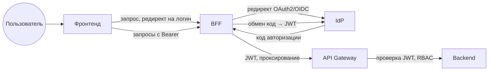

### 9.3. API Gateway и точка входа

Роль шлюза в подсистеме и связь с требованиями ТЗ приведены в п. 1.1 и 1.2. 
Ниже — назначение компонента в архитектуре, последовательность обработки запроса, реализация на базе Kong, логирование и перспектива замены.

#### 9.3.1. Назначение и место в подсистеме

API Gateway выступает **единственной точкой входа** для всех запросов к серверной части Системы (веб-интерфейс через BFF, внешние клиенты, при необходимости мобильные приложения и запросы от других backend-сервисов — п. 1.4.9). 
Все запросы к backend-компонентам проходят через шлюз; прямой доступ к backend в обход шлюза не предусмотрен. 
На шлюз возлагаются: принудительная проверка аутентификации (валидность JWT), проверка прав доступа по ролям (RBAC), ограничение частоты запросов, маршрутизация на соответствующие компоненты и аудит каждого запроса. 
Таким образом, backend получает только уже провалидированные запросы с контекстом авторизации (идентификатор пользователя, роли).

#### 9.3.2. Последовательность обработки запроса

Для каждого входящего запроса шлюз выполняет следующие шаги. 
1. **Приём запроса** и извлечение JWT из заголовка `Authorization: Bearer <token>`. 
2. **Аутентификация:** проверка подписи и срока действия JWT по публичным ключам IdP (JWKS или PEM); при отсутствии токена, невалидной подписи или истечении срока — ответ **401 Unauthorized**, запрос на backend не передаётся, событие логируется. 
3. **Авторизация (RBAC):** для пары «метод HTTP + путь» проверяется, разрешена ли операция для хотя бы одной из ролей пользователя, извлечённых из JWT; при недостаточных правах — **403 Forbidden**, backend не вызывается. 
4. **Ограничение частоты:** не более 100 запросов в минуту на одного аутентифицированного пользователя (п. 4.1.1 ТЗ); при превышении — **429 Too Many Requests**. 
5. **Маршрутизация:** запрос вместе с контекстом авторизации (идентификатор пользователя, роли) направляется на соответствующий backend-компонент согласно правилам (маппинг «путь + метод» → целевой компонент). 
6. **Ответ:** ответ backend возвращается клиенту через шлюз; при таймауте или ошибке компонента шлюз формирует ответ с кодом 5xx и фиксирует событие. 
Порядок плагинов на маршруте: сначала проверка JWT, затем RBAC, затем при необходимости rate limiting и маршрутизация. Схема шагов приведена на [рис. 2](#fig-2).

**Рис. 2. Последовательность обработки запроса на API Gateway** <a id="fig-2"></a>

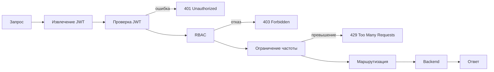

#### 9.3.3. Реализация (Kong OSS) на стадии технического проекта (прототипирования) или реализации.

В реализации прототипирования используется Kong OSS.
 - Конфигурация задаётся декларативно; файл `iam/kong/kong.yml`, режим DB-less; маршруты, плагины и параметры описываются в YAML и применяются при старте контейнера. 
 - Внешний доступ к API — по порту 8001 (HTTP); при необходимости добавляется HTTPS (порт 8444) и reverse proxy с TLS.
 - Маршрут `/api` проксируется на backend-компоненты;
 - Запросы к путям, не входящим в конфигурацию, могут возвращать 404. 
 - Проверка JWT выполняется по ключам IdP (OpenID Connect). 
В Kong OSS плагин **openid-connect** недоступен (входит в Kong Enterprise), поэтому используется встроенный плагин **jwt**: в конфигурацию подставляются публичный ключ (PEM) и идентификатор ключа (kid) из IdP Authentik; JWKS провайдера приложения доступен по URL вида `.../application/o/<slug>/jwks/`. 
Скрипт `iam/kong/scripts/setup-kong-jwt-auth.sh` позволяет автоматически получить ключи из Authentik и обновить `kong.yml`. 
Проверка RBAC по ролям из JWT в Kong OSS требует дополнительной логики (например, плагин pre-function с кодом на Lua и таблица правил «метод + путь → разрешённые роли»); таблица хранится в конфигурации шлюза и обновляется при изменении матрицы доступа.

#### 9.3.4. Логирование и интеграция с SIEM

Каждый запрос, проходящий через API Gateway, логируется с метаданными: IP-адрес клиента, идентификатор пользователя (из JWT), время запроса, метод и путь, HTTP-статус ответа, задержка. События отказа в доступе (401, 403, 429) фиксируются отдельно и могут передаваться в систему SIEM Заказчика (п. 4.1.4 ТЗ).

**Реализация в Kong OSS.** 
Для логирования используются встроенные плагины Kong OSS: 
**File Log** (запись в файл, в т.ч. JSON), 
**Syslog** (отправка в syslog-сервер), 
**HTTP Log** (отправка каждой записи POST на заданный URL). 

Плагин подключается к сервисам/маршрутам или глобально в конфигурации (`kong.yml`); в лог по умолчанию попадают client_ip, метод и путь запроса, код ответа, задержка. 

Идентификатор пользователя из JWT в стандартные плагины не подставляется автоматически: для его добавления в лог применяют плагин **Request Transformer** или **Pre-function** (Lua) — после проверки JWT извлечь claim (например, `sub`) из контекста и записать в заголовок запроса (например, `X-User-Id`), который затем включается в тело лога; либо реализуют кастомный плагин логирования, добавляющий в запись поля из JWT. 

События 401, 403, 429 либо выделяются в SIEM правилами/фильтрами по полю статуса в общем потоке логов, либо настраивается отдельный экземпляр плагина (например, HTTP Log) только для отказов в доступе с отдельным endpoint или тегом.

Доставка в SIEM Заказчика: 
По протоколу **syslog** (плагин Syslog, хост/порт приёмника SIEM); 
Через **файл** — File Log пишет в файл, сборщик (Filebeat, Fluentd, Vector и т.п.) доставляет логи в SIEM (Elasticsearch, Splunk, QRadar и др.) по поддерживаемому протоколу; 
По **HTTP** — плагин HTTP Log отправляет события на URL, принимаемый SIEM или промежуточным приёмником. 
Конкретный формат и способ интеграции уточняются с Заказчиком в соответствии с п. 4.1.4 ТЗ; на этапе тех.проекта или реализации.

#### 9.3.5. Взаимодействие с IdP

Шлюз не обращается к IdP при каждом запросе: проверка JWT выполняется локально по публичным ключам IdP (Authentik). 
Синхронизация ключей (обновление PEM в конфигурации Kong) выполняется при развёртывании или по процедуре обновления (например, скрипт setup-kong-jwt-auth.sh).

### 9.4. Аутентификация

Подраздел раскрывает установление и проверку личности пользователя: понятие аутентификации, состав компонента (IdP, BFF, фронтенд), процесс входа и выдачи токена, обоснование выбора IdP; интеграция с корпоративным каталогом (п. 1.4.8), аутентификация сервисов бэкенда между собой (п. 1.4.9). 
Обоснование архитектурного варианта (OAuth2/OIDC, IdP в контуре Заказчика, BFF) — п. 1.1 и 1.2; проверка прав (авторизация) — п. 1.5. 
Детали реализации — п. 3.8.1 документа «Описание программного обеспечения».

#### 9.4.1. Понятие аутентификации

*Аутентификация* — установление и проверка личности субъекта (пользователя или компонента): подтверждение того, что субъект является тем, за кого себя выдаёт. Пользователь предъявляет учётные данные (логин и пароль, сертификат, биометрию или второй фактор — TOTP, FIDO2); система проверяет их и при успехе связывает сессию или выданный токен с идентификатором. 

Результат аутентификации — уверенность в том, *кто* обращается к системе. 

В ИС «Фармадок» аутентификация обеспечивается IdP (проверка учётных данных, при необходимости MFA, выдача JWT); после входа права пользователя проверяются при каждом запросе по утверждениям в JWT (авторизация — п. 1.5).

#### 9.4.2. Назначение и состав компонента

Компоненты аутентификации и авторизации выступают источником *идентичности* пользователя и *сведений о его правах* для всей Системы: установление личности при входе, выдача JWT для последующих запросов к API, передача контекста прав в API Gateway и backend (решения о допуске принимаются на шлюзе и backend по утверждениям в JWT).

Требования ТЗ: п. 4.1.1, 4.1.4 ТЗ (см. п. 1.1.1). 


**IdP (Identity Provider):** 
В конфигурации на стадии прототипирования — Authentik или Keycloak по согласованию с Заказчиком; проверяет учётные данные, при необходимости проводит MFA, выдаёт JWT с утверждениями о пользователе и ролях (или группах, отображаемых на роли). Обоснование выбора IdP — п. 1.4.5.

**BFF (Backend for Frontend):** 
Через него фронтенд входит в систему и обращается к API; выполняет обмен кода авторизации на токен и проксирует запросы к API с подстановкой JWT.

**Фронтенд:**
Браузерное приложение; инициация входа (редирект на IdP) и вызовы функциональности через BFF. Логически компонент расположен между клиентом и API Gateway: клиент обращается к IdP за токеном через BFF; шлюз проверяет JWT и извлекает контекст прав; backend получает контекст от шлюза и не обращается к IdP напрямую.

#### 9.4.3. SSO (единый вход)

*Single Sign-On (SSO)* — возможность один раз пройти аутентификацию в едином IdP и затем обращаться ко всем приложениям и сервисам Системы без повторного ввода учётных данных.
В ИС «Фармадок» SSO обеспечивается за счёт централизованного IdP (Authentik или согласованный с Заказчиком OIDC-совместимый провайдер) и протоколов OAuth2/OpenID Connect:
- после успешного входа в IdP пользователь получает JWT; 
- при обращении к другим приложениям в контуре (фронтенд, API через BFF) повторная аутентификация не требуется — шлюз и backend доверяют утверждениям в токене.

Требование единого входа задано ТЗ: п. 4.1.1. 
Детали процесса входа и выдачи токена — п. 1.4.4 ([рис. 3](#fig-3)); обоснование выбора IdP — п. 1.2 и п. 1.4.5.

#### 9.4.4. Процесс входа и выдачи токена

1. Пользователь открывает фронтенд по адресу BFF.
2. При необходимости входа фронтенд обращается к BFF (эндпоинт входа); BFF перенаправляет браузер на IdP с параметрами протокола Authorization Code + PKCE (code_challenge, state, redirect_uri, client_id, scope).
3. Пользователь вводит учётные данные (и при необходимости проходит MFA) на стороне IdP. 
4. После успешной аутентификации IdP редиректит браузер на callback BFF с кодом авторизации. 
5. Фронтенд передаёт код и code_verifier на BFF (POST `/auth/exchange`); BFF обменивает их на access_token (и при необходимости refresh_token) через token endpoint IdP.
6. При последующих запросах к функциональности Системы фронтенд обращается к BFF; BFF проксирует запросы в API Gateway с заголовком `Authorization: Bearer <token>`. Шлюз проверяет JWT и RBAC (последовательность обработки запроса на шлюзе — п. 1.3.2, [рис. 2](#fig-2)) и при успехе передаёт запрос на backend с контекстом авторизации. 
Секреты клиента (client_secret при наличии) и долгоживущие токены не попадают в браузер — это соответствует рекомендациям по безопасному использованию OAuth2/OIDC для фронтенда. Последовательность взаимодействия отражена на [рис. 3](#fig-3).

**Рис. 3. Поток входа и выдачи токена (Authorization Code + PKCE)** <a id="fig-3"></a>

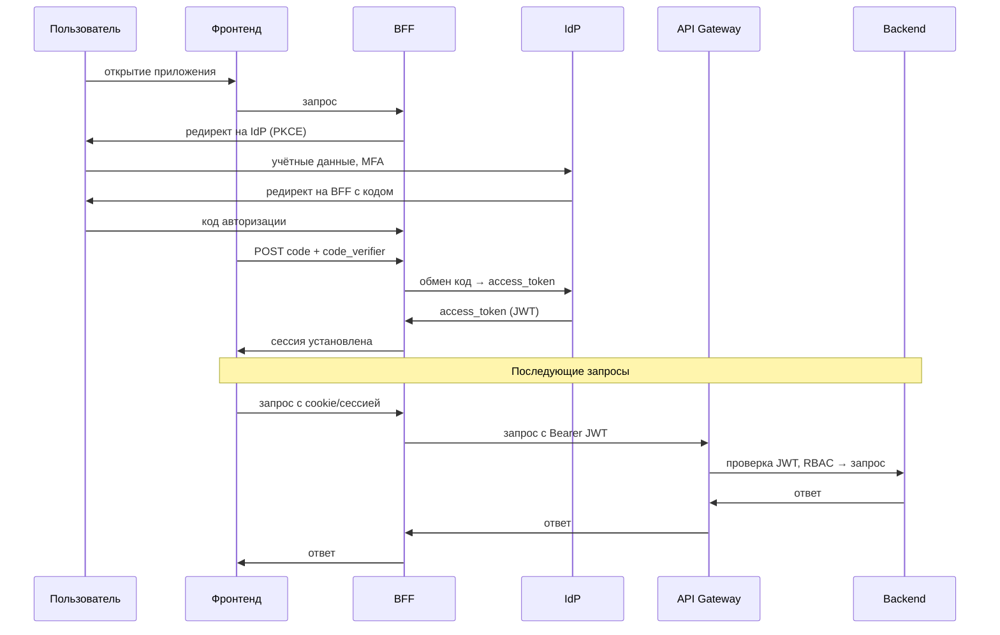

#### 9.4.5. Обоснование выбора IdP (Authentik и альтернативы)

В качестве IdP на стадии прототипирования выбран Authentik; при утверждённом корпоративном IdP Заказчика (в т.ч. Keycloak) допускается его использование по согласованию.

- **Authentik** — открытое ПО (лицензия MIT), развёртывание на собственной инфраструктуре. Поддерживает OAuth 2.0, OpenID Connect, JWT, MFA (TOTP, FIDO2), интеграцию с LDAP и др. В репозитории предусмотрены: готовый docker-compose, интеграция с HashiCorp Vault (скрипт run-authentik-with-vault.sh), blueprint провайдера OIDC и приложения (farmadoc-oidc), скрипт настройки Kong (setup-kong-jwt-auth.sh). Это сокращает сроки развёртывания и обеспечивает единообразие конфигурации без привязки к облаку и без передачи данных аутентификации за пределы контура Заказчика.

- **Keycloak** — открытый IdP (Red Hat), OAuth2/OIDC, MFA, LDAP. Выбор обоснован, если у Заказчика уже развёрнут Keycloak как корпоративный стандарт; интеграция с Kong (JWKS) и BFF аналогична. В конфигурации на стадии прототипирования выбран Authentik из соображений ресурсоёмкости (Keycloak тяжелее по памяти и образу) и наличия готовых скриптов и blueprints; при переходе на Keycloak потребуются подстановка JWKS в Kong и настройка BFF на discovery Keycloak.

- **Облачные IdP (Auth0, Okta, Azure AD, Google Identity и др.)** — передача аутентификации и учётных данных третьей стороне. Для ИС «Фармадок» не рекомендуется как основной вариант из-за п. 4.1.4 ТЗ и конфиденциальности (персональные данные, данные экспертиз). Допустимо только при явном согласии Заказчика и соответствии провайдера политике по размещению данных.

- **Самописный IdP** — разработка собственного сервера с OAuth2/OIDC и MFA. Требует больших трудозатрат, дублирует зрелые решения и увеличивает риски уязвимостей. Не рекомендуется при наличии готовых IdP (Authentik, Keycloak), удовлетворяющих ТЗ.

Итого: принят Authentik как баланс между полнотой функций (SSO, MFA, OIDC, LDAP), независимостью от облака, открытой лицензией и удобством развёртывания (Vault, скрипты, blueprint). Замена на иной OIDC-совместимый IdP (например Keycloak) возможна без изменения архитектуры: BFF и Kong работают с любым таким IdP. Интеграция с корпоративным AD (федерация и маппинг групп в роли) — п. 1.4.8.

#### 9.4.6. MFA (многофакторная аутентификация)

*Многофакторная аутентификация (MFA)* — проверка личности пользователя по двум и более факторам: не только «что пользователь знает» (пароль), но и «что пользователь имеет» (TOTP-код с устройства, ключ безопасности) или «кто пользователь» (биометрия). MFA снижает риски при компрометации пароля и соответствует требованию ТЗ п. 4.1.4 (защита информации, MFA при необходимости). В ИС «Фармадок» MFA реализуется на стороне IdP: после ввода логина и пароля IdP при необходимости запрашивает второй фактор; при успешной проверке выдаётся JWT. 

Поддерживаемые методы в Authentik и Keycloak: 
- **TOTP** (одноразовые коды по времени, приложения типа Google Authenticator, Authenticator); 
- **FIDO2/WebAuthn** (аппаратные ключи или платформенный аутентификатор). 
Включение MFA, выбор методов и назначение политик (обязательный второй фактор для ролей или приложений) настраиваются в IdP; архитектура входа (BFF, OIDC, JWT) при этом не меняется. 

Детали настройки MFA — в документации IdP и п. 3.8.1 документа «Описание программного обеспечения».

#### 9.4.7. Backend, фронтенд и BFF

Серверная часть Системы (backend) реализуется на Python 3.11 и выше с использованием FastAPI или эквивалента.
Доступ к backend извне — только через API Gateway (п. 1.3); запросы приходят с проверенным JWT и контекстом авторизации.

**Фронтенд.** 
Пользовательский веб-интерфейс (п. 4.1.1 ТЗ) выполняется в виде многостраничного приложения (MPA) на Vue.js (шаблоны на стороне сервера, переходы по страницам с полной перезагрузкой); конкретный выбор фреймворка уточняется на этапе технического проектирования или реализации. 
Допускается также реализация в виде одностраничного приложения (SPA) с серверным рендерингом. IdP, Kong и общая схема аутентификации (OAuth2/OIDC, JWT, SSO) при этом не меняются; отличия касаются места хранения токена и потока входа (см. ниже).

**BFF.** 
Backend for Frontend — серверное приложение между фронтендом и IdP/API Gateway. BFF инициирует редирект пользователя на IdP для входа, принимает callback с кодом авторизации, обменивает код на JWT у IdP и хранит токен (или привязывает его к сессии); при последующих запросах к функциональности Системы BFF проксирует их в Kong с заголовком `Authorization: Bearer <token>`. Секреты и долгоживущие токены в браузер не передаются (п. 1.4.4). Детали потока зависят от типа фронтенда (MPA или SPA) — см. варианты ниже.

При использовании MPA логику входа и прокси к API можно разместить в backend MPA (объединённый вариант) или оставить в отдельном BFF. Для SPA отдельный BFF фактически обязателен с точки зрения безопасности (п. 1.4.4); обмен кода на токен выполняется в BFF, конфигурация (discovery, endpoints) и долгоживущие токены остаются на сервере — рекомендации OAuth 2.0 Security BCP и RFC 8252 для публичных клиентов. Кроме того, SPA не реализует протокол OIDC целиком: конфигурация (discovery, endpoints) и обмен код→токен выполняет BFF, фронтенд лишь инициирует вход и передаёт код после редиректа; упрощается разработка и обновление клиента при смене IdP.

Преимущества отдельного BFF (для MPA и SPA): 
 - a. Разделение ответственности — backend MPA (или статика SPA) не содержит логики входа и вызовов Kong; смена IdP или параметров шлюза не затрагивает код фронтенда; 
 - b. Единый слой входа для разных клиентов — один BFF может обслуживать MPA, SPA и иные клиенты без дублирования OAuth-логики; 
 - c. Концентрация секретов в одном месте — JWT и конфигурация OIDC только в BFF;
 - d. Упрощение приложения фронтенда — отсутствие зависимостей от OIDC-клиентов и прямых вызовов Kong; 
 - e. Независимое развёртывание и масштабирование BFF и приложения (MPA или статики SPA); 
 - f. Единая точка аудита и логирования обмена токенов и запросов к API;
 - g. Возможность гибридной схемы (часть интерфейса MPA, часть SPA) с одной сессией и одним BFF.

Переменные окружения BFF: 
    OIDC_DISCOVERY_URL, OIDC_CLIENT_ID, OIDC_REDIRECT_URI, при необходимости PORT. Значение redirect_uri должно совпадать с настройками провайдера в Authentik. Развёртывание: конфигурация задаётся переменными окружения (или секрет-менеджером) на сервере BFF; в Authentik у провайдера должен быть заведён redirect URI приложения.

**Вариант MPA + BFF** 
Обмен кода на токен выполняется целиком на BFF: 
 - callback после входа в IdP приходит на BFF;
 - BFF обменивает код на токен, сохраняет JWT в серверной сессии и выдаёт браузеру только cookie сессии. 
 - JWT в браузер не передаётся. 
 - Эндпоинты GET `/config.json` и POST `/auth/exchange` для браузера не требуются; вместо них — обработчик GET callback на BFF (например, `/auth/callback?code=...`). 

Запросы к API идут с BFF: 
 - браузер отправляет cookie,
 - BFF по сессии подставляет JWT и проксирует запрос в Kong (или сам вызывает Kong с токеном из сессии).

IdP, Kong, требования ТЗ к единому входу и защите данных сохраняются.

**Вариант SPA + BFF.** 
BFF:
 - раздаёт статику SPA; 
 - отдаёт конфигурацию OIDC по запросу GET `/config.json`; 
 - обрабатывает обмен кода на токен (POST `/auth/exchange`); 
 - проксирует запросы к API (пути `/api/...`) в Kong с заголовком `Authorization: Bearer <token>`. 
  
Браузер инициирует вход через BFF; после редиректа с IdP SPA передаёт код авторизации на BFF, BFF обменивает код на JWT и при последующих запросах подставляет токен при проксировании в Kong (п. 1.4.4).

#### 9.4.8. Интеграция с корпоративным каталогом (AD-федерация)

Интеграция с корпоративным Active Directory позволяет организовать вход пользователей по учётным данным AD и использовать группы AD для разграничения доступа в Системе (в соответствии с упоминаниями в п. 1.1–1.2 об интеграции с инфраструктурой Заказчика).

**Аутентификация (вход через AD-федерацию).** 
IdP (Authentik или Keycloak) настраивается на использование AD как источника идентичности: подключение по LDAP/LDAPS.
- Пользователь вводит логин и пароль AD; 
- IdP проверяет их по AD, при успехе выдаёт JWT. 
Поток для клиента (BFF, OIDC) не меняется — меняется только источник учётных данных на стороне IdP (п. 1.4.4, 1.4.5; Authentik и Keycloak поддерживают LDAP и федерацию).

**Авторизация (роли из групп AD).** 
В IdP настраивается маппинг групп (или атрибутов) AD в утверждения JWT (например, группы AD → claim `groups` или `roles`). Шлюз и backend используют эти утверждения для RBAC по п. 1.5; дополнительная настройка — в п. 1.5.3 (настройка авторизации). 
Права доступа в ИС «Фармадок» могут таким образом определяться членством в группах AD без дублирования учёта в самом IdP.

Развёртывание и настройка федерации с AD выполняются по согласованию с Заказчиком (LDAP). Учётные данные проверяются в контуре Заказчика (IdP и AD внутри контура или через защищённый канал), что соответствует п. 4.1.4 ТЗ по конфиденциальности. Детали настройки LDAP и маппинга групп — в документации IdP (Authentik, Keycloak) и при необходимости в п. 3.8.1 документа «Описание программного обеспечения».

#### 9.4.9. Аутентификация сервисов бэкенда между собой

При вызове одного компонента бэкенда другим вызываемый сервис должен проверять легитимность вызова. Рассматривались следующие варианты. 
- **1. Client Credentials (OAuth2):** 
Сервисы регистрируются в IdP как confidential-клиенты, получают JWT по client_id/client_secret и передают его в запросе; проверка по ключам IdP. 
- **2. Прокидывание пользовательского JWT:**
При вызове в контексте запроса пользователя — передача того же JWT, что пришёл в первый сервис; подходит для цепочки вызовов «от имени» пользователя, не подходит для фоновых вызовов без пользователя. 
- **3. Внутренний API-ключ или shared secret:**
Заголовок с секретом, проверяемым Kong или сервисом; простая реализация, но один скомпрометированный ключ открывает доступ, ротация и учёт сложнее. 
- **4. mTLS (взаимная TLS-аутентификация):**
Сертификаты на стороне сервисов; сильная аутентификация, но отдельная инфраструктура сертификатов. 
- **5. Без аутентификации (доверие внутренней сети):** 
Вызовы внутри контура считаются доверенными; риск при компрометации любого компонента или сегмента сети.

Выбор: 
**Client Credentials** в качестве основного механизма для сервис-сервис вызовов без пользовательского контекста, при необходимости в сочетании с **прокидыванием пользовательского JWT** для вызовов в рамках запроса пользователя. 
Обоснование: 
- единый IdP для пользовательских и сервисных токенов, стандартный OAuth2, отзыв через IdP, отсутствие распространения секретов между сервисами; 
- Kong и backend уже проверяют JWT по ключам IdP (п. 1.3.5). 

Реализация выбранного способа — **Client Credentials (OAuth2)**. 
- Сервисы регистрируются в IdP (Authentik) как confidential-клиенты (client_id и client_secret).
- При необходимости вызвать другой сервис вызывающий компонент запрашивает у IdP access token (POST к token endpoint с grant_type=client_credentials);
- IdP выдаёт JWT с утверждениями о вызывающем сервисе (например, sub или client_id, при необходимости aud).
- Вызов выполняется с заголовком `Authorization: Bearer <token>`; 
- Kong или принимающий сервис проверяет подпись и срок действия токена по публичным ключам IdP (те же, что для пользовательских JWT — п. 1.3.5), при необходимости — по audience или иным claims. 
Секреты между сервисами не передаются; единая точка выдачи и отзыва — IdP. Поток аутентификации сервисов показан на [рис. 4](#fig-4).

**Рис. 4. Аутентификация сервисов бэкенда (Client Credentials)** <a id="fig-4"></a>

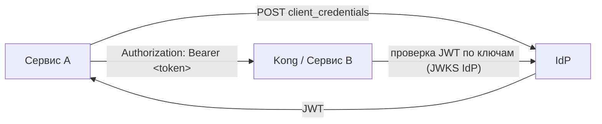

Варианты контекста вызова: 
- a. При вызове в рамках запроса пользователя допустимо прокидывать пользовательский JWT (тот же, что пришёл в первый сервис через Kong), чтобы у вызываемого сервиса был полный контекст пользователя для RBAC и аудита; 
- b. Для фоновых или сервисных вызовов без пользователя (очереди, планировщики) используется только Client Credentials. В Kong настраиваются отдельные маршруты или правила для приёма сервисных токенов (различие по audience или claim), чтобы разделять пользовательский и сервисный трафик.

#### 9.4.10. Ссылки на реализацию
Детали реализации (настройка провайдера и приложения в IdP, конфигурация BFF, пошаговый поток, взаимодействие компонентов, входы и выходы компонента, хранение секретов, интеграция с AD — п. 1.4.8, аутентификация сервисов — п. 1.4.9) — п. 3.8.1 документа «Описание программного обеспечения». 

### 9.5. Авторизация

Подраздел раскрывает проверку прав доступа: понятие авторизации, двухуровневую модель (шлюз и backend), настройку RBAC. 
Последовательность проверки JWT и RBAC на шлюзе — п. 1.3 и [рис. 2](#fig-2).

#### 9.5.1. Понятие авторизации

*Авторизация* — проверка прав субъекта на выполнение действия или доступ к ресурсу: разрешено ли уже опознанному пользователю выполнить операцию, прочитать документ, вызвать эндпоинт API. Авторизация опирается на результат аутентификации (идентификатор и атрибуты, например роли) и на правила разграничения доступа (матрица «кто — что может»). Результат авторизации — решение *разрешить* или *запретить* доступ. 
В ИС «Фармадок» авторизация реализована проверкой прав по ролям (RBAC) на уровне API Gateway и backend при каждом запросе по утверждениям в JWT.

#### 9.5.2. Двухуровневая авторизация (RBAC)

Авторизация реализуется в два уровня. 
- **1. На уровне API Gateway (п. 1.3):** для пары «метод HTTP + путь» проверяется разрешённость операции для ролей из JWT; при недостаточных правах возвращается 403 Forbidden до вызова backend. Тем самым решается вопрос *доступа к эндпоинту*. 
- **2. На уровне backend:** проверка прав при доступе к конкретным данным (например, Retriever возвращает только документы по ролевой модели) и при выполнении изменяющих операций (создание, изменение, удаление). Тем самым решается вопрос *доступа к данным и операциям*. 

Ролевая модель поддерживается назначением ролей в IdP и передачей утверждений (роли/группы) в JWT; матрица «роль — операции и данные» уточняется на этапах технического проектирования и реализации.

#### 9.5.3. Настройка авторизации

Настройка выполняется в двух местах.
- **1. IdP (Authentik):** в провайдере или приложении OIDC настраивается включение ролей или групп пользователя в JWT (custom claims или стандартные scopes); задаётся маппинг «роль/группа в IdP — имя утверждения в токене» (например `groups`, `roles`), чтобы шлюз и backend единообразно читали список ролей. Роли могут поступать из групп AD при федерации с корпоративным каталогом (п. 1.4.8). 
- **2. API Gateway (Kong):** задаются правила вида «для пути X и методов M разрешены роли R»; в Kong OSS проверка по ролям из JWT реализована через дополнительную логику (плагин pre-function, таблица правил в конфиге), см. п. 1.3. 

Хранение таблицы правил и порядок плагинов на маршруте — п. 1.3.2 и 1.3.3. Детали настройки — п. 3.8.2 документа «Описание программного обеспечения», iam/docs/kong.md.

#### 9.5.4. Ссылки на реализацию

Ролевая модель RBAC с перечнем ролей, взаимодействие компонентов — п. 3.8.1 документа «Описание программного обеспечения». 

### 9.6. Ограничения текущей реализации и перспектива замены

Kong выбран Заказчиком в качестве API Gateway в исходном техническом задании на стадии конкурсного отбора. 
На стадии прототипирования были выявлены недостатки:
- усложнённая схема авторизации (в Kong OSS нет плагина openid-connect; поддержка OIDC — лишь косвенно, через плагин JWT с ручной подстановкой ключей; проверка RBAC по ролям из JWT требует плагина pre-function и кода на Lua); 
- отсутствие в открытой версии нативной поддержки OIDC (discovery по URL IdP, проверка токена без ручного обновления PEM). 

На этапе технической реализации по согласованию с Заказчиком целесообразно рассмотреть возможность замены Kong на **Apache APISIX**: 
- в открытой версии APISIX доступен плагин openid-connect (интеграция с IdP по discovery, проверка Bearer-токена по JWKS), что упростит настройку аутентификации и авторизации по ролям из JWT без кастомного Lua. 
- при замене потребуются обновление конфигурации шлюза, адаптация скриптов развёртывания и документации;
- архитектура (BFF → шлюз → backend, проверка JWT и RBAC на шлюзе) сохраняется.


Ниже приведен полный текст раздела 10 настоящей записки:


## 10. Подсистема хранения ключей и секретов, аудита, мониторинга и логирования

Подраздел описывает архитектуру и обоснование решений по: 
 - 1. централизованному хранению секретов и ключевого материала; 
 - 2. журналированию действий пользователей и системных событий, пригодному для расследований и соответствия требованиям ИБ; 
 - 3. мониторингу технического состояния и производительности компонентов; 
 - 4. сбору, хранению и анализу операционных логов приложений и платформы.

### 10.0. Глоссарий
- **секрет** — конфиденциальные данные конфигурации (пароли СУБД, API-ключи, client_secret, строки подключения, TLS-ключи и сертификаты прикладного уровня и т.п.), которые не должны храниться в исходном коде или незащищённых файлах образов;
- **ключ шифрования** — криптографический ключ или материал для шифрования данных на покое (хранимые данные, резервные копии, тома с документами); в обобщённом виде может управляться тем же контуром, что и секреты;
- **Vault** — HashiCorp Vault или функциональный аналог (кор­по­ра­тив­ный секрет-менеджер);
- **аудит (security audit)** — фиксация значимых событий безопасности и подотчётных действий (вход, отказ в доступе, изменение прав, обращение к секретам, административные операции) с привязкой к субъекту и времени;
- **SIEM** — система управления событиями и информацией о безопасности (централизованный приём, корреляция и анализ событий);
- **метрика** — числовой показатель работы компонента (задержка, ошибки, утилизация ресурсов, размер очередей);
- **наблюдаемость (observability)** — совокупность метрик, логов и (при необходимости) трасс для диагностики состояния системы;
- **ретенция** — срок и политика хранения журналов и аудита;
- **ELK** — стек Elasticsearch, Logstash, Kibana или эквивалент (OpenSearch, Loki+Grafana и т.п.) для централизованного поиска по логам.

### 10.1. Обзор подсистемы: проблема, подходы, требования

#### 10.1.1. Проблема и требования

ИС «Фармадок» обрабатывает фармацевтическую документацию, персональные данные и сведения экспертиз. Без выделенного контура для секретов, аудита, мониторинга и логирования:

1. **секреты** оказываются в переменных окружения на хостах, в репозиториях или образах — что увеличивает риск утечки и затрудняет ротацию;
2. **расследование инцидентов** и демонстрация соответствия регламентам требуют целостной цепочки записей «кто — что — когда»; разрозненные логи на контейнерах без доставки в единое хранилище не обеспечивают приемлемого уровня аудита;
3. **эксплуатация** (дежурства, плановые работы) нуждается в проактивном обнаружении деградации (рост задержек, отказы зависимостей), что невозможно без метрик и оповещений;
4. **устранение сбоев** замедляется, если прикладные и инфраструктурные логи не структурированы и не коррелируются по идентификатору запроса.

Требования ТЗ (в части, касающейся настоящей подсистемы): 
 - п. 4.1.1 — единая точка входа с **логированием запросов**; 
 - п. 4.1.4 — **журналирование действий пользователей и системных событий**, возможность **интеграции с SIEM**, **шифрование** каналов и хранимых данных, что предполагает **управление ключами и секретами**; 
 - п. 4.1.3 — **резервное копирование с шифрованием**, связанное с политикой ключей. 
 В документе «Описание архитектуры» (Architecture) принцип **наблюдаемости**, разделы о безопасности и стеке технологий (в т.ч. ELK, Prometheus, Grafana) согласуются с настоящим подразделом.

#### 10.1.2. Существующие подходы

**Хранение секретов:**
 - распределённое хранение в конфигурации хостов;
 - секреты Kubernetes (или Sealed Secrets); 
 - облачные Secret Manager / Key Vault; специализированные хранилища с политиками доступа и аудитом (HashiCorp Vault и аналоги); 
 - шифрование секретов в Git (SOPS). 

 Для контура Заказчика без обязательного Kubernetes и с требованием независимости от внешнего облака приоритетны решения класса Vault или утверждённый корпоративный секрет-менеджер.

**Аудит:**
 - запись в реляционную СУБД (таблицы аудита приложения);
 - неизменяемые журналы (WORM-системы, отдельный контур) — для усиленных сценариев;
 - экспорт в SIEM (syslog, CEF, JSON по API).
 
 Сочетание **прикладного аудита** (бизнес-действия) и **платформенного** (шлюз, IdP, Vault) даёт полноту картины.

**Мониторинг:**
 - сбор метрик в формате Prometheus;
 - визуализация и дашборды в Grafana; 
 - оповещения по порогам и алертам.

Альтернативы — экосистемы Zabbix, Nagios, облачные APM. 
Для микросервисной архитектуры стек Prometheus+Grafana является распространённым стандартом.

**Логирование:** 
- стек Elasticsearch/OpenSearch (агенты + индекс + UI) даёт мощный полнотекстовый поиск и сложную аналитику;
- стек Loki+Grafana (с Promtail/Fluent Bit/Vector) ориентирован на хранение и поиск логов по меткам (labels) с меньшими накладными расходами на индекс;
- требование интеграции с SIEM может реализовываться дублированием критичных событий в поток SIEM помимо общего лог-хранилища.

Для ИС «Фармадок» в качестве базового варианта целесообразно рассматривать **Loki+Grafana**: стек уже включает Grafana для метрик, а модель Loki (индексация меток вместо полного текста) упрощает эксплуатацию и снижает требования к ресурсам при типовых нагрузках микросервисной архитектуры. Elasticsearch/OpenSearch остаётся допустимой альтернативой при усиленных требованиях к полнотекстовой аналитике.

### 10.2. Обоснование выбора и состав подсистемы

#### 10.2.1. Принятые решения (реализация на стадии прототипирования / ТП)

1. **Секреты и ключевой материал**
 - **HashiCorp Vault** (или утверждённый Заказчиком аналог) в контуре организации;
 - приложения получают секреты по API/агенту с политиками доступа;
 - ротация — по регламенту без пересборки образов с захардкоженными паролями.

2. **Аудит** — события безопасности и значимые действия:
 - запись в **PostgreSQL** (метаданные, журнал приложения),
 - **логи API Gateway** (п. 1.3.4 документа по аутентификации),
 - **аудит IdP** (вход, MFA),
 - **аудит обращений к Vault**;
 -  выборочная или полная **доставка в SIEM** Заказчика по п. 4.1.4 ТЗ.

3. **Мониторинг** 
 - **Prometheus** (сбор метрик с сервисов и инфраструктуры),
 - **Grafana** (дашборды и алерты);
 - при необходимости — экспорт в корпоративные системы мониторинга Заказчика.

4. **Централизованные логи**
- основной вариант — **Loki+Grafana** (агент Promtail/Fluent Bit/Vector, хранение в Loki, поиск и дашборды в Grafana);
- альтернативный вариант — стек **ELK/OpenSearch** по согласованию с Заказчиком;
- структурированный формат (JSON);
- **correlation/request ID** для связки записей шлюза, BFF и backend;
- единая схема labels: `service`, `env`, `namespace`, `instance`, `route`, `level`.

Указанный набор обеспечивает выполнение требований ТЗ к журналированию и интеграции с SIEM, разделение хранения секретов и кода, наблюдаемость для приёмки по производительности (п. 4.1.2 ТЗ) и эксплуатационную устойчивость (п. 4.1.3 ТЗ), без привязки к конкретному публичному облаку.

#### 10.2.2. Состав и взаимодействие компонентов

**Рис. 1. Логические потоки подсистемы наблюдаемости и аудита** <a id="fig-1"></a>

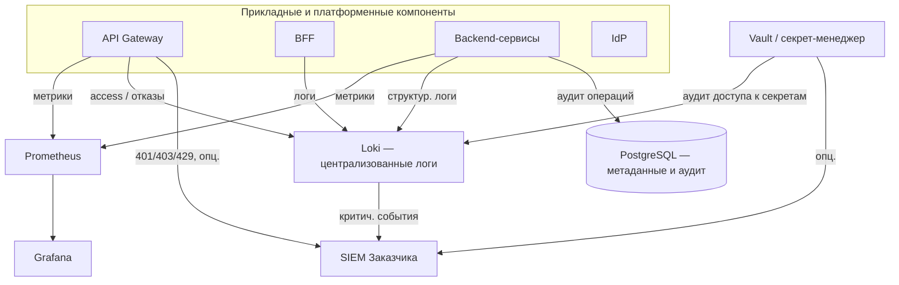

Связь с подсистемой аутентификации: шлюз уже обеспечивает первичный **access-лог** каждого вызова API; настоящий документ задаёт, как эти и прочие события включаются в общий контур **аудита**, **логов** и **метрик**.

### 10.3. Хранение ключей и секретов

#### 10.3.1. Назначение

Централизованное хранение паролей СУБД, ключей для шифрования томов с документами (при отдельном управлении), client_secret сервисов, учётных данных для интеграций и иных секретов с **разграничением доступа по политикам** и **аудитом чтения**.

#### 10.3.2. Обоснование выбора HashiCorp Vault среди альтернатив

Требования п. 4.1.1 и п. 4.1.4 ТЗ к централизованному хранению секретов и ключей допускают различные реализации. Рассматривались: облачные секрет-менеджеры (AWS Secrets Manager, Azure Key Vault, Google Secret Manager), механизмы Kubernetes (Secrets, Sealed Secrets), SOPS/Helm secrets, хранение только в переменных окружения на хосте.

**HashiCorp Vault** выбран по причинам, изложенным в пояснительной записке к ТЗ (раздел 10 исходной редакции), в частности:

1. **Независимость от облачного провайдера** — развёртывание на инфраструктуре Заказчика;
2. **Единый API, политики ACL, аудит** обращений к секретам, интеграция с LDAP/OIDC по согласованию;
3. **Применимость при Docker Compose** и классическом развёртывании без обязательного Kubernetes;
4. **Разделение** кода и секретов, **ротация** без изменения образов приложений.

При наличии у Заказчика утверждённого корпоративного секрет-менеджера допускается его замена при сохранении принципов: секреты не в Git, выдача по ролям, аудит, регламент ротации. В репозитории прототипа предусмотрена интеграция IdP (Authentik) с Vault (см. скрипты развёртывания в документации проекта).

#### 10.3.3. Практические требования

- каталог секретов по сервисам и средам (dev/test/prod);  
- минимальные права приложений (**least privilege**);  
- регламент **ротации** паролей и ключей;  
- запрет логирования значений секретов в прикладных логах;  
- резервное копирование состояния Vault и процедуры восстановления (согласовать с п. 4.1.3 ТЗ).

Детали реализации (подготовка кредов перед запуском стека, перечень ключей, ручная и автоматическая ротация) — в п. 3.8.2 документа «Описание программного обеспечения».

### 10.4. Аудит

#### 10.4.1. Категории событий

Рекомендуется явно разделять:

| Категория | Примеры | Назначение |
|-----------|---------|------------|
| Аутентификация и доступ | Вход, выход, неуспешный вход, MFA | Расследование попыток НСД |
| Авторизация | 403, отказ Retriever по RBAC | Доказательство контроля доступа к данным |
| Администрирование | Изменение ролей, политик, конфигурации | Контроль привилегированных действий |
| Данные и документы | Загрузка, удаление, экспорт отчёта | Подотчётность по персональным и экспертным данным |
| Секреты | Чтение/обновление записей в Vault | Контроль доступа к ключевому материалу |
| Платформа | Перезапуск критичных сервисов, сбой бэка | Связь с ИБ и восстановлением |

#### 10.4.2. Хранение и неизменяемость

- **PostgreSQL** — для записей аудита прикладного уровня (кто выполнил операцию, тип объекта, время, результат); срок хранения и индексация согласовываются с Заказчиком.  
- **Файлы/потоки логов** шлюза, Vault, ОС — в central log store (п. 2.6); для усиленных требований — политика **immutability** (append-only, отдельный retention) по регламенту Заказчика.  
- **SIEM** — для корреляции, правил обнаружения инцидентов и долгосрочной политики архивации в соответствии с организацией Заказчика.

#### 10.4.3. Минимизация ПДн в аудите

В записях аудита избегают излишнего дублирования персональных данных; при необходимости — только идентификаторы и хэши/псевдонимы, в соответствии с ФЗ № 152-ФЗ и внутренними нормами.

### 10.5. Мониторинг

#### 10.5.1. Метрики

Минимальный набор для backend и инфраструктуры:

- **HTTP/RPS, задержки** (latency percentiles), доля ошибок 4xx/5xx по сервисам и маршрутам;  
- **Загрузка CPU, память, диск, сеть** на узлах с БЯМ, векторной БД, PostgreSQL;  
- **Очереди и фоновые задачи** (если применимо);  
- **Здоровье зависимостей** (доступность СУБД, брокера сообщений, Vault).

#### 10.5.2. Визуализация и алертинг

**Grafana** — дашборды по продуктовым и инфраструктурным метрикам; оповещения при превышении порогов (рост ошибок, деградация задержки относительно целевых значений п. 4.1.2 ТЗ, исчерпание ресурсов). Интеграция с каналами оповещения Заказчика (почта, мессенджеры, тикет-система) уточняется на этапе внедрения.

#### 10.5.3. Мониторинг по логам (Loki)

В дополнение к метрикам Prometheus рекомендуется использовать **логовые алерты** в Grafana на базе Loki (LogQL), что особенно полезно для событий, которые не всегда отражаются отдельной метрикой:

- всплеск ошибок аутентификации и авторизации (`401/403`) по маршрутам API;
- повторяющиеся ошибки обращения к Vault, СУБД, внешним интеграциям;
- рост сообщений уровня `error`/`critical` по конкретному сервису;
- аномалии в системных журналах (частые рестарты контейнеров, отказы health-check).

Логовые алерты дополняют метрики и сокращают время выявления инцидентов при дежурной эксплуатации.

### 10.6. Логирование

#### 10.6.1. Структура и корреляция

Логи в **структурированном виде** (JSON-предпочтительно) с полями: 
 - время (UTC), уровень, сервис,
 - **request/correlation ID**, 
  - идентификатор пользователя (если применимо),
  - сообщение, контекст ошибки без утечки секретов.
  
  Один и тот же **request ID** прокидывается от шлюза или BFF через backend — для восстановления цепочки при обращении пользователя или при инциденте.

Для Loki рекомендуется разделять:
- **labels** (низкая кардинальность): `service`, `env`, `namespace`, `instance`, `route`, `level`;
- **payload** (тело записи): текст ошибки, stack trace, бизнес-контекст.

Поля с высокой кардинальностью (например, `user_id`, `session_id`, `document_id`, `trace_id`) не следует выносить в labels; их оставляют в теле JSON и извлекают в запросе при необходимости. Это критично для производительности и объёма индекса Loki.

#### 10.6.2. Централизация

Основной стек централизованного логирования — **Loki+Grafana**:
- агенты (Promtail, Fluent Bit или Vector) собирают логи контейнеров и узлов;
- при отправке добавляются нормализованные labels и сохраняется JSON-структура записи;
- Loki хранит логи чанками и индексирует потоки по labels и времени;
- поиск, фильтрация, корреляция и визуализация выполняются в Grafana через LogQL.

Рекомендуемый профиль хранения:
- «горячий» период в Loki для оперативных расследований (например, 30–90 дней);
- архивный период в объектном или корпоративном хранилище по политике Заказчика;
- отдельная ретенция для security-событий (дольше общего операционного лога).

Конкретные сроки ретенции, объём хранилища и класс носителей утверждаются совместно с ИБ и эксплуатацией.

#### 10.6.3. Практика проектирования labels для Loki

Для стабильной работы Loki и предсказуемой стоимости хранения рекомендуется:

1. использовать ограниченный и фиксированный набор labels для всех сервисов;
2. не включать в labels значения, близкие к уникальным на запись;
3. нормализовать `route` (например, `/api/docs/{id}`, а не фактический UUID в пути);
4. контролировать рост числа потоков (`streams`) как отдельный эксплуатационный показатель;
5. формализовать схему labels в регламенте логирования проекта.

Эти правила уменьшают риск деградации запросов и избыточного роста индекса.

#### 10.6.4. Доставка в SIEM

Критичные события (отказы аутентификации, массовые 403, аномалии частоты запросов, ошибки Vault, признаки недоступности сервисов) могут дублироваться в SIEM по **syslog**, **HTTP** или штатным коннекторам SIEM — по согласованию с ИБ Заказчика (п. 4.1.4 ТЗ). 
Механизмы доставки с уровня API Gateway описаны в п. 1.3.4 документа раздела 9 настоящей записки.

При использовании Loki целесообразно применять один из подходов:
- доставка в SIEM напрямую из источников (шлюз, IdP, Vault) параллельно с отправкой в Loki;
- экспорт выборки критичных записей из Loki через агент/промежуточный коннектор;
- гибридная схема, где Loki — оперативный поиск, SIEM — корреляция ИБ и долговременный контур.

Выбор схемы зависит от требований службы ИБ к полноте событий и времени доставки.

### 10.7. Требования к эксплуатации и приёмке

- Документированы **сроки хранения** журналов аудита и операционных логов.  
- Подтверждена **работоспособность** сбора метрик и централизованных логов на стенде, близком к промышленному.  
- Проверена **интеграция** с SIEM (хотя бы приём тестового потока), если она входит в объём поставки.  
- Регламенты **ротации секретов** и **резервного копирования** Vault согласованы с п. 4.1.3 ТЗ.

### 10.8. Ограничения текущей реализации и перспектива

На стадии прототипирования возможны упрощения: сокращённый набор дашбордов, локальный SIEM-заглушка, ручная выгрузка аудита. 
На этапе технического проектирования и промышленной эксплуатации целесообразно: расширить **набор алертов**, ввести **SLO/SLA** для ключевых API, при необходимости — **распределённую трассировку** (OpenTelemetry, Jaeger/Tempo) для глубокой диагностики задержек в цепочках вызовов RAG и агентов. 
Замена отдельных продуктов (Vault → корпоративный секрет-менеджер, Loki → OpenSearch/ELK или обратный переход) не меняет архитектурной логики подсистемы при сохранении перечисленных функций.

---


## 11. Подсистема хранения информации

Подраздел описывает архитектуру и обоснование решений по хранению данных в ИС «Фармадок»: 
 - хранение документов и метаданных,
 - хранение векторных представлений для семантического поиска,
 - хранение журналов и аудита

а также требования к целостности, доступности, резервному копированию и защите данных.

### 11.0. Глоссарий

- **операционные данные** — учётные записи, карточки объектов, служебные справочники, параметры конфигурации;
- **документное хранилище** — место хранения исходных файлов (DOCX, PDF, изображения, отчёты);
- **векторная база данных** — хранилище эмбеддингов и индексов для семантического поиска;
- **метаданные документа** — идентификатор, тип, версия, источник, атрибуты доступа, сроки хранения;
- **PostgreSQL** — основная реляционная СУБД для операционных данных, метаданных и прикладного аудита;
- **Milvus** — векторная БД для хранения эмбеддингов и выполнения ANN/k-NN поиска в контуре RAG;
- **S3 MinIO** — S3-совместимое объектное хранилище для исходных документов и отчётов;
- **RabbitMQ** — брокер сообщений для асинхронного обмена заданиями и событиями между сервисами;
- **TTL** — срок жизни данных (time-to-live);
- **RPO** — допустимая точка потери данных при восстановлении;
- **RTO** — допустимое время восстановления сервиса;
- **шифрование на хранении** — криптографическая защита данных «на диске»;
- **RBAC** — разграничение доступа по ролям.

### 11.1. Обзор подсистемы: проблема, подходы, требования

#### 11.1.1. Проблема и требования

ИС «Фармадок» работает с разнородными данными:

1. исходные документы (регуляторные, рабочие, отчётные);
2. структурированные метаданные и настройки;
3. эмбеддинги и индексы для RAG;
4. журналы аудита и события эксплуатации.

Использование одного универсального хранилища для всех типов данных приводит к ухудшению производительности, сложностям с политиками доступа и завышенным эксплуатационным затратам. Требуется разделение контуров хранения по типу нагрузки и характеру данных.

Требования ТЗ, влияющие на подсистему хранения:

- п. 4.1.1 — поддержка векторной БД и семантического поиска, логическое разделение данных;
- п. 4.1.2 — устойчивость работы при росте нагрузки;
- п. 4.1.3 — резервное копирование и восстановление;
- п. 4.1.4 — шифрование, разграничение доступа, журналирование и защита данных.

#### 11.1.2. Подходы к реализации

Рассматриваются три базовых подхода:

- **монолитное хранилище** (одна СУБД для всего) — проще старт, но хуже масштабируемость и эксплуатация;
- **гибридная модель** (реляционная БД + документное хранилище + векторная БД + отдельный контур логов) — балансируемость и соответствие характеру данных;
- **полностью управляемые облачные сервисы** — быстрый запуск, но зависимость от провайдера и ограничения по размещению данных.

Для контура Заказчика и требований конфиденциальности приоритетна гибридная модель с развёртыванием в инфраструктуре Заказчика или в доверенном облаке.

### 11.2. Обоснование выбора и состав подсистемы

#### 11.2.1. Принятые решения

1. **PostgreSQL** — хранение операционных данных, справочников, метаданных документов и прикладного аудита.
2. **S3 MinIO** — объектное хранилище оригиналов документов, производных артефактов и сформированных отчётов DOCX.
3. **Milvus** — хранение эмбеддингов и векторных индексов для Retriever в контуре RAG.
4. **Отдельный контур логов и аудита** — централизованное логирование и передача критичных событий в SIEM.
5. **RabbitMQ** — брокер сообщений для асинхронного обмена между компонентами и буферизации нагрузки в событийных сценариях.

Выбор соответствует модульной архитектуре и позволяет независимо масштабировать хранение документов, метаданных и индексов.

#### 11.2.2. Логическая схема хранения

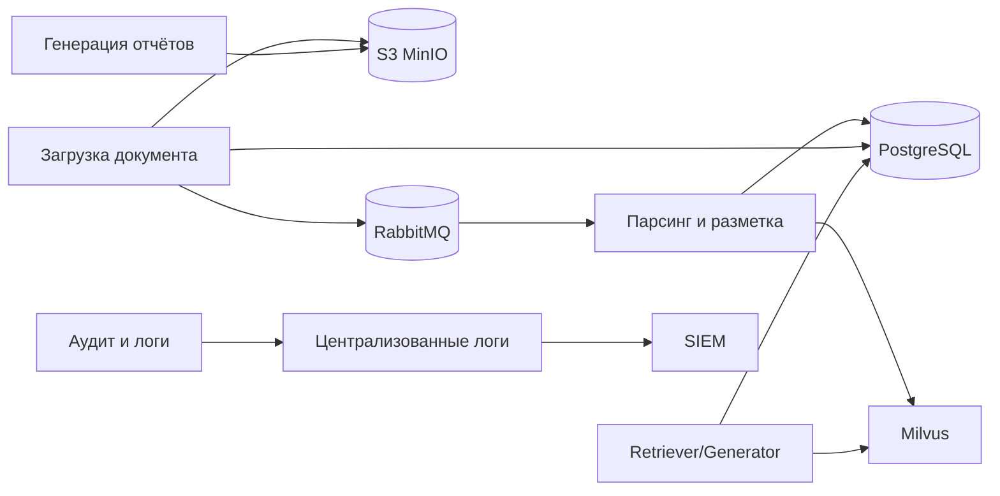


### 11.3. Контуры хранения данных

#### 11.3.1. Операционные данные и метаданные

В **PostgreSQL** хранятся:

- учётные данные и сервисные сущности приложения;
- метаданные документов (идентификаторы, тип, версия, статусы, права доступа);
- записи прикладного аудита;
- параметры конфигурации, не являющиеся секретами.

Требования к PostgreSQL:

- транзакционность и целостность;
- индексация по часто используемым полям (идентификатор, тип, дата, владелец);
- миграции схемы через контролируемый процесс.

#### 11.3.2. Документное хранилище (S3 MinIO)

**S3 MinIO** хранит исходные и производные файлы:

- загруженные DOCX, PDF, изображения;
- промежуточные артефакты обработки (при необходимости);
- итоговые отчёты DOCX.

Требования к MinIO:

- S3-совместимые стабильные URI/идентификаторы объектов;
- версионирование документов (если предусмотрено регламентом);
- контроль доступа к скачиванию через backend и RBAC.

Рекомендуемая сегментация бакетов:
- `farmadoc-source-docs` — загруженные исходные документы;
- `farmadoc-reports` — сформированные отчёты;
- `farmadoc-temp` — временные артефакты обработки с коротким TTL/очисткой.

#### 11.3.3. Векторное хранилище (Milvus)

**Milvus** содержит эмбеддинги и индексы, используемые модулем RAG:

- разбиение по логическим классам данных (регламентирующие, рабочие, кэш внешнего поиска);
- хранение метаданных для фильтрации по RBAC;
- поддержка TTL для кэша внешних источников.

Поиск выполняется с учётом прав доступа пользователя; недоступные документы не должны попадать в выдачу Retriever.
В Milvus целесообразно использовать коллекции/партиции по классам данных и предусматривать регулярное обслуживание индексов при росте корпуса.

#### 11.3.4. Брокер сообщений (RabbitMQ)

**RabbitMQ** используется как транспортный слой для асинхронного взаимодействия между компонентами (оркестратор, обработчики, контур индексирования и сервисы интеграции) и обеспечивает буферизацию нагрузки при пиковых сценариях.

Основные требования к использованию брокера:

- разделение очередей по назначению (входные задания, события этапов, технические уведомления);
- подтверждение доставки сообщений (`ack`) и политика повторной обработки при временных сбоях;
- использование `dead-letter` очередей для неуспешных сообщений с контролируемым разбором ошибок;
- идемпотентность обработчиков на стороне потребителей;
- ограничение времени жизни сообщений (TTL) и регламент очистки служебных очередей.

Требования безопасности:

- доступ к RabbitMQ только из доверенного контура и через сервисные учётные записи с минимальными правами;
- шифрование транспортного канала (TLS) между продюсерами/консьюмерами и брокером;
- журналирование операций администрирования и критичных ошибок брокера в контур наблюдаемости и аудита.

#### 11.3.5. Хранилище логов и аудита

Логи и платформенные события хранятся в специализированном контуре наблюдаемости (Loki/ELK/аналог) с отдельной политикой ретенции и экспортом критичных событий в SIEM.

### 11.4. Политики данных и жизненный цикл

#### 11.4.1. Классификация и сроки хранения

Рекомендуется выделять:

- **операционные данные** — по срокам эксплуатации системы и требованиям регламента;
- **документы экспертизы** — по нормативным срокам Заказчика;
- **кэш внешнего поиска** — краткосрочно (TTL, например 24 часа);
- **операционные логи** — среднесрочно;
- **security-аудит** — дольше операционных логов.

#### 11.4.2. Версионирование и неизменяемость

- для документов предусмотреть версионность или журнал изменений;
- для аудита обеспечить неизменяемость записей (append-only подход);
- для критичных действий фиксировать автора, время и результат операции.

#### 11.4.3. Удаление и архивирование

Удаление данных выполняется по регламенту и с подтверждением прав доступа. Перед удалением долгоживущих данных допускается архивирование в отдельный контур хранения.

### 11.5. Надёжность и восстановление

#### 11.5.1. Резервное копирование

Подсистема должна обеспечивать:

- резервные копии PostgreSQL (полные + инкрементальные по регламенту);
- резервные копии/репликацию бакетов S3 MinIO;
- резервирование конфигурации Milvus и процедур переиндексации;
- контроль целостности резервных копий.

#### 11.5.2. Восстановление после сбоев

Процедуры восстановления должны быть документированы и протестированы:

- восстановление БД из резервной копии;
- восстановление доступа к бакетам S3 MinIO;
- восстановление или перепостроение векторных индексов Milvus (если требуется после аварии);

Целевые значения RPO/RTO определяются требованиями эксплуатации и соответствуют разделу ТЗ о надёжности.

#### 11.5.3. Масштабирование

Масштабирование выполняется по контурам:

- реляционная БД — оптимизация запросов, репликация, разделение ролей чтение/запись;
- объектное хранилище MinIO — горизонтальное масштабирование объёма и пропускной способности;
- Milvus — масштабирование под рост корпуса документов и нагрузки поиска;

### 11.6. Защита информации в подсистеме хранения

#### 11.6.1. Доступ и разграничение прав

- доступ к данным — только через backend/API Gateway;
- RBAC применяется к операциям чтения/записи и к выдаче документов/фрагментов;
- сервисные учётные записи получают минимально необходимые права.

#### 11.6.2. Шифрование и ключи

- шифрование каналов связи между компонентами (TLS 1.3);
- шифрование данных на хранении (в соответствии с политикой и нормативами Заказчика);
- хранение ключей и секретов в Vault или корпоративном секрет-менеджере;
- регламент ротации ключевого материала.

#### 11.6.3. Маскирование чувствительных данных

Перед передачей в БЯМ и перед индексацией векторных представлений чувствительные данные подлежат маскированию (Presidio или аналог) согласно требованиям ИБ.

### 11.7. Эксплуатационные требования и приёмка

Для приёмки подсистемы хранения подтверждаются:

1. корректная запись и чтение данных по всем контурам хранения;
2. выполнение RBAC-фильтрации при поиске и доступе к документам;
3. работоспособность резервного копирования и тестового восстановления;
4. применение политики хранения и TTL для временных данных;
5. журналирование ключевых операций и доставка критичных событий в SIEM (если входит в объём поставки).

### 11.8. Ограничения и перспектива развития

На стадии прототипирования допустимы упрощения (ограниченная схема архивирования, базовая ретенция, упрощённая репликация). На промышленном этапе рекомендуется:

- формализовать модель данных и матрицу сроков хранения;
- автоматизировать контроль качества данных и проверку резервных копий;
- внедрить регулярные тесты восстановления;
- расширить политику аудита изменений в документных и метаданных.


---


## 12. Подсистема модулей и управления их работой

Подраздел описывает принципы **модульного построения пайплайнов обработки информации** в ИС «Фармадок»: центральный **оркестратор** и **подключаемые модули**, составляющие цепочки (графы) этапов обработки. Материал задаёт архитектурные рамки; конкретные имена сервисов, форматы контрактов и каталог модулей уточняются на этапе технического проектирования или разработки и согласуются с документами по смежным подсистемам (хранение — раздел 11 настоящей записки, аудит и наблюдаемость — раздел 10 настоящей записки, аутентификация — раздел 9 настоящей записки, контур ИИ и RAG — раздел 13 настоящей записки).

---

### 12.0. Глоссарий

- **Пайплайн обработки информации** — упорядоченная (в общем случае — ориентированная) последовательность этапов преобразования входных данных в выходные артефакты или решения.
- **Оркестратор пайплайна** — компонент, который выбирает сценарий (описание пайплайна), создаёт контекст выполнения, вызывает модули в заданном порядке, обрабатывает ошибки, фиксирует состояние и метаданные прогона.
- **Подключаемый модуль (плагин этапа)** — изолированная реализация одного логического этапа пайплайна с фиксированным контрактом входа/выхода и объявленными зависимостями; подключается к системе без изменения ядра оркестратора.
- **Контракт модуля** — соглашение о формате входных и выходных данных, кодах ошибок, требованиях к идемпотентности и к метаданным (версия модуля, идентификатор этапа).
- **Реестр модулей** — каталог доступных модулей, их версий, возможностей и политик использования; служит источником истины для оркестратора при сборке пайплайна.
- **Контекст выполнения** — передаваемое между этапами состояние: входные параметры сценария, промежуточные артефакты, идентификаторы для трассировки, атрибуты RBAC.
- **Сценарий (описание пайплайна)** — декларативное или конфигурируемое описание графа этапов (какие модули в каком порядке и при каких условиях вызываются).

---

### 12.1. Назначение и обоснование подхода

#### 12.1.1. Проблема

Жёстко зашитая в одном сервисе логика многоэтапной обработки затрудняет эволюцию: добавление этапа требует правок ядра, усложняет тестирование и повторное использование этапов в разных сценариях. Для ИС «Фармадок» типичны цепочки с разными комбинациями шагов (нормализация, разметка, извлечение признаков, вызов моделей, формирование отчётов и т.п.) — их целесообразно строить из **переиспользуемых модулей** под управлением **единого оркестратора**.

#### 12.1.2. Решение: оркестратор и подключаемые модули

Архитектура строится из двух уровней:

1. **Оркестратор** — отвечает за выбор сценария, жизненный цикл прогона, вызов модулей, политику повторов, таймауты, фиксацию аудита и связь с внешними API (в т.ч. через единую точку входа).
2. **Подключаемые модули** — реализуют отдельные этапы; регистрируются в реестре; не содержат знания о полном графе пайплайна, только о своём контракте и заявленных зависимостях.

Такое разделение соответствует модульности, заявленной в архитектурных принципах пояснительной записки к ТЗ, и облегчает независимое развитие этапов при сохранении согласованности контрактов.

---

### 12.2. Архитектура: оркестратор, модули, реестр

Сводная логическая схема взаимодействия компонентов приведена в [п. 12.2.7](#fig-logicheskaya-shema-5-2-7).

#### 12.2.1. Функции оркестратора

- разбор сценария пайплайна (статический конфиг, БД, API управления сценариями — по решению проекта);
- проверка доступности и совместимости версий модулей из реестра;
- создание и наполнение **контекста выполнения**; передача выхода одного этапа на вход следующего (или ветвление при условных переходах);
- применение политик: таймауты, ограничение параллелизма, повторные попытки для отдельных классов ошибок;
- интеграция с **RBAC** (разрешение на запуск сценария и на использование отдельных модулей);
- журналирование этапов, ошибок и идентификаторов прогона для аудита и расследований;
- при необходимости — постановка длительных прогонов в очередь и асинхронное завершение.

#### 12.2.2. Требования к подключаемым модулям

- явный **идентификатор** и **версия**; совместимость версий контракта фиксируется в реестре;
- реализация контракта входа/выхода; документированные побочные эффекты (запись в хранилища, вызовы внешних API);
- отсутствие обхода политик доступа: модуль получает принципала/ограничения из контекста, а не дублирует авторизацию произвольно;
- устойчивость к повторному вызову (**идемпотентность**) там, где оркестратор допускает повтор этапа;
- ограничение области ответственности: один модуль — один смысловой этап (упрощение тестирования и замены реализации).

#### 12.2.3. Реестр конвейеров

Реестр конвейеров хранится в таблице PostgreSQL **`pipeline_registry`**: в ней перечислены именованные типы конвейеров, доступные для запуска оркестратором. Процедура регистрации конвейера состоит из занесения в `pipeline_registry` его идентификационных и конфигурационных сведений. Оркестратор создает экземпляр конвейера только для типов, присутствующих в этой таблице и имеющих активный статус.
Рекомендуемый набор полей таблицы `pipeline_registry` приведен в п. `5.4.3`.

#### 12.2.4. Реестр модулей

Реестр модулей — специальная таблица PostgreSQL, в которой хранятся зарегистрированные обработчики как самостоятельные сущности. Для нормализации структуры данных привязка модулей к конвейерам хранится не в `module_registry`, а в отдельной таблице связи `pipeline_module_link` (отношение многие-ко-многим между `pipeline_registry` и `module_registry`). Оркестратор не запускает незарегистрированные или неактивные модули.

При запуске экземпляра конвейера оркестратор выбирает обработчики через связку `pipeline_registry -> pipeline_module_link -> module_registry` и определяет стартовые обработчики.
Рекомендуемые наборы полей таблиц `module_registry` и `pipeline_module_link` приведены в п. `5.4.3`.

#### 12.2.5. Экземпляры конвейеров (`pipeline_instance`)

Таблица `pipeline_instance` хранит общие сведения о каждом запущенном экземпляре конвейера и используется как родительская сущность для записей статусов модулей в `module_run_status`.
Рекомендуемый набор полей таблицы `pipeline_instance` приведен в п. `5.4.3`.

#### 12.2.6. Статусы выполнения модулей (`module_run_status`)

Таблица `module_run_status` хранит состояние выполнения обработчиков в рамках конкретного экземпляра конвейера: по одной записи на каждую пару «обработчик - экземпляр конвейера». Начальный статус записи — `not started`; после завершения обработки оркестратор обновляет запись на `done` или `error` (в зависимости от кода завершения, переданного обработчиком).
Рекомендуемый набор полей таблицы `module_run_status` приведен в п. `5.4.3`.

#### 12.2.7. Логическая схема

Ниже показаны связи между входной очередью, оркестратором конвейеров, реестрами в PostgreSQL, данными о прогоне (экземпляр конвейера, статусы модулей), подключаемыми модулями, бакетом контекста в S3 и выходом конвейера.

```mermaid
flowchart TB
  QIN[Входная очередь] --> ORCH[Оркестратор конвейеров]

  subgraph REG[Реестры (PostgreSQL)]
    PR[(Реестр конвейеров)]
    PML[(Связь «конвейер — модуль»)]
    MR[(Реестр модулей)]
  end

  ORCH --> PR
  ORCH --> PML
  ORCH --> MR

  subgraph RUN[Выполнение]
    PI[(Экземпляр конвейера)]
    MRS[(Статус выполнения модуля)]
    MODS[Подключаемые модули]
    S3[(Бакет контекста в S3)]
  end

  ORCH --> PI
  ORCH --> MRS
  ORCH --> MODS
  MODS --> S3
  MODS --> ORCH

  ORCH --> OUT[Результат конвейера]
```

<a id="fig-logicheskaya-shema-5-2-7"></a>

**Рисунок 5.2-7.** Логическая схема подсистемы модульных конвейеров.

На практике модули могут выполняться в отдельных процессах или контейнерах; оркестратор вызывает их через согласованный механизм (очередь сообщений).

---

### 12.3. Описание пайплайна и поток данных

- Все бизнес-процессы обработки информации в ИС «Фармадок» представляют собой **именованные конвейеры** (процессы, пайплайны); перечень конвейеров ведется в таблице `pipeline_registry` (PostgreSQL).
- **Сценарий** задаёт граф этапов: линейный порядок, параллельные ветки, условные переходы по результату модуля или по метаданным контекста.
- **Контекст выполнения** содержит идентификатор прогона, ссылку на сценарий, входные параметры, накопленные результаты этапов, метки времени; объём и формат сериализации определяются на этапе технического проектирования или разработки.
- **Артефакты большого объёма** (файлы, векторные индексы) в контексте передаются по **ссылкам** на хранилища (см. раздел 11 настоящей записки), а не целиком в теле сообщений между этапами.

Укрупнённый поток выполнения конвейера (цикл оркестратора и модулей) показан [в п. 12.3.2](#fig-diagramma-potoka-5-3-2). Диаграмма последовательности обмена сообщениями между входной очередью, оркестратором, PostgreSQL, брокером, обработчиком и бакетом контекста в S3 приведена [в п. 12.3.3](#fig-posledovatelnosti-5-3-3).

#### 12.3.1. Механизм запуска обработчиков и обмен сообщениями

Взаимодействие участников во времени отражено [в п. 12.3.3](#fig-posledovatelnosti-5-3-3); ниже дано текстовое описание шагов и состава сообщений.

Оркестратор создает экземпляр конвейера после получения сообщения с именем типа конвейера из специальной очереди брокера сообщений. После создания экземпляра оркестратор определяет в таблице реестра обработчики, которые должны выполняться первыми, и отправляет им через канал брокера сообщений специальное сообщение о старте.

Стартовое сообщение содержит:

- идентификатор экземпляра конвейера;
- имя конвейера и имя обработчика;
- путь к бакету S3 (или префиксу в бакете), где обработчик сохраняет артефакты своей работы;
- **перечень входных артефактов**, уже созданных в этом бакете другими модулями данного экземпляра конвейера (пути в S3 и, при необходимости, имя модуля-источника — см. п. 5.4.1, поле `input_artifacts`).

**Использование артефактов предшественников.** Модуль опирается на сведения, переданные оркестратором в стартовом сообщении: по указанным путям он читает в общем контекстном бакете объекты, созданные ранее другими обработчиками (без самостоятельного «угадывания» структуры каталога, если иное не оговорено контрактом модуля). Модуль не обязан загружать все перечисленные артефакты — он использует те из них, которые нужны его логике.

После получения стартового сообщения обработчик выполняет свою работу и отправляет оркестратору сообщение о завершении с кодом завершения (например: `done`, `error` и иные статусы по регламенту проекта). В этом же сообщении обработчик указывает имена (пути) всех файлов-артефактов, созданных им в процессе работы в выделенном бакете S3.

Оркестратор, получив сообщение о завершении, проставляет статус `done` в записи пары «модуль - экземпляр конвейера» (для успешного завершения), затем в таблице связей находит модуль, который должен запускаться следующим, и отправляет ему стартовое сообщение. В стартовом сообщении следующему модулю передаются название бакета контекста и сводный список артефактов, полученных в результате работы предыдущих модулей данного экземпляра конвейера.

Данный цикл повторяется, пока для экземпляра конвейера существуют следующие обработчики со статусом `not started`. Если таких обработчиков не остается, работа конвейера считается завершенной. После завершения конвейера оркестратор имеет право удалить временный бакет с контекстом в соответствии с политикой хранения и регламентом эксплуатации. Описанный цикл в виде блок-схемы приведён [в п. 12.3.2](#fig-diagramma-potoka-5-3-2), обмен сообщениями между участниками — [в п. 12.3.3](#fig-posledovatelnosti-5-3-3).

#### 12.3.2. Диаграмма потока выполнения конвейера

Ниже показаны этапы от приёма запроса на запуск конвейера до завершения всех модулей: создание экземпляра и статусов, поочерёдный запуск модулей, обмен через брокер, обновление статусов и проверка наличия следующего модуля.

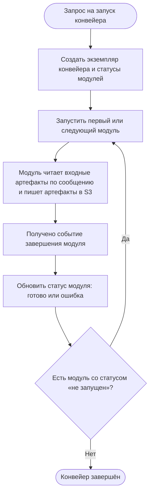

<a id="fig-diagramma-potoka-5-3-2"></a>

**Рисунок 5.3-2.** Диаграмма потока выполнения конвейера.

#### 12.3.3. Диаграмма последовательности обмена сообщениями

На рисунке ниже показаны сообщения от запроса на запуск конвейера до завершения экземпляра: обращения оркестратора к реестрам и статусам в PostgreSQL, команды и события через брокер, работа обработчика с бакетом S3 и цикл по модулям со статусом «не запущен».

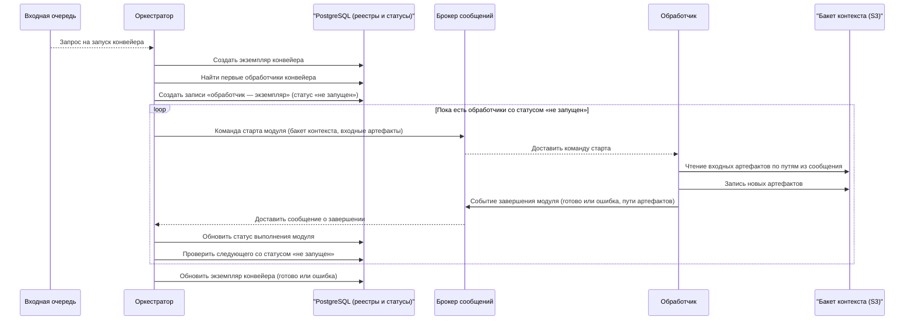

<a id="fig-posledovatelnosti-5-3-3"></a>

**Рисунок 5.3-3.** Диаграмма последовательности обмена сообщениями.

---

### 12.4. Рекомендуемые контракты, политики и форматы

#### 12.4.1. Рекомендуемые форматы сообщений в брокере

Ниже приведены рекомендуемые форматы сообщений (JSON) для взаимодействия оркестратора и модулей через брокер. Конкретные имена топиков/очередей и строгая схема валидации (JSON Schema/Avro/Protobuf) фиксируются на этапе технического проектирования или разработки.

**1) Сообщение на создание экземпляра конвейера** (вход в оркестратор из `entry_queue`):

```json
{
  "message_type": "pipeline.start.request",
  "schema_version": "1.0",
  "message_id": "9f6a02d5-8f3c-4f44-8a85-7ce4d2f31b2f",
  "ts_utc": "2026-03-25T10:15:30Z",
  "pipeline_name": "pharma-document-processing",
  "pipeline_version": "1.0.0",
  "requested_by": "system|user-id",
  "input": {
    "document_ids": [
      "doc-1001",
      "doc-1002"
    ],
    "options": {
      "priority": "normal"
    }
  },
  "correlation_id": "corr-0b5f7d8f"
}
```

**2) Стартовое сообщение оркестратора для обработчика**:

В стартовом сообщении для каждого входного артефакта передаются не только путь в S3, но и имя обработчика, который создал этот артефакт (если применимо).

```json
{
  "message_type": "module.start.command",
  "schema_version": "1.0",
  "message_id": "2ae2fcb0-7703-4c7f-8538-6e4fdd5a5d13",
  "ts_utc": "2026-03-25T10:15:35Z",
  "pipeline_instance_id": "pi-20260325-000123",
  "pipeline_name": "pharma-document-processing",
  "module_name": "markup-service",
  "context_bucket": "s3://farmadoc-pipeline-context/pi-20260325-000123/",
  "input_artifacts": [
    {
      "artifact_path": "s3://farmadoc-pipeline-context/pi-20260325-000123/source/doc-1001.pdf",
      "producer_module_name": "ingest-service"
    }
  ],
  "correlation_id": "corr-0b5f7d8f",
  "attempt": 1
}
```

**3) Сообщение обработчика о завершении** (в оркестратор):

```json
{
  "message_type": "module.finish.event",
  "schema_version": "1.0",
  "message_id": "f0c8fa2f-c8f5-4a5f-9a13-8f0fda9ee8fb",
  "ts_utc": "2026-03-25T10:16:02Z",
  "pipeline_instance_id": "pi-20260325-000123",
  "pipeline_name": "pharma-document-processing",
  "module_name": "markup-service",
  "status": "done",
  "completion_code": "ok",
  "artifact_paths": [
    "s3://farmadoc-pipeline-context/pi-20260325-000123/markup/doc-1001.md"
  ],
  "metrics": {
    "duration_ms": 27000
  },
  "error": null,
  "correlation_id": "corr-0b5f7d8f"
}
```

**4) Сообщение обработчика о завершении с ошибкой**:

```json
{
  "message_type": "module.finish.event",
  "schema_version": "1.0",
  "message_id": "f5ad0a6f-6e6b-4f67-bc3f-42c737742f74",
  "ts_utc": "2026-03-25T10:16:02Z",
  "pipeline_instance_id": "pi-20260325-000123",
  "pipeline_name": "pharma-document-processing",
  "module_name": "markup-service",
  "status": "error",
  "completion_code": "validation_failed",
  "artifact_paths": [],
  "metrics": {
    "duration_ms": 4200
  },
  "error": {
    "code": "VALIDATION_ERROR",
    "message": "Unsupported document format",
    "details": {
      "document_id": "doc-1001"
    }
  },
  "correlation_id": "corr-0b5f7d8f"
}
```

Рекомендуемые правила:

- использовать `message_id` (уникальность) и `correlation_id` (сквозная трассировка);
- фиксировать `pipeline_instance_id`, `pipeline_name`, `module_name` во всех рабочих сообщениях;
- в `module.start.command` передавать полный перечень релевантных входных артефактов (`input_artifacts`), чтобы модуль мог однозначно обратиться к объектам в общем бакете, созданным ранее другими модулями;
- нормализовать значения `status` (`not started`, `in progress`, `done`, `error`) и `completion_code`;
- передавать артефакты только ссылками (`artifact_paths`) на S3, без включения больших бинарных данных в тело сообщения.

#### 12.4.2. Очереди брокера сообщений (RabbitMQ): назначение и режим работы

Ниже приведен рекомендуемый минимальный набор очередей RabbitMQ для работы оркестратора и модулей.

| Очередь | Назначение | Publisher -> Consumer | Режим работы (рекомендуемый) |
| --- | --- | --- | --- |
| `pipeline.start.request` | Запрос на создание экземпляра конвейера по имени типа (`pipeline_name`). | Внешние инициаторы/сервисы -> `pipeline-orchestrator` | `durable`, manual `ack`; quorum queue; retry через DLX + delayed retry; дедупликация по `message_id`. |
| `module.start.command` | Команда запуска конкретного обработчика в рамках экземпляра конвейера. | `pipeline-orchestrator` -> соответствующий модуль-обработчик | `durable`, manual `ack`; желательно разделение по routing key (например, `module.<module_name>.start`); quorum queue. |
| `module.finish.event` | Событие завершения обработки (`done`/`error`) с кодом и списком артефактов. | Модуль-обработчик -> `pipeline-orchestrator` | `durable`, manual `ack`; at-least-once доставка; дедупликация у оркестратора по `message_id`. |
| `pipeline.control.command` (опц.) | Операционные команды: pause/resume/cancel/retry для экземпляра. | Оператор/служебные сервисы -> `pipeline-orchestrator` | `durable`; доступ только привилегированным ролям; аудит всех команд. |
| `pipeline.audit.event` (опц.) | Поток событий жизненного цикла для аудита/наблюдаемости. | `pipeline-orchestrator` и модули -> аудит/мониторинг | `durable`; fanout/topic exchange; подписчики read-only. |
| `pipeline.dlq` | Dead-letter очередь для сообщений, не обработанных после исчерпания retry. | DLX -> операционный consumer/оркестратор | `durable`; обязательный мониторинг, алерты и runbook на разбор причин. |

Рекомендуемые принципы эксплуатации очередей:

- **Семантика доставки:** at-least-once, идемпотентная обработка на стороне consumer.
- **Подтверждения:** manual `ack` только после фиксации статуса в БД и/или завершения критичных операций.
- **Повторы:** retry-policy с backoff; после лимита попыток — перевод сообщения в `pipeline.dlq`.
- **Порядок:** порядок сообщений гарантируется в пределах очереди/partition, но не между разными очередями; логика оркестратора не должна зависеть от глобального total order.
- **Надежность:** очереди и сообщения — `durable`; для production предпочтительны quorum queues.
- **Безопасность:** TLS для подключений, отдельные vhost/права, запрет анонимного доступа, ротация секретов подключения.
- **Наблюдаемость:** метрики depth, publish rate, ack rate, redelivery rate, DLQ rate; алерты на рост `pipeline.dlq`.

#### 12.4.3. Рекомендуемый перечень методов (функций)

Ниже приведен рекомендуемый минимальный набор методов для реализации модульной системы. Имена методов могут отличаться в конкретном языке/фреймворке, но семантика должна сохраняться.

**Оркестратор (`pipeline-orchestrator`):**

| Метод/функция | Назначение |
| --- | --- |
| `handle_pipeline_start(request)` | Обработка входного `pipeline.start.request`, валидация и запуск экземпляра конвейера. |
| `build_start_command(pipeline_instance_id, module_name)` | Формирование `module.start.command`, включая `context_bucket` и `input_artifacts`. |
| `publish_start_command(command)` | Отправка стартовой команды в брокер сообщений. |
| `handle_module_finish(event)` | Прием `module.finish.event`, валидация, дедупликация и маршрутизация дальнейших действий. |
| `find_next_not_started_module(pipeline_instance_id)` | Поиск следующего обработчика со статусом `not started`. |
| `finalize_pipeline_instance(pipeline_instance_id)` | Перевод `pipeline_instance` в итоговый статус `done/error`. |

**Подключаемый модуль (обработчик):**

| Метод/функция | Назначение |
| --- | --- |
| `register_module(registration_payload)` | Регистрация модуля в системе (запись сведений в `module_registry` и привязка к конвейерам через `pipeline_module_link` по регламенту). |
| `handle_start_command(command)` | Обработка команды `module.start.command`, полученной от оркестратора через брокер сообщений. |
| `publish_finish_event(event)` | Публикация сообщения о завершении в брокер. |

#### 12.4.4. Рекомендуемые поля таблиц (PostgreSQL)

Рекомендуемый минимальный набор полей в таблице `pipeline_registry`:

| Поле | Назначение |
| --- | --- |
| `pipeline_name` | Уникальное имя типа конвейера. |
| `pipeline_version` | Версия описания конвейера (контракта этапов). |
| `description` | Краткое назначение и область применения конвейера. |
| `entry_queue` | Имя специальной очереди брокера сообщений, из которой оркестратор получает сообщения на запуск экземпляров данного типа конвейера. |
| `context_bucket` | Имя S3-бакета или базовый префикс для контекста и артефактов экземпляров конвейера. |
| `is_active` | Признак доступности типа конвейера к запуску. |
| `created_at` | Дата и время регистрации конвейера. |
| `updated_at` | Дата и время последнего изменения записи конвейера. |

Рекомендуемый минимальный набор полей в таблице `module_registry`:

| Поле | Назначение |
| --- | --- |
| `module_name` | Уникальное имя модуля (обработчика). |
| `module_version` | Версия модуля для контроля совместимости и воспроизводимости. |
| `is_active` | Признак активности модуля как обработчика. |
| `created_at` | Дата и время регистрации записи. |
| `updated_at` | Дата и время последнего изменения записи. |

Рекомендуемый минимальный набор полей в таблице связи `pipeline_module_link`:

| Поле | Назначение |
| --- | --- |
| `pipeline_name` | Имя конвейера из `pipeline_registry`. |
| `module_name` | Имя обработчика из `module_registry`. |
| `run_after_handler` | Имя обработчика-предшественника в рамках данного конвейера. Для первого обработчика допускается `NULL` или маркер начала. |
| `is_active` | Признак активности связи модуль-конвейер. |
| `created_at` | Дата и время регистрации связи. |
| `updated_at` | Дата и время последнего изменения связи. |

Рекомендуемый минимальный набор полей в таблице `pipeline_instance`:

| Поле | Назначение |
| --- | --- |
| `pipeline_instance_id` | Уникальный идентификатор экземпляра конвейера. |
| `pipeline_name` | Имя типа конвейера из `pipeline_registry`. |
| `pipeline_version` | Версия конвейера, зафиксированная на момент запуска экземпляра. |
| `status` | Текущий агрегированный статус экземпляра (`not started`, `in progress`, `done`, `error`). |
| `entry_message_id` | Идентификатор входного сообщения из очереди брокера, инициировавшего запуск. |
| `context_bucket` | Имя бакета/префикса S3 для артефактов данного экземпляра. |
| `created_at` | Дата и время создания экземпляра конвейера. |
| `started_at` | Дата и время фактического начала обработки. |
| `finished_at` | Дата и время завершения экземпляра конвейера. |
| `updated_at` | Дата и время последнего обновления записи экземпляра. |

Рекомендуемый минимальный набор полей в таблице `module_run_status`:

| Поле | Назначение |
| --- | --- |
| `pipeline_instance_id` | Идентификатор экземпляра конвейера. |
| `pipeline_name` | Имя конвейера, к которому относится экземпляр. |
| `module_name` | Имя обработчика, для которого хранится статус. |
| `status` | Текущий статус выполнения (`not started`, `done`, `error` и др.). |
| `completion_code` | Код завершения, полученный от обработчика. |
| `artifact_paths` | Список путей файлов-артефактов, переданных обработчиком в сообщении о завершении. |
| `started_at` | Дата и время фактического старта обработчика (при наличии). |
| `finished_at` | Дата и время завершения обработчика (при наличии). |
| `updated_at` | Дата и время последнего изменения статуса. |

#### 12.4.5. Формальная модель статусов и переходов

Нормативная таблица переходов `module_run_status.status`:

| Текущий статус | Событие | Новый статус | Исполнитель | Условие |
| --- | --- | --- | --- | --- |
| `not started` | Отправлено `module.start.command` | `in progress` | Оркестратор | Запись активна, попытка запуска зарегистрирована |
| `in progress` | Получено `module.finish.event` с `status=done` | `done` | Оркестратор | Валидация сообщения завершена |
| `in progress` | Получено `module.finish.event` с `status=error` | `error` | Оркестратор | Ошибка подтверждена кодом завершения |
| `error` | Разрешен retry и отправлен новый `module.start.command` | `in progress` | Оркестратор | `attempt < max_attempts` |
| `done` | Любое новое событие выполнения | `done` | Оркестратор | Повторные события игнорируются как дубликаты |

Нормативная таблица переходов `pipeline_instance.status`:

| Текущий статус | Событие | Новый статус | Условие |
| --- | --- | --- | --- |
| `not started` | Создан экземпляр | `in progress` | Отправлена хотя бы одна стартовая команда |
| `in progress` | Все обязательные модули в `done` | `done` | Нет записей `not started` и `in progress` |
| `in progress` | Критическая ошибка без retry | `error` | Исчерпаны попытки или ошибка non-retryable |
| `error` | Ручной перезапуск экземпляра (новый run) | `not started`/новый instance | По регламенту эксплуатации |

#### 12.4.6. Политика ошибок и повторных попыток

- `max_attempts` задается на уровне конвейера и/или конкретной связи `pipeline_module_link`;
- рекомендуется экспоненциальный backoff (например 5s, 15s, 45s, ...), верхний предел задается регламентом;
- ошибки делятся на:
  - **retryable** (временная недоступность зависимостей, сетевые сбои),
  - **non-retryable** (ошибки валидации входа, некорректный контракт);
- при исчерпании попыток модуль получает статус `error`, экземпляр конвейера переводится в `error`, если модуль критичен;
- поддерживается дедупликация сообщений завершения: повторный `module.finish.event` с тем же `message_id` не изменяет состояние.

#### 12.4.7. DDL-ограничения и индексы (рекомендуемые)

Минимальные требования целостности данных:

- `pipeline_registry`: PK по `pipeline_name` (или surrogate key + unique на `pipeline_name`);
- `module_registry`: PK по `module_name` (или surrogate key + unique на `module_name`);
- `pipeline_module_link`:
  - FK на `pipeline_registry` и `module_registry`,
  - unique на (`pipeline_name`, `module_name`),
  - index на (`pipeline_name`, `is_active`);
- `pipeline_instance`:
  - PK по `pipeline_instance_id`,
  - FK/ссылка на `pipeline_registry`,
  - index на (`pipeline_name`, `status`, `created_at`);
- `module_run_status`:
  - FK на `pipeline_instance` и `module_registry`,
  - unique на (`pipeline_instance_id`, `module_name`),
  - `CHECK` для допустимых статусов,
  - index на (`pipeline_instance_id`, `status`) для поиска следующих обработчиков.

#### 12.4.8. Контракт сообщений и версионирование схем

- каждое сообщение содержит `message_type`, `message_id`, `ts_utc`, `correlation_id`, `schema_version`;
- `schema_version` обязателен для сообщений:
  - `pipeline.start.request`,
  - `module.start.command`,
  - `module.finish.event`;
- принцип совместимости: backward-compatible изменения допускаются в пределах одной major-версии, breaking changes требуют увеличения major;
- оркестратор ведет white-list поддерживаемых `schema_version` и отклоняет неподдерживаемые схемы с аудитом события.

Рекомендуемое дополнение к примерам JSON:

```json
{
  "schema_version": "1.0"
}
```

#### 12.4.9. Политика хранения артефактов S3

- артефакты сохраняются по детерминированному шаблону ключей:
  - `s3://<bucket>/<pipeline_instance_id>/<module_name>/<artifact_name>`;
- в `artifact_paths` записываются только ссылки на объекты, фактические бинарные данные в сообщения брокера не помещаются;
- для временного контекста задается lifecycle policy (TTL), согласованная с эксплуатацией;
- удаление временного контекста допускается только после финального статуса экземпляра (`done`/`error`) и выполнения правил ретенции;
- для аудита рекомендуется сохранять manifest артефактов по экземпляру конвейера.

---

### 12.5. Операционные SLO/SLA и runbook

Рекомендуемые эксплуатационные требования:

- SLO по времени:
  - задержка оркестратора на обработку события брокера,
  - p95/p99 длительности модулей и полного конвейера;
- лимиты:
  - максимальный размер message payload,
  - ограничение параллельных экземпляров конвейеров;
- обязательные алерты:
  - рост доли `error`,
  - увеличение числа retry,
  - зависшие `in progress` дольше порога.

Минимальный runbook:

1. Ручной перезапуск модуля в рамках экземпляра.
2. Ручной перезапуск экземпляра конвейера.
3. Принудительный перевод в `error` при зависании.
4. Reconciliation состояния БД и фактических артефактов S3.
5. Процедура восстановления после отказа оркестратора.

---

### 12.6. Безопасность и соответствие требованиям ИС

- доступ к запуску пайплайнов и к отдельным модулям — через **RBAC** и единую точку входа (см. раздел 9 настоящей записки);
- подключаемые модули не должны обходить требования к **журналированию** и **минимизации ПДн**; события значимых этапов фиксируются для аудита (см. раздел 10 настоящей записки);
- поставка и обновление модулей — по контролируемому контуру (проверка целостности, политика доверенных источников; при необходимости — сканирование вложений и артефактов в соответствии с архитектурными принципами пояснительной записки к ТЗ);
- секреты и ключи не передаются в контексте открытым текстом; модуль получает доступ к секретам через утверждённый механизм (секрет-менеджер).

---

### 12.7. Эксплуатация, наблюдаемость и приёмка

- метрики оркестратора: длительность прогона, длительность по этапам, число ошибок и повторов, глубина очереди (если используется);
- сквозной **correlation/request ID** для связки логов оркестратора и модулей;
- критерии приёмки: воспроизводимый запуск сценария из реестра; корректная обработка отказа этапа; соблюдение RBAC; наличие записей аудита для критичных операций; возможность отката на предыдущую совместимую версию модуля без остановки оркестратора (если предусмотрено политикой версий).

---

### 12.8. Ограничения и развитие

Чрезмерная фрагментация (слишком мелкие модули) увеличивает накладные расходы на вызовы и усложняет сопровождение; чрезмерно «толстые» модули снижают гибкость. Оптимальная гранулярность определяется на этапе технического проектирования или разработки по доменным сценариям и требованиям к времени ответа (в т.ч. п. 4.1.2 ТЗ). Расширение каталога модулей и сценариев не должно нарушать обратную совместимость контрактов без явного версионирования.

---


## 13. Подсистема обработки информации с использованием ИИ

Подраздел описывает назначение, принципы построения и использование двух классов индексов в конвейере интеллектуального поиска и RAG ИС «Фармадок»: векторного (семантический поиск по эмбеддингам) и лексического (поиск по совпадению терминов, в том числе BM25). Настоящий документ углубляет индексирование, хранилища и контур retrieval в составе того же конвейера. Материал дополняет § **13** пояснительной записки к ТЗ (подсистема обработки информации с использованием ИИ); гибридный поиск и этапы конвейера изложены в настоящем разделе. Также используется документ «Описание программного обеспечения» (модуль RAG и подсистема векторной БД).

---

### 13.0. Глоссарий

- **RAG (Retrieval-Augmented Generation)** - подход, при котором генерация ответа выполняется на основе извлечённого из хранилища контекста.
- **Retriever** - компонент поиска и отбора релевантных фрагментов документов.
- **Generator** - компонент генерации итогового ответа на основе контекста (БЯМ).
- **Галлюцинация** - генерация ответа, не подтверждённого источниками из контекста; снижается за счёт RAG и обязательного цитирования.
- **Векторный индекс** - хранилище эмбеддингов фрагментов (блоков) документов и связанных метаданных, поддерживающее поиск ближайших соседей по метрике сходства (косинусное расстояние, скалярное произведение и аналоги).
- **Эмбеддинг** - числовой вектор фиксированной размерности, представляющий смысл текста; получается моделью эмбеддингов при индексации и при запросе.
- **Лексический индекс** - структура данных для поиска по словам и терминам (обратный индекс по токенам); ранжирование часто реализуется статистикой вхождений (например BM25).
- **Гибридный поиск** - совместное использование векторного и лексического каналов с последующим слиянием списков кандидатов (например **RRF** - Reciprocal Rank Fusion) и при необходимости переранжированием (Cross-Encoder).
- **RBAC в индексе** - атрибуты прав доступа к фрагменту или документу, по которым фильтруются результаты при запросе.
- **Markup-сервис (структурирование)** - этап предобработки, который принимает сырые документы и формирует структурированные документы в формате Markdown.
- **Сервис тэгирования структуры** - этап предобработки перед индексированием, который принимает структурированный документ в Markdown и возвращает JSON со списком тэгированных фрагментов (абзацев) и метаданными тэгирования.
- **run (прогон процесса)** - единичный экземпляр выполнения пайплайна с уникальным идентификатором.
- **progress (прогресс выполнения)** - доля завершённых этапов/работ в рамках конкретного прогона.
- **throughput (пропускная способность)** - количество обработанных документов/запросов за единицу времени.

---

### 13.1. Назначение, цели и место в архитектуре

Подсистема векторного и лексического индексирования реализуется как два независимых, но согласованных пайплайна:

- **offline-пайплайн подготовки данных** - сбор документов, структурирование, тэгирование, чанкинг и построение индексов;
- **online-пайплайн обработки запроса** - гибридное извлечение, фильтрация, маскирование чувствительных данных, реранкинг и передача контекста в Generator.

Пайплайны развязаны по времени выполнения и нагрузочному профилю: offline-контур работает асинхронно при поступлении/изменении документов, online-контур выполняется синхронно на пользовательский запрос с опорой на уже подготовленные индексы.

**Обоснование RAG по сравнению с альтернативами.** Чистая генерация без извлечения (LLM-only) не гарантирует опору на корпус документов и повышает риск галлюцинаций. Поиск без генерации (retrieval-only) даёт список фрагментов, но не формирует связного ответа на естественном языке. RAG сочетает извлечение релевантного контекста из доверенного корпуса с генерацией ответа по этому контексту, что для «Фармадок» обеспечивает проверяемость за счёт цитирования и согласуется с требованиями к экспертной и регуляторной документации (в том числе согласно п. 4.1.2 ТЗ).

**Оркестрация моделей.** Модели эмбеддингов используются при индексации чанков и при кодировании пользовательского запроса для векторного поиска; большая языковая модель (БЯМ) применяется на этапе Generator для формирования ответа. Разделение ролей и вызовы моделей координирует backend.

Подсистема ориентирована на регуляторные и экспертные процессы ФГБУ «НЦЭСМП» Минздрава России и поддерживает работу с профильной фармацевтической документацией (регистрационные досье, инструкции по медицинскому применению, ПУР, нормативные документы по качеству и сопутствующие материалы). В рамках данного документа подсистема рассматривается как технологическая основа для быстрого и воспроизводимого извлечения релевантного контекста: она не формирует экспертное заключение, а обеспечивает качество входных данных для последующих этапов реранкинга и генерации ответа.

Назначение подсистемы напрямую связано с требованиями ТЗ по безопасности: индексирование и поиск выполняются в контролируемой инфраструктуре Заказчика, с учетом RBAC, шифрования и ограничений на обработку данных в доверенном контуре.

**Ключевые цели подсистемы индексирования:**

- **Точность извлечения (retrieval precision/recall).** Обеспечить устойчивое нахождение релевантных фрагментов как по смыслу, так и по точным лексическим совпадениям (коды, номера, термины) за счет гибридного поиска (векторный + BM25), корректного чанкинга и последующего реранкинга.
- **Трассируемость и цитируемость.** Сохранять в индексе метаданные первоисточников (документ, раздел, страница/фрагмент), чтобы на этапе генерации ответа обеспечивалось обязательное цитирование и проверяемость выводов.
- **Масштабируемость и производительность.** Поддерживать рост объема корпуса и числа пользователей без деградации SLA, включая целевые показатели ТЗ по времени ответа и нагрузке.
- **Безопасность данных.** Обеспечить обработку и хранение артефактов индексирования в рамках требований ИБ (RBAC, шифрование, разделение доступов, контроль источников данных).

Требования ТЗ и критерии приемки (в том числе время ответа, качество поиска, учет прав, шифрование хранения эмбеддингов) согласуются с п. 4.1.1, 4.1.2, 4.2.1 и п. 2.2 ТЗ; детали размещения моделей эмбеддингов и БЯМ — в § **4.4**, § **7.7–7.8** и § **8** пояснительной записки к ТЗ; подсистема обработки с использованием ИИ — § **13** той же записки. Хранение артефактов в рамках подсистемы: эмбеддинги - в Milvus; результирующие артефакты этапа тэгирования - в S3 MinIO бакете с привязкой к исходному документу; при необходимости служебная метаинформация - в PostgreSQL.

---

#### 13.1.1. Общая архитектура подсистемы индексирования

Подсистема реализует оркестрированную архитектуру из двух независимых контуров, которые связаны через общие хранилища и контракты метаданных.

**Offline-пайплайн подготовки данных** формирует индексный слой:

- `ingest-service` принимает и валидирует входящие документы;
- `markup-service`, `tagging-service` и `chunking-service` подготавливают структурированные фрагменты;
- `vector-indexer` строит векторные представления в `milvus-vector-db`;
- `lexical-indexer` формирует лексический индекс BM25 в `postgresql-db`;
- артефакты тэгирования сохраняются в `s3-storage`.

**Online-пайплайн обработки запроса** использует индексный слой для retrieval:

- `retriever-service` оркестрирует обработку пользовательского запроса;
- `vector-retriever` выполняет семантический поиск по `milvus-vector-db`;
- `lexical-retriever` выполняет BM25-поиск по `postgresql-db`;
- `merge-service` объединяет кандидатов (RRF), далее `filter-service` отсекает по метаданным и RBAC, затем `masking-middleware` маскирует чувствительные данные, `reranker-service` уточняет релевантность;
- итоговый контекст передается в `llm-generator` для ответа с обязательным цитированием первоисточников.

Такое разделение повышает управляемость подсистемы: offline-контур оптимизируется под полноту и качество индексов, online-контур - под время ответа и стабильность SLA.

---

### 13.2. Типы чанкинга для индексирования и обоснование выбора

Чанкинг определяет, какие фрагменты документа станут единицами индексирования, поиска и цитирования. Для ИС "Фармадок" используются следующие типы:

1. **Структурный чанкинг (рекомендуемый базовый).**
  - Деление по логике документа: заголовки, разделы, подпункты, абзацы, таблицы.
  - Источник границ: результат этапов markup и тэгирования.
  - Плюс: высокая интерпретируемость и корректные ссылки на нормативные фрагменты.
2. **Фиксированный чанкинг по длине (символы/токены).**
  - Деление на блоки заданного размера, при необходимости с overlap.
  - Плюс: стабильно по вычислительной стоимости и просто в реализации.
  - Минус: может разрывать логический смысл и ухудшать точность ссылок для нормативных формулировок.
3. **Скользящий чанкинг (sliding window).**
  - Последовательные окна фиксированного размера с перекрытием.
  - Плюс: снижает риск потери контекста на границах.
  - Минус: увеличивает объем индекса и число почти дублирующих фрагментов.
4. **Семантический чанкинг.**
  - Границы формируются по тематическим переходам/сходству предложений.
  - Плюс: более цельные по смыслу фрагменты.
  - Минус: выше вычислительная стоимость, сложнее воспроизводимость границ и аудит.

**Выбор для системы "Фармадок".**

- Основной вариант: **структурный чанкинг**, потому что в системе критичны трассируемость фрагментов, цитирование и проверка на соответствие нормативам.
- Дополнительный механизм: **ограничение максимальной длины чанка** и при необходимости **умеренное перекрытие** для длинных разделов, чтобы сохранить контекст и не выходить за ограничения модели эмбеддингов.
- Для некоторых типов документов допускается fallback на фиксированный/скользящий режим, если структурные границы выделены недостаточно надежно.

---

### 13.3. Процесс подготовки данных (offline pipeline)

#### 13.3.1. Диаграмма потоков данных

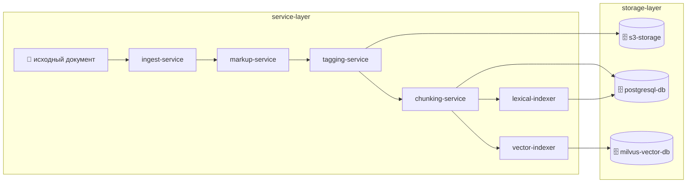


#### 13.3.2. Этап сбора документов (ingest)

**Назначение.** Этап сбора документов выполняется перед markup и обеспечивает контролируемое поступление документов в конвейер подготовки данных.

**Вход этапа.** На вход `ingest-service` поступают исходные сырые документы и метаданные источника (тип документа, версия, источник, служебные атрибуты).

**Выход этапа.** На выходе формируется подготовленный пакет документов для `markup-service`: принятые файлы, результаты первичной валидации и минимальный набор служебных метаданных для дальнейшей трассировки.

---

#### 13.3.3. Этап markup (структурирование) перед тэгированием

**Назначение.** До этапа тэгирования выполняется этап markup (структурирование) документа. Этап используется для преобразования сырого документа в унифицированное структурированное представление, пригодное для последующего тэгирования и индексирования.

**Вход этапа.** На вход markup-сервиса подаются сырые документы.

**Выход этапа.** Markup-сервис возвращает структурированные документы в формате Markdown.

---

#### 13.3.4. Этап тэгирования структуры перед индексированием

**Назначение.** После этапа markup и до векторного индексирования выполняется этап тэгирования структуры документа. Этап используется для выделения логически осмысленных фрагментов и нормализации признаков, которые затем будут использованы при векторном и лексическом индексировании. Дополнительно этап тэгирования нужен для дальнейшего учета и обработки тэгов фрагментов текста на этапе проверки документов на соответствие нормативам.

**Вход этапа.** На вход сервиса тэгирования подаются структурированные документы в формате Markdown (результат этапа markup).

**Выход этапа.** Сервис возвращает JSON, содержащий:

- список тэгированных фрагментов (абзацев);
- метаданные тэгирования для каждого фрагмента (например тип тега/секции, позиция в документе, уровень структуры, служебные признаки качества разметки).

Результирующие JSON-артефакты этапа тэгирования сохраняются в S3 MinIO бакете с привязкой к исходному документу (например по идентификатору документа и версии).

**Опциональность по типу документа.** Этап тэгирования может быть пропущен для некоторых типов документов. В этом случае в индексацию передаются фрагменты, полученные базовым конвейером парсинга и разметки, без дополнительного тэгирования.

---

#### 13.3.5. Этап векторного индексирования

**Идея.** В offline-пайплайне тексты блоков документов преобразуются в эмбеддинги согласованной моделью и сохраняются в векторный индекс. Онлайн-поиск по этим данным выполняется отдельным компонентом `vector-retriever` (см. п. 13.4.2).

**Содержимое записи индекса (логически).** Вектор эмбеддинга; идентификатор документа и фрагмента; метаданные для цитирования (страница, раздел); атрибуты RBAC; при необходимости тип документа (регламентирующие/рабочие/кэш внешнего поиска — по классификации в описании программного обеспечения ИС, подсистема векторной БД); при необходимости - заголовки структуры.

Хранение векторных представлений выполняется в Milvus. При необходимости метаинформация об индексировании и связях между артефактами хранится в PostgreSQL.

**Особенности для фармдомена.** Семантический поиск хорошо покрывает формулировки "по смыслу" и синонимы; может быть менее точным для редких кодов и точных строковых совпадений без донастройки - отсюда оправдан лексический канал в гибриде.

---

#### 13.3.6. Этап лексического индексирования

**Идея.** В offline-пайплайне документы представляются как наборы лексических единиц (токены после нормализации: регистр, стемминг или лемматизация - по решению реализации) и строится обратный индекс: термин -> список документов или фрагментов, где термин встречается (с позициями или частотами). Онлайн-доступ к индексу выполняет `lexical-retriever` (см. п. 13.4.2).

**Ранжирование.** Типично используется BM25: учитываются частота термина в фрагменте, обратная частота по корпусу, длина текста. Это дает сильные результаты при точном совпадении идентификаторов: коды АТХ, МНН, регистрационные номера, артикулы, точные названия из регламентов (см. § **13** пояснительной записки к ТЗ и п. **13.4** настоящего раздела — гибридный поиск).

**"При необходимости".** Лексический индекс может не строиться на самых ранних итерациях, если достаточно чисто векторного поиска; для целевого качества на смешанных запросах рекомендуется гибрид (п. 13.4.2).

### 13.4. Процесс обработки запроса (online pipeline)

#### 13.4.1. Диаграмма потоков данных

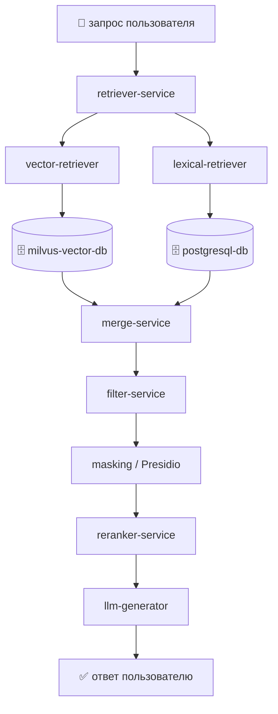

#### 13.4.2. Последовательность обработки запроса

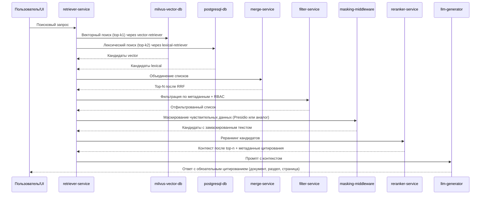

#### 13.4.3. Этап поиска

1. После этапов markup и тэгирования (если тэгирование включено для типа документа) независимо выполняются: векторный поиск (топ-k1) и лексический поиск (топ-k2) с теми же ограничениями RBAC (и фильтрами по типу документов, если заданы).
2. Списки объединяются алгоритмом вроде RRF: позиции в ранжированных списках преобразуются в общий скор без обязательной калибровки весов двух модальностей.
3. Формируется промежуточный список кандидатов (топ-N) для последующей передачи на этап фильтрации по метаданным.

Реализация поиска на данном этапе выполняется двумя специализированными компонентами:

- `vector-retriever` - выполняет семантический поиск по `milvus-vector-db` и возвращает топ-k1 кандидатов;
- `lexical-retriever` - выполняет лексический BM25-поиск по `postgresql-db` и возвращает топ-k2 кандидатов.

На этапе поиска выполняется проверка RBAC: в выборку кандидатов попадают только документы и фрагменты, доступные пользователю в соответствии с его ролями и политиками доступа. **Документы и фрагменты, недоступные пользователю по правам, не передаются в Generator** — исключение выполняется на этапах поиска и фильтрации до формирования промпта для БЯМ.

Такой конвейер зафиксирован в пояснительной записке к ТЗ (§ **13**; этапы и гибридный поиск — в п. **13.4** настоящего раздела) и в описании программного обеспечения (модуль RAG, Retriever).

---

#### 13.4.4. Этап фильтрации по метаданным

Этап выполняется после базового поиска и до маскирования и реранкинга для исключения нерелевантных кандидатов по атрибутам документа и контекста запроса.

1. На вход поступает промежуточный список кандидатов (топ-N) с этапа поиска.
2. Применяются фильтры по метаданным (например тип документа, источник, версия/актуальность, дата, раздел, язык, служебные тэги, ограничения видимости).
3. На выходе формируется отфильтрованный список кандидатов для этапа маскирования и последующего реранкинга.

Фильтрация по метаданным используется совместно с RBAC и позволяет уменьшить шум до более затратных этапов маскирования и реранкинга.

---

#### 13.4.5. Этап маскирования чувствительных данных

Этап выполняется сразу после фильтрации по метаданным и RBAC и до реранкинга.

**Тексты фрагментов-кандидатов** (и при необходимости фрагменты пользовательского запроса) проходят сокрытие персональных и иных чувствительных данных в соответствии с политикой ИБ (Presidio или функционально эквивалентные средства). Это снижает риск утечки чувствительных сведений в реранкер, логи и промпт БЯМ. Реранкер оперирует уже замаскированными формулировками; калибровка качества реранкинга на таких текстах выполняется на техническом проектировании.

---

#### 13.4.6. Этап реранкинга

Этап реранкинга выполняется после маскирования и до передачи контекста в Generator.

**Назначение реранкинга:** повысить релевантность итогового контекста; снизить шум в списке кандидатов после гибридного поиска; стабилизировать качество при росте объёма корпуса.

**Цепочка параметров:** на этапах векторного и лексического извлечения задаются **top-k** (k1, k2) для широкого набора кандидатов; после слияния (RRF) и фильтрации список сужается; после маскирования реранкер формирует упорядоченный **top-n** фрагментов для передачи в Generator. Значения **k** и **n** подбираются на техническом проектировании и нагрузочных испытаниях, синхронизируются с п. 4.1.2 ТЗ и целевыми SLA.

1. На вход поступает ограниченный список кандидатов после этапа маскирования (топ-N после RRF, отсева по метаданным и сокрытия чувствительных данных в текстах).
2. Кандидаты переоцениваются более точной и более «тяжёлой» моделью (например Cross-Encoder), чтобы уточнить порядок релевантности.
3. По результатам формируется финальный упорядоченный список (**top-n**), который передаётся в Generator для формирования ответа и цитирования источников.

Реранкинг применяется при необходимости и балансируется с требованиями по времени ответа (п. 4.1.2 ТЗ).

---

#### 13.4.7. Этап формирования окончательного ответа для пользователя

Этап выполняется после реранкинга и завершает конвейер обработки пользовательского запроса. Формирование ответа проводится с помощью LLM (Generator). Маскирование чувствительных данных уже выполнено на этапе п. 13.4.5.

1. На вход Generator поступает упорядоченный список фрагментов и метаданные цитирования после реранкинга (тексты фрагментов — в замаскированном виде, пригодном для промпта БЯМ).
2. Generator формирует итоговый ответ на основе этого контекста, с учётом ограничений доступа и требований к качеству.
3. В ответ обязательно включаются ссылки на первоисточники (цитирование: документ, раздел и страница при наличии).
4. Ответ приводится к формату, пригодному для отображения в пользовательском интерфейсе.

**Контроль качества ответа (сжато):** пороги релевантности и политика отказа в ответе при недостаточной уверенности или отсутствии опоры на источники; запрет выдачи утверждений без ссылки на фрагмент корпуса, где это требуется регламентом; при постобработке — диагностические показатели (число кандидатов до/после реранкинга, наличие цитирования) — по требованиям к качеству ответа подсистемы RAG.

При необходимости на этапе выполняются постобработка и валидация качества ответа перед возвратом пользователю.

---

#### 13.4.8. Операционные метрики, безопасность и эксплуатация

Для сопровождения online-контура целесообразно собирать **операционные метрики** по этапам: задержка retrieval (векторный и лексический каналы), merge/RRF, фильтрация, маскирование, реранкинг, генерация; агрегаты по числу кандидатов на каждом шаге; доля ответов с цитированием. Отказы доступа и попытки обращения к недоступным документам подлежат учёту в рамках подсистемы аудита (см. раздел 10 настоящей записки). Секреты (ключи API, строки подключения к индексам) хранятся в защищённом хранилище секретов согласно политике развёртывания.

---

#### 13.4.9. Приёмка и ограничения (связь с подсистемой RAG)

Критерии приёмки подсистемы RAG, сценарии тестирования и ограничения (область применения, границы ответственности компонентов) задаются ТЗ и согласуются с техническим проектом. В контексте настоящего документа критично: соответствие целевым показателям извлечения и времени ответа (п. 4.1.2 ТЗ); корректная работа RBAC на пути к Generator; воспроизводимость цитирования; согласованность индексов с актуальным корпусом после обновлений (п. 13.7).

---

### 13.5. Процесс сравнения двух документов между собой

Пайплайн предназначен для автоматизированного сопоставления двух документов (или двух версий одного документа) с формированием структурированного отчёта о расхождениях.

Ключевые этапы пайплайна:

1. **Приём входа** — загрузка/выбор документов A и B, проверка форматов и доступов (RBAC).
2. **Нормализация и разметка** — приведение документов к сопоставимому структурированному представлению (разделы, абзацы, таблицы, реквизиты).
3. **Выравнивание фрагментов** — поиск пар сопоставимых блоков по структуре и семантическому сходству.
4. **Семантическое сравнение** — классификация различий (изменение формулировки, добавление, удаление, противоречие, изменение параметров/значений).
5. **Агрегация и ранжирование** — выделение критичных расхождений и группировка по типам/разделам.
6. **Формирование результата** — отчёт с таблицей различий, ссылками на источники и возможностью экспорта (DOCX/PDF по правилам проекта).

Выходные артефакты пайплайна:

- структурированный список различий с атрибутами (тип изменения, уровень критичности, фрагменты A/B);
- сводка по категориям изменений;
- отчёт для пользователя с трассировкой на исходные фрагменты.

Ключевые KPI и SLA процесса:

- **Precision выявления расхождений** — доля корректно выявленных различий среди всех отмеченных системой.
- **Recall выявления расхождений** — доля выявленных системой значимых различий относительно эталонной разметки.
- **Доля ложноположительных срабатываний** — не выше целевого порога, согласованного с Заказчиком на приемке.
- **SLA времени обработки** — целевое время формирования отчёта сравнения для документа типового объёма (например, до 20 страниц) фиксируется в программе испытаний.

Минимальные приёмочные тесты:

1. сравнение двух версий документа с известным набором правок и проверкой полноты найденных различий;
2. сравнение документов с отличиями в таблицах и реквизитах;
3. сценарий частичного совпадения структуры (разные заголовки/порядок разделов);
4. проверка корректного экспорта отчёта и ссылок на исходные фрагменты.


### 13.6. Процесс проверки документов на соответствие нормативным требованиям

Пайплайн предназначен для проверки документа на соответствие заданному набору нормативных требований (регламент, шаблон, чек-лист, обязательные разделы и формулировки).

Ключевые этапы пайплайна:

1. **Приём входа** — загрузка проверяемого документа и выбор профиля нормативной проверки.
2. **Подготовка контекста требований** — извлечение и индексация релевантных нормативных фрагментов из доверенного корпуса.
3. **Структурно-семантическая проверка** — сопоставление разделов документа с требованиями, проверка наличия обязательных блоков и корректности формулировок.
4. **Контроль полноты и противоречий** — выявление пропусков, несоответствий и потенциально конфликтующих утверждений.
5. **Оценка критичности** — присвоение уровня значимости замечаний (критично/существенно/рекомендация).
6. **Формирование заключения** — отчёт с перечнем несоответствий, ссылками на нормативные основания и рекомендациями по исправлению.

Выходные артефакты пайплайна:

- карта соответствия «требование -> фрагмент документа»;
- реестр несоответствий с приоритетами;
- итоговое заключение по соответствию с цитированием нормативных источников.

Ключевые KPI и SLA процесса:

- **Точность классификации несоответствий** — доля корректно классифицированных замечаний по уровням критичности.
- **Полнота покрытия обязательных требований** — доля требований профиля, проверенных и отражённых в отчёте.
- **Доля критичных пропусков (false negative)** — должна быть минимизирована и контролироваться на эталонном наборе.
- **SLA времени нормоконтроля** — целевое время формирования заключения фиксируется для типового объёма документа и профиля требований.

Минимальные приёмочные тесты:

1. документ, полностью соответствующий профилю требований (нулевой реестр критичных несоответствий);
2. документ с заранее размеченными несоответствиями разных уровней (критично/существенно/рекомендация);
3. документ с конфликтующими формулировками, требующий фиксации противоречий;
4. проверка корректности карты «требование -> фрагмент документа» и итогового заключения.

#### 13.6.1. Риски качества моделей и меры снижения

Ключевые риски:

- **устаревание индексов** при изменении нормативного корпуса;
- **шум источников** и неоднородность входной разметки;
- **дрейф формулировок** в предметной области, снижающий стабильность классификации.

Рекомендуемые меры:

- регулярное переиндексирование и контроль версий корпуса требований;
- периодическая валидация на эталонном наборе документов;
- мониторинг метрик качества (precision/recall/false positives) с порогами алертов;
- процедура экспертного пересмотра критичных решений до финального заключения.


### 13.7. Обновление индексов и согласованность

При добавлении, изменении или удалении документа необходимо обновить или удалить соответствующие записи markdown-представления (результат markup), тэгированного представления (если этап тэгирования включен для данного типа), векторного и (если используется) лексического индексов, чтобы поиск и цитирование в ответах соответствовали актуальному корпусу. При необходимости должно быть обеспечено автоматическое переиндексирование документа при его изменении, включая повторное переразбиение на фрагменты и пересчет связанных представлений. Порядок индексации (полная переиндексация или инкрементальные обновления) определяется на этапе технического проектирования или разработки с учетом объема данных и п. 4.1.2 ТЗ.

#### 13.7.1. Сводный список сервисов

| Имя                 | Сервис/компонент                    | Роль в подсистеме                                                           | Основные входы                                             | Основные выходы                                    | Этап конвейера                      |
| ------------------- | ----------------------------------- | --------------------------------------------------------------------------- | ---------------------------------------------------------- | -------------------------------------------------- | ----------------------------------- |
| `ingest-service`    | Сервис сбора документов             | Прием, первичная валидация и маршрутизация документов в конвейер подготовки | Источники документов, файлы загрузки, метаданные источника | Подготовленный пакет документов для markup-service | Этап 1: подготовка и индексирование |
| `markup-service`    | Markup-сервис                       | Преобразование сырого документа в структурированный Markdown                | Сырые документы (PDF/DOCX/HTML и аналоги)                  | Структурированный документ (Markdown)              | Этап 1: подготовка и индексирование |
| `tagging-service`   | Сервис тэгирования структуры        | Выделение логических фрагментов и структурных метаданных                    | Markdown от Markup-сервиса                                 | JSON со списком фрагментов и метаданными           | Этап 1: подготовка и индексирование |
| `chunking-service`  | Chunking-компонент                  | Формирование единиц индексирования и цитирования                            | Markdown и/или тэгированный JSON                           | Набор чанков с привязкой к источнику               | Этап 1: подготовка и индексирование |
| `vector-indexer`    | Сервис векторного индексирования    | Векторизация чанков и построение векторного индекса                         | Чанки документов                                           | Эмбеддинги и записи индекса                        | Этап 1: подготовка и индексирование |
| `lexical-indexer`   | Лексический индексатор (BM25)       | Построение и обслуживание лексического индекса                              | Чанки/тексты документов                                    | Лексический индекс BM25                            | Этап 1: подготовка и индексирование |
| `vector-retriever`  | Компонент семантического извлечения | Поиск релевантных фрагментов в векторном индексе                            | Текст запроса, параметры top-k                             | Топ-k1 векторных кандидатов                        | Этап 2: гибридное извлечение        |
| `lexical-retriever` | Компонент лексического извлечения   | Поиск релевантных фрагментов в лексическом индексе BM25                     | Текст запроса, параметры top-k                             | Топ-k2 лексических кандидатов                      | Этап 2: гибридное извлечение        |
| `merge-service`     | RRF Merge                           | Слияние ранжированных списков vector/BM25                                   | Списки кандидатов двух каналов                             | Объединенный топ-N список                          | Этап 2: гибридное извлечение        |
| `filter-service`    | Metadata + RBAC Filter              | Отсев по метаданным, ролям и ограничениям доступа                           | Топ-N после RRF, атрибуты доступа                          | Отфильтрованный список кандидатов                  | Этап 3: пост-поисковая обработка    |
| `masking-middleware`| Маскирование (Presidio/аналог)       | Сокрытие чувствительных данных в текстах фрагментов до реранкинга и БЯМ    | Список кандидатов после фильтрации                         | Список с замаскированными текстами               | Этап 3: пост-поисковая обработка    |
| `reranker-service`  | Реранкер (Cross-Encoder)            | Уточнение порядка релевантности (top-k → top-n)                             | Кандидаты после маскирования                               | Упорядоченный контекст для БЯМ                     | Этап 3: пост-поисковая обработка    |
| `retriever-service` | Retriever API (оркестратор)         | Управление online-конвейером retrieval                                      | Пользовательский запрос, параметры поиска                  | Финальный контекст + метаданные цитирования        | Этап 2-3                            |
| `llm-generator`     | Generator LLM (смежный модуль)      | Формирование ответа по проверенному контексту                               | Контекст после реранкинга, метаданные источников           | Ответ с обязательным цитированием                  | Этап 4: генерация ответа            |

#### 13.7.2. Сводный список хранилищ (БД и объектное хранилище)

| Имя                | Хранилище             | Назначение                                                                         | Основные входы                                                                  | Основные выходы                                                            | Контур использования                                          |
| ------------------ | --------------------- | ---------------------------------------------------------------------------------- | ------------------------------------------------------------------------------- | -------------------------------------------------------------------------- | ------------------------------------------------------------- |
| `milvus-vector-db` | Milvus (векторная БД) | Хранение и поиск по векторному индексу                                             | Эмбеддинги и метаданные                                                         | Топ-k векторных кандидатов                                                 | Этап 1 (хранение), Этап 2 (поиск)                             |
| `postgresql-db`    | PostgreSQL            | Хранение служебной метаинформации, связей артефактов и лексического индекса (BM25) | Метаданные процессов индексирования, нормализованные токены/индексные структуры | Служебные записи для трассировки и связности, топ-k лексических кандидатов | Инфраструктурное хранилище, Этап 1 (хранение), Этап 2 (поиск) |
| `s3-storage`       | S3 MinIO              | Хранение JSON-артефактов тэгирования                                               | JSON от сервиса тэгирования                                                     | Доступные артефакты тэгирования                                            | Инфраструктурное хранилище                                    |

---

Документ вводит обоснование подсистемы векторного и лексического индексирования для включения в структуру пояснительных материалов к ТЗ и детализирует индексы, хранилища и контур retrieval. Перекрёстные ссылки в других файлах при необходимости добавляются отдельно.

## 14. Подсистема пользовательского UI

Ниже приведен полный текст раздела 14 настоящей записки:

Подраздел описывает принципы построения **пользовательского интерфейса** ИС «Фармадок»: клиентское приложение как точка взаимодействия сотрудников с функциями системы, согласование с единой точкой входа и авторизацией, требования к удобству, доступности и безопасности на стороне клиента. Конкретный стек фронтенда, макеты экранов и состав виджетов уточняются на этапе технического проектирования или разработки и согласуются с документами по смежным подсистемам (аутентификация и RBAC — раздел 9 настоящей записки, аудит и наблюдаемость — раздел 10 настоящей записки, хранение — раздел 11 настоящей записки, контур ИИ и RAG — раздел 13 настоящей записки, модульные конвейеры — раздел 12 настоящей записки).

---

### 14.0. Глоссарий

- **Пользовательский UI** — совокупность экранов, сценариев взаимодействия и клиентской логики отображения данных, через которые пользователь выполняет операции в ИС «Фармадок».
- **Клиентское приложение (фронтенд)** — программа, выполняемая в браузере пользователя (или в оболочке рабочего места), обращающаяся к backend через согласованные API.
- **BFF** (Backend for Frontend) — серверный компонент, адаптирующий запросы фронтенда к внутренним API и обеспечивающий безопасный обмен токенами (см. раздел 9 настоящей записки).
- **Единая точка входа** — шлюз/API Gateway, через который клиент обращается к серверной части; граница для аутентификации, ограничения частоты запросов и аудита.
- **RBAC в UI** — отображение только разрешённых разделов, действий и данных в соответствии с ролями пользователя; скрытие или блокировка недоступных элементов без раскрытия факта существования объектов — по политике проекта.
- **Корреляционный идентификатор** — идентификатор запроса/сессии для связки клиентских событий с журналами backend и аудита.
- **run (прогон процесса)** — отображаемый в UI экземпляр выполнения конвейера с уникальным идентификатором.
- **progress (прогресс выполнения)** — индикатор завершённости операций/этапов в рамках прогона.
- **throughput (пропускная способность)** — показатель объёма обработки данных за единицу времени на дашбордах UI.

---

### 14.1. Назначение и обоснование подхода

#### 14.1.1. Проблема

Без выделенных требований к пользовательскому слою интерфейсы разных модулей могут расходиться по стилю, дублировать проверки доступа на уровне «скрытых» URL и ухудшать воспринимаемую целостность продукта. Для регуляторной и экспертной работы с документами важны предсказуемость сценариев, явная обратная связь при длительных операциях (в т.ч. при вызовах пайплайнов и моделей) и снижение риска ошибок пользователя.

#### 14.1.2. Цели подсистемы UI

1. **Единообразие** — согласованные паттерны навигации, форм, таблиц, сообщений об ошибках и состояниях загрузки.
2. **Соответствие правам доступа** — интерфейс не подменяет серверную авторизацию, но отражает RBAC: пользователь видит только допустимые действия и данные.
3. **Связность с контуром безопасности** — отсутствие хранения долгоживущих секретов в браузере; работа с токенами и входом в соответствии с разделом 9 настоящей записки.
4. **Поддерживаемость** — модульность клиентского кода по прикладным областям, чтобы развитие подсистем (документы, поиск, ИИ, конвейеры) не приводило к неконтролируемому дублированию.

---

### 14.2. Архитектура клиентской части

#### 14.2.1. Рекомендуемая модель

- **Браузерный клиент** как основной способ доступа пользователей к ИС «Фармадок» в рамках согласованной с Заказчиком среды.
- **Основной принцип построения UI** — следование пользовательским use case, соответствующим пайплайнам обработки документов: отдельная браузерная страница (или выделенный экран раздела) сопоставляется конкретному пользовательскому сценарию и выступает интерфейсом соответствующего пайплайна.
- **Обращение к backend** только через **единую точку входа** и/или **BFF**, без прямых вызовов внутренних сервисов из браузера, за исключением явно разрешённых случаев (например, выдача файлов по краткоживущим ссылкам по политике из раздел 11 настоящей записки).
- **Разделение слоёв:** представление (компоненты UI), состояние и маршрутизация, клиент для HTTP/API — с едиными политиками обработки ошибок, таймаутов и повторных запросов.

#### 14.2.2. Связь с подсистемами

| Область | Роль UI |
|--------|---------|
| Аутентификация | Вход, обновление сессии, выход; согласование с OIDC/OAuth и BFF (раздел 9 настоящей записки). |
| Документы и хранение | Просмотр метаданных, загрузка/выгрузка по правилам доступа и presigned URL при необходимости (раздел 11 настоящей записки). |
| ИИ и RAG | Отображение сценариев интеллектуального поиска, сравнения документов и проверки на нормативное соответствие с цитированием и объяснимостью результатов (раздел 13 настоящей записки). |
| Конвейеры | Запуск сценариев, отображение статусов этапов и артефактов по контрактам оркестратора (раздел 12 настоящей записки). |
| Аудит | Пользователь не отключает журналирование; при необходимости — просмотр событий в рамках выданных прав (раздел 10 настоящей записки). |

Конкретные экраны и маршруты фиксируются в проекте интерфейса; настоящий документ задаёт архитектурные и качественные рамки.

---

### 14.3. Требования к UX и отображению данных

- **Состояния загрузки и прогресса** — для операций с ожидаемой задержкой (индексация, пайплайн, вызов модели) отображается явный индикатор; по возможности — оценка или этап выполнения.
- **Ошибки** — сообщения пользователю формулируются понятно, без утечки внутренних имён сервисов и трасс в продакшене; технические детали — в журналах (раздел 10 настоящей записки).
- **Доступность** — ориентир на требования Заказика к WCAG/ГОСТ в части интерфейсов; фокус, контраст, подписи к полям, работа с клавиатурой — в объёме, согласованном на этапе проектирования.
- **Язык интерфейса** — при необходимости многоязычности ресурсы выносятся в каталоги сообщений; язык по умолчанию и переключение — по регламенту проекта.

---

### 14.4. RBAC и отображение разрешений

- Решение о **допустимости операции** принимается на сервере; UI не является доверенным источником прав.
- **Скрытие и блокировка:** элементы управления (кнопки, пункты меню), ведущие к запрещённым действиям, не отображаются или показываются неактивными — в соответствии с политикой (в т.ч. чтобы не раскрывать существование объектов без прав).
- **Маршрутизация:** при прямом переходе по URL к недоступному разделу отображается согласованная страница «нет доступа» или перенаправление, без подробностей о причинах, вредных для безопасности.

---

### 14.5. Безопасность на стороне клиента

- Не хранить **долгоживущие секреты** (ключи API, client secret) в localStorage/sessionStorage без явной необходимости и согласования; предпочтительна схема с BFF и httpOnly-куки либо короткоживущими токенами по раздел 9 настоящей записки.
- **XSS:** минимизация вставки неэкранированного HTML; доверенные шаблоны для пользовательского контента; политика Content Security Policy — на стороне развёртывания.
- **CSRF:** для cookie-сессий — токены синхронизатора или SameSite-политики; согласование с выбранной схемой аутентификации.
- **Чувствительные данные на экране** — маскирование по политике (ПДн, коммерческая тайна); автоматический выход по таймауту неактивности при необходимости.

---

### 14.6. Наблюдаемость и приёмка

- **Клиентские ошибки** (неперехваченные исключения, сбои API) могут направляться в систему сбора фронтовых ошибок (по решению проекта) с **обезличиванием** и без дублирования содержимого документов.
- **Корреляция** — передача correlation/request ID в заголовках запросов в соответствии с общей политикой трассировки (раздел 10 настоящей записки).
- **Критерии приёмки UI-части (ориентиры):** выполнение согласованных сценариев под тестовыми ролями; корректное поведение при истечении сессии; отсутствие утечки запрещённых данных в ответах об ошибках; соответствие макетам и чек-листу доступности — в объёме, зафиксированном в договорной документации.

---

### 14.7. Основные пользовательские пайплайны и экраны

Ниже приведено соответствие ключевых конвейеров обработки данных пользовательским страницам и элементам интерфейса.

| Пайплайн (конвейер) | Веб-страница / веб-форма | Доступные операции (визуальные контролы) | Визуальные элементы отображения |
|---|---|---|---|
| **Загрузка и регистрация документа** (разделы 11, 12) | Страница **«Документы / Загрузка»**; форма загрузки документа | `Выбрать файл`, `Drag-and-drop`, заполнение полей метаданных, `Загрузить`, `Сохранить черновик`, `Отменить` | Таблица загруженных документов, статус-бейджи (`новый`, `в обработке`, `ошибка`), индикатор прогресса загрузки |
| **Парсинг и разметка документа** (раздел 12) | Страница **«Конвейеры / Обработка»**; карточка запуска сценария | `Запустить конвейер`, `Повторить этап`, `Остановить`, `Открыть лог`, `Скачать артефакт` | Таймлайн этапов, диаграмма статусов этапов, журнал событий по run-id, индикатор очереди RabbitMQ |
| **Индексирование (vector + lexical)** (разделы 11, 13) | Страница **«Индексирование»**; форма параметров индексации | `Запустить индексацию`, `Переиндексировать`, `Обновить по измененным`, `Пауза`, `Возобновить` | Счётчики обработанных документов/чанков, прогресс-бар, KPI-карточки (`throughput`, `ошибки`), таблица проблемных документов |
| **Интеллектуальный поиск** (раздел 13.4) | Страница **«Поиск по базе знаний»**; поисковая форма | Поле запроса, `Найти`, фильтры (`тип`, `дата`, `источник`), `Показать цитаты`, `Экспорт ответа` | Список результатов с релевантностью, блок ответа Generator, панель цитирования (документ/раздел/страница), теги фильтров |
| **Сравнение двух документов** (раздел 13.5) | Страница **«Сравнение документов»**; форма выбора `Документ A` и `Документ B` | `Выбрать документ A/B`, `Сравнить`, `Показать только различия`, `Экспорт отчёта`, `Сохранить результат` | Двухколоночный просмотр документов, подсветка различий по категориям, сводка изменений, таблица расхождений с критичностью |
| **Проверка на соответствие нормативным требованиям** (раздел 13.6) | Страница **«Нормоконтроль»**; форма выбора документа и профиля требований | `Выбрать профиль проверки`, `Запустить проверку`, `Показать критичные`, `Сформировать заключение`, `Экспорт замечаний` | Матрица «требование -> фрагмент документа», список несоответствий с приоритетами, карточки рекомендаций, индикатор итогового статуса соответствия |

Приведённый перечень фиксирует базовые пользовательские сценарии; окончательный состав экранов и контролов уточняется на этапе технического проектирования при сохранении RBAC и требований ИБ.

Негативные UX-сценарии (обязательные для ключевых экранов):

- **таймаут операции** — отображать статус «превышено время ожидания», кнопку `Повторить` и ссылку на журнал;
- **частичная деградация** — явно показывать, какие данные доступны, а какие временно недоступны;
- **нет доступа (RBAC)** — согласованная страница/баннер с кодом отказа без раскрытия лишних деталей;
- **повтор операции** — идемпотентное повторное выполнение без дублирования результатов (для загрузки, сравнения, нормоконтроля и формирования отчётов).

---

### 14.8. Backend-сервис для пользовательского UI

Для реализации сценариев, перечисленных в п. 14.7, рекомендуется выделить специализированный **backend-сервис (BFF/API Facade)**, который инкапсулирует вызовы внутренних сервисов и предоставляет фронтенду согласованный прикладной API.

#### 14.8.1. Назначение и зона ответственности

Backend-сервис для UI выполняет:

- единый вход для UI-операций по документам, поиску, сравнению и нормоконтролю;
- агрегацию данных из подсистем 10, 11, 12 и 13 в форматах, удобных для экранов;
- оркестрацию длинных операций (запуск конвейеров, отслеживание статуса, получение артефактов);
- централизованную проверку RBAC и применение политик доступа к данным/операциям;
- нормализацию ошибок и возврат пользовательски понятных кодов/сообщений.

#### 14.8.2. Рекомендуемый состав API (v1)

Ниже приведён рекомендуемый минимальный набор REST-методов.

| Группа API | Метод и путь | Назначение | Основной результат |
|---|---|---|---|
| Документы | `POST /api/v1/documents` | Загрузка документа и метаданных | `documentId`, статус регистрации |
| Документы | `GET /api/v1/documents` | Список документов с фильтрами/пагинацией | Страница списка для UI-таблицы |
| Документы | `GET /api/v1/documents/{documentId}` | Карточка документа | Метаданные и доступные действия |
| Конвейеры | `POST /api/v1/pipelines/{pipelineType}/runs` | Запуск конвейера (parse/index/report и т.д.) | `runId`, стартовый статус |
| Конвейеры | `GET /api/v1/pipelines/runs/{runId}` | Получение статуса выполнения | Текущее состояние, этап, прогресс |
| Конвейеры | `POST /api/v1/pipelines/runs/{runId}:cancel` | Остановка выполнения | Подтверждение остановки |
| Поиск (RAG) | `POST /api/v1/search/query` | Интеллектуальный поиск по корпусу | Ответ + цитаты + метаданные |
| Сравнение | `POST /api/v1/compare/runs` | Запуск сравнения документов A/B | `comparisonRunId`, статус |
| Сравнение | `GET /api/v1/compare/runs/{comparisonRunId}` | Результаты сравнения | Список различий и сводка |
| Нормоконтроль | `POST /api/v1/compliance/runs` | Запуск проверки на соответствие профилю требований | `complianceRunId`, статус |
| Нормоконтроль | `GET /api/v1/compliance/runs/{complianceRunId}` | Результаты проверки | Несоответствия, приоритеты, рекомендации |
| Отчёты | `POST /api/v1/reports` | Формирование отчёта (DOCX/PDF) | `reportId`, статус формирования |
| Отчёты | `GET /api/v1/reports/{reportId}` | Метаданные и статус отчёта | Состояние и ссылка на скачивание |
| Аудит/мониторинг | `GET /api/v1/audit/events` | Журнал пользовательских действий | Лента аудита с фильтрами |

#### 14.8.3. Требования к контрактам API

- Все методы должны поддерживать `correlation-id` для трассировки (п. 14.6).
- Для длительных операций использовать асинхронный шаблон: `POST` -> `runId` -> `GET status/result`.
- Формат ошибок унифицировать (`code`, `message`, `details`, `traceId`) без утечки чувствительных данных.
- Для списков и таблиц обязательно: пагинация, сортировка, фильтры и стабильные идентификаторы.
- Экспортируемые артефакты (отчёты, результаты сравнения/проверки) выдавать через backend с проверкой прав доступа.

Рекомендуемый единый формат ответа:

```json
{
  "data": {},
  "meta": { "requestId": "uuid", "timestamp": "ISO-8601" },
  "error": null
}
```

Рекомендуемый формат ошибки:

```json
{
  "data": null,
  "meta": { "requestId": "uuid", "timestamp": "ISO-8601" },
  "error": { "code": "DOMAIN_ERROR", "message": "Пояснение", "details": {} }
}
```

Обязательные заголовки и правила:

- входящий и исходящий `x-correlation-id` для сквозной трассировки;
- `Idempotency-Key` для повторяемых `POST`-операций (загрузка, запуск сравнения/нормоконтроля, генерация отчёта);
- для списков: `page`, `pageSize`, `sort`, `filter` с единым контрактом пагинации.

#### 14.8.4. Нефункциональные требования

- Версионирование API (`/api/v1`) и обратная совместимость при эволюции UI.
- Ограничение частоты запросов и защита от перегрузки на уровне API Gateway и backend.
- Наблюдаемость: метрики latency/error-rate по endpoint, аудит критичных операций.
- Безопасность: RBAC, TLS, маскирование чувствительных данных в логах и ответах.

---

### 14.9. Ограничения и развитие

Чрезмерная кастомизация интерфейса под отдельных пользователей без версионирования усложняет сопровождение; наоборот, полное отсутствие обратной связи при длительных серверных операциях снижает доверие к системе. Баланс между универсальностью компонентов и специализированными рабочими местами определяется на этапе технического проектирования. Расширение функций ИИ и конвейеров должно сопровождаться обновлением пользовательских сценариев и обучающих материалов, а не только backend-контрактов.


## 15. Требования к порядку контроля и приёмки

### 15.0. Матрица трассируемости требований

| Требование ТЗ | Разделы реализации | Способ проверки |
|---|---|---|
| п. 4.1.1 (модульность, единая точка входа, логирование) | разделы 9, 12, 14.8 | Функциональные тесты API, проверка маршрутизации и аудита |
| п. 4.1.2 (производительность, масштабируемость) | разделы 8, 13.4, 13.5, 13.6 | Нагрузочные испытания, SLA-метрики времени отклика/обработки |
| п. 4.1.3 (резервирование и восстановление) | разделы 10, 11 | Тест восстановления из бэкапов, проверка регламентов RPO/RTO |
| п. 4.1.4 (безопасность, RBAC, шифрование) | разделы 9, 10, 11, 14.5, 14.8 | Тесты доступа по ролям, проверка TLS/секретов, аудит событий ИБ |
| п. 4.3.1 (ИИ-методы для доменных задач) | разделы 13.4, 13.5, 13.6 | Сценарные тесты поиска/сравнения/нормоконтроля на эталонном наборе |


### 15.1. Приёмочные испытания

Проведение приёмочных испытаний по программе и методике, утверждённой Заказчиком, необходимо для объективной проверки соответствия Системы требованиям ТЗ. Оформление протокола и акта готовности к опытной эксплуатации фиксирует результат испытаний и переход к следующему этапу — опытной эксплуатации на объектах Заказчика.

Минимальный чек-лист приёмки по пользовательским pipeline (п. 14.7):

1. **Интеллектуальный поиск (13.4):** корректность цитирования, устойчивость фильтрации RBAC, время ответа в целевом SLA.
2. **Сравнение документов (13.5):** полнота/точность выявленных различий на эталонной выборке, корректный экспорт отчёта.
3. **Нормоконтроль (13.6):** корректная классификация несоответствий, формирование заключения и карты соответствия.
4. **Формирование отчётов:** успешная генерация и выдача файлов с проверкой прав доступа.
5. **Мониторинг и аудит:** наличие трассировки `x-correlation-id` и запись критичных событий в аудит.

### 15.2. Опытная эксплуатация

Опытная эксплуатация на условно реальных данных позволяет выявить недостатки и особенности работы в условиях, близких к штатным, без риска для реальных процессов. Ведение рабочего журнала и фиксация сбоев и замечаний создают основу для доработок и для повторных приёмочных испытаний. Акт о завершении опытной эксплуатации документирует итоги этапа.

На этапе опытной эксплуатации дополнительно фиксируются:

- статистика деградаций UI/API (таймауты, частичные отказы, повторные запуски);
- стабильность KPI процессов `13.5` и `13.6` на рабочих данных;
- перечень улучшений интерфейса и контрактов API по фактической обратной связи пользователей.

### 15.3. Повторные приёмочные испытания

Повторные приёмочные испытания проводятся при наличии неустранённых недостатков после опытной эксплуатации. Их цель — подтвердить устранение замечаний и готовность Системы к постоянной эксплуатации. Результат — акт о готовности к постоянной эксплуатации и передача обновлённой документации и исходных кодов Заказчику в соответствии с п. 5.3 ТЗ.

Повторная приёмка должна подтвердить:

- закрытие замечаний по качеству сравнения и нормоконтроля (п. 13.5, п. 13.6);
- отсутствие регрессий в сценариях UI и в контрактах backend-сервиса (п. 14.7, п. 14.8);
- соблюдение целевых SLA и требований ИБ по результатам повторных испытаний.

---

## 16. Требования к подготовке к вводу в действие и организации работ


### 16.1. Подготовка объекта

Требования раздела 6 ТЗ обеспечивают готовность инфраструктуры и Системы к вводу в действие: приобретение и установка оборудования по рекомендациям Подрядчика — соответствие архитектуре развёртывания (раздел 10 Architecture); установка и настройка системного ПО Подрядчиком — единообразие окружения (ОС, СУБД, виртуализация, резервное копирование); развёртывание и настройка Системы — приведение конфигурации в соответствие с политиками Заказчика; обучение пользователей — снижение рисков ошибочной эксплуатации; начальное наполнение векторной базы — возможность сразу использовать семантический поиск; загрузка исходных кодов в СМК Заказчика с автоматической сборкой и развёртыванием — контроль версий и воспроизводимость развёртывания.

### 16.2. Организация работ

Сроки выполнения работ (02.02.2026–12.05.2027), места выполнения (площадки Заказчика в Москве и место нахождения Подрядчика), формы взаимодействия (телефон, электронная почта, ВКС, совещания) и обязанность Подрядчика предоставлять отчёты по требованию Заказчика определены контрактом и обеспечивают управляемость проекта и согласованность с Приложением № 1 к ТЗ (календарный план).

---

## 17. Требования к документированию

Выполнение документации по ГОСТ 2.105-2019 и программной документации по ЕСПД обеспечивает единообразие и пригодность документации для экспертизы и сопровождения. Состав документации задаётся Приложением № 1 к ТЗ. Предоставление отчётной документации в печатном виде (1 экз.) и в электронном формате DOCX, а также передача исходных кодов на электронном носителе (1 экз.) соответствуют типовым требованиям к приёмке результатов работ.

---

## 18. Риски и допущения

### 18.1. Допущения

- Инфраструктура Заказчика (серверы, сеть, WAF, СЗИ) предоставляется в соответствии с рекомендациями Подрядчика и обеспечивает развёртывание Системы в объёме, описанном в "Описание архитектуры и тех. средств".
- Существующая система идентификации Заказчика (или развёрнутый IdP Authentik) совместима с требованиями к SSO и MFA и может быть интегрирована с API Gateway без изменения штатной конфигурации Заказчика в недопустимой степени.
- Список разрешённых внешних источников для веб-поиска (вторая очередь) определяется Заказчиком и является допустимым с точки зрения регламентов и лицензий.
- Шаблоны отчётных документов и перечень типов документов для интеллектуальной обработки (Приложение А к ТЗ) уточняются в ходе проектирования и не блокируют старт работ по первой очереди.

### 18.2. Риски

- **Производительность БЯМ и векторной БД** — при росте объёма данных или сложности запросов возможны превышения целевого времени ответа (20 с). Учёт: масштабирование по разделу 10.4 Architecture, настройка параметров поиска и переранжирования; при приёмке проверяется соблюдение критериев на заданной конфигурации.
- **Качество перевода и OCR (вторая очередь)** — точность может зависеть от типа документов и качества изображений. Учёт: использование локальной или доверенной БЯМ и возможность дообучения/настройки; приёмка по критериям качества, согласованным с Заказчиком.
- **Доступность внешних API (EMA, FDA и др.)** — изменения интерфейсов или ограничения доступа могут потребовать доработки модуля безопасного веб-поиска. Учёт: кэширование результатов в векторной БД (TTL 24 ч), обработка конфиденциальных запросов только по внутренним данным.

Указанные риски учтены в двух очередях реализации и в требованиях к приёмке (раздел 5 ТЗ); при необходимости детализация мер по снижению рисков выполняется на этапе технического проектирования.

---

## 19. Список использованных источников и приложения

### Нормативные и методические документы

1. Федеральный закон от 27.07.2006 № 152-ФЗ «О персональных данных».
2. ГОСТ 2.105-2019. Единая система конструкторской документации. Текстовые документы.
3. ГОСТ 34.201-89. Виды, комплектность и обозначение документов при создании автоматизированных систем.
4. Единая система программной документации (ЕСПД), ГОСТ 19 серии.
5. ГОСТ Р 34.11-2012. Информационная технология. Криптографическая защита информации. Функция хэширования.
6. ГОСТ Р 34.12-2015. Информационная технология. Криптографическая защита информации. Блоковые шифры.
7. Рекомендации Роскомнадзора по обработке персональных данных.
8. Требования Минздрава России к информационной безопасности при обработке конфиденциальной информации.

### Проектные документы

- Техническое задание на создание информационной системы «Фармадок» (ТЗ).
- Описание архитектуры ИС «Фармадок» (Architecture.md).
- Приложение № 1 к ТЗ — календарный план, состав документации.
- Приложение № 2 к ТЗ — схема сетевой инфраструктуры.
- Приложение № 3 к ТЗ — примерная архитектура Системы.
- Приложение А к ТЗ — примерный перечень типов документации для интеллектуальной обработки в ИС «Фармадок».

### Приложение А к пояснительной записке. Пояснения по подсистеме интеллектуального поиска

Развёрнутое обоснование архитектуры и технологий подсистемы интеллектуального поиска (подготовка данных, векторизация, гибридный поиск, переранжирование, генерация с цитированием) приведено в отдельном документе:

**«Пояснительная записка к ТЗ. Система интеллектуального поиска документов»** — файл `Интеллектуальный поиск (Пояснительная записка к ТЗ).md`.

Указанный документ является частью пояснительной записки к Техническому заданию в части, касающейся § 13 настоящей записки и подсистемы интеллектуального поиска.

