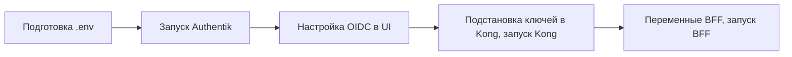
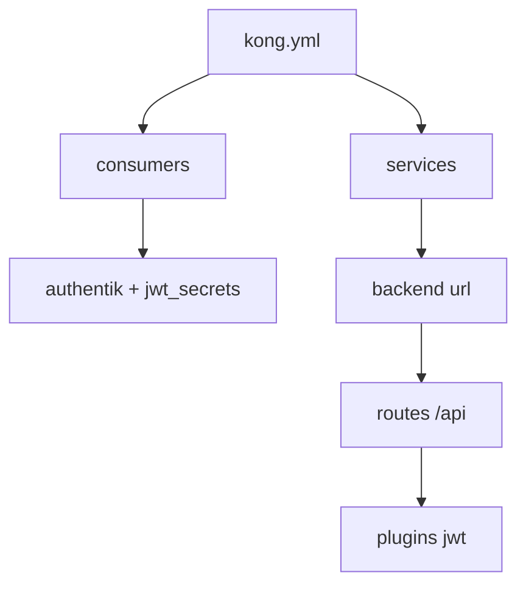
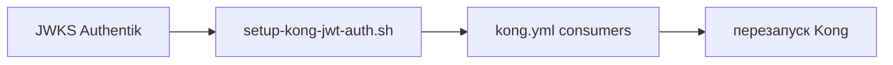
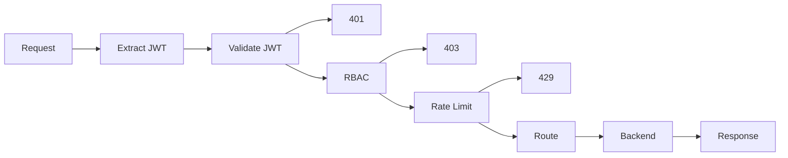
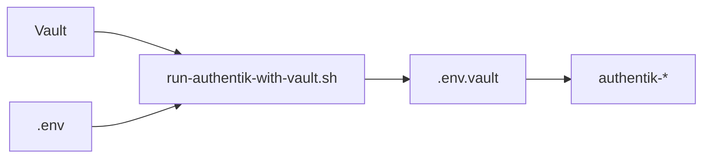
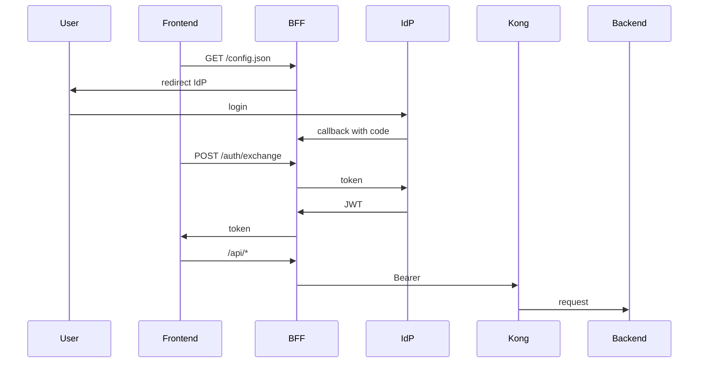
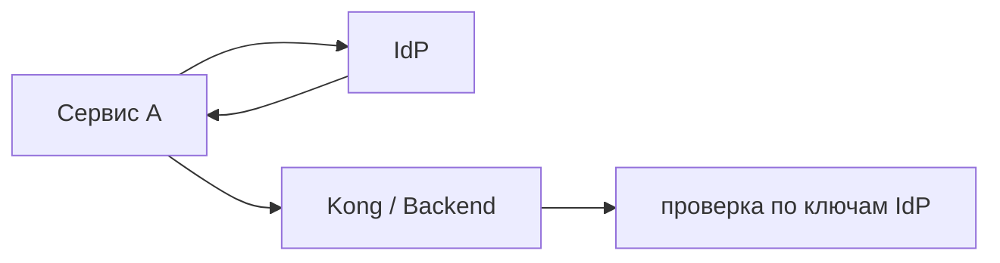

# ОПИСАНИЕ ПРОГРАММНОГО ОБЕСПЕЧЕНИЯ

# 1. Подсистема входа, аутентификации и авторизации (описание ПО)

Документ синхронизирован по **структуре разделов** с `1_1_subsystem_auth.md`, но содержит **детали реализации и настройки** (артефакты репозитория, конфигурации, скрипты, переменные окружения, типовые ошибки).

## 1.0. Глоссарий

Термины, используемые в подразделе:

- **фронтенд** — браузерное приложение (точка входа пользователя);
- **SPA** — одностраничное приложение;
- **MPA** — многостраничное приложение;
- **клиент** — фронтенд в контексте запросов к BFF и API;
- **BFF** (Backend for Frontend) — серверный компонент для обмена кода авторизации на токен и проксирования запросов с JWT;
- **IdP** — поставщик идентичности (Identity Provider);
- **API Gateway** — единая точка входа для запросов к backend;
- **JWT** — JSON Web Token;
- **OIDC** — OpenID Connect;
- **RBAC** — разграничение доступа по ролям (Role-Based Access Control);
- **MFA** — многофакторная аутентификация;
- **SSO** — единый вход (Single Sign-On).

## 1.1. Обзор подсистемы: что и где настраивается

Артефакты реализации подсистемы в репозитории:

| Компонент | Конфигурация / код | Документация | Скрипты |
|-----------|--------------------|--------------|---------|
| **IdP (Authentik)** | docker-compose (контейнеры authentik-postgresql, authentik-redis, authentik-server, authentik-worker) | `iam/docs/authentik.md` | `iam/authentik/scripts/run-authentik-with-vault.sh`, `authentik-setup.sh`, `uninstall-authentik.sh` |
| **API Gateway (Kong)** | `iam/kong/kong.yml` (DB-less, маршруты, плагин jwt, consumers) | `iam/docs/kong.md` | `iam/kong/scripts/setup-kong-jwt-auth.sh`, `fetch-authentik-jwks-pem.py`, `uninstall-kong.sh` |
| **BFF + фронтенд** | `iam/frontend/` (serve.py, статика SPA), переменные окружения | `iam/docs/frontend.md`, `iam/docs/auth-flow.md` | запуск: `cd iam/frontend && python3 serve.py` или через docker compose (bff) |
| **Секреты** | `.env`, `.env.vault` (не коммитить); Vault — путь `secret/farmadoc/authentik` | `iam/docs/vault.md` | `iam/authentik/scripts/run-authentik-with-vault.sh`; `iam/vault/scripts/setup-dev-kv.sh` |

Рекомендуемый **порядок первичного развёртывания**: 
- 1. подготовка `.env` (PG_PASS, AUTHENTIK_SECRET_KEY); 
- 2. запуск Authentik (через run-authentik-with-vault.sh или docker compose); 
- 3. первичная настройка Authentik (initial-setup, создание OIDC провайдера и приложения); 
- 4. подстановка ключей в Kong и запуск Kong; 
- 5. настройка переменных BFF и запуск BFF/фронтенда. 

Порядок показан на рис. 1.

<a id="fig-1"></a>



*Рис. 1. Порядок первичного развёртывания подсистемы.*

## 1.2. Состав подсистемы (в терминах реализации)

Состав компонентов соответствует `1_1_subsystem_auth.md` (IdP + BFF + API Gateway + клиент). 
Реализационные договорённости:

- **Kong OSS и OIDC**: 
в Kong OSS отсутствует плагин `openid-connect` (только Kong Enterprise). Поэтому аутентификация запросов реализуется через плагин **`jwt`** и публичный ключ (PEM), получаемый из **JWKS** Authentik. Подробно — `iam/docs/kong.md`.
- **OIDC discovery для клиента**: 
BFF и фронтенд используют discovery URL провайдера Authentik (OIDC) для входа (Authorization Code + PKCE). 
Подробно — `iam/docs/frontend.md`, `iam/docs/authentik.md`.

## 1.3. API Gateway и точка входа (Kong): реализация и настройка

### 1.3.1. Декларативная конфигурация (DB-less)

Конфигурация Kong хранится в одном файле **`iam/kong/kong.yml`** и применяется при старте контейнера (режим DB-less; состояние не персистируется между перезапусками). Структура конфигурации — см. рис. 2.

**Режим с базой данных.** Kong также поддерживает режим с хранением конфигурации в базе данных (PostgreSQL или Cassandra): маршруты, сервисы и плагины можно менять через Admin API без перезапуска, конфигурация персистируется. 
**Обоснование выбора DB-less в данной реализации:** 
 - 1. не требуется развёртывать и сопровождать отдельную БД для Kong (упрощение инфраструктуры и эксплуатации); 
 - 2. конфигурация описывается декларативно в коде (`kong.yml`), версионируется в репозитории и применяется при деплое — консистентность с практикой «инфраструктура как код»; 
 - 3. изменения маршрутов, ключей JWT и плагинов выполняются нечасто, перезапуск Kong после обновления конфига допустим. 

При необходимости частых изменений конфигурации без перезапуска (например, динамическое управление из внешней системы) целесообразно рассмотреть режим с PostgreSQL.

**Структура конфигурации:**

- **consumers** — список потребителей JWT; для Authentik используется consumer с именем `authentik` и блоком `jwt_secrets`, в котором задаются `key` (идентификатор ключа, соответствует `kid` в JWKS), `algorithm` (RS256), `rsa_public_key` (PEM в многострочном виде). Скрипт `setup-kong-jwt-auth.sh` подставляет сюда актуальные значения из JWKS Authentik.
- **services** — upstream-сервисы: поле `url` (например `http://backend:80` для placeholder или `http://host.docker.internal:8080` для реального API). После смены URL перезапуск Kong обязателен: `docker compose up -d kong`.
- **routes** — привязка путей к сервису: `paths: ["/api"]`, `strip_path: false` (путь не отрезается при проксировании). Запросы к путям, не входящим в конфиг (например `/` или `/other`), могут возвращать 404.
- **plugins** — на уровне сервиса/маршрута: плагин **jwt** с параметрами `key_claim_name: kid`, `claims_to_verify: [exp]`. Проверка подписи и срока действия выполняется по ключам из consumer.

<a id="fig-2"></a>



*Рис. 2. Структура конфигурации Kong (kong.yml).*

**Порты:**

- **8001** — внешний HTTP proxy (основной доступ к API с хоста: `http://localhost:8001/api/...`; порт 8000 в конфиге Kong занят под другими целями, например vLLM).
- **8444** — HTTPS proxy (настраивается при вводе TLS).
- Из сети Docker (например из BFF): обращение к Kong по внутреннему имени и порту (в docker-compose обычно маппинг на порт 8000 внутри контейнера).

**Запуск:** из корня репозитория `docker compose up -d backend kong` (backend — placeholder nginx при отсутствии своего API). Остановка: `docker compose stop kong`.

### 1.3.2. Проверка JWT в Kong OSS (плагин jwt) и подстановка ключей из Authentik

В Kong OSS плагин **openid-connect** недоступен (только Kong Enterprise), поэтому проверка Bearer-токенов выполняется плагином **jwt** с явно заданным публичным ключом (PEM) и идентификатором ключа (`kid`). Источник ключей — JWKS endpoint провайдера Authentik. Подстановка ключей при настройке — рис. 3.

**Пошаговая настройка:**

1. **Создать OIDC провайдер и приложение в Authentik** (п. 1.4.2). После создания зафиксировать slug приложения (например `farmadoc_app` или `farmadoc-app`) и URL JWKS: `http://localhost:9000/application/o/<slug>/jwks/` (с хоста); из контейнера в той же сети: `http://authentik-server:9000/application/o/<slug>/jwks/`.

2. **Подставить в `iam/kong/kong.yml` актуальные `kid` и PEM** (секция `consumers` → consumer `authentik` → `jwt_secrets`).

   **Вариант А (рекомендуется) — автоматически скриптом:** из корня репозитория выполнить
   ```bash
   ./iam/kong/scripts/setup-kong-jwt-auth.sh
   ```
   Скрипт по умолчанию запрашивает JWKS по адресу приложения `farmadoc_app`; при другом slug передать URL явно:
   ```bash
   ./iam/kong/scripts/setup-kong-jwt-auth.sh "http://localhost:9000/application/o/<slug>/jwks/"
   ```
   Опции: `--no-restart` — только обновить конфиг без перезапуска Kong; путь к локальному JSON JWKS (для офлайн/теста): `./iam/kong/scripts/setup-kong-jwt-auth.sh iam/kong/scripts/test-data/jwks-sample.json --no-restart`.

   **Вариант Б — вручную:** установить `pip install cryptography`; из каталога `iam/kong/scripts` выполнить `python3 fetch-authentik-jwks-pem.py "http://localhost:9000/application/o/<slug>/jwks/"` (или без аргумента для дефолтного приложения); подставить выведенные `kid` и PEM в `iam/kong/kong.yml` либо использовать `--update ../kong.yml` для автоматической подстановки в файл; затем `docker compose restart kong`.

<a id="fig-3"></a>



*Рис. 3. Подстановка ключей JWT из Authentik в Kong (настройка).*

3. **Проверка работоспособности:**
   - Без токена: `curl -i http://localhost:8001/api/` — ожидается **401 Unauthorized** (при включённом плагине jwt).
   - С валидным Bearer-токеном (получить через вход в SPA/BFF или OAuth2 flow в Authentik): `curl -i -H "Authorization: Bearer <access_token>" http://localhost:8001/api/` — ожидается ответ от backend (например HTML от placeholder nginx).

**Типовые ошибки и действия:**

| Симптом | Причина | Действие |
|--------|---------|----------|
| 401 "No credentials found for given 'kid'" | В конфиге Kong указан устаревший или неверный `kid`/PEM | Повторить подстановку ключей из JWKS (скрипт `setup-kong-jwt-auth.sh` или шаги варианта Б); убедиться, что токен выдан тем же провайдером Authentik, чей JWKS используется. |
| Kong не стартует / Connection refused на 8001 | Ошибка в конфиге (например некорректный PEM) или плагин openid-connect в конфиге (недоступен в OSS) | Проверить логи: `docker compose logs kong --tail 50`. Удалить из конфига ссылки на openid-connect; проверить, что в `jwt_secrets` подставлен валидный PEM (скрипт или ручная подстановка). |
| 404 на запрос к `/api/...` | Путь не входит в `routes[].paths` | Проверить в `iam/kong/kong.yml`, что маршрут с `paths: ["/api"]` привязан к нужному сервису. |

### 1.3.3. Последовательность обработки запроса (реализация)

Базовая последовательность и коды ошибок соответствуют `1_1_subsystem_auth.md` (401/403/429/5xx). В реализации Kong OSS:

- **401** формируется плагином `jwt` при отсутствии/невалидном токене (в т.ч. истечение `exp`).
- **429** реализуется через rate limiting (настраивается плагином и политикой; конкретная настройка фиксируется при тех.проектировании или реализации).
- **403** для RBAC требует отдельного механизма проверки по claims токена (см. п. 1.5). Схема шагов — рис. 4.

<a id="fig-4"></a>



*Рис. 4. Последовательность обработки запроса на API Gateway (Kong).*

### 1.3.4. Логирование и интеграция с SIEM (реализация)

В Kong OSS для логирования запросов используются встроенные плагины (подключаются в `iam/kong/kong.yml` к сервисам/маршрутам или глобально):

- **File Log** — запись в файл (в т.ч. JSON).
- **Syslog** — отправка в syslog-сервер (хост/порт приёмника SIEM).
- **HTTP Log** — отправка каждой записи POST на заданный URL (SIEM или промежуточный приёмник).

В стандартный лог по умолчанию попадают client_ip, метод и путь запроса, код ответа, задержка. Идентификатор пользователя из JWT (`sub`) в стандартные плагины не подставляется автоматически. Чтобы добавить его в лог, применяют **Request Transformer** или **Pre-function** (Lua): после проверки JWT извлечь claim (например `sub`) из контекста и записать в заголовок запроса (например `X-User-Id`), который затем включается в тело лога; либо реализуют кастомный плагин логирования. События 401, 403, 429 можно выделять в SIEM правилами по полю статуса или настроить отдельный экземпляр плагина (например HTTP Log) только для отказов в доступе. Конкретный формат и способ доставки в SIEM Заказчика уточняются на этапе тех.проекта или реализации (ТЗ п. 4.1.4).

### 1.3.5. Взаимодействие Kong с IdP (JWKS)

Kong **не обращается** к IdP при каждом входящем запросе: проверка JWT выполняется локально по публичному ключу (PEM), полученному из JWKS при настройке. Синхронизация ключей (обновление PEM в `iam/kong/kong.yml`) выполняется при развёртывании или по процедуре ротации: запуск `./iam/kong/scripts/setup-kong-jwt-auth.sh` (при необходимости с указанием URL JWKS) и перезапуск Kong (`docker compose restart kong`).

## 1.4. Аутентификация: IdP (Authentik) + BFF + клиент (реализация и настройка)

### 1.4.1. Запуск Authentik и секреты

Authentik 2026.2 разворачивается по официальному docker-compose: контейнеры **authentik-postgresql**, **authentik-redis**, **authentik-server**, **authentik-worker**. Доступ с хоста по умолчанию: **http://localhost:9000** (порт 9443 — для HTTPS при настройке TLS). Из сети Docker: `http://authentik-server:9000`.

**Подготовка секретов.** Сервисы Authentik читают переменные `PG_PASS` и `AUTHENTIK_SECRET_KEY` из файла **`.env.vault`** в корне репозитория (подключается через `env_file` в docker-compose). Файл не коммитится; его создаёт скрипт перед запуском контейнеров. Поток секретов при запуске — рис. 5.

**Вариант А — секреты из Vault (рекомендуется для контуров с Vault):**

1. Запустить Vault и включить KV v2: `docker compose up -d vault`, затем `./iam/vault/scripts/setup-dev-kv.sh`.
2. Записать в Vault секреты из `.env`: в `.env` задать `PG_PASS`, `AUTHENTIK_SECRET_KEY`, `VAULT_ADDR`, `VAULT_DEV_ROOT_TOKEN_ID` (или `VAULT_TOKEN`); выполнить `./iam/vault/scripts/setup-dev-kv.sh --write-from-env`. При первой настройке сгенерировать значения: пароль БД — `openssl rand -base64 36 | tr -d '\n'`, секретный ключ — `openssl rand -base64 60 | tr -d '\n'`, добавить в `.env` и повторить команду.
3. Запустить Authentik: из корня репозитория `./iam/authentik/scripts/run-authentik-with-vault.sh`. Скрипт читает секреты из Vault (`secret/farmadoc/authentik`), записывает их в `.env.vault` и выполняет `docker compose up -d authentik-postgresql authentik-redis authentik-server authentik-worker`.

**Вариант Б — секреты только в .env (без Vault):** в корне репозитория задать в `.env` переменные `PG_PASS` и `AUTHENTIK_SECRET_KEY`, затем выполнить `./iam/authentik/scripts/run-authentik-with-vault.sh --from-env`. Скрипт скопирует их в `.env.vault` и поднимет контейнеры.

<a id="fig-5"></a>



*Рис. 5. Поток секретов при запуске Authentik.*

Только подготовить `.env.vault` без запуска: `--prepare-only` или `--prepare-only --from-env`. Подробнее — `iam/docs/vault.md`, `iam/docs/authentik.md`.

**После запуска:** дождаться готовности (миграции при первом запуске — 1–3 минуты). Проверка: `docker compose logs -f authentik-server`. При первом открытии http://localhost:9000 пройти мастер initial-setup (создание учётной записи администратора).

**Типовые неполадки при запуске Authentik:**

| Симптом | Действие |
|--------|----------|
| В браузере «failed to connect to authentik backend: authentik starting» | Сервер ещё поднимается (миграции 1–3 мин). Подождать, обновить страницу. Логи: `docker compose logs -f authentik-server`. |
| В логах «database "authentik" does not exist» | Убедиться, что контейнер authentik-postgresql запущен и здоров: `docker compose ps authentik-postgresql`. |
| Скрипт authentik-setup.sh: «Authentik API не ответил за отведённое время» | Увеличить ожидание: `AUTHENTIK_WAIT_ATTEMPTS=90 AUTHENTIK_WAIT_DELAY=3 ./iam/authentik/scripts/authentik-setup.sh`. Запускать скрипт с `SKIP_DOCKER_SETUP=1` после того, как Authentik уже поднят через `docker compose up`. |
| Скрипт: «Token invalid/expired» или HTTP 401/403 | Создать токен в панели: **System** → **Tokens** → Create, скопировать и передать в скрипт. |
| Остановка и полное удаление | Остановка: `docker compose stop authentik-server authentik-worker authentik-postgresql authentik-redis`. Полное удаление (контейнеры и тома): из корня репозитория `./iam/authentik/scripts/uninstall-authentik.sh` (флаг `-f` для пропуска подтверждения). После удаления Authentik Kong нужно остановить или изменить конфиг. |

### 1.4.2. Создание OIDC провайдера и приложения (UI или blueprint)

После первичного входа в панель Authentik (http://localhost:9000) нужно создать провайдер OpenID Connect и приложение — вручную в UI или через blueprint.

**Вариант А — ручная настройка в UI (рекомендуется для понимания шагов).**

**Провайдер (OpenID Connect Provider):** **Directory** → **Providers** → **Create** → **OpenID Connect Provider**.

| Поле | Рекомендуемое значение |
|------|------------------------|
| Имя | `farmadoc_public_explicit_authentication_flow` |
| Поток аутентификации | default-authentication-flow |
| Поток авторизации | default-provider-authorization-explicit-consent |
| Тип клиента | Публичный (Public) |
| Перенаправляющие URI | `http://localhost:3000/callback`; при доступе по IP добавить `http://<IP>:3000/callback` (без завершающего слэша) |
| Подписывающий ключ | authentik Self-signed Certificate |
| Срок кода доступа | minutes=1 |
| Срок Access токена | hours=1 |
| Срок Refresh токена | days=30 |
| Scopes | openid, email, profile |
| Режим эмитента (Issuer) | У каждого провайдера свой эмитент (per provider) |

**Приложение (Application):** **Applications** → **Create** (или Directory → Applications → Create).

| Поле | Значение |
|------|----------|
| Имя | `farmadoc_app` |
| Идентификатор (slug) | `farmadoc_app` или `farmadoc-app` (должен совпадать в BFF и при вызове скрипта Kong) |
| Провайдер | Выбранный провайдер (см. выше) |
| Режим механизма политики | any |

После сохранения зафиксировать: 
- 1. **Client ID**
  в карточке провайдера (Directory → Providers → выбранный провайдер); он потребуется для переменной `OIDC_CLIENT_ID` BFF. 
- 2. **Slug приложения** 
  для сборки URL: discovery — `http://localhost:9000/application/o/<slug>/.well-known/openid-configuration`, JWKS — `http://localhost:9000/application/o/<slug>/jwks/`.

**Вариант Б — применение blueprint.** Если в репозитории есть `iam/authentik/blueprints/farmadoc-oidc.yaml` и API-токен Authentik: **System** → **Tokens** → Create → скопировать токен; из корня репозитория выполнить `SKIP_DOCKER_SETUP=1 ./iam/authentik/scripts/authentik-setup.sh -e http://localhost:9000 'ваш-токен'`. Скрипт не трогает контейнеры и только загружает blueprint в уже запущенный Authentik. При ошибке HTTP 405 blueprint можно применить вручную: **Customization** → **Blueprints** → **Apply blueprint** → загрузить файл.

**Критично:** Redirect URIs в провайдере должны **точно** совпадать со значением, которое BFF отправляет при обмене кода на токен (обычно это `OIDC_REDIRECT_URI`; при доступе по IP BFF может формировать URI по заголовку Host — тогда в Authentik нужно добавить соответствующий URI). При ошибке `invalid_grant` проверить в логах BFF поле `redirect_uri` в запросе token exchange и добавить это значение в Redirect URIs провайдера.

### 1.4.3. SSO (практические аспекты реализации)

SSO обеспечивается сессионной моделью Authentik. Для корректного SSO в разных окружениях важны:

- корректные redirect URI для каждого домена/хоста;
- единообразный issuer/discovery URL (для клиента);
- политика cookies и reverse proxy (если добавляется TLS и домены).

### 1.4.4. Процесс входа и выдачи токена (Authorization Code + PKCE): что реализовано в BFF

BFF (в текущей реализации — `iam/frontend/serve.py`) обеспечивает три функции, необходимые для безопасного входа фронтенда без попадания секретов и долгоживущих токенов в браузер.

**1. Конфигурация OIDC для клиента.** Endpoint **`GET /config.json`** возвращает клиенту параметры для инициации OAuth2/OIDC (discovery URL, client_id, redirect_uri, при необходимости базовый URL API). Значения формируются из переменных окружения BFF (п. 1.4.11), так что один и тот же билд фронтенда может работать в разных окружениях (dev/prod) без изменения кода.

**2. Обмен кода авторизации на токен.** Endpoint **`POST /auth/exchange`** принимает от клиента код авторизации, code_verifier и redirect_uri, выполняет запрос к token endpoint IdP (Authentik) и возвращает клиенту результат (access_token и при необходимости refresh_token). Секрет клиента (если используется) и долгоживущие токены не передаются в браузер.

**3. Проксирование запросов к API.** Запросы клиента к тому же origin по пути **`/api/*`** BFF пересылает в Kong (URL задаётся переменной `KONG_INTERNAL_URL`), подставляя в заголовок `Authorization: Bearer <token>` JWT, полученный при обмене кода. Браузер не обращается напрямую к Kong и к IdP (кроме редиректа на страницу входа). Процесс входа и вызова API — рис. 6.

<a id="fig-6"></a>



*Рис. 6. Процесс входа и вызова API через BFF (реализация).*

**Запуск BFF локально:** из корня репозитория `cd iam/frontend && python3 serve.py`; по умолчанию BFF слушает порт 3000, открыть в браузере http://localhost:3000/. Либо через docker compose: задать переменные в `.env`, выполнить `docker compose up -d bff`.

**Типовые ошибки при входе:**

| Симптом | Причина | Действие |
|--------|---------|----------|
| `invalid_grant` при обмене кода | redirect_uri, отправляемый BFF в IdP, не совпадает ни с одним из Redirect URIs провайдера | В логах BFF найти запрос token_exchange и значение `redirect_uri`; добавить это значение в настройки провайдера Authentik (Redirect URIs). При доступе по IP BFF может формировать URI по Host — добавить `http://<IP>:3000/callback`. |
| «Client ID Error» в Authentik | Неверный или не заданный OIDC_CLIENT_ID | Скопировать Client ID из карточки провайдера (Directory → Providers → выбранный OIDC-провайдер); задать в переменных окружения BFF `OIDC_CLIENT_ID`; перезапустить BFF. |
| После входа запросы к /api дают 401 | Kong не принимает токен (неверный kid/PEM или другой issuer) | Проверить, что в Kong подставлены ключи из того же провайдера Authentik (п. 1.3.2); при необходимости повторно выполнить `setup-kong-jwt-auth.sh`. |

Полный перечень переменных BFF — в п. 1.4.11. Подробнее: `iam/docs/frontend.md`, `iam/docs/auth-flow.md`.

### 1.4.5. IdP (Authentik) и альтернативы (в части переносимости настроек)

Архитектура и протоколы остаются неизменными при замене Authentik на иной OIDC-совместимый IdP (например, Keycloak), но в реализации потребуется:

- заменить discovery/JWKS URL и issuer для BFF/клиента;
- заменить процедуру получения ключей (JWKS → PEM) для Kong OSS.

### 1.4.6. MFA (настройка)

Многофакторная аутентификация включается и настраивается в IdP (Authentik): политики приложения, обязательность второго фактора для ролей или приложений, выбор методов (TOTP, FIDO2/WebAuthn). Со стороны BFF и Kong изменений не требуется — после успешной аутентификации (включая MFA) IdP выдаёт тот же JWT; утверждения в токене остаются совместимыми. Детали настройки MFA — в документации Authentik и в `iam/docs/authentik.md` при наличии соответствующих разделов.

### 1.4.7. Backend, фронтенд и BFF (реализационные варианты)

В текущей реализации репозитория BFF (serve.py в `iam/frontend/`) ориентирован на схему **SPA + BFF**: BFF раздаёт статику SPA, отдаёт `GET /config.json`, обрабатывает `POST /auth/exchange` и проксирует `/api/*` в Kong. Альтернатива — **MPA + BFF**: логика входа и прокси к API могут быть в backend MPA (объединённый вариант) или в отдельном BFF; при MPA callback после входа может приходить на BFF (например `/auth/callback?code=...`), BFF обменивает код на токен и сохраняет JWT в серверной сессии, выдавая браузеру только cookie сессии; эндпоинты `/config.json` и `/auth/exchange` в таком варианте могут не использоваться клиентом напрямую. В обоих вариантах требования к совпадению redirect_uri с настройками провайдера в Authentik и к проксированию запросов к API с Bearer-токеном сохраняются. Сравнение с точки зрения безопасности (статический SPA без BFF vs SPA + BFF) — `iam/docs/spa-vs-bff.md`.

### 1.4.8. Интеграция с корпоративным каталогом (AD/LDAP): где настраивается

Интеграция с Active Directory или иным LDAP-каталогом выполняется целиком в IdP (Authentik или Keycloak): подключение к каталогу по LDAP/LDAPS, привязка источника пользователей к потоку аутентификации. Поток для клиента (BFF, OIDC, редирект на IdP) не меняется — меняется только источник учётных данных на стороне IdP. Для авторизации по ролям настраивается маппинг групп (или атрибутов) AD/LDAP в утверждения JWT (например claim `groups` или `roles`), чтобы Kong и backend единообразно читали список ролей для RBAC. Детали настройки LDAP и маппинга групп — в документации IdP (Authentik, Keycloak); при наличии в репозитории — в `iam/docs/authentik.md`.

### 1.4.9. Аутентификация сервисов бэкенда между собой (Client Credentials): реализация

Сервис-сервис вызовы без пользовательского контекста аутентифицируются по OAuth2 **Client Credentials** (см. рис. 7):

1. В IdP (Authentik) зарегистрировать вызывающий сервис как **confidential** OAuth2-клиент (client_id, client_secret); при необходимости настроить audience или иные claims для отличия сервисных токенов от пользовательских.
2. Вызывающий компонент при необходимости вызвать другой сервис выполняет POST к token endpoint IdP с `grant_type=client_credentials`, передаёт client_id и client_secret (из конфигурации/секрет-менеджера); IdP возвращает access_token (JWT).
3. Вызов целевого сервиса или Kong выполняется с заголовком `Authorization: Bearer <token>`.
4. Kong или принимающий сервис проверяют подпись и срок действия токена по публичным ключам IdP (те же JWKS/PEM, что и для пользовательских JWT); при необходимости различают сервисные и пользовательские токены по claim (например `aud` или специальный claim) и применяют отдельные маршруты/правила.

<a id="fig-7"></a>



*Рис. 7. Аутентификация сервисов бэкенда (Client Credentials).*

Секреты между сервисами не передаются; единая точка выдачи и отзыва — IdP. Для вызовов в контексте запроса пользователя допускается прокидывание пользовательского JWT вместо client_credentials (см. `1_1_subsystem_auth.md`, п. 1.4.9).

### 1.4.10. Ссылки на реализацию

- `iam/docs/authentik.md` — запуск Authentik, OIDC провайдер/приложение, discovery/JWKS, типовые ошибки.
- `iam/docs/kong.md` — Kong OSS, плагин jwt, подстановка ключей из JWKS, проверка работоспособности.
- `iam/docs/frontend.md` — BFF и фронтенд, переменные окружения, endpoints `/config.json`, `/auth/exchange`, проксирование `/api`.
- `iam/docs/auth-flow.md` — общая схема потока.

### 1.4.11. Переменные окружения (сводная таблица)

Ниже приведены переменные, необходимые для запуска и настройки компонентов подсистемы. Дополнительные детали — в `iam/docs/authentik.md`, `iam/docs/frontend.md`, `iam/docs/vault.md`.

**IdP (Authentik)** — передаются через `.env.vault` (подготовка скриптом `iam/authentik/scripts/run-authentik-with-vault.sh` или `--from-env`):

| Переменная | Назначение |
|------------|------------|
| `PG_PASS` | Пароль PostgreSQL для Authentik (до 99 символов). Генерация: `openssl rand -base64 36 \| tr -d '\n'` |
| `AUTHENTIK_SECRET_KEY` | Секретный ключ приложения Authentik. Генерация: `openssl rand -base64 60 \| tr -d '\n'` |

Опционально: `PG_USER` (по умолчанию `authentik`), `PG_DB` (по умолчанию `authentik`), порты HTTP/HTTPS (9000 / 9443).

**BFF (фронтенд + прокси к API)** — задаются на сервере BFF (или в `.env` при локальном запуске):

| Переменная | По умолчанию | Описание |
|------------|--------------|----------|
| `OIDC_DISCOVERY_URL` | — | Полный URL discovery OIDC (например `http://localhost:9000/application/o/farmadoc_app/.well-known/openid-configuration/`). Если не задан, собирается из `AUTHENTIK_BASE_URL` и `OIDC_APP_SLUG`. |
| `OIDC_CLIENT_ID` | — | Client ID публичного OAuth2-клиента (копируется из карточки провайдера в Authentik). Обязателен. |
| `OIDC_REDIRECT_URI` | `http://localhost:3000/callback` | Redirect URI после входа; должен совпадать с одним из Redirect URIs провайдера в Authentik. |
| `AUTHENTIK_BASE_URL` | `http://localhost:9000` | Базовый URL Authentik; используется для сборки discovery URL, если `OIDC_DISCOVERY_URL` не задан. |
| `OIDC_APP_SLUG` | `farmadoc-app` | Slug приложения в Authentik для сборки discovery URL. |
| `KONG_INTERNAL_URL` | `http://localhost:8001` | URL Kong, на который BFF проксирует запросы `/api`. |
| `KONG_API_BASE_URL` | пусто | Базовый URL API для клиента. Пусто — запросы идут на тот же origin (BFF проксирует в Kong). |
| `PORT` | `3000` | Порт, на котором слушает BFF. |

Для продакшена задают `OIDC_DISCOVERY_URL`, `OIDC_CLIENT_ID`, `OIDC_REDIRECT_URI` (например `https://your-domain.com/callback`) и в Authentik добавляют этот redirect URI в настройках провайдера.

## 1.5. Авторизация (RBAC): где реализуется и как настраивается

В `1_1_subsystem_auth.md` описан принцип двухуровневой авторизации (шлюз + backend). В реализации:

- **На шлюзе (Kong OSS):** для RBAC по ролям из JWT требуется отдельная логика, т.к. плагин `jwt` только проверяет подпись и срок действия токена и не выполняет проверку по методу и пути. Варианты: плагин **pre-function** (Lua) с таблицей правил «метод HTTP + путь → разрешённые роли» (роли извлекаются из claims JWT, например `groups` или `roles`); при недостаточных правах — возврат 403 Forbidden. Таблица правил может храниться в конфигурации Kong (`iam/kong/kong.yml`) или во внешнем хранилище. Порядок плагинов на маршруте: сначала `jwt`, затем логика RBAC.
- **На backend:** проверка доступа к конкретным данным и при изменяющих операциях (создание, изменение, удаление); контекст авторизации (идентификатор пользователя, роли) передаётся шлюзом в заголовках или в теле запроса (согласно конфигурации Kong и backend).

**Настройка источника ролей:** в IdP (Authentik) в провайдере или приложении OIDC настраивается включение ролей или групп пользователя в JWT (custom claims или scopes); задаётся маппинг «роль/группа в IdP — имя утверждения в токене» (например `groups`, `roles`), чтобы шлюз и backend единообразно читали список ролей. Роли могут поступать из групп AD при интеграции с корпоративным каталогом (п. 1.4.8). Конкретная матрица ролей и правил маршрутов фиксируется на этапе тех.проекта или реализации. Подробнее — `iam/docs/kong.md` при наличии раздела по RBAC.

## 1.6. Ограничения текущей реализации и перспектива замены (с практическими последствиями)

**Ограничения Kong OSS для OIDC/RBAC:**

- Плагин **openid-connect** входит только в Kong Enterprise. В Kong OSS проверка Bearer-токена выполняется плагином **jwt** с явно заданным публичным ключом (PEM); ключи подставляются из JWKS Authentik при развёртывании или по скрипту. При ротации ключей в IdP необходимо повторно выполнить подстановку в `iam/kong/kong.yml` и перезапустить Kong.
- RBAC по ролям из JWT не реализован «из коробки»: требуется кастомная логика (плагин pre-function на Lua, таблица правил «метод + путь → роли»), сопровождение конфигурации при изменении матрицы доступа.

**Практическая перспектива:** на этапе технической реализации по согласованию с Заказчиком целесообразно рассмотреть замену Kong на API Gateway с нативной поддержкой OIDC (например **Apache APISIX**: плагин openid-connect в открытой версии, интеграция с IdP по discovery, проверка Bearer по JWKS, упрощение настройки RBAC по claims без кастомного Lua). При замене потребуется: перенос маршрутов и правил из `iam/kong/kong.yml` в конфигурацию нового шлюза; актуализация скриптов развёртывания (подстановка ключей/JWKS при необходимости); обновление данного документа и `iam/docs/kong.md`. Архитектура цепочки (BFF → API Gateway → backend, проверка JWT и RBAC на шлюзе) сохраняется.

---

*Связь с общими сведениями и обоснованиями:* варианты реализации и обоснование выбора — `1_1_subsystem_auth.md`. Данный документ фиксирует только реализационные детали и настройку.
