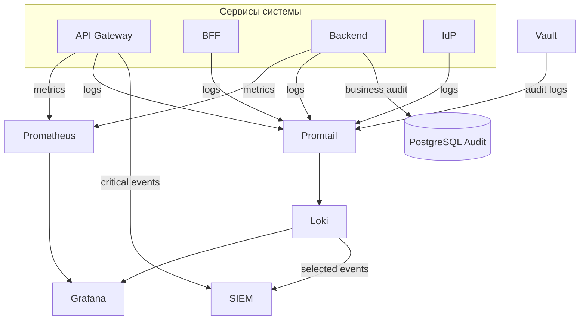

# ОПИСАНИЕ ПРОГРАММНОГО ОБЕСПЕЧЕНИЯ

# 2. Подсистема хранения ключей и секретов, аудита, мониторинга и логирования (описание ПО)

Документ синхронизирован по структуре и терминам с `1_2_subsystem_audit.md`, но содержит детали реализации: конфигурации, параметры, практику эксплуатации и типовые сценарии настройки.

## 2.0. Глоссарий

- **Vault** — защищённое хранилище секретов и ключевого материала (HashiCorp Vault или корпоративный аналог);
- **Loki** — система централизованного хранения логов с индексацией по labels;
- **Promtail** — агент сбора логов для Loki (допускаются Fluent Bit/Vector);
- **LogQL** — язык запросов к логам в Loki;
- **SIEM** — система корреляции и анализа событий ИБ;
- **ретенция** — политика сроков хранения логов и аудита;
- **cardinality** — количество уникальных значений label; избыточная cardinality ухудшает производительность Loki.

## 2.1. Обзор подсистемы: что и где настраивается

Артефакты реализации (структура каталогов и имена файлов уточняются по репозиторию Заказчика):

| Компонент | Конфигурация / код | Назначение |
|-----------|--------------------|------------|
| **Vault** | `iam/vault/` (`docker-compose`, скрипты инициализации KV v2) | хранение секретов, политики доступа, аудит обращений |
| **Loki** | `observability/loki/` (`loki-config.yaml`) | централизованное хранение и поиск логов |
| **Promtail** | `observability/promtail/` (`promtail-config.yaml`) | сбор логов контейнеров/узлов и отправка в Loki |
| **Prometheus** | `observability/prometheus/` (`prometheus.yml`) | сбор метрик сервисов и инфраструктуры |
| **Grafana** | `observability/grafana/` (datasources, dashboards, alert rules) | дашборды метрик и логов, алертинг |
| **Экспорт в SIEM** | плагины шлюза, syslog/http-коннекторы, или отдельный forwarder | доставка критичных security-событий |

Рекомендуемый порядок первичной настройки:

1. поднять и инициализировать Vault (KV v2, базовые политики, тестовые секреты);
2. развернуть Loki и Promtail, проверить приём логов;
3. подключить Loki и Prometheus как источники данных в Grafana;
4. настроить базовые дашборды и алерты (метрики + LogQL);
5. включить экспорт критичных событий в SIEM.

## 2.2. Состав подсистемы (в терминах реализации)

### 2.2.1. Принятые реализационные решения

1. **Хранение секретов** — Vault KV v2, выдача секретов по сервисным политикам, без хранения секретов в репозитории.
2. **Аудит** — прикладной аудит в PostgreSQL + системные события (API Gateway, IdP, Vault) в централизованные логи.
3. **Мониторинг** — Prometheus + Grafana (инфраструктурные и прикладные метрики).
4. **Логирование** — основной контур `Loki+Grafana`, где:
   - Loki хранит логи по потокам;
   - labels нормализованы и ограничены;
   - поиск и аналитика выполняются в Grafana через LogQL.

### 2.2.2. Логический поток компонентов



## 2.3. Управление ключами и секретами (Vault): реализация и настройка

### 2.3.1. Практика хранения секретов

Секреты хранятся по путям вида `secret/farmadoc/<service>`:

- `secret/farmadoc/authentik`: `postgres_password`, `secret_key`;
- `secret/farmadoc/backend`: `db_password`, `api_keys`, `internal_tokens`;
- `secret/farmadoc/kong`: секреты плагинов и интеграций;
- `secret/farmadoc/vector-db`: ключи шифрования и параметры доступа.

Рекомендуется исключить хранение секретов в коде, `.env` под VCS и контейнерных образах.

### 2.3.2. Получение секретов при запуске

Предпочтительный сценарий: «подготовка кредов перед запуском».

1. Скрипт на хосте (или в CI) читает секреты из Vault;
2. формирует временный `.env.vault` для сервисов;
3. сервисы стартуют с `env_file`, без токена Vault внутри контейнера.

Плюсы: минимизация привилегий, меньше поверхности атаки, проще аудит доступа.

### 2.3.3. Ротация и аудит

- ручная ротация: обновить секрет в Vault, обновить `.env.vault`, перезапустить затронутые сервисы;
- автоматическая: периодическая задача (cron/CI) по регламенту Заказчика;
- для паролей БД: сначала изменить пароль в СУБД, затем обновить Vault и перезапустить клиентов.

Аудит Vault должен фиксировать операции чтения/записи секретов и экспортироваться в централизованные логи.

## 2.4. Аудит: реализация и хранение

### 2.4.1. Разделение прикладного и платформенного аудита

- **прикладной аудит** (PostgreSQL): бизнес-действия пользователя (создание/изменение/удаление, экспорт отчёта);
- **платформенный аудит** (Loki/SIEM): входы, отказы доступа, изменения конфигурации, обращения к секретам, системные ошибки.

### 2.4.2. Минимальная структура audit-записи

Рекомендуемые поля:

- `timestamp_utc`;
- `actor_id` (или псевдоним/сервисный субъект);
- `action`;
- `target_type`, `target_id`;
- `result` (`success`/`deny`/`error`);
- `correlation_id`;
- `source_ip` (для внешних действий).

Состав полей согласуется с требованиями по ПДн и внутренними правилами ИБ.

## 2.5. Мониторинг: реализация и настройка

### 2.5.1. Базовые метрики

- HTTP RPS, latency (p50/p95/p99), доля 4xx/5xx;
- ресурсы CPU/RAM/disk/network;
- доступность зависимостей (PostgreSQL, Vault, IdP, Loki);
- глубина очередей и время выполнения фоновых задач (если применимо).

### 2.5.2. Grafana: дашборды и алерты

Минимальные дашборды:

1. API и backend (нагрузка, ошибки, задержки);
2. инфраструктура (ресурсы узлов);
3. безопасность (401/403/429, ошибки доступа к секретам);
4. логовые панели из Loki по ключевым сервисам.

Минимальные алерты:

- рост 5xx выше порога;
- всплеск 401/403;
- недоступность Vault/Loki/Prometheus;
- резкий рост сообщений `error` в логах.

## 2.6. Логирование (Loki): реализация и настройка

### 2.6.1. Архитектура Loki

Контур `Promtail -> Loki -> Grafana`:

- Promtail читает логи контейнеров/узлов;
- нормализует labels;
- отправляет записи в Loki;
- Grafana выполняет запросы LogQL и строит панели/алерты.

Для стендов разработки возможен single-binary Loki; для промышленной эксплуатации — конфигурация с object storage, ретенцией и резервированием по требованиям Заказчика.

### 2.6.2. Стратегия labels

Рекомендуемые labels (низкая cardinality):

- `service`, `env`, `namespace`, `instance`, `route`, `level`.

Не выносить в labels:

- `user_id`, `session_id`, `trace_id`, `document_id`, UUID/хэши запросов.

Такие поля оставляют в JSON payload и извлекают в LogQL при анализе.

### 2.6.3. Ретенция и хранение

Рекомендуемая схема:

- «горячие» логи в Loki: 30–90 дней;
- отдельная ретенция security-событий: дольше общего периода;
- архив — в объектном/корпоративном хранилище.

Окончательные сроки и классы хранения утверждаются службой ИБ и эксплуатацией.

### 2.6.4. Примеры LogQL-запросов (операционный минимум)

Всплеск ошибок авторизации:

```logql
sum by (service) (count_over_time({service="api-gateway"} |= "403" [5m]))
```

Ошибки по сервису за 15 минут:

```logql
count_over_time({service="backend", level="error"}[15m])
```

Поиск цепочки по correlation_id:

```logql
{env="prod"} |= "correlation_id=abcd-1234"
```

### 2.6.5. Доставка событий в SIEM

Допустимые схемы:

1. прямой экспорт из источников (GW/IdP/Vault) в SIEM + параллельно в Loki;
2. экспорт отобранных записей из Loki через коннектор/forwarder;
3. гибрид: Loki для эксплуатации, SIEM для ИБ-корреляции и долгого хранения.

Критерии выбора: полнота событий, задержка доставки, требования регулятора, стоимость хранения.

## 2.7. Типовые проверки после настройки

1. Логи всех ключевых сервисов видны в Loki и фильтруются по labels.
2. В Grafana работают панели Loki и Prometheus.
3. Логовые алерты срабатывают на тестовых событиях (`error`, `401/403`).
4. Аудит Vault фиксирует обращения к секретам.
5. Тестовый поток критичных событий доходит до SIEM.

## 2.8. Ограничения текущей реализации и перспектива

- На прототипе допустимы упрощения (один инстанс Loki, ограниченные дашборды, частичная интеграция с SIEM).
- Для промышленного контура рекомендуется формализовать:
  - стандарт лог-полей и labels;
  - правила алертинга;
  - политику ретенции и архивирования;
  - регламент ротации секретов и проверки восстановления.

Замена платформы логирования (Loki <-> OpenSearch/ELK) допустима без изменения общей архитектуры при сохранении требований к аудиту, мониторингу и ИБ.

---

*Связь с общими сведениями и обоснованиями:* архитектурное обоснование — `1_2_subsystem_audit.md`; данный документ фиксирует реализационные детали и настройки для `2_opisanie_po.md`.
