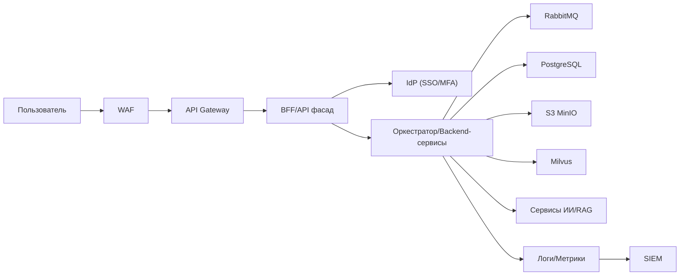
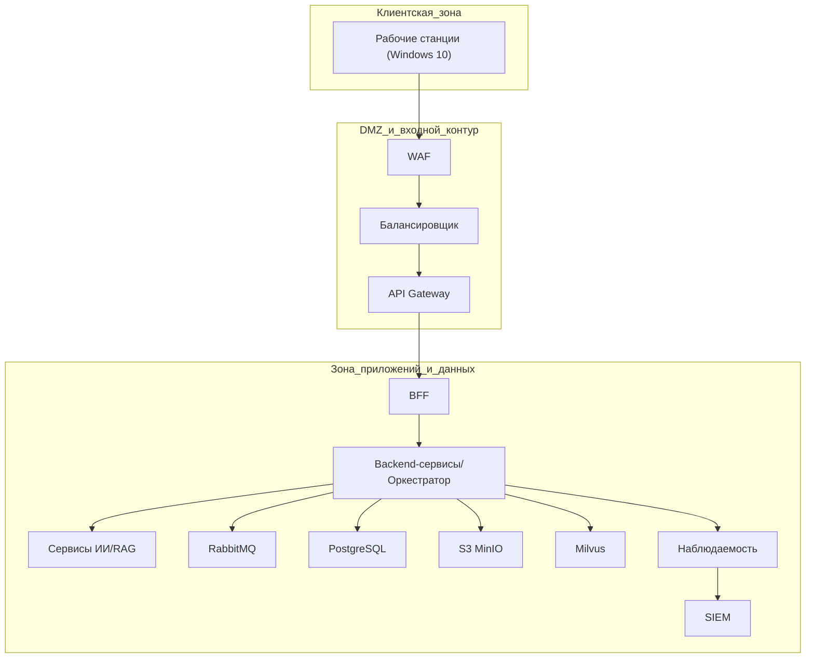
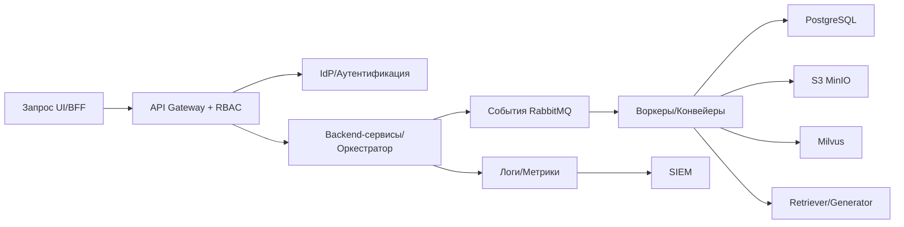
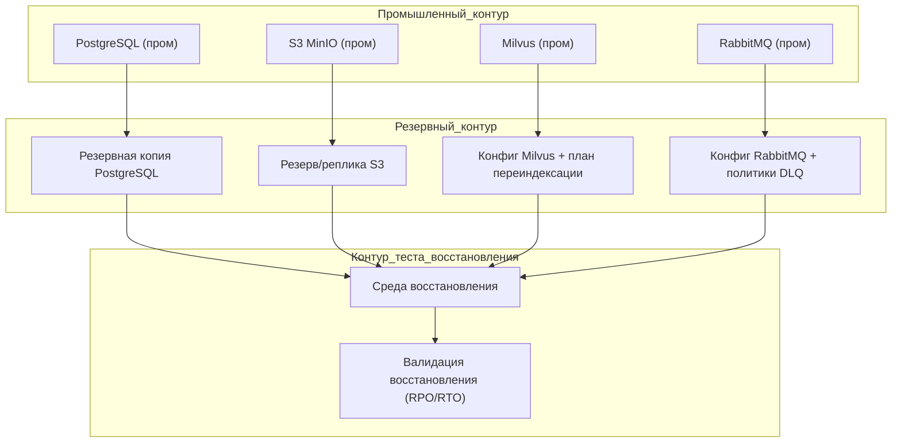

# ОПИСАНИЕ АРХИТЕКТУРЫ И ТЕХНИЧЕСКИХ СРЕДСТВ
## информационной системы «Фармадок»

**Версия:** 1.0  
**Дата:** 2026-03-26  
**Основание:** `Техническое Задание.md`, `1_zapiska_k_tz.md`

---

## 1. Назначение документа

Документ фиксирует, где и на каком оборудовании разворачивается ИС «Фармадок», какие программные и инфраструктурные компоненты используются, как организованы сетевые взаимодействия, отказоустойчивость, безопасность и эксплуатация.

Целевая аудитория:
- системные администраторы;
- DevOps/SRE-инженеры;
- специалисты по инфраструктуре и ИБ;
- архитекторы технического проекта.

---

## 2. Исходные требования и принятые допущения

Документ сформирован на основе:
- `Техническое Задание.md` (требования к структуре, безопасности, производительности, ОС и вводу в действие);
- `1_zapiska_k_tz.md` (уточненная архитектурная модель подсистем и интеграций).

Принятые допущения:
1. Развертывание выполняется в контуре Заказчика (on-prem или доверенное облако Заказчика).
2. Для хранения и индексации применяются PostgreSQL + S3 MinIO + Milvus.
3. Для асинхронного взаимодействия используется RabbitMQ.
4. Везде, где в ТЗ указаны "или аналог", допускается замена компонента при сохранении функциональных и ИБ-требований.

---

## 3. Архитектурная модель (верхний уровень)

ИС «Фармадок» строится как модульная сервисная система с единой точкой входа и разделением на прикладные и инфраструктурные контуры.

Основные контуры:
1. **Контур доступа и безопасности:** API Gateway, IdP, BFF, RBAC, MFA.
2. **Контур прикладной обработки:** оркестратор конвейеров, обработчики документов, сервисы AI/RAG.
3. **Контур хранения данных:** PostgreSQL, S3 MinIO, Milvus.
4. **Контур обмена сообщениями:** RabbitMQ.
5. **Контур наблюдаемости и аудита:** централизованные логи, метрики, SIEM-интеграция.

---

## 4. Схема развёртывания и топология

### 4.1. Логическая топология площадки

Рекомендуется трехзонная схема:
- **Client Zone**: рабочие станции пользователей (Windows 10, доменная сеть).
- **DMZ/Ingress Zone**: WAF, API Gateway, внешняя точка входа.
- **Application/Data Zone**: backend-сервисы, очереди, БД, объектное и векторное хранилища, мониторинг.

Сетевой доступ между зонами ограничивается ACL и межсетевыми экранами по принципу минимально необходимых прав.

### 4.2. Транспорт и защищенные каналы

- Все межсервисные соединения: TLS 1.3.
- Удаленный защищенный доступ администраторов/техперсонала: VPN (WireGuard, согласно инфраструктуре Заказчика).
- Прямой доступ пользователей к внутренним сервисам (в обход API Gateway) не допускается.

---

## 5. Состав технических средств

### 5.1. Роли серверов

Рекомендуется выделение ролей:
1. **Ingress-сервер(а):** WAF/API Gateway, балансировка входящих запросов.
2. **Auth-сервер(а):** IdP (Authentik/Keycloak) и BFF.
3. **App-сервер(а):** backend-сервисы, оркестратор, обработчики пайплайнов.
4. **AI-сервер(а):** модели БЯМ/эмбеддингов, сервисы RAG.
5. **Data-сервер(а):** PostgreSQL, Milvus, S3 MinIO, RabbitMQ.
6. **Observability-сервер(а):** мониторинг, логи, интеграция с SIEM.

### 5.2. Минимальные ориентиры по ресурсам

Точные параметры утверждаются на этапе технического проектирования и нагрузочных испытаний. Для стартовой конфигурации рекомендуется:

- **App-сервер:** от 8 vCPU, 32 GB RAM, SSD NVMe.
- **Data-сервер PostgreSQL:** от 8 vCPU, 32-64 GB RAM, быстрые SSD.
- **Milvus:** от 8 vCPU, 32-64 GB RAM, быстрые SSD; масштабирование по росту корпуса.
- **S3 MinIO:** дисковый пул с резервированием (RAID/erasure coding), выделенный объем под документы и артефакты.
- **RabbitMQ:** от 4 vCPU, 16 GB RAM, дисковая подсистема под устойчивые очереди.
- **AI-сервер:** CPU+GPU-конфигурация, достаточная для целевых SLA (20 секунд по ТЗ для релевантных сценариев поиска/анализа).

---

## 6. Спецификация программного окружения

### 6.1. Операционные системы

- Рабочие станции: Windows 10.
- Серверы: Ubuntu 24.04 LTS или выше.

### 6.2. Платформенные и прикладные компоненты

- API Gateway: Kong (или аналог).
- IdP: Authentik / Keycloak (по согласованию).
- Backend/BFF: сервисы прикладной логики и фасад для UI.
- Хранилища: PostgreSQL, S3 MinIO, Milvus.
- Брокер сообщений: RabbitMQ.
- Контейнеризация: Docker.
- Оркестрация: Kubernetes или Docker Compose (по масштабу контура).
- CI/CD: GitLab CI или Jenkins (по регламенту Заказчика).

### 6.3. Управление секретами и ключами

- HashiCorp Vault (или корпоративный аналог).
- Ротация секретов и ключевого материала по регламенту ИБ.

---

## 7. Состав данных и потоки между компонентами

1. Пользовательский запрос проходит через WAF/API Gateway.
2. Аутентификация/авторизация выполняется через IdP и RBAC-политики.
3. Backend/BFF маршрутизирует запрос в соответствующий конвейер.
4. Асинхронные этапы обмениваются событиями через RabbitMQ.
5. Данные сохраняются:
   - метаданные и операционные данные — PostgreSQL;
   - документы и артефакты — S3 MinIO;
   - эмбеддинги и индексные структуры — Milvus.
6. Метрики/логи/аудит передаются в контур наблюдаемости и SIEM.

---

## 8. Требования к безопасности

1. Единая точка входа через API Gateway, запрет обхода.
2. RBAC и MFA для пользовательского и административного доступа.
3. Шифрование каналов TLS 1.3.
4. Шифрование данных на хранении согласно требованиям ТЗ и политик Заказчика.
5. Изоляция AI-агентов и фоновых обработчиков в контейнерной среде.
6. Маскирование чувствительных данных перед обработкой БЯМ и индексированием.
7. Журналирование значимых событий и интеграция с SIEM.

---

## 9. Надёжность, резервное копирование и восстановление

1. Резервное копирование PostgreSQL (полные и инкрементальные по графику).
2. Репликация/бэкап бакетов S3 MinIO.
3. Резервирование конфигурации Milvus и процедур переиндексации.
4. Резервирование конфигурации RabbitMQ и регламент обработки неуспешных сообщений (DLQ).
5. Регулярные тесты восстановления на тестовом контуре.
6. Целевые RPO/RTO — в соответствии с ТЗ и эксплуатационными регламентами Заказчика.

---

## 10. Масштабируемость и производительность

1. Горизонтальное масштабирование stateless-сервисов (gateway, backend, BFF, обработчики).
2. Масштабирование Milvus/PostgreSQL/MinIO в соответствии с характером нагрузки.
3. Контроль очередей RabbitMQ (глубина, задержка обработки, DLQ).
4. Профилирование AI-контура (latency этапов retrieval/rerank/generation).
5. Контроль целевых эксплуатационных метрик:
   - не менее 100 одновременных пользователей;
   - не менее 100 запросов/мин на пользователя (ограничение и защита на gateway);
   - целевые SLA отклика по сценариям ТЗ.

---

## 11. Наблюдаемость и эксплуатация

### 11.1. Обязательные метрики

- доступность сервисов;
- latency/error-rate по API endpoint;
- глубина и задержка очередей RabbitMQ;
- производительность и емкость хранилищ;
- метрики AI-контура (retrieval, rerank, generation);
- показатели SLA/SLO пользовательских сценариев.

### 11.2. Журналирование

- централизованный сбор логов gateway, backend, хранилищ и брокера;
- сквозной `x-correlation-id` для трассировки;
- фиксация критичных событий ИБ и административных действий.

---

## 12. Требования к вводу в действие

Перед промышленным вводом должны быть подтверждены:
1. Соответствие инфраструктурной схеме и политикам ИБ Заказчика.
2. Работоспособность CI/CD и процедур развёртывания.
3. Успешные тесты резервного копирования/восстановления.
4. Успешные интеграционные и нагрузочные испытания.
5. Наличие эксплуатационной документации и обученных администраторов.

---

## 13. Риски и ограничения

1. Фактическая потребность в GPU/CPU может отличаться от стартовой оценки и должна уточняться на нагрузочных испытаниях.
2. Изменение нормативных требований и внешних интеграций влияет на профиль нагрузки и состав сервисов.
3. При замене компонентов на аналоги обязательна повторная проверка требований ИБ, производительности и отказоустойчивости.

---

## 14. Приложения (рекомендуемые к включению)

1. Схема сетевой инфраструктуры (из Приложения № 2 ТЗ).
2. Логическая схема взаимодействия подсистем (из пояснительной записки).
3. Таблица инфраструктурных параметров по средам (DEV/TEST/PROD).
4. Карта портов и сетевых правил (ACL/NAT/Firewall).
5. Матрица ролей администрирования и доступа к инфраструктуре.

